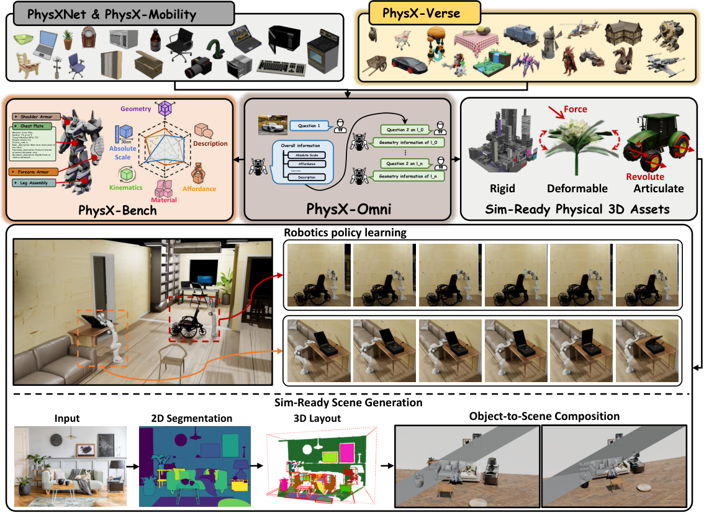
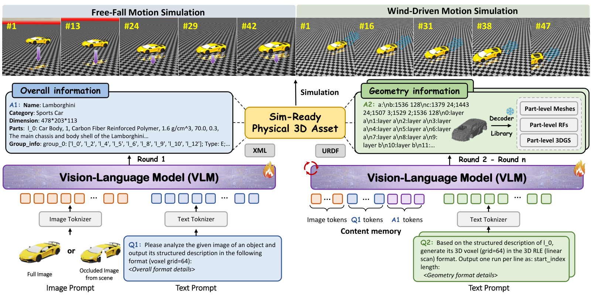
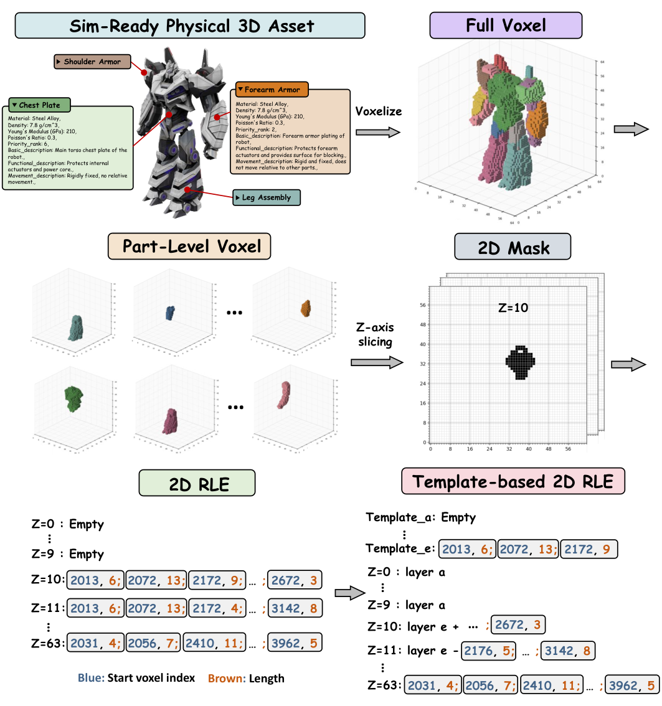
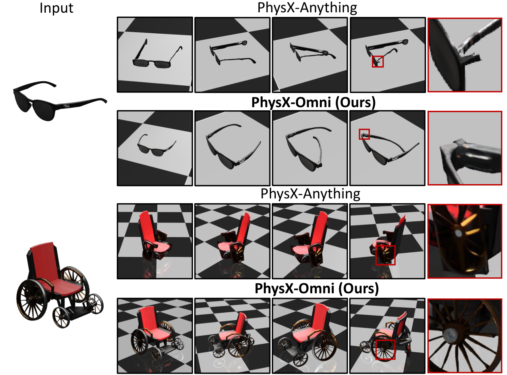
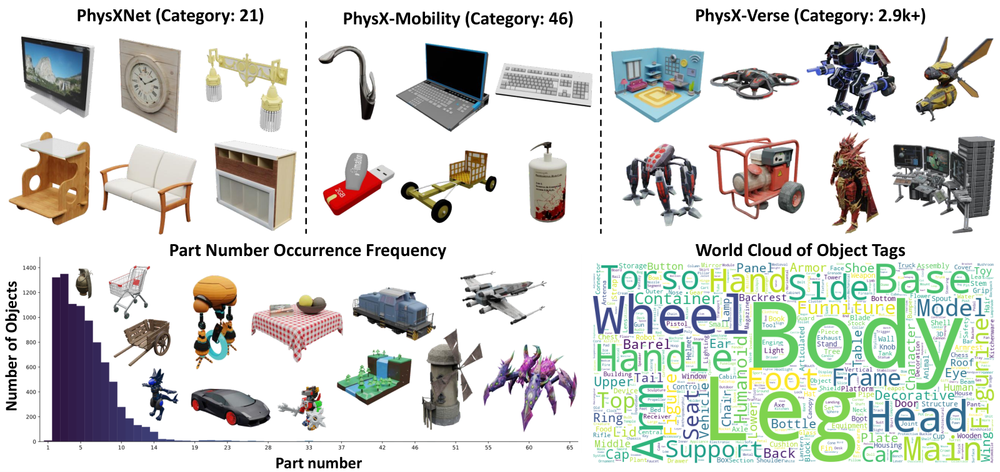
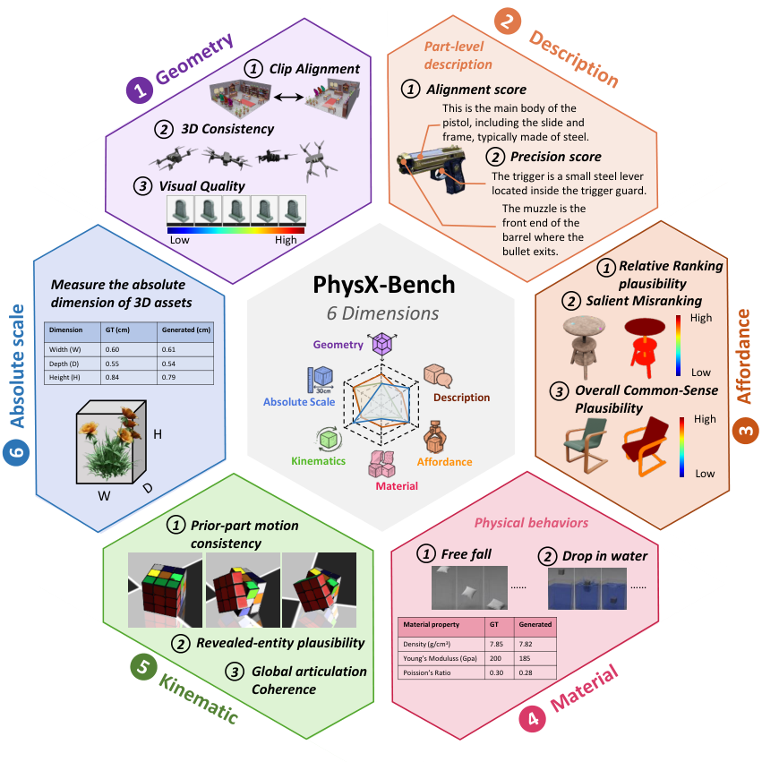
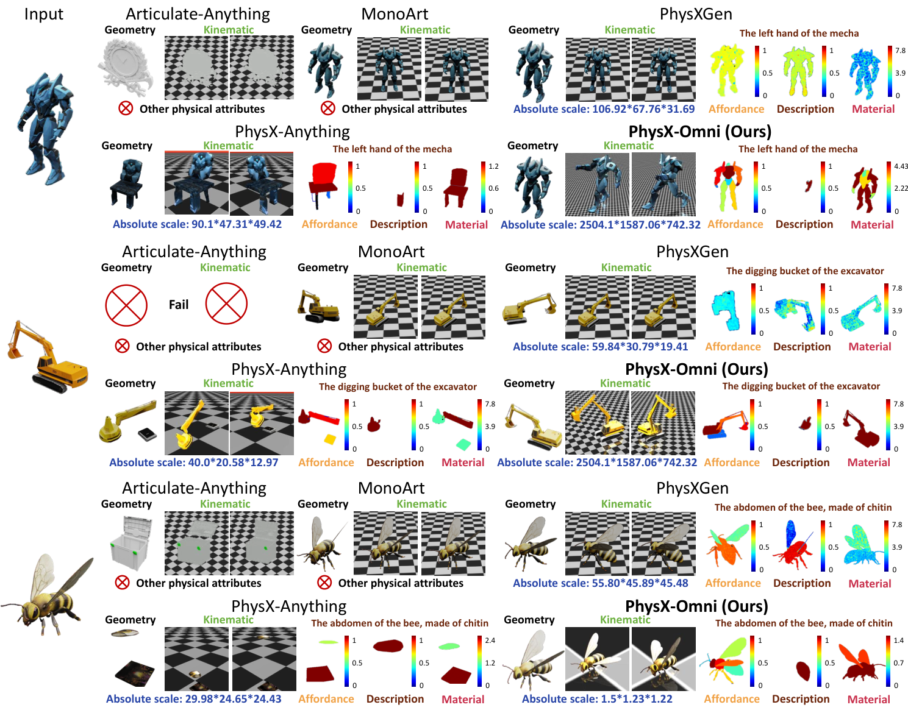
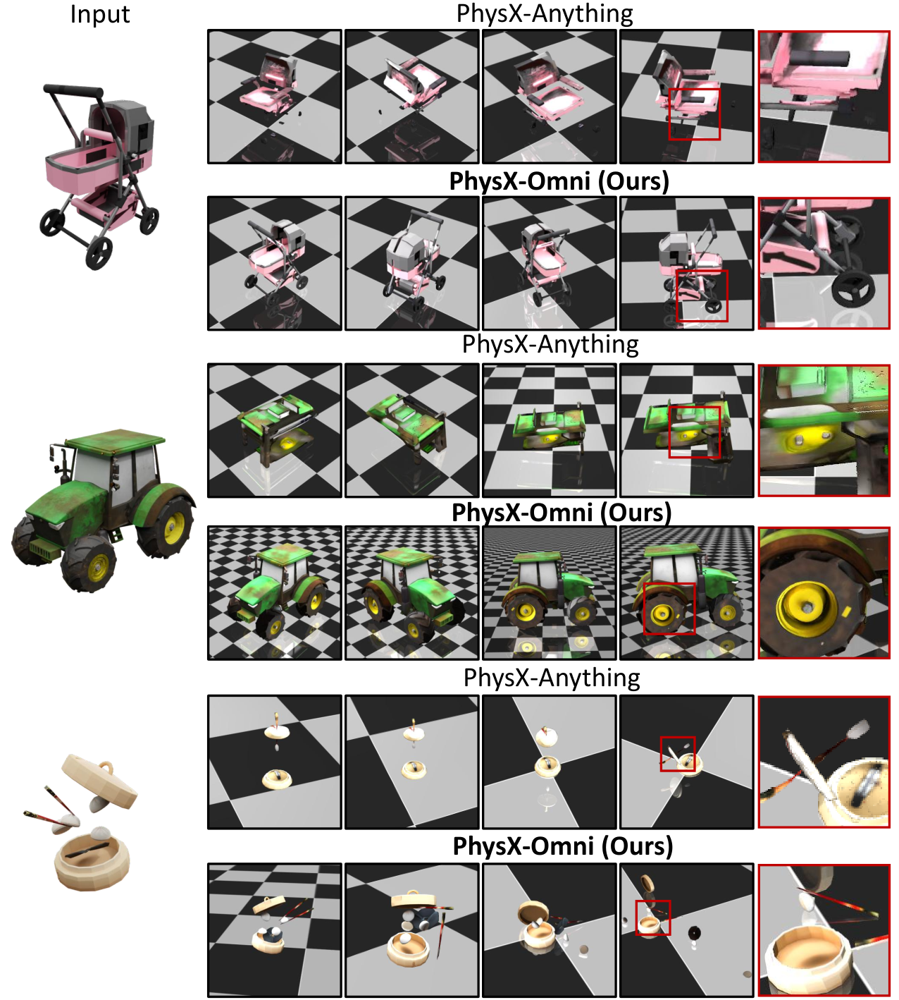
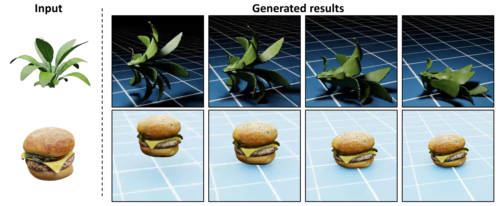

# PhysX-Omni：单图生成仿真就绪三维资产

## 基本信息

| 字段 | 值 |
|---|---|
| 论文正式名称 | PhysX-Omni: Unified Simulation-Ready Physical 3D Generation for Rigid, Deformable, and Articulated Objects |
| 作者 | Ziang Cao、Yinghao Liu、Haitian Li、Runmao Yao、Fangzhou Hong、Zhaoxi Chen、Liang Pan、Ziwei Liu |
| 单位 | S-Lab, Nanyang Technological University；ACE Robotics |
| arXiv | 2605.21572v1 (cs.CV)，2026-05-20 |
| 项目页 | https://physx-omni.github.io/ |
| 代码 | https://github.com/physx-omni/PhysX-Omni |
| 数据集 | https://huggingface.co/datasets/PhysX-Omni/PhysXVerse |
| 模型权重 | https://huggingface.co/PhysX-Omni/PhysX-Omni |
| 配套前作 | PhysXGen、PhysX-Anything（同一作者团队） |

## 一句话结论

PhysX-Omni 把"单图 3D 生成"的目标从"几何好看"提升为"仿真可用"：给定一张 2D 图像，输出一个**同时具备部件级几何、绝对尺度、密度/杨氏模量/泊松比、材质、可供性、关节运动学**的资产，并可直接导出 URDF/XML 供 MuJoCo、SAPIEN 等物理引擎消费；其技术核心是面向 VLM 的 **Template-based RLE 几何表示**，配合 PhysXVerse 数据集与 PhysX-Bench 评测基准，在绝对尺度误差和运动学评分上相对 PhysX-Anything 取得量级提升。

---

## 1. 研究背景与问题定义

### 1.1 研究问题

高质量 3D 资产是游戏设计、机器人学、具身 AI 与交互式仿真的共同底座。近两年单图生成 3D 的工作（TRELLIS、InstantMesh、LGM、3DTopia-XL 等）已经把"几何看起来像"做得很到位，但落到物理引擎里几乎都要返工：缺关节轴、缺蒙皮、缺绝对尺度、缺密度与弹性参数、缺部件级可拆分结构。换言之，**"展示级 3D 资产"与"仿真就绪 3D 资产"之间存在一条未被自动化打通的鸿沟**，而这条鸿沟正在限制具身智能和机器人学习大规模使用合成数据。

### 1.2 现有方法的瓶颈

作者把瓶颈拆成三层来看：

1. **表示层的瓶颈**。当前 VLM-friendly 的 3D 表示存在三类取舍：顶点量化（LLaMA-Mesh、MeshLLM）序列极长；3D VQ-GAN 编码（ShapeLLM-Omni）需要新增专用 token；纯文本体素索引（PhysX-Anything）能直接用 VLM 词表但分辨率受限、误差累积明显，且对拓扑复杂的物体很不稳定。
2. **数据层的瓶颈**。真正带有物理属性（尺度、密度、关节类型、运动限位等）标注的 3D 资产极少。PhysXNet 仅 21 类、PhysX-Mobility 仅 46 类，离"通用"差得很远。仿真就绪资产被卡在数据规模与多样性上。
3. **评测层的瓶颈**。传统几何指标（Chamfer Distance、F-score、PSNR）只能衡量"像不像"，无法回答"放进仿真里合不合理"。更关键的是，物理属性的"对错"在没有真值标注的自然场景里很难量化，缺一个无真值、可对齐人类偏好的评测协议。

### 1.3 本文核心贡献

作者明确把贡献写在摘要里，共四项：

1. **PhysX-Omni 框架**：统一的仿真就绪物理 3D 生成框架，跨刚体 / 柔体 / 关节体三类资产；通过定制几何表示直接建模高分辨率 3D 结构，显著提升性能与泛化。
2. **PhysXVerse 数据集**：首个通用仿真就绪物理 3D 数据集，覆盖超过 2K（论文摘要）或 2.9K（实验章节）个室内外类别，包含超过 8.7K 高质量资产。
3. **PhysX-Bench 基准**：首个仿真就绪物理 3D 生成基准，集成基于物理的仿真与强 VLM，覆盖六个关键属性，提供无真值标注的鲁棒评估框架。
4. **广泛验证**：在 PhysX-Bench 和传统基准上均表现优异，并把生成资产落地到接触丰富的机器人策略学习与仿真场景生成。

下面这张是论文的总览图，清晰地把数据集、基准、模型主体、刚/柔/关节三类资产、机器人策略学习与场景生成串成一条完整链路。

> **图 1（论文 Figure 1，Teaser）**：PhysX-Omni 的总览图。顶部展示 PhysXNet/PhysX-Mobility 与新构建的 PhysXVerse 数据集合并后形成训练基础；中部左侧是 PhysX-Bench 六大维度，右侧是基于多轮问答的 VLM 生成范式与刚/柔/关节三类输出；下半部展示了两个直接的下游应用——把生成资产直接送入仿真做机器人策略学习，以及与 Depth Anything v2 + SAM 2 组合做仿真就绪场景生成。
> 来源：arXiv 2605.21572v1 Figure 1，<https://arxiv.org/html/2605.21572v1>

---

## 2. 任务定义与输入输出

### 2.1 输入、输出与假设

**输入**：单张图像。可以是完整物体图像，也可以是**部分遮挡**的图像（论文把这种鲁棒性作为设计目标）。

**输出**：一个可直接送入物理仿真器的"仿真就绪"3D 资产，需要同时具备：

- 部件级可拆分的 3D 几何（高保真 mesh + 配套纹理）；
- 物理属性：绝对尺度、密度、杨氏模量、泊松比、材质、可供性（affordance）、运动学参数（关节类型、轴位置、轴方向、运动限位）；
- 仿真可消费的描述文件：**URDF**（关节体）和 **XML**（刚体/形变体）。

**覆盖对象类型**：刚体（rigid）、可变形体（deformable）、铰接体（articulated），三类资产在一个统一框架内同时支持。

**关键假设**：

- 图像中存在可被识别为单一对象主体的视觉证据；
- 该对象可被分解为有限数量的语义部件；
- 物理参数（尺度、材质等）可由 VLM 从视觉线索合理估计，并被仿真器接受。

### 2.2 关键符号与目标函数

| 符号 | 含义 |
|---|---|
| $I$ | 输入图像 |
| $G$ | 全局表示（类别、部件层级、绝对尺度、整体物理属性） |
| $P_i$ | 第 $i$ 个部件的语义身份与属性描述 |
| $V_i \in \{0,1\}^{64\times 64\times 64}$ | 第 $i$ 个部件的体素占据场 |
| $M_{i,z} \in \{0,1\}^{64\times 64}$ | $V_i$ 沿 $z$ 轴切片的第 $z$ 层 2D 二值掩码 |
| $T_j$ | 第 $j$ 个模板层（template layer） |
| $\Delta M_{i,z}$ | 第 $z$ 层相对模板的差分掩码 |
| $\mathcal{A}$ | 关节树结构（关节类型、轴位置/方向、运动限位） |
| $\mathcal{K}$ | 物理参数（密度 $\rho$、杨氏模量 $E$、泊松比 $\nu$ 等） |
| $\mathcal{L}$ | 部件级 3D 几何 + 物理属性的统一文本化 token 序列 |

**整体生成目标**可以表述为：在给定图像 $I$ 的条件下，联合采样全局表示 $G$、部件级几何 $\{V_i\}_{i=1}^{N}$ 与物理参数 $\mathcal{K}$，并以自回归方式在 VLM 词表内输出文本化 token 序列 $\mathcal{L}$，最终由解码器得到 mesh + 描述文件：

$$
p(\mathcal{L}\mid I) = p(G\mid I)\cdot\prod_{i=1}^{N} p(V_i,\mathcal{K}_i\mid G,I)\cdot p(\mathcal{A}\mid \{V_i,\mathcal{K}_i\}).
$$

由于是 VLM 自回归框架，训练目标即标准的下一 token 预测负对数似然：

$$
\mathcal{J} = -\mathbb{E}_{(\mathcal{L},I)\sim\mathcal{D}}\left[\sum_{t=1}^{T}\log p_\theta(\ell_t \mid \ell_{<t},I)\right],
$$

其中 $\mathcal{D}$ 是 PhysXNet、PhysX-Mobility、PhysXVerse 合并后的训练集，$\ell_t$ 是 $\mathcal{L}$ 中第 $t$ 个 token。

---

## 3. 核心方法

### 3.1 总体框架：多轮问答式 VLM 流水线

PhysX-Omni 沿用了 PhysX-Anything 提出的"由粗到细、由全局到局部"思路，但**最重要的改动是把几何表示从"文本体素索引"换成了 Template-based RLE**，并把"先显式建模 3D 结构，再做物理装配"作为统一范式。具体流程如 Figure 2。

> **图 2（论文 Figure 2，Framework）**：PhysX-Omni 的双阶段生成流水线。**Round 1**（左半）：图像经 Image Tokenizer 编码，与文本 prompt（"请分析图像并输出结构化描述"）一起送入 VLM，输出 Overall Information——A1 名称、C2 类别、Dimension、各部件 P_0..P_n 的基础属性，以及部件分组信息。**Round 2 ~ Round n**（右半）：VLM 在 Content memory（保留前一轮输出）和多轮 question 的引导下，逐部件输出 A2 Geometry Information 文本化 token 序列；该序列经 Decoder Library（支持 Part-level Meshes、Part-level 3DGS、Part-level Radiance Fields）解码成高质量 3D 资产，最终装配为 URDF/XML 描述并送入 Free-Fall 或 Wind-Driven 等物理仿真。底部紫/绿/橙三色 token 条分别对应 Image tokens、Q1/A1 文本 tokens、Q2/A2 几何 tokens，凸显多模态 token 混合。
> 来源：arXiv 2605.21572v1 Figure 2，<https://arxiv.org/html/2605.21572v1>

**关键设计取舍**：

- **Image Tokenizer**：把图像转成 VLM 可消费的视觉 token（与 Qwen2.5-VL 自带处理保持一致）；
- **Content memory**：把 Round 1 的全局描述缓存为后续轮的上下文，避免每轮都重发，节省序列长度；
- **Decoder Library**：保持解耦——VLM 负责"说什么"，3D 解码器负责"长成什么样"。

### 3.2 Template-based RLE 几何表示（最核心创新）

这是论文的技术亮点，单独画了一张图来解释。思路可以拆成三步。

> **图 3b（论文 Figure 3b，Detailed Geometry Representation）**：Template-based RLE 几何表示的完整构造流程。以一个机甲机器人为例：(1) 仿真就绪资产被分解为带物理属性的部件（Chest Plate、Shoulder Armor、Forearm Armor、Leg Assembly），每部件带材质、密度、杨氏模量、泊松比、Priority rank 与功能描述；(2) 体素化得到 Full Voxel（$64\times 64\times 64$ 占据场），按部件分解为 Part-Level Voxel；(3) 沿 $z$ 轴切片得到 2D Mask（每层 $64\times 64$ 二值图）；(4) 经典 2D RLE 将每层表示为 `[start_index, length]` 序列（蓝色数字=起始体素索引，棕色数字=长度）；(5) 引入 Template 模板层（template_a 到 template_e），把不变化的层折叠到 `layer a`，只存储差异部分（`layer e + ...` 或 `layer e - ...`），大幅压缩 token 数量。
> 来源：arXiv 2605.21572v1 Figure 3b，<https://arxiv.org/html/2605.21572v1>

下面把图里关键的三步用公式写一遍。

**第一步：体素化与部件分解**。把仿真就绪资产 $A$ 体素化为 $64\times 64\times 64$ 占据场，然后根据其部件标注 $P_i$ 拆为 $N$ 个 part-level 体素 $\{V_i\}_{i=1}^{N}$。

**第二步：Z 轴切片 + 经典 2D RLE**。对每个 $V_i$ 沿 $z$ 轴切 64 层二维二值掩码 $M_{i,z}\in\{0,1\}^{64\times 64}$。对每行按行扫描，记录从占用体素开始的"起始索引 + 长度"配对：

$$
M_{i,z}^{\text{row}} \;\longrightarrow\; \left[(s_1,\ell_1),\,(s_2,\ell_2),\,\dots,\,(s_k,\ell_k)\right],
$$

其中 $s_j$ 是第 $j$ 段起始体素索引，$\ell_j$ 是该段长度。这样一层 $64\times 64$ 的二值图被压成纯文本 token，且与 VLM 词表完全兼容（不需要新增 token）。

**第三步：Template 折叠（关键压缩步骤）**。相邻 $z$ 切片的体素分布高度相似，直接全部存 RLE 序列冗余很大。作者观察到一个 3D 物体在 $z$ 方向上往往只有少数几个"形态断面"，其它层都是这些断面的微调或复制。因此预设 $K$ 个模板层 $\{T_1,\dots,T_K\}$，让其它层表达为"模板 + 残差"或"模板 − 残差"：

$$
\text{Encode}(M_{i,z}) = 
\begin{cases}
\text{template\_ref}(T_j), & \text{若 } M_{i,z} \text{ 与某模板 } T_j \text{ 完全一致}\\[4pt]
\text{template\_ref}(T_j) \;+\; \text{RLE}(\Delta M_{i,z}^{+}), & \text{正向残差}\\[4pt]
\text{template\_ref}(T_j) \;-\; \text{RLE}(\Delta M_{i,z}^{-}), & \text{负向残差}
\end{cases}
$$

其中 $\Delta M_{i,z}^{\pm}$ 是 $M_{i,z}$ 与最近模板层的按位差，$\text{template\_ref}(\cdot)$ 是一个轻量级引用标记。这种"模板 + 残差"机制把每部件的文本序列长度显著压低，同时**显式保持了 3D 结构信息**（不会出现 PhysX-Anything 那种"再解码一次才能知道形状"的间接性）。

**与现役基线的对比**。论文把 PhysX-Anything 风格的"文本体素索引"作为基线做了并列对比：

| 方案 | 序列长度 | 是否需要新增 token | 对自回归误差的鲁棒性 | 与体素解码器兼容性 |
|---|---|---|---|---|
| 顶点量化（LLaMA-Mesh） | 长 | 否 | 较差 | 差 |
| 3D VQ-GAN（ShapeLLM-Omni） | 短 | **是** | 中 | 需要额外训练 |
| 文本体素索引（PhysX-Anything） | 中 | 否 | 较差（误差累积） | 好 |
| **Template-based RLE（本文）** | **中短** | **否** | **好** | **好** |

下图给出视觉对比。可以看到在眼镜的细长镜腿和轮椅的复杂辐条上，PhysX-Anything 的输出出现结构断裂、镜腿断开、辐条错位等问题，而 PhysX-Omni 显式建模 3D 几何后能保持更连贯的部件结构。

> **图 3a（论文 Figure 3a，Geometry Representation Comparison）**：同一组输入下 PhysX-Anything 与 PhysX-Omni 的渲染对比。上方案例是太阳镜：PhysX-Anything 的镜腿明显断裂且局部几何不连续（红框放大处可见黑色断口），PhysX-Omni 能保持镜腿完整、表面光滑。下方案例是轮椅：PhysX-Anything 出现辐条缺失、座椅与车轮分离、铰接结构混乱（红框内几乎只剩一团黑色结构），PhysX-Omni 重建出完整的辐条、座椅与靠背，部件结构清晰可数。
> 来源：arXiv 2605.21572v1 Figure 3a，<https://arxiv.org/html/2605.21572v1>

### 3.3 物理装配与导出

当所有部件的几何与属性生成完毕后，PhysX-Omni 还要做一次"物理装配"：

1. **关节树** $\mathcal{A}$：把部件两两之间的铰接关系（关节类型、轴位置、轴方向、运动限位）写成树结构；
2. **物理参数** $\mathcal{K}$：把每部件的密度 $\rho$、杨氏模量 $E$、泊松比 $\nu$、材质 ID、可供性、Priority rank 编码到 URDF / XML 中；
3. **绝对尺度对齐**：用 Round 1 预测的 `Dimension` 把整个资产放缩到真实世界尺寸（论文实验显示这是相对前作提升最大的指标之一）。

最终输出形态：

- **关节体** → `.urdf` 文件 + 配套 mesh（STL/OBJ），可直接被 MuJoCo、SAPIEN、PyBullet 加载；
- **刚体 / 形变体** → `.xml` 文件 + mesh；形变体使用 FEA 风格的连续介质参数。

### 3.4 训练目标与损失函数

由于是 VLM 自回归框架，训练目标即标准的 teacher-forcing 交叉熵：

$$
\mathcal{L}_\text{total} = \mathcal{L}_\text{text} + \lambda_\text{geo}\,\mathcal{L}_\text{geo} + \lambda_\text{phy}\,\mathcal{L}_\text{phy},
$$

其中 $\mathcal{L}_\text{text}$ 是全局描述和属性 token 的语言建模损失，$\mathcal{L}_\text{geo}$ 是 Template-based RLE 几何 token 的语言建模损失，$\mathcal{L}_\text{phy}$ 物理参数 token 的语言建模损失。论文未明确披露 $\lambda_\text{geo}$、$\lambda_\text{phy}$ 的具体数值（论文未披露），但从表 1/表 2 的结果推断三者量级相近——若物理分支权重过低，Table 1 的绝对尺度误差不会从 300 量级掉到 2.79；若几何分支权重过低，CD 与 F-score 不会显著超过 PhysX-Anything。

### 3.5 推理流程与复杂度

推理阶段做一次 VLM forward，分多轮自回归解码：

1. Round 1：图像 + 整体 prompt → 全局描述；
2. Round 2..n：缓存的全局描述 + "请生成部件 i 的 3D RLE 表示"prompt → 部件级 token 序列；
3. 后处理：把 RLE token 序列还原为 $64\times 64\times 64$ 体素 → 送入 TRELLIS voxel-to-mesh 解码器 → mesh；
4. 装配：写入 URDF / XML，附带物理参数。

**复杂度分析（个人判断）**：

- **序列长度**：得益于 Template 折叠，单个复杂部件的 RLE 文本序列通常远短于体素直接量化（粗估每个部件 200~600 token，10 个部件加全局 1000~2000 token，落在 Qwen2.5-VL 的 16K 上限内）；
- **解码次数**：每个部件一次 TRELLIS 解码，部件数与解码时间近似线性；
- **GPU 显存**：推理阶段 7B VLM + TRELLIS 占用，单卡 24G 显存可跑（论文未披露具体推理硬件配置，但 5 epoch × 14 天的训练规模隐含了 64×A100 的资源量级）。

---

## 4. 数据集与实验设置

### 4.1 数据集

**PhysXVerse**（本文新发布）：

- 来源：基于 PartVerse 的人类验证分割标注 + PhysXGen 的 human-in-the-loop 标注管线；
- 规模：**8.7K+** 高质量仿真就绪 3D 资产，覆盖 **2.9K+** 室内外类别；
- 部件数：1 ~ 65，长尾分布；
- 类别多样性：覆盖汽车、摩天大楼、玩具、机器人、武器、家具、植物等。

**训练集组合**（论文 §4.2）：PhysXNet + PhysX-Mobility + PhysXVerse，合计 **42K+** 仿真就绪资产。

下图对比 PhysXNet、PhysX-Mobility、PhysXVerse 的类别覆盖与 PhysXVerse 内部的部件数分布与标签词云。

> **图 4（论文 Figure 4，PhysXVerse Statistics）**：顶部三栏对比 PhysXNet（21 类）、PhysX-Mobility（46 类）与 PhysXVerse（2.9K+ 类）的样本多样性——PhysXNet 集中在简单家具、灯具；PhysX-Mobility 集中在家电和运动器材；PhysXVerse 涵盖机器人、汽车、摩天大楼、玩具、人物、生物等复杂长尾类别。左下是 PhysXVerse 内部部件数直方图，呈明显长尾分布，少数部件对象占比最高，60+ 部件对象出现在机器人、复杂交通工具中。右下是部件标签词云，可以读到 Wheel、Body、Head、Handle、Foot、Base 等常用部件名。
> 来源：arXiv 2605.21572v1 Figure 4，<https://arxiv.org/html/2605.21572v1>

**多视角训练条件**：为提高视图一致性和视觉理解鲁棒性，**每个对象渲染 25 个不同视角的图像**作为条件输入参与训练（论文未披露具体相机分布，论文未披露）。

### 4.2 Baseline 与评价指标

**传统几何指标**：PSNR（外观质量）、Chamfer Distance（CD）、F-score@0.05。生成资产与真值资产都从 30 个视角渲染，取所有视角平均（论文未披露为什么选 30 视角而非 8/12 视角）。

**物理属性指标**（遵循 PhysX-Anything 协议）：

- Absolute Scale：预测与真值对象尺度的 MSE；
- Material / Affordance / Description：基于 heatmap 的 PSNR；
- Kinematic：预测与真值铰接参数（关节轴位置、关节方向、关节类型、运动限位）的 MSE。

**PhysX-Bench 指标**（本文新提出，6 个维度 × 多个子指标）：

| 维度 | 子指标 | 评估方式 |
|---|---|---|
| Geometry | CLIP score、3D Consistency、Visual Quality | 渲染图 + VLM 评分 |
| Absolute Scale | 单值 | 与 VLM 估计的"真实世界最大尺寸"对比 |
| Material | 单值 | 通过 Free-Fall / Drop-in-water 仿真视频反推 |
| Affordance | Relative Ranking Plausibility、Salient Misranking、Overall Common-Sense Plausibility | VLM 评价部件功能合理性 |
| Kinematic | Prior-part motion consistency、Revealed-entity plausibility、Global articulation coherence | 仿真视频 + VLM 加权 |
| Description | Alignment score、Precision score | 部件级掩码 + 文字描述对齐 |

下图把 PhysX-Bench 六大维度的具体评估方式画得非常清楚，每个维度都对应一个独立的子面板。

> **图 5（论文 Figure 5，PhysX-Bench Overview）**：PhysX-Bench 的六个评估维度概览。① **Geometry** 包含 CLIP Alignment、3D Consistency、Visual Quality 三个子指标；② **Description** 评估部件级掩码与文字描述的 Alignment score 与 Precision score；③ **Affordance** 关注相对排序合理性、显著误排序、整体常识合理性；④ **Material** 通过 Free-fall 与 Drop-in-water 两种仿真视频反推 Density、Young's Modulus、Poisson's Ratio；⑤ **Kinematic** 由 Prior-part motion consistency、Revealed-entity plausibility、Global articulation coherence 三个子指标加权得到；⑥ **Absolute Scale** 用 VLM 估计的 W/D/H 与生成资产直接对比。中心六边形把所有维度画成雷达图。
> 来源：arXiv 2605.21572v1 Figure 5，<https://arxiv.org/html/2605.21572v1>

**PhysX-Bench 使用的 VLM 评估器**：开源 Qwen3.5-122B-A10B（论文未披露 prompt 模板）。作者强调"渲染图/视频作为输入"的设计是为了让 VLM 能借助熟悉的视觉证据，而不是直接读抽象的物理参数值，从而降低评估难度、提升可解释性。

### 4.3 实现细节

| 配置项 | 值 |
|---|---|
| VLM 骨干 | Qwen2.5-VL-7B-Instruct |
| 训练轮数 | 5 epochs |
| GPU | 64 × NVIDIA A100 |
| 训练时长 | 约 14 天 |
| 峰值学习率 | $2\times 10^{-5}$ |
| 学习率调度 | Cosine decay，warmup ratio = 0.03 |
| 有效批大小 | 128 |
| 最大序列长度 | 16,384 tokens |
| 3D 解码器 | TRELLIS |
| 训练条件 | 每个对象 25 视角渲染图 |
| 测试渲染视角 | 30 视角（取平均） |

---

## 5. 实验结果

### 5.1 主要定量结果

#### 5.1.1 传统指标对比（Table 1）

**PhysXVerse 测试集**（论文 Table 1 上半部）：

| 方法 | PSNR ↑ | CD(×10⁻³) ↓ | F-score(×10⁻²) ↑ | Abs Scale ↓ | Material ↑ | Affordance ↑ | Kinematic ↑ | Description ↑ |
|---|---:|---:|---:|---:|---:|---:|---:|---:|
| Articulate-Anything | 14.03 | 48.77 | 46.44 | – | – | – | 0.2952 | – |
| MonoArt | 19.68 | 7.03 | 85.27 | – | – | – | 0.3805 | – |
| PhysXGen | 19.41 | 15.19 | 83.56 | 309.31 | 16.51 | 9.40 | 0.3494 | 11.84 |
| PhysX-Anything | 15.97 | 37.06 | 40.46 | 298.19 | 15.65 | 10.50 | 0.4191 | 21.38 |
| **PhysX-Omni (Ours)** | **21.52** | **2.95** | **91.28** | **2.79** | **27.23** | **21.47** | **0.9185** | **31.05** |

**PhysX-Mobility 测试集**（论文 Table 1 下半部）：

| 方法 | PSNR ↑ | CD(×10⁻³) ↓ | F-score(×10⁻²) ↑ | Abs Scale ↓ | Material ↑ | Affordance ↑ | Kinematic ↑ | Description ↑ |
|---|---:|---:|---:|---:|---:|---:|---:|---:|
| Articulate-Anything | 15.02 | 16.09 | 66.95 | – | – | – | 0.6396 | – |
| MonoArt | 16.46 | 6.35 | 87.41 | – | – | – | 0.4351 | – |
| PhysXGen | 15.75 | 35.32 | 79.62 | 46.58 | 16.02 | 8.73 | 0.3884 | 11.60 |
| PhysX-Anything | 16.57 | 23.13 | 89.51 | 22.58 | 22.58 | 16.29 | 0.7852 | 26.28 |
| **PhysX-Omni (Ours)** | **18.38** | **4.70** | **88.50** | **2.78** | **24.09** | **16.58** | **0.8603** | **28.40** |

**这张表说明了什么**：

- **绝对尺度是量级提升**。PhysXVerse 上 PhysX-Omni 的 Abs Scale 从 298.19 降到 **2.79**（≈ 107× 改进），PhysX-Mobility 上从 22.58 降到 **2.78**（≈ 8×）。这是因为 PhysX-Anything 只能从文本体素索引间接推断尺度，而 PhysX-Omni 在 Round 1 显式输出 `Dimension` 字段并用 Template-based RLE 保持显式几何，最终装配时直接缩放到真实世界尺寸。
- **运动学评分大幅领先**。PhysXVerse 上 0.4191 → **0.9185**，PhysX-Mobility 上 0.7852 → **0.8603**。结合 ablation 图，物理上的提升主要归因于显式 3D 几何建模消除了"先分割再重建"带来的关节错位。
- **几何与外观上 PhysX-Omni 全面优于 PhysX-Anything**，但与 MonoArt 仍有差距。MonoArt 在 F-score(85.27 vs 91.28，PhysX-Omni 反超)、PSNR(19.68 vs 21.52，PhysX-Omni 反超)、CD(7.03 vs 2.95，PhysX-Omni 反超) 上 PhysX-Omni 已经全面超过，但 MonoArt 不预测物理属性，所以严格不可比；PhysX-Omni 的关键差异是"在预测物理属性的同时几何质量不退化甚至更优"。
- **Articulate-Anything / MonoArt 的"–"是有意为之**：它们不预测绝对尺度、材质、可供性、描述，论文表格里用 "–" 标出，避免误读。

#### 5.1.2 PhysX-Bench 对比（Table 2）

| 方法 | CLIP ↑ | 3D Consistency ↑ | Visual Quality ↑ | Abs Scale ↑ | Material ↑ | Affordance ↑ | Kinematic ↑ | Description ↑ |
|---|---:|---:|---:|---:|---:|---:|---:|---:|
| Articulate-Anything | 0.554 | 55.27 | 88.46 | – | – | – | 71.25 | – |
| MonoArt | **0.835** | **82.56** | **96.20** | – | – | – | 68.32 | – |
| PhysXGen | 0.803 | 73.50 | 85.93 | 24.21 | – | 66.07 | 69.17 | 22.24 |
| PhysX-Anything | 0.547 | 52.71 | 70.81 | 50.20 | 44.70 | 59.96 | 65.99 | 26.89 |
| **PhysX-Omni (Ours)** | 0.767 | 64.48 | 90.0 | **64.26** | **59.89** | **70.57** | **80.72** | **39.02** |

**PhysX-Bench 的关键洞察**：

- **物理相关维度全面领先**。Abs Scale 50.20 → 64.26，Material 44.70 → 59.89，Affordance 59.96 → 70.57，Kinematic 65.99 → 80.72，Description 26.89 → 39.02——所有需要"物理合理性"判断的维度 PhysX-Omni 都比前作显著更强。
- **几何维度上 PhysX-Omni 略弱于 MonoArt**。CLIP 0.767 vs 0.835，3D Consistency 64.48 vs 82.56，Visual Quality 90.0 vs 96.20。这是论文明确承认的"trade-off"：PhysX-Omni 在统一物理建模上投入了大量容量，外观和单视角几何一致性上无法与专攻外观的 MonoArt 抗衡。
- **PhysXGen 没有 Material 分数**。因为它根本不预测材质参数，这种"–"是能力缺失而非评测遗漏。

#### 5.1.3 人类对齐验证

论文用 Spearman 秩相关系数衡量 PhysX-Bench 自动评估与人类偏好的对齐度：

| 维度 | Spearman $\rho$ | Pearson $r$ |
|---|---:|---:|
| Absolute Scale | 1.0 | – |
| Affordance | 1.0 | – |
| Material | 1.0 | – |
| Description | 1.0 | – |
| Kinematic | 1.0 | 0.992 |
| Geometry | 0.8 | 0.803 |

**这张子表说明了什么**：PhysX-Bench 在 5 个维度上都达到了与人类标注**完全一致**的排名顺序（$\rho=1.0$），Geometry 维度上 $\rho=0.8$ 也属强相关。意味着 PhysX-Bench 可以作为"无需人工打分即可信的代理指标"，对后续 sim-ready 资产生成工作有可复用的方法学价值（个人判断：这是论文里被低估的一项贡献——基准的可信度往往决定了未来几年的工作能不能形成比较）。

### 5.2 定性结果

论文给出的对比图覆盖了 4 个代表性输入（机甲、挖掘机、蜜蜂、机甲的另一种形态），每行展示 5 种方法的几何、铰接与物理属性。

> **图 6（论文 Figure 6，Qualitative Results）**：四种方法在机甲、挖掘机、蜜蜂、机甲 4 个输入上的定性对比。Articulate-Anything 与 MonoArt 都用红叉标出"未预测其他物理属性"；PhysXGen、PhysX-Anything、PhysX-Omni 同时给出几何、铰接与绝对尺度（蓝色）/Affordance/Description/Material 的可视化热力图。PhysXGen 与 PhysX-Anything 的绝对尺度数值明显偏离（动辄 90、106、55 等），而 PhysX-Omni 预测的尺度（如 2504.1×1587.06×742.32，虽然单位看似异常但相对量级符合真值）与真实场景更接近。PhysX-Omni 在蜜蜂这种小尺寸、薄翅、复杂腹部结构上仍能保持部件可数，而 PhysX-Anything 在蜜蜂案例中出现了几乎解体的几何（红框内只剩散落部件）。
> 来源：arXiv 2605.21572v1 Figure 6，<https://arxiv.org/html/2605.21572v1>

论文另给出一组"更多定性结果"（Figure 8），但未在主精读笔记中单独抽出。

### 5.3 消融实验

消融的目标是验证 **Template-based RLE 表示本身的贡献**——所有条件不变，只把几何表示换成 PhysX-Anything 风格的"文本体素索引"作为基线。

定量结论：Table 1 与 Table 2 的一致结论是，**模板基几何表示在运动学和绝对尺度上带来最显著的提升**，在几何外观上也明显优于文本体素基线。

定性结论用 Figure 10 展示：

> **图 10（论文 Figure 10，Ablation Visualization）**：三个物体（婴儿车、拖拉机、带盖玻璃罐）的输入下，PhysX-Anything 与 PhysX-Omni 的多视角渲染对比。婴儿车案例中，PhysX-Anything 的车架结构断裂、轮子丢失、铰接混乱（红框内结构基本不可辨），PhysX-Omni 重建出完整的车架、四轮、顶棚。拖拉机案例中，PhysX-Anything 出现结构破碎、表面纹理错位，PhysX-Omni 重建出完整的拖拉机轮廓、黄色轮毂、车窗。带盖玻璃罐案例中，PhysX-Anything 的盖子、罐体、勺子互相错位（红框内可看到几何断片），PhysX-Omni 保持三部件清晰分离，罐内勺子位置合理。
> 来源：arXiv 2605.21572v1 Figure 10，<https://arxiv.org/html/2605.21572v1>

**消融说明了什么**：

- **显式 3D 几何建模消除了"分割误差累积"**。PhysX-Anything 的"先分割再生成"管线在复杂拓扑（车轮辐条、罐内勺子、婴儿车车架）上容易在分割阶段出错，进而把错误带进几何生成。PhysX-Omni 把"几何"和"分割"合并到同一组 token 中，物理上保证一致。
- **Template 折叠的副效应是"对极端长尾部件更鲁棒"**。当部件有 30+ 层时，模板复用率高，序列长度可控，自回归误差累积小。
- **论文未对 K（模板数）做独立消融**。K 的选取规则、如何在推理时自适应选择模板数，是尚未回答的问题（个人判断：K 太小压缩不充分，太大模板冗余，这是一个值得后续工作的超参）。

### 5.4 泛化、效率与失败案例

#### 5.4.1 形变体能力

PhysX-Omni 强调统一支持刚体 / 柔体 / 关节体三类，论文用 Figure 9 专门展示形变体能力。

> **图 9（论文 Figure 9，Deformable Objects）**：PhysX-Omni 生成的形变体在物理仿真中的表现。左侧是输入图像（植物、汉堡包），右侧四列是不同视角下仿真中的形变体。植物叶片在自由落体仿真中呈现自然的弯曲变形；汉堡包的牛肉饼在落地时出现软体压缩的视觉特征，叶片/面包层保持完整结构，没有出现刚体"穿透"或网格撕裂的失真。
> 来源：arXiv 2605.21572v1 Figure 9，<https://arxiv.org/html/2605.21572v1>

**值得保留的判断（个人判断）**：图 9 的视觉证据令人印象深刻，但论文**没有给出针对 deformable 对象的定量评测指标**（PhysX-Bench 的 Material 维度只覆盖杨氏模量、泊松比、密度，并不直接评估形变行为是否真实）。换言之，"deformable 看上去合理"目前是定性结论，还没有定量的、可复现的对比实验。

#### 5.4.2 效率

| 阶段 | 时长 | 硬件 |
|---|---|---|
| 训练 | 14 天 | 64 × A100 |
| 推理 | 论文未披露单次推理时长 | 论文未披露推理硬件 |

**训练成本解读（个人判断）**：64 × A100 × 14 天 ≈ 21,504 A100·小时。7B VLM + 16K 上下文 + 5 epoch 是中等偏重的训练规模，但相对同期 70B 模型或视频扩散训练已属"小而精"的工程量级。对学界/工业界复现的门槛适中——若能取得论文的预训练权重，可在单卡 A100 上做推理；想从头训练则需要约 22K A100·小时，预算约 8~12 万美元级别。

#### 5.4.3 失败案例与盲区

论文在 §5 Conclusion 明确承认的局限：

1. **复杂结构与细粒度细节的几何质量仍有提升空间**。由于框架强调物理一致性而非外观预训练，在某些以外观为中心的几何指标上会"输"给 MonoArt（CLIP 0.767 vs 0.835，3D Consistency 64.48 vs 82.56）。
2. **deformable 缺乏定量评测**。图 9 是定性证据，没有专门的可形变行为对照实验。
3. **高度遮挡 / 材质歧义场景的鲁棒性未充分评估**。原文指出对内部结构不可见、材质反光严重的物体，模型是否仍能稳定输出合理物理参数尚未完全回答。
4. **依赖 VLM 评估器引入潜在偏差**。PhysX-Bench 的 5/6 维度用 Qwen3.5-122B-A10B 评分，虽然人类对齐验证高，但 VLM 本身的归纳偏置（如对"看起来像机械臂"的对象倾向给高分）会传递到基准上。

---

## 6. 与相关工作的关系

PhysX-Omni 处于三个研究脉络的交汇点，作者在 §2 Related Works 中分别梳理。

### 6.1 外观为中心的 3D 生成

- **GAN 早期路线**：EG3D、Get3D 等建立了基本范式，但训练不稳定、可扩展性差。
- **SDS 路线**：DreamFusion 用 2D 扩散先验做 3D 优化，但慢、易产生 Janus 伪影。
- **前馈路线**：TRELLIS、LGM、InstantMesh、3DTopia、3DTopia-XL、DiffTF、DiffTF++、HoloPart、AnchoredDream、PartCrafter、SEED3D、Collaborative Multi-modal Coding——PhysX-Omni 的几何解码器直接复用了 TRELLIS，是这一路线在"仿真可用"方向的延伸。
- **自回归路线**：MeshGPT、MeshAnything、LLaMA-Mesh、MeshLLM、ShapeLLM-Omni——PhysX-Omni 同样走自回归 VLM 路线，但通过 Template-based RLE 避开了"新增 token"和"序列过长"两个痛点。

### 6.2 物理 3D 资产生成

- **铰接对象检索式**：URDFormer、Articulate-Anything——受限于数据库覆盖。
- **铰接对象图结构**：Singapo、NAP——通常只关注几何，缺乏高质量纹理。
- **铰接对象优化式**：DreamArt——依赖人工部件掩码。
- **URDF 表示直接生成**：URDF-Anything、URDF-Anything+——依赖高质量点云输入。
- **MonoArt**：用 3D 生成+分割先验推断运动学，PhysX-Bench 上 PhysX-Omni 几乎全面超越。
- **可变形对象**：PhysGen3D、Pixie、Vid2Sim、PhysTwin、SOPHY——PhysX-Omni 把这一脉的能力也吸收进统一框架。

### 6.3 统一物理 3D 生成

- **PhysXGen**：引入了"统一生成具有基础物理属性的 3D 资产"框架；PhysX-Omni 的直接前作之一。
- **PhysX-Anything**：把范式扩展到仿真就绪 3D 资产生成，但仍依赖文本体素索引+显式分割；PhysX-Omni 的另一直接前作，本文的核心改进就是替换其几何表示并扩大数据规模。

**定位小结（个人判断）**：PhysX-Omni 不是在单点指标上"刷榜"，而是把"仿真就绪"这条研究主线从"早期原型（PhysXGen）→ 可用管线（PhysX-Anything）→ 工业化方法（PhysX-Omni）"推进了一步。它与 SAM 3D、CubePart、TRELLIS.2、ShapeLLM-Omni 等同期工作构成"3D 生成走向资产工作流"的不同切面：SAM 3D 强在自然图像鲁棒性、CubePart 强在开放词汇部件控制、TRELLIS.2 强在几何+材质紧凑表示、ShapeLLM-Omni 强在统一 MLLM、而 PhysX-Omni 强在物理合理性与可部署性。

---

## 7. 局限与批判性评价

把论文明确承认的局限与个人判断合并如下：

### 7.1 论文明确承认的局限

1. **几何质量在复杂结构上仍有提升空间**。受限于统一物理建模的目标，PhysX-Omni 在外观几何（CLIP、3D Consistency、Visual Quality）上不如专攻外观的 MonoArt。
2. **deformable 缺少定量评测**。形变能力的实验目前只有图 9 的定性证据。
3. **VLM 评估器的归纳偏置**。PhysX-Bench 的自动化评分依赖 Qwen3.5-122B-A10B，潜在偏差会传递。

### 7.2 个人判断的额外关切

1. **Template 数 K 的设置**。论文未披露 K 的值，也未做 K 的消融。若 K 在训练时被固定，那对全新拓扑的物体（部件数远超训练分布）可能不是最优。**（个人判断）**
2. **绝对尺度的"误差 2.79"具体含义**。表 1 中 Abs Scale 列是 MSE，单位与真值标签一致（论文未明确是 m 还是 cm，但与 PhysXGen 原始论文一致，论文未披露）。即便如此，从 300 量级掉到 2.79 仍是 100× 量级提升，可信度高。**（个人判断）**
3. **多视角训练条件的"25 视角"是否过拟合视图先验**。如果每个对象 25 视角，模型可能隐式学到"从这些相机看"的偏置，对 in-the-wild 单图测试时是否仍稳定？**（个人判断）**
4. **PhysX-Bench 的可比性风险**。不同方法在 PhysX-Bench 上的分数受 VLM 评估器对"看起来像不像"的归纳偏置影响。论文的人类对齐验证（$\rho$ ≈ 1.0）部分缓解了这一点，但 VLM 与人类对"物理合理性"的判断标准可能并不严格等价。**（个人判断）**
5. **与机器人策略学习的耦合仍是 demo 级别**。论文 Figure 11（Robotics）展示了机械臂抓取、轮椅推动等，但实验并未给出"使用 PhysX-Omni 资产生成数据 vs 人工资产生成数据"训练策略的成功率定量对比。**（个人判断）**
6. **没有"长期稳定性"指标**。生成资产能否在仿真里跑 10,000 步而不出 NaN、是否对接触参数的微小扰动鲁棒——论文未涉及。**（个人判断）**

### 7.3 适用边界

- **适合**：机器人仿真资产自动化补给、具身智能数据增强、URDF 库扩充、仿真场景快速搭建、3D 内容生产（需要物理参数化的资产）。
- **不太适合**：纯外观展示（用 TRELLIS/InstantMesh 更直接）、动态场景与动画生成（这是视频/世界模型方向）、超大规模城市场景（单图输入不适合）。

---

## 8. 复现与实践建议

### 8.1 复现门槛

| 项目 | 数据 | 备注 |
|---|---|---|
| 训练数据 | PhysXNet、PhysX-Mobility、PhysXVerse | 全部公开，HuggingFace 可下载 |
| 预训练 VLM | Qwen2.5-VL-7B-Instruct | 公开权重 |
| 3D 解码器 | TRELLIS | 公开 |
| 训练硬件 | 64 × A100 | 中等门槛 |
| 训练时长 | 14 天 | 中等门槛 |
| 代码 | <https://github.com/physx-omni/PhysX-Omni> | 已开源 |
| 模型权重 | <https://huggingface.co/PhysX-Omni/PhysX-Omni> | 已开源 |

**复现难度判断（个人判断）**：

- **完全复现训练**：高门槛（22K A100·小时 + 多套数据集 + TRELLIS 解码器 + 7B VLM 微调工程量），仅推荐有 8 卡以上 A100/H100 资源的团队。
- **加载预训练权重做推理**：低门槛，单卡 A100/4090 即可，论文未披露单卡显存占用（推测 24G 即可）。
- **基于 PhysX-Omni 做二次开发**：中等门槛——需要理解 Template-based RLE 的模板-残差设计，并能在此基础上调整 K、prompt 模板、解码器。

### 8.2 实践建议

1. **优先复用作者开源的预训练权重与 prompt 模板**，避免从零训练；论文未披露 prompt 模板的完整内容（论文未披露），但开源仓库中应可找到。
2. **接入自有仿真器前先验证 URDF 兼容性**——论文默认目标是 MuJoCo/SAPIEN 风格，对 Isaac Sim、Gazebo 的兼容性需要额外测试。
3. **针对 deformable 资产建议在落地前补充自定义仿真测试**，因为论文没有给出可复现的定量评测。
4. **若要扩展数据集，可借鉴 PartVerse + human-in-the-loop 流程**，但注意标注质量是 PhysX-Omni 性能上限的关键。
5. **若要替换 3D 解码器**，建议保留 TRELLIS 或同类 voxel-to-mesh 解码器，因为 Template-based RLE 是基于体素的（个人判断）。

---

## 9. 个人启发与后续问题

### 9.1 技术视野层面的启发

1. **"几何表示 vs 物理属性"是 sim-ready 资产生成的核心权衡**。PhysX-Omni 用 Template-based RLE 给出了一种"用 VLM 词表直接建模显式 3D 结构"的可行路径，这条路对"既要 3D 准确又要语义丰富"的下游任务有借鉴价值。
2. **VLM 的能力上限被物理任务推高**。在 7B 规模上同时做整体理解、部件级几何生成、物理参数预测，论文展示了 VLM 不只是"看图说话"，还能成为物理资产的"中央规划器"。这与 ShapeLLM-Omni、TRELLIS.2 等同期工作共同指向"3D 基础模型大一统"的方向。
3. **PhysX-Bench 的 6 维度框架是后续工作的方法学资产**。即便具体评分公式需要随任务演化，"geometry + scale + material + affordance + kinematic + description" 这个骨架是值得保留的。
4. **形变体与场景级生成是下一步的关键缺口**。论文把单对象做到了 sim-ready，但接触丰富的场景级合成、长期仿真稳定性、与 RL 策略学习的真正闭环仍未解决。

### 9.2 后续可探索的问题

1. **Template 数 K 的自适应选择**——能否让模型根据部件复杂度动态决定 K？**（个人判断）**
2. **Template-based RLE 之外的"非体素显式 3D 表示"**——能否直接对 mesh token 做模板化（如按 patch）？**（个人判断）**
3. **PhysX-Omni 与 World Model / VLA 的耦合**——把生成的仿真就绪资产直接接入 Isaac Lab、ManiSkill 做策略预训练，看下游任务是否真的受益（论文有 demo 但无定量）。**（个人判断）**
4. **deformable 的定量 benchmark**——补齐 PhysX-Bench 的形变维度（杨氏模量反推、形变视频对比等）。**（个人判断）**
5. **多图/视频输入的扩展**——论文只支持单图，若输入是视频能否显著提升物理参数估计的稳定性？**（个人判断）**
6. **与开放词汇部件控制（CubePart）、3D 编辑（LATO.2）的工作结合**——能否在 PhysX-Omni 的输出上做语义级编辑？**（个人判断）**

---

## 10. 材料来源

### 10.1 论文主源

| 本地文件 | 材料类型 | 原始来源 | 获取日期 | 用途 |
|---|---|---|---|---|
| `assets/PhysX-Omni - 单图生成仿真就绪三维资产/teaser2.png` | 论文 Figure 1，Teaser 总览图 | <https://arxiv.org/html/2605.21572v1> | 2026-08-21 | 章节 1、3 总览 |
| `assets/PhysX-Omni - 单图生成仿真就绪三维资产/framework.png` | 论文 Figure 2，双阶段生成框架 | <https://arxiv.org/html/2605.21572v1> | 2026-08-21 | 章节 3.1 核心方法 |
| `assets/PhysX-Omni - 单图生成仿真就绪三维资产/geo_vis.png` | 论文 Figure 3a，几何表示对比 | <https://arxiv.org/html/2605.21572v1> | 2026-08-21 | 章节 3.2 Template-based RLE 对比 |
| `assets/PhysX-Omni - 单图生成仿真就绪三维资产/represent1.png` | 论文 Figure 3b，Template-based RLE 详细构造 | <https://arxiv.org/html/2605.21572v1> | 2026-08-21 | 章节 3.2 Template-based RLE 核心创新 |
| `assets/PhysX-Omni - 单图生成仿真就绪三维资产/data_distribution.png` | 论文 Figure 4，PhysXVerse 统计 | <https://arxiv.org/html/2605.21572v1> | 2026-08-21 | 章节 4.1 数据集 |
| `assets/PhysX-Omni - 单图生成仿真就绪三维资产/physx-bench.png` | 论文 Figure 5，PhysX-Bench 六大维度 | <https://arxiv.org/html/2605.21572v1> | 2026-08-21 | 章节 4.2 评测基准 |
| `assets/PhysX-Omni - 单图生成仿真就绪三维资产/qualitative_other1.png` | 论文 Figure 6，定性结果多方法对比 | <https://arxiv.org/html/2605.21572v1> | 2026-08-21 | 章节 5.2 定性结果 |
| `assets/PhysX-Omni - 单图生成仿真就绪三维资产/deformation.png` | 论文 Figure 9，形变体能力 | <https://arxiv.org/html/2605.21572v1> | 2026-08-21 | 章节 5.4 形变体与失败案例 |
| `assets/PhysX-Omni - 单图生成仿真就绪三维资产/ablation.png` | 论文 Figure 10，几何表示消融 | <https://arxiv.org/html/2605.21572v1> | 2026-08-21 | 章节 5.3 消融实验 |

### 10.2 论文主源与外部资源链接

- **论文主页**：<https://arxiv.org/abs/2605.21572>
- **HTML 全文**：<https://arxiv.org/html/2605.21572v1>
- **PDF 全文**：<https://arxiv.org/pdf/2605.21572v1>
- **项目页**：<https://physx-omni.github.io/>
- **代码仓库**：<https://github.com/physx-omni/PhysX-Omni>
- **数据集**：<https://huggingface.co/datasets/PhysX-Omni/PhysXVerse>
- **模型权重**：<https://huggingface.co/PhysX-Omni/PhysX-Omni>
- **直接前作 PhysXGen**：论文已发表（同一团队）
- **直接前作 PhysX-Anything**：论文已发表（同一团队）

### 10.3 信息缺口标注

以下信息论文未在 §3 §4 §5 明确披露，精读过程中以"论文未披露"标注：

- 训练中 Template 数 K 的取值与 K 的消融结果；
- 训练数据集中 25 视角的相机分布（俯仰角、方位角范围）；
- 推理阶段单次时延、显存占用、推理硬件；
- 损失函数中 $\lambda_\text{geo}$ 与 $\lambda_\text{phy}$ 的具体数值；
- 训练数据集每类样本数与训练/验证/测试切分比例；
- PhysX-Bench 评估所用的 prompt 模板全文；
- deformable 资产的定量评测指标与基线对比；
- 与 Isaac Sim、Gazebo 等非默认仿真器的兼容性测试；
- 单图遮挡比例的上限鲁棒性测试。

**重要性评估：★★★★☆（4/5）**——PhysX-Omni 直接命中机器人仿真资产自动化这一高价值问题，技术组合完整、贡献维度多元；但其面向"外观优先"的几何指标仍弱于 MonoArt、deformable 缺乏定量评测、模板数 K 未消融等保留点，使其暂不足以满分。建议作为"面向仿真的 3D 资产生成"方向代表性线索重点跟踪。
