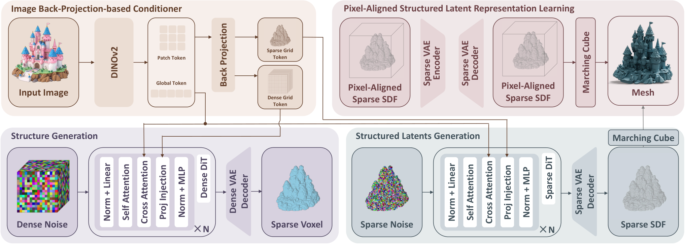
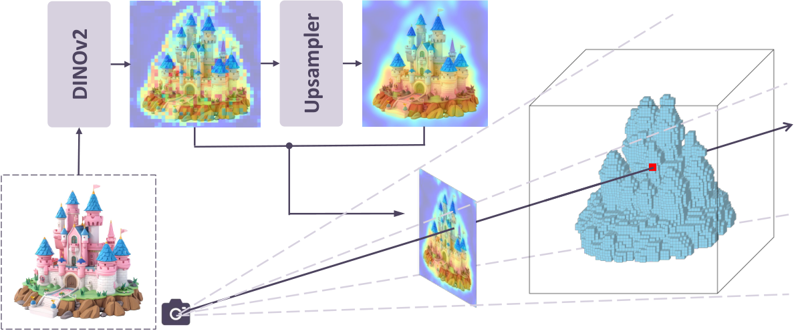
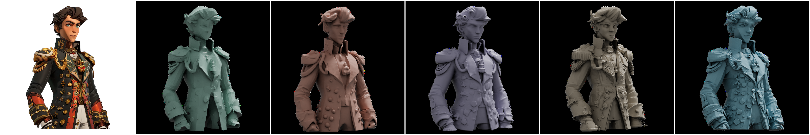

# Pixal3D: Pixel-Aligned 3D Generation from Images

## 基本信息

**论文链接**：https://arxiv.org/abs/2605.10922

**项目页面**：https://ldyang694.github.io/projects/pixal3d/

**作者单位**：清华大学、腾讯 ARC Lab、维多利亚大学

**发表**：SIGGRAPH 2026 Conference Papers

---

> 图 1：Pixal3D 生成的像素对齐网格，前景为生成结果、背景为对应输入图像，左下角展示将 2D 特征反向投影到 3D 体的条件机制。
> 来源：论文 Figure 1，https://arxiv.org/abs/2605.10922

## 研究背景

当前 3D 生成模型在几何细节和外观质量上持续进步，但像素级保真度（fidelity）始终是核心瓶颈。这里的保真度指生成的 3D 资产与输入图像在轮廓、可见表面几何和局部结构上的对应程度。用户给定一张图像时，通常有两个期望：一是精确重建可见表面，二是合理补全不可见区域以形成可用的 3D 资产。现有方法在第一点上普遍不足。

传统 3D 生成方法（如 TRELLIS、Direct3D-S2、Hunyuan3D 等）在规范空间中合成形状，再通过交叉注意力注入图像信息。这种方式使得 2D 像素与 3D 位置之间的对应关系是隐式的——注意力机制需要"搜索"每个图像特征应当影响哪些 3D 区域。在局部细节、重复部件或多视图输入的场景中，这种搜索过程容易产生歧义，最终表现为轮廓偏差、部件错位和细节丢失。

相比之下，3D 重建方法天然具有更高的保真度。多视图几何建立在像素对应与三角化之上，单目重建方法按像素输出深度、法线或点图，2D 到 3D 的映射直接且明确。但重建的局限在于结果往往不完整，无法直接作为可用的 3D 资产。

Pixal3D 的出发点是将重建的几何严谨性与生成模型的创造性结合起来。可见区域被输入图像通过显式对应关系强约束，不可见区域则由生成先验合理补全。

---

## 核心方法

> 图 2：Pixal3D 整体框架，包含像素对齐结构化潜表示学习、图像反向投影条件器与生成解码流程。
> 来源：论文 Figure 2，https://arxiv.org/abs/2605.10922

### 像素对齐生成范式

传统生成方法将所有对象映射到统一的规范姿态，这有利于学习类别级先验，但从根本上削弱了图像条件与 3D 表示的对应关系。输入图像的视角、局部可见区域与规范空间中的 3D latent 之间存在一道鸿沟，模型往往只能依赖全局语义线索而非精确的像素到 3D 映射。

Pixal3D 提出在输入相机坐标系中定义和生成 3D 对象。对象被表示为"从相机视角看到的样子"，3D 体空间与图像视锥体对齐，每个像素对应唯一的相机射线和 3D 空间中的结构化轨迹。这样，对应关系从一个需要学习的随机行为，变成了由几何先验确定的事实。

### 反向投影条件机制

> 图 3：反向投影条件机制示意，图像特征沿相机射线显式提升到 3D 特征体，建立 2D-3D 对应关系。
> 来源：论文 Figure 3，https://arxiv.org/abs/2605.10922

为实现像素对齐生成，Pixal3D 提出反向投影条件方案，用显式的 2D-3D 对应替代传统的交叉注意力。

给定输入图像，先用 DINOv2 提取 2D 特征图。特征图中的每个像素可以沿相机射线反向投影到 3D 空间，射线上的任意 3D 点都代表目标对象的潜在表面点。这些射线共同构成相机视锥体，目标 3D 形状被假设位于其中并由图像条件的射线定义。

生成模型需要一个预定义的包围盒来限定对象的空间范围。包围盒在视锥体中的放置由相机平面到立方体中心的距离参数和立方体尺度参数控制。通过投影公式，图像像素与立方体内的体素之间建立显式对应关系。

在实现中，这一过程以相反方向执行：将体素投影到图像平面并采样特征，这样更便于处理插值。训练阶段使用真实投影参数，推理阶段则通过固定策略确定参数：选择较小的视场角和单位立方体尺度，计算相机距离使得从图像四角发射的射线恰好经过单位立方体后表面的四个顶点。

最终形成的 3D 特征体与扩散模型中的噪声体在空间上对齐，直接相加作为图像条件。同时，DINOv2 提取的全局特征 token 仍通过交叉注意力注入，提供额外的全局语义引导。

### 多尺度特征融合

DINOv2 特征以高层语义为主，粒度相对粗糙，低层细粒度结构细节容易丢失。Pixal3D 使用一个现成的特征上采样模型将 DINOv2 patch token 特征上采样到全分辨率，得到细节更丰富的高分辨率特征图。

反向投影条件机制保持不变：在每个尺度上将体素投影到图像平面进行双线性采样，然后取平均。多尺度高分辨率特征改善了细节恢复与一致性。这个升级在交叉注意力方法中因计算代价高昂而难以实现，但在显式 2D-3D 对应的框架下几乎没有额外成本。

### 两阶段生成过程

Pixal3D 采用两阶段生成流程。第一阶段预测粗略结构，第二阶段预测详细 latent，最后解码为高保真网格。这样设计使像素对齐条件信号既能约束全局形状，也能作用于局部细节。

### 多视图扩展

由于单视图模型通过投影几何显式构建，扩展到多视图场景非常直接。多视图输入的相机参数假定为已知，与传统多视图立体、NeRF 和 3D Gaussian Splatting 的标准设置一致。

每个视图的多尺度特征独立反向投影到 3D 空间，在每个体素内通过简单取平均进行聚合。融合后的特征体作为生成模型的条件信号。这一方案可以容纳任意数量的输入视图，随着视角增加，更多 3D 表面变为可见，3D 形状重建的确定性也随之增强。

### 场景生成流水线

对于包含多个对象的场景图像，Pixal3D 可以逐个生成对象再通过图像空间对齐组合。

流水线分为三个步骤。第一步是分割与补全：用 SAM3 进行交互式分割得到对象掩码，再用 Qwen-image-edit 对遮挡区域进行 2D 补全。第二步是像素对齐生成：补全后的图像输入 Pixal3D 生成 3D 对象，由于生成对象的朝向已与输入图像对齐，只需解决对象间的相对尺度和深度问题。第三步是全局对齐：用 MoGe 从图像预测全局点图，Pixal3D 输出和 MoGe 预测都具有像素对齐属性，可以直接建立点级约束，通过最小二乘问题估计对象的尺度和深度。

与 SAM3D 相比，这一流水线避免了从图像估计 7-DoF 对象位姿这一困难且不稳定的步骤，转而通过像素对齐生成和全局深度估计解决对齐问题。

---

## 实验结果

### 单视图 3D 生成

> 图 4：单视图 3D 生成定性对比（81 号样本），从左到右为输入、TRELLIS、TripoSG、Hunyuan3D、Direct3D-S2 与 Pixal3D。
> 来源：论文 Figure 4，https://arxiv.org/abs/2605.10922

在 Toys4K 数据集上，Pixal3D 在多项指标上优于现有方法。与 Hunyuan3D-2.1 相比，IoU 从 83.33 提升至 93.57，法线误差均值从 21.19 下降到 16.63，11.25 度阈值内的法线精度从 51.37 提升到 53.13，22.5 度阈值内从 69.08 提升到 77.96，30 度阈值内从 75.83 提升到 85.35。视觉对比显示 Pixal3D 的输入视图轮廓更贴合，局部形状对位更准确，法线与结构细节更接近输入。

### 多视图 3D 生成

多视图实验在 Toys4K 上进行，与 VGGT 和 TRELLIS 对比。简单的特征体聚合方案能够稳定融合多个视图的信息。

### 消融实验

消融实验验证了几个关键设计的有效性。不使用多尺度特征时，细节恢复能力下降；改用交叉注意力替代反向投影条件时，保真度显著降低；退回规范空间生成范式时，与现有方法的差距缩小。这些结果表明提升来自对应关系设计本身，而非更大的模型或更长的训练。

---

## 与相关工作的关系

与 TRELLIS、Direct3D-S2、Hunyuan3D 等 3D-native 生成器相比，这些方法主要改进 3D 表示、稀疏结构效率和网格外观质量，但没有从根本上解决图像像素与 3D 位置对应不明确的问题。Pixal3D 的区别在于不主要改动 3D backbone，而是改动条件注入范式。

与 Hi3DGen 这类增加法线或几何线索的方法相比，这类方法仍在规范空间中生成，几何线索是辅助信息而非显式对应机制。

与纯重建方法相比，Pixal3D 在可见表面上接近重建级保真度，同时具备生成模型对不可见区域的补全能力。

与 ReconViaGen 和 CUPID 这类生成式重建工作相比，ReconViaGen 将 VGGT 特征注入规范空间生成器，CUPID 联合建模规范 3D 对象和相机位姿。Pixal3D 的推进点在于不是预测对应关系或位姿，而是直接通过几何反向投影强行建立对应关系。

---

## 局限与评价

Pixal3D 对相机几何和输入视图组织方式更为敏感，反向投影到 3D 体空间本身带来计算和内存成本。对于极端遮挡、反光、透明或细薄结构，沿射线赋予特征的方式是否足够精确仍有待观察。可见区域被强约束，但不可见区域仍主要依赖生成先验，补全合理性仍是开放问题。

从方法层面看，Pixal3D 与具体 3D 生成 backbone 相对正交，理论上可以兼容未来更强的稀疏体素、网格或纹理材质表示。问题定义准确，不是盲目追求更大模型，而是正视保真度这一真实痛点。解决方式直接：对应关系问题就用显式对应去解。

Pixal3D 的本质贡献是将显式几何对应从重建引入 3D-native 生成，用反向投影的 3D 条件体替代以往模糊的图像到 3D 交叉注意力注入路径。这是一个范式层面的推进，不是在现有框架上增加一个分支或一个损失函数。
