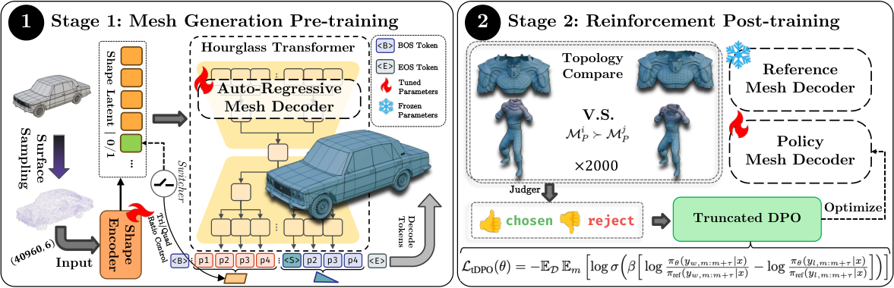
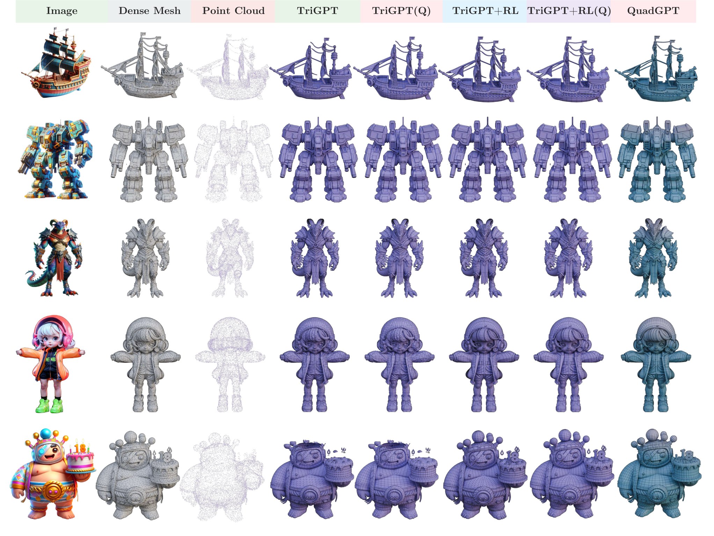

以下为论文 Figure 1 的 teaser 图，展示 QuadGPT 基于点云条件生成多样、高质量四边形网格的效果。

本次版本不再沿用早先基于二手文章的简略解读，而是按**可核实的官方原版论文**进行覆盖式重写。当前与 **Hunyuan3D-PolyGen** 最直接对应、且能完整解释其原生四边形/美术级拓扑能力的官方论文，是腾讯混元团队的 **QuadGPT: Native Quadrilateral Mesh Generation with Autoregressive Models**。如果后续官方再单独发布以 “Hunyuan3D-PolyGen” 命名的独立技术报告，可在此版本基础上继续联动更新。

## 1. 背景

Hunyuan3D-PolyGen 对应的问题，不是“再做一个能看起来像 3D 的生成模型”，而是**如何直接生成可以进入专业美术生产管线的网格资产**。在游戏、动画、角色绑定、细分建模等真实场景里，最终交付对象通常不是稠密三角网格，而是**拓扑干净、边流合理、四边形占主导**的 low-poly / mid-poly mesh。

这正是传统 3D 生成方法长期最薄弱的一环。很多方法能生成体素、TSDF、NeRF、3DGS 或三角面网格，但一旦进入生产链，仍需要人工 retopology、修边流、补洞、控面数、清理异常面。对美术团队而言，这类结果更像“参考草模”，而不是“可用资产”。

QuadGPT / Hunyuan3D-PolyGen 的动机非常明确：**把四边形主导网格的生成能力，直接纳入自回归生成模型本身，而不是依赖‘先生成三角面，再后处理转四边面’的间接方案。** 这也是它相较早期 Hunyuan3D 系列和大量 image-to-3D / text-to-3D 工作最重要的工程跃迁。

### 1.1 论文与产品对应关系

- **产品/系统名：** Hunyuan3D-PolyGen
- **底层官方论文：** [QuadGPT: Native Quadrilateral Mesh Generation with Autoregressive Models](https://arxiv.org/abs/2509.21420)
- **作者/机构：** 腾讯混元团队、香港科技大学等
- **在系统中的角色：** Hunyuan3D Studio / 混元 3D 生产链中的核心 mesh generation / retopology 模块

### 1.2 为什么值得关注

1. 它把 3D 生成的竞争焦点，从“视觉上像不像”推进到“拓扑上能不能直接用”。
2. 它明确面向四边形主导网格，而不是停留在通用三角网格或隐式表示。
3. 它把自回归 mesh generation、统一 tokenization、长序列建模和偏好优化结合起来，体现了**从研究 demo 到资产生产工具**的明显过渡。

---

## 2. 文章主线 / 论文线索

### 2.1 正式论文信息

- **论文标题：** [QuadGPT: Native Quadrilateral Mesh Generation with Autoregressive Models](https://arxiv.org/abs/2509.21420)
- **工作定位：** 原生四边形网格生成 / 面向工业拓扑质量的 mesh autoregressive model
- **核心目标：** 直接生成 quadrilateral-dominant mesh，而不是用 triangle mesh 后处理近似得到 quad mesh

### 2.2 论文试图解决的核心矛盾

现有 mesh generation 方案通常存在两条路线：

1. **先生成三角面网格，再通过规则或几何算法转四边面** 这类方案容易在局部细节、环流连续性、非流形位置上产生明显缺陷，尤其在复杂机械件、角色关节、衣物折叠等位置，会出现拓扑破碎、边流紊乱和不适合变形的问题。
2. **依赖 cross-field / quad remeshing 等几何后处理** 这类方法虽然能改善拓扑，但对输入表面质量非常敏感，而且本质上仍属于“生成之后再修”，不是原生地学习 quad topology 的生成规律。

QuadGPT 的论文主线因此可以概括为：

- 重新定义网格序列化方式，使三角面和四边面都能被统一建模；
- 用更适合长序列网格的 Hourglass Transformer 捕获全局拓扑上下文；
- 用拓扑质量感知的偏好优化，让模型学到更接近专业美术师的 edge flow 习惯；
- 最终直接输出更干净的 quadrilateral-dominant mesh。

### 2.3 与早期 Hunyuan3D 路线的关系

如果把腾讯混元 3D 路线分层看：

- **Hunyuan3D 1.x / 2.x** 更偏向 image-to-3D / texture / high-fidelity shape generation；
- **PolyGen / QuadGPT** 则把重点放在**网格结构质量与生产可编辑性**；
- 两者共同组成了从“生成几何”到“生成可交付资产”的完整闭环。

**一句话理解：** QuadGPT 不是单纯追求几何保真，而是在学习“专业 quad mesh 应该怎么布线”。

---

## 3. Pipeline / Architecture + I/O 数据流

以下为论文的整体 pipeline 架构图，展示从几何条件输入到四边形网格输出的完整流程。

### 3.1 总体输入与输出

|阶段|输入|输出|
|---|---|---|
|几何条件准备|高精细几何表面 / 点云采样 / 法线信息 / 上游几何先验|用于条件控制的 shape embedding|
|统一 tokenization|mesh 顶点、面片、拓扑连接关系|统一长度的 face token blocks|
|自回归网格生成|shape embedding + 已生成 token 序列|逐步展开的 quad / tri face 序列|
|序列解码与重建|完整 token 序列|四边形主导网格|
|偏好优化后训练|候选 mesh 对 + 拓扑质量偏好信号|更稳定、更符合美术习惯的边流与面布局|

### 3.2 统一 tokenization：如何把 quad mesh 变成序列

论文的第一个关键点，是把 mesh generation 变成一个可被大型序列模型处理的问题。

传统自回归 mesh 生成通常更偏向三角面，原因是三角面有固定 3 个顶点，序列化较容易；但四边面是 4 个顶点，且实际数据里还经常存在 tri/quad 混合拓扑。为了避免模型对不同 face type 使用两套完全不同的编码，论文采用了**统一 face token block 表示**：

- 每个面片都被编码为定长 token block；
- 四边面直接编码四个顶点及其相关结构信息；
- 三角面通过 padding 或约定符号补齐到同样长度；
- 这样模型不需要先判定“这是 triangle 还是 quad”，而是在统一格式下隐式学习面片类型与拓扑规律。

这一步非常关键，因为它让模型能够在**统一序列空间**中学习 mixed-topology mesh，并把“面片类型 + 顶点顺序 + 局部结构关系”一起纳入建模。

### 3.3 条件表示：Shape embedding 如何进入生成器

QuadGPT 不是无条件地从空白开始 hallucinate 一个 mesh。论文中它通常接收由上游几何表示得到的**shape embedding** 作为条件信号。直观上可以理解为：

- 上游表面或点云先被编码器压缩为整体形状语义；
- Decoder 通过 cross-attention 读取这一条件；
- 之后再按 token block 方式，逐步生成面片序列。

因此它更接近 **conditioned mesh generation / retopology-aware generation**，而不是完全自由的 open-ended 3D creation。

### 3.4 Hourglass Transformer：为什么适合长序列 mesh

网格序列往往比普通文本长得多。随着面数增加，face token 序列长度会迅速膨胀。如果直接用标准 full attention Transformer，计算和显存都会很快成为瓶颈。

论文因此采用 **Hourglass Transformer**：

1. **前段压缩（shortening）** 先对长序列做层级压缩，缩短需要全局交互的序列长度。
2. **瓶颈全局建模** 在较短的 bottleneck 表示上进行更高效的全局上下文传播，使模型能看到远距离的拓扑依赖，比如两侧对称结构、连续 edge loops、全局面流向等。
3. **后段展开** 再恢复局部细节表示，输出具体的面片 token。

这种结构的实际意义在于：**模型既能记住全局拓扑组织，又不会因为序列过长而彻底失控。** 对 quad mesh 来说，这一点尤为重要，因为边流质量、loop 连续性、对称性、面密度分布都不是局部贪心就能决定的。

### 3.5 生成过程的 I/O 数据流

可以把整个系统理解为如下数据流：

1. **输入几何条件**：点云 / 表面采样 / 上游 high-res mesh
2. **编码全局形状**：得到 shape embedding
3. **自回归展开 token**：逐块生成统一 face token blocks
4. **隐式判断面类型**：triangle / quadrilateral 在统一编码中被共同学习
5. **解码为显式 mesh**：恢复顶点、面片与拓扑连接
6. **偏好优化修正风格**：通过后训练让结果更符合专业拓扑标准
7. **输出最终网格**：四边形主导、边流更规整、可进一步进入 rigging / UV / animation 流程

### 3.6 tDPO：为什么要做偏好优化

仅靠 teacher forcing 的最大似然训练，模型往往只能学到“统计上像训练集”，却未必学会“专业上更优”。而在 quad mesh 领域，很多关键质量并不容易用简单损失直接表达，例如：

- edge loops 是否连续；
- 关节附近是否便于动画变形；
- 局部面流是否符合美术习惯；
- 是否存在难以编辑的拓扑断裂与异常极点。

论文因此引入 **truncated Direct Preference Optimization（tDPO）**。其思路是：

- 自动构造候选 mesh 对；
- 依据拓扑质量函数或偏好信号，形成“这个更好 / 那个更差”的监督；
- 用偏好学习而不是纯回归，让模型学到更接近专业标准的生成偏好。

这一步是 PolyGen 从“学术 mesh 生成模型”走向“可用于工业资产生产模块”的关键增强。

---

## 4. 实验与关键信息

### 4.1 数据与训练设置

根据论文与系统材料，可确认的训练设置包括：

- 训练数据为**大规模四边形主导 3D 模型集合**，覆盖通用物体、美术资产和复杂几何对象；
- 采用课程式训练思路，从较简单 topology 渐进过渡到复杂 quad-dominant 数据；
- 模型规模达到十亿级参数量级；
- 训练资源为多卡 A100 集群；
- 偏好优化阶段额外构造了基于生成结果的 preference pairs，用于学习更优拓扑布局。

论文更强调**拓扑质量**而不是纯视觉外观，因此实验设计也明确包含 geometry fidelity 与 topology quality 两类指标。

### 4.2 评价指标

论文重点关注以下几类结果：

1. **几何精度** 如 Chamfer Distance、Hausdorff Distance 等，用于衡量生成网格与目标表面的距离误差。
2. **拓扑质量** 如 quad ratio、面片规整性、边流连续性等，用于反映输出是否真正接近专业可用网格。
3. **专家主观评价** 由更接近美术/建模工作流的人工偏好评价，判断结果是否更适合后续编辑、细分与动画。

以下为论文 Figure 7，对比原生 quad generation 与「先生成三角面再转换」的 pipeline，展示 QuadGPT 在边流质量上的优势。

### 4.3 与基线方法的对比结论

论文主结论非常清楚：**原生 quad generation 明显优于 triangle-first 再 conversion 的间接路线。** 其优势主要体现在：

- 四边形占比更高；
- 局部布线更自然；
- 边缘流更连续；
- 在复杂结构上的 topology stability 更好；
- 更少依赖后续 remeshing 修复。

特别是在人体、机械件、细长结构或高曲率区域，QuadGPT 生成结果相较基线更少出现：

- 局部破碎；
- 异常高 valence 点；
- 面片扭曲；
- 不利于骨骼变形的 edge flow。

### 4.4 tDPO 的收益

偏好优化后的模型，相比纯预训练版本进一步表现出：

- 边流更符合人工建模经验；
- 连续 loop 更稳定；
- 局部结构更加规整；
- 面向真实 AI 生成 dense mesh 输入时更稳健。

也就是说，tDPO 改善的不是简单的“几何是否更像”，而是**拓扑是否更适合作为资产继续用**。

### 4.5 从工程角度看结果意味着什么

如果只从论文数字看，这是一篇 mesh generation 论文；但如果从 3D 内容生产的工程目标看，它的真正价值是：

- 降低重拓扑的人力成本；
- 让 AI 生成结果更接近 rigging-ready / animation-ready；
- 使 3D foundation model 输出更像“资产”，而非“展示结果”。

**关键判断：** QuadGPT / Hunyuan3D-PolyGen 的价值，不在于替代全部专业建模，而在于把 AI 输出从“需要大量清理”推进到“可以被专业流程接住”。

### 4.6 局限性与风险

论文也反映出几类边界：

1. **域间隙仍存在** 训练数据虽然大，但真实部署时面对的输入可能来自噪声更高的 AI dense mesh、扫描件或不完整几何，其分布和训练集仍有差异。
2. **极复杂高面数对象仍受长序列限制** 即使使用 Hourglass Transformer，超长 mesh sequence 仍然会带来效率与稳定性挑战。
3. **面数预算可控性仍需增强** 论文更强调生成质量与拓扑质量，但对“严格指定输出面数 / 局部密度分布控制”的能力仍不算充分。
4. **它不是完整生产链的全部** Quad mesh 生成只是资产制作中的一个关键环节，后续仍可能需要 UV、材质、绑定、动画适配等步骤。

---

## 5. 个人评注 / 下一步

### 5.1 对当前技术视野的价值

这篇工作应放在 **3D生成** 主标签下，但它的重要意义其实横跨“3D 生成”和“资产生产自动化”。如果只看 3D 生成 benchmark，它只是更强的 mesh model；如果放到工业生产里，它代表的是：

**AI 3D 输出开始直接面向专业网格标准。**

### 5.2 与既有关注方向的关系

它和以下主线高度相关：

- 从 image-to-3D / text-to-3D 走向 **asset-ready 3D generation**；
- 从隐式表示和高保真外观，走向 **explicit structured mesh output**；
- 从“把东西生成出来”，走向“生成后能直接进入后续 DCC / 引擎管线”。

### 5.3 建议下一步跟进

1. 继续跟踪腾讯后续是否发布 **Hunyuan3D-PolyGen 独立技术报告**，确认产品名与 QuadGPT 的一一映射关系是否进一步公开化。
2. 对比它与 triangle-to-quad remeshing、MeshAnything、Michelangelo 等路线的真实差异，特别关注**人工后处理成本**是否显著下降。
3. 进一步观察它在角色、机械件、可动画对象上的 edge flow 质量，判断是否真正接近 production-ready 标准。
4. 如果后续需要做 3D 资产生成综述，QuadGPT 应作为“**原生 quad mesh generation**”这一分支的核心代表工作。

---

**建议写入主文档的一句话摘要：** Hunyuan3D-PolyGen 对应的官方核心论文 QuadGPT 聚焦原生四边形网格生成，通过统一 mesh tokenization、Hourglass Transformer 与拓扑偏好优化，显著提升了 AI 生成网格的边流质量和工业可用性，是 3D 资产从“能看”走向“能进生产链”的关键一步。
