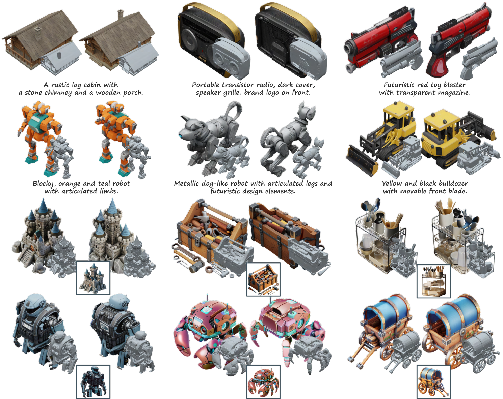
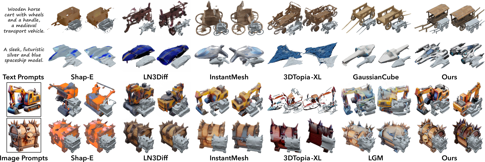

本版基于官方原版论文 **Structured 3D Latents for Scalable and Versatile 3D Generation** 覆盖重写，不再沿用早期公众号/README 层面的简化整理。重点补足 SLAT 表示、两阶段生成、Rectified Flow Transformer、编辑能力，以及论文中的实验细节与对比结论。

## 1. 背景

TRELLIS 试图解决的核心问题，是 3D 生成长期缺乏一个**既能统一几何与外观、又能灵活解码到多种 3D 表示形式**的中间潜空间。

在 2D 生成领域，latent representation 已经成为非常自然的基础设施；但在 3D 领域，表示形式高度割裂：

- **Mesh** 适合显式几何与编辑，但难以直接承载细致外观；
- **Radiance Field / NeRF** 擅长视图合成，但显式表面提取和资产导出不够直接；
- **3D Gaussian Splatting** 在渲染质量和效率上很强，但并不是天然的编辑友好资产格式。

这意味着，很多既有方法本质上只能在某一种 3D 表示内优化，难以同时兼顾：

1. 高质量几何；
2. 细致外观；
3. 多格式输出；
4. 局部可编辑性；
5. 可扩展的大模型训练。

TRELLIS 的动机因此非常明确：**先学习一种结构化统一 3D latent，再按需要解码成不同表示。** 这使它不仅是一个 text/image-to-3D 模型，更是一个朝“3D foundation representation”方向推进的工作。

下图是论文 Figure 4：TRELLIS 生成的高质量 3D 资产示例（Gaussian 与 Mesh 两种表示，来自文生/图生提示）。

### 1.1 正式论文信息

- **论文标题：** [Structured 3D Latents for Scalable and Versatile 3D Generation](https://arxiv.org/abs/2412.01506)
- **项目名：** TRELLIS
- **发表：** CVPR 2025
- **作者/机构：** 微软研究院、清华大学、中国科大等
- **项目页：** [TRELLIS Project Page](https://trellis3d.github.io/)

### 1.2 为什么值得看

1. 它提出的 **SLAT（Structured LATent）** 是论文真正的核心，不只是一个“模型名字”。
2. 它把生成目标从“固定一种 3D 表示”变成“先学统一潜空间，再决定输出格式”。
3. 它不仅支持 text-to-3D / image-to-3D，还支持 asset variants 和局部编辑，说明作者把它当成可持续操作的资产工作流来设计。

---

## 2. 文章主线 / 论文线索

### 2.1 论文试图回答什么问题

论文的核心问题可以表述为：

> 能否构造一种统一的 3D 潜表示，使它既保留高分辨率 3D 结构，又能承载足够细的外观信息，并且能被大规模生成模型稳定学习，最终灵活解码到 mesh、3DGS、radiance field 等不同格式？

作者的回答是 **SLAT**。

### 2.2 SLAT 的基本思想

SLAT 不是一个纯稠密体素特征网格，也不是一个纯隐式全局 latent。它由两部分组成：

1. **结构层（sparse structural scaffold）** 用稀疏激活体素描述 3D 空间里哪些位置属于物体表面附近，从而提供高分辨率但高效的 3D 结构框架。
2. **外观层（dense local latent features）** 在每个激活体素上附加局部 latent feature，这些特征来自多视图视觉信号聚合，承载细节纹理、局部几何与外观信息。

因此，SLAT 本质上是一个**结构化稀疏 3D latent field**：

- 既有显式空间位置；
- 又有附着其上的局部高维潜向量；
- 既保留结构，又不丢细节。

### 2.3 与传统路线相比的新意

相较只在某种目标表示上建模的方法，TRELLIS 的根本新意在于：

- 先学习一个中间层，而不是一开始就押注最终输出格式；
- 用统一 latent 连接 text/image 条件、结构生成、外观细化和下游解码；
- 把 3D 生成从“针对单格式设计模型”推进到“针对统一 3D latent 设计模型”。

**一句话理解：** TRELLIS 把 3D 资产生成拆成“先生成一个结构化 3D 潜空间，再把它解码成不同资产格式”。

---

## 3. Pipeline / Architecture + I/O 数据流

### 3.1 总体流程总览

下图是论文 Figure 2：方法总览，展示了 SLAT 编码（稀疏 3D 网格上的局部 latent）与两阶段生成（稀疏结构 + 局部 latent）以及多 decoder 解码的完整流程。

TRELLIS 采用明确的**两阶段生成流程**：

1. 先生成稀疏结构；
2. 再在激活区域上生成局部 latent feature；
3. 最后把统一 latent 解码为不同 3D 表示。

|阶段|输入|输出|
|---|---|---|
|条件编码|文本 prompt 或单张图像|条件特征（文本特征 / 图像特征）|
|结构生成|条件特征|稀疏 3D 结构，占据哪些 active voxels|
|局部 latent 生成|条件特征 + active voxels|每个激活体素对应的局部 latent vectors|
|统一表示|结构 + 局部 latent|SLAT|
|解码输出|SLAT|Radiance Field / 3D Gaussian / Mesh / GLB|

### 3.2 SLAT 的具体构成

论文把 SLAT 记为结构化的 latent 集合，每个 active voxel 附带一个局部潜向量。其关键设计思想是：

- **空间位置是稀疏的**：只保留物体表面附近需要建模的区域；
- **局部特征是稠密的**：在这些位置上保留高容量特征，用于承载细节；
- **位置与特征绑定**：因此既不像全局 latent 那样过度压缩，也不像整块 dense voxel grid 那样昂贵。

作者默认使用较高分辨率的 3D 网格，但真正被显式建模的是其中激活的小部分，从而兼顾了：

- 高空间分辨率；
- 稀疏结构计算效率；
- 局部高频细节表达能力。

### 3.3 两阶段生成：为什么先结构、后细节

#### 第一阶段：生成结构

第一阶段的目标不是直接生成最终外观，而是先回答：

- 物体大概占据哪些 3D 区域？
- 哪些 voxels 是“非空 / 活跃”的？
- 粗几何骨架是什么？

为了让模型更稳定地学习稀疏结构，论文先把结构表示压缩到更低分辨率的连续表征，再进行生成，之后再恢复到目标分辨率。这样做的好处是：

- 更容易捕捉全局形状；
- 降低结构生成的复杂度；
- 为第二阶段提供明确的 active region。

#### 第二阶段：生成局部 latent vectors

有了结构以后，第二阶段只在 active voxels 上继续工作。此时模型不需要再关心整个 3D 空间，只需为每个激活位置生成局部 feature。这样做非常关键，因为它相当于把“细节建模”限制在真正重要的位置上，避免把大量容量浪费在空空间。

这些局部 latent 随后可被不同 decoder 消费，因此它既服务于几何，也服务于外观与渲染。

### 3.4 Rectified Flow Transformer 如何工作

TRELLIS 并没有使用最朴素的扩散 Transformer，而是采用 **Rectified Flow Transformer（RFT）** 作为骨干。Rectified Flow 的优势在于：

- 更适合大规模生成模型扩展；
- 在采样效率和稳定性上具备优势；
- 能自然兼容条件生成。

但 SLAT 与普通 2D latent 不同，它具有明显的**稀疏 3D 结构特性**。因此作者做了几项关键适配：

1. **适配稀疏结构的注意力/卷积设计** 使模型既能利用局部空间邻域，又不丢失长程结构依赖。
2. **窗口式/分层式局部交互** 增强局部 coherent 结构建模能力。
3. **归一化与训练稳定性处理** 使得 10 亿到 20 亿参数级别模型训练更稳定。

总的来说，RFT 在 TRELLIS 里扮演的角色不是“通用 backbone”，而是**为 structured sparse 3D latent 定制的大模型主干**。

### 3.5 不同 decoder：同一个 latent，多个输出

TRELLIS 的统一性真正体现在 decoder 端。

#### 3D Gaussian Decoder

- 将局部 latent 解码为一组高斯 primitives；
- 每个高斯包含位置、尺度、旋转、颜色、不透明度等参数；
- 适合高质量快速渲染与展示。

#### Radiance Field Decoder

- 将局部 latent 解码为局部辐射场表示；
- 适合视图合成与体渲染；
- 保留更连续的视角依赖外观表达。

#### Mesh Decoder

- 将 SLAT 解码为显式几何场，再进一步提取 mesh；
- 论文中借助可微表面提取路线，使网格输出能保持几何质量；
- 这是它能导出资产格式、靠近生产流程的关键一步。

因此，TRELLIS 的核心不是“同时支持多格式”这句功能描述本身，而是它真的建立了**同一个潜空间到多种 3D 表示的映射机制**。

### 3.6 编辑与变体能力的 I/O 逻辑

论文不只做从零生成，也强调资产工作流能力。

#### 变体生成（asset variation）

- **输入：** 已有生成结构 + 新的文本条件
- **机制：** 固定部分结构或共享第一阶段结果，仅改变第二阶段局部 latent 条件
- **输出：** 保持大结构一致、细节和外观发生变化的新资产

#### 局部编辑（region-specific editing）

- **输入：** 现有资产 + 指定编辑区域 + 条件信息
- **机制：** 仅重采样目标区域的结构或 latent
- **输出：** 局部修改后的 3D 资产

这说明作者把 TRELLIS 视为一个可以被“持续操作”的 3D latent system，而不是一次性出图模型。

---

## 4. 实验与关键信息

### 4.1 数据集与训练配置

论文使用大规模高质量 3D 资产集合，来源覆盖多个公开 3D 数据源，并对数据进行严格筛选、对齐和 caption 构建。关键点包括：

- 数据规模约 **50 万** 高质量 3D 资产；
- 使用高质量文字描述增强 text-to-3D 对齐；
- 构建多视图渲染与视觉特征，为 SLAT 提供跨视角细节监督；
- 模型家族覆盖从数亿到 **20 亿参数** 的规模。

这意味着 TRELLIS 不是“小规模 clever trick”，而是明确按**foundation model 路线**搭建的系统。

### 4.2 表示层面的实验结论

论文首先证明 **SLAT 本身就是强表示**。

与既有 3D latent / 3D representation baseline 相比，SLAT 在以下方面表现更好：

- 几何还原更准确；
- 外观更细致；
- 重建保真度更高；
- 解码到不同表示形式时质量更稳定。

这说明 TRELLIS 的成功不只是因为模型大，更因为它提出了一个更合理的 3D 中间表示。

### 4.3 生成结果与基线比较

下图是论文 Figure 5：TRELLIS 与先前方法的生成结果视觉对比（基于 AI 生成提示）。

在 text-to-3D 与 image-to-3D 任务上，TRELLIS 对比多个强基线时总体体现出以下优势：

1. **几何更稳** 相比依赖 2D multi-view consistency 或单格式 3D 表示的方法，TRELLIS 输出的结构更完整，少出现几何破碎。
2. **外观更好** 局部 latent 加上视觉基础模型特征，使它在颜色、表面细节、边缘清晰度上更强。
3. **多格式一致性更强** 同一个 SLAT 可被稳定解码为 Gaussian、RF、Mesh，不需要为每种表示各训一套模型。
4. **用户偏好显著更高** 无论 text-to-3D 还是 image-to-3D，用户研究都显示 TRELLIS 胜率明显领先。

### 4.4 为什么 image-to-3D 特别强

论文和项目页都反复表明，TRELLIS 在 image-to-3D 上尤其突出。这背后的原因是：

- 图像条件能提供更强的外观和结构先验；
- SLAT 可以充分利用图像里的细节信号；
- 相比纯 text-to-3D，image-to-3D 的生成空间更收敛，因此统一 latent 的优势更容易兑现。

从工程实践看，这也解释了为什么官方更推荐把 TRELLIS 用作“图生 3D”或“文生图后再转 3D”的核心引擎。

### 4.5 论文体现出的限制

尽管结果很强，论文也揭示了几类边界：

1. **PBR / 光照解耦不充分** 输出结果仍可能携带输入图像中的 baked-in shading，材质与光照没有完全分离。
2. **真实世界复杂物体仍有难度** 尽管 image-to-3D 已很强，但对复杂透明、极细结构或强反射场景仍有挑战。
3. **统一 latent 不等于完全统一工作流** Mesh、Gaussian、Radiance Field 虽都能解码，但不同输出在下游编辑、渲染和资产制作上仍有各自边界。

**关键判断：** TRELLIS 最重要的贡献不是单次指标领先，而是用 SLAT 证明了“统一 3D latent”这条路是可行的，而且确实能带来多格式生成与编辑能力。

---

## 5. 个人评注 / 下一步

### 5.1 对当前技术视野的价值

TRELLIS 应归入 **3D生成**，但从方法论上看，它更像“3D foundation representation”的代表工作。相比许多只在某个 benchmark 上抬分的方法，它更值得长期跟踪，因为它试图重建的是**整个 3D 生成的中间层基础设施**。

### 5.2 与既有关注方向的关系

它和以下主线高度相关：

- 统一 latent 表示驱动 3D 生成；
- 多输出格式资产生成；
- 3D 资产编辑与可持续操作；
- 3D foundation model 的扩展路径。

### 5.3 建议下一步跟进

1. 继续对比 TRELLIS 与更紧凑 structured latent 路线，观察统一 latent 是否进一步压缩而不损失质量。
2. 重点跟踪其 mesh decoder 的真实可用性，评估是否已达到更高等级资产导出门槛。
3. 结合 SAM 3D、Hunyuan3D-PolyGen 等工作一起看，会更清楚近期 3D 主线正在分化为：**统一 latent、真实世界重建、生产级 mesh 资产化** 三条支线。
4. 如果后续做方向综述，TRELLIS 应作为“统一 3D latent 表示”主线的核心 anchor paper。

---

**建议写入主文档的一句话摘要：** TRELLIS 通过提出统一的结构化 3D 潜表示 SLAT，并采用两阶段 Rectified Flow Transformer 在该表示上生成和编辑 3D 资产，实现了从同一 latent 稳定解码到 mesh、3D Gaussian 和 radiance field 的能力，是统一 3D foundation representation 路线上的代表性工作。
