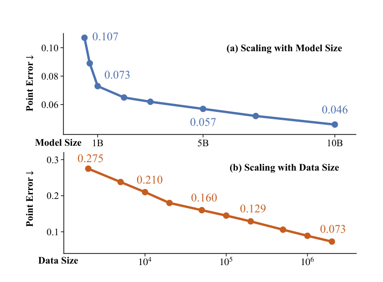
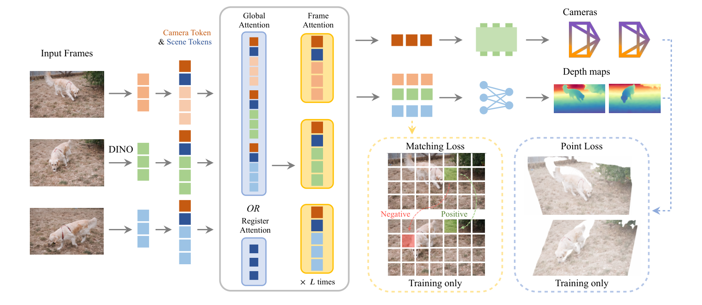
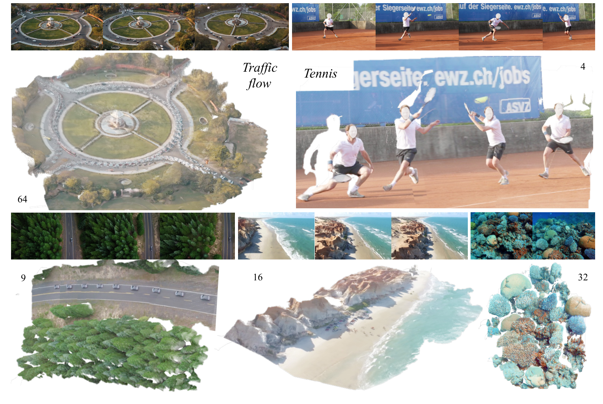

# VGGT-Ω: 迈向 3D 视觉大模型时代的 Feed-forward 重建基座

**核心观点：** VGGT-Ω 证明了前馈（Feed-forward）重建模型的质量能够随着模型和数据规模的扩大而产生预测性的提升。通过引入 Register Attention 架构改进、超大规模动态场景标注管线以及自监督学习协议，VGGT-Ω 在多个静态与动态基准测试中刷新了 SOTA，并展现了其作为空间理解通用表征的巨大潜力。

---

## 论文概览（粗读层）

### 标题与链接

- **标题**：VGGT-Ω: Scaling Feed-forward Reconstruction
- **项目主页**：[http://vggt-omega.github.io/](http://vggt-omega.github.io/)
- **论文链接**：[https://vggt-omega.github.io/assets/paper/preview_v3.pdf](https://vggt-omega.github.io/assets/paper/preview_v3.pdf)

### 作者与单位

- **作者**：Jianyuan Wang, Minghao Chen, Shangzhan Zhang, Nikita Karaev, Johannes Schönberger, Patrick Labatut, Piotr Bojanowski, David Novotny, Andrea Vedaldi, Christian Rupprecht
- **单位**：牛津大学视觉几何组 (VGG)、Meta AI

### 摘要翻译

最近的前馈重建模型（如 VGGT）已证明其在前馈推理下具备与传统基于优化的重建器竞争的能力，同时能提供对其他任务有用的几何感知特征。本文中，我们展示了这些模型的质量会随着模型和数据规模的增大而呈预测性地提升。我们推出了 **VGGT-Ω**，它在静态和动态场景的重建精度、效率和能力上均有显著提升。

为了实现前所未有的训练规模，我们引入了改善训练效率的架构变革、支持动态场景的高质量数据标注管线以及自监督学习协议。我们通过使用单一密集预测头配合多任务监督，并移除昂贵的高分辨率卷积层，简化了 VGGT 的架构。我们还使用寄存器（registers）将场景信息聚合到紧凑表征中，并引入了 **寄存器注意力（register attention）** 机制。该机制将帧间信息交换限制在寄存器之间，部分取代了全局注意力。因此，在训练期间，VGGT-Ω 仅消耗前作约 30% 的 GPU 显存，使我们能使用比此前多 15 倍的监督数据进行训练，并利用海量的无标签视频数据。

VGGT-Ω 在多个基准测试中取得了强劲的静态与动态重建结果，例如在 Sintel 上的相机估计精度比此前最佳方法提升了 77%。此外，我们展示了学习到的寄存器可以改进视觉-语言-动作（VLA）模型并支持与语言的对齐，这表明重建可以作为空间理解的一种强大且可扩展的代理任务。

### 主旨与贡献总结

VGGT-Ω 的核心在于**“规模化（Scaling）”**。它不仅是一个更强的重建模型，更是在探索 3D 视觉领域是否存在类似 LLM 的 Scaling Law。

1. **架构优化**：引入了基于寄存器的 Bottleneck 设计，将 O(N^2) 的全局注意力精简为针对寄存器的交互，配合密集预测头的轻量化（MLP + Pixel Shuffle），大幅降低了训练显存开销。
2. **动态支持与数据管线**：开发了一套融合 VLM 预过滤、几何后过滤及跨视图一致性校验的自动化标注管线，成功从 4000 万段互联网视频中提取出 80 万段高质量轨迹与深度图（含 1/3 动态场景），将监督数据规模提升至 400 万序列。
3. **泛化表征**：证明了 3D 重建任务学习到的寄存器（Scene Tokens）具备极强的语义和几何属性，可以直接作为 VLA 模型的插件，或与语言空间进行对比对齐。

**图 1：性能随数据和模型参数规模的 Scaling 趋势。随着参数从 0.2B 增至 10B，数据从 2K 增至 2M 序列，3D 点误差呈现稳定的幂律下降趋势。** [[1]](https://arxiv.org/abs/2511.10647)

---

## 精读分析：背景与核心挑战

### 历史脉络与当前痛点

传统的 3D 重建（如 SfM/SLAM）长期依赖于特征匹配和基于光度/几何残差的非线性优化（Bundle Adjustment）。虽然 COLMAP 等系统非常稳健，但在面对**低纹理、弱基线、大运动模糊**或**动态场景**时，优化过程极易陷入局部最优。

近年来，以 VGGT 、DUSt3R 为代表的前馈模型（Feed-forward Models）开启了新范式：直接通过神经网络回归相机参数和深度图。然而，这类模型面临三大瓶颈：

- **效率瓶颈**：ViT 的全局注意力机制随帧数呈二次方增长，导致长序列训练和推理显存爆炸。
- **数据瓶颈**：高质量的 3D 监督数据（带位姿和深度）极难获取，尤其是动态视频的 GT。
- **动态局限**：大多数现有模型假设场景是刚性的（Static），面对移动物体（如行人、车辆）时会产生严重的几何畸变。

### VGGT-Ω 的定位

VGGT-Ω 致力于解决**“如何在大规模、异构且包含动态内容的真实世界视频上训练基础重建模型”**。它通过算法创新降低资源消耗，通过数据创新突破标注限制，旨在成为 3D 空间理解的“基石模型”。

---

## 精读分析：VGGT-Ω 技术路线

### 1. 架构改进：寄存器注意力与显存效率

VGGT-Ω 的核心设计思想是引入**寄存器（Registers / Scene Tokens）**作为帧间信息交换的瓶颈（Bottleneck）。

- **Tokenization**：每个输入帧被分割为 Patch Tokens，并额外追加 1 个相机 Token (camera token) 和 16 个寄存器 Token (scene tokens)。
- **Register Attention**：在 ViT 的多层注意力中，VGGT-Ω 并不是在每一层都进行全帧（Global）交互。它将 25% 的全局注意力层替换为“寄存器注意力”。在这些层中，只有寄存器之间进行交互。随后，通过后续的“帧内注意力（Frame Attention）”，寄存器再将聚合的全局场景信息分发回各自帧的 Patch Tokens。
    - **效果**：这种设计不仅鼓励寄存器学习全局一致的表示，还显著降低了计算量。替换 25% 的全连接层后，训练显存节省约 16%，FLOPs 降低 23%，且几乎不损失性能。[[2]](http://openaccess.thecvf.com/content/CVPR2025/html/Li_MegaSaM_Accurate_Fast_and_Robust_Structure_and_Motion_from_Casual_CVPR_2025_paper.html)

    

**图 2：架构概览。模型在全局/寄存器注意力和帧内注意力之间交替，最终解码出相机位姿和深度图。** [[3]](http://openaccess.thecvf.com/content/CVPR2025/html/Wang_VGGT_Visual_Geometry_Grounded_Transformer_CVPR_2025_paper.html)

- **解码头优化**：VGGT-Ω 移除了 VGGT 中昂贵的高分辨率卷积层，改为使用 **MLP + Pixel Shuffle** 操作进行上采样。这种方式在保持深度的局部平滑性的同时，将训练显存消耗降低了 70%。

### 2. 多任务监督协议

尽管 VGGT-Ω 在推理时**只预测相机** $$g_$$ **和深度图** $$D_$$，但在训练阶段，它引入了丰富的辅助损失来强化表征：

| 损失项                                 | 描述                               | 作用            |
| ----------------------------------- | -------------------------------- | ------------- |
| 相机损失 $$\mathcal{L}_{\text{cam}}$$   | 预测四元数、平移向量及 FoV 的 $$\ell_1$$ 距离。 | 监督全局一致的几何布局。  |
| 深度损失 $$\mathcal{L}_{\text{depth}}$$ | 包含梯度一致性项和自适应不确定性权重。              | 学习像素级空间位置。    |
| 点图损失 $$\mathcal{L}_{\text{point}}$$ | 通过深度和位姿反投影得到的 3D 点云损失。           | 强化空间几何的一致性。   |
| 匹配损失 $$\mathcal{L}_{\text{match}}$$ | 对最后一层 Token 进行对比学习（正负样本对）。       | 学习具有几何区分度的特征。 |

### 3. 大规模标注管线：化腐朽为神奇

为了利用 4000 万段无标注视频，作者设计了一套极为保守但高质量的自动标注管线：

1. **VLM 预过滤**：利用视觉语言模型（如 GPT-4V 级别）筛除多镜头剪辑、过度模糊、大量水印的视频。仅保留 10% 的重建友好型素材。
2. **动态掩码**：使用 Grounding DINO 识别行人、车辆等潜在移动物体，在特征匹配时将其排除，从而在动态视频中获得稳定的刚性背景轨迹。
3. **多模型集成匹配**：融合 SIFT、SuperPoint、LightGlue 等多个模型进行特征提取与匹配。
4. **几何校验与一致性**：运行 COLMAP 进行 Bundle Adjustment，并对生成的深度图进行跨视图投影校验（Reprojection Error < 1%）。
5. **监督过滤器**：训练一个 XGBoost 分类器，基于轨迹平滑度、视差角、深度图完整性等特征，进一步剔除低质量标注。

最终，该管线为 VGGT-Ω 提供了 80 万段互联网视频的“伪真值（Pseudo-GT）”。[[4]](https://dl.acm.org/doi/full/10.1145/3631533)

### 4. 自监督学习：Teacher-Student 协议

为了进一步挖掘 1800 万段纯无标签视频的价值，作者引入了类似 DINOv2 的动量教师协议：

- **Student** 通过梯度更新，**Teacher** 通过 EMA（指数移动平均）更新。
- **目标**：要求 Student 在不同的数据增强（颜色抖动、随机掩码、帧顺序打乱）下，匹配 Teacher 输出的 Token 表征。
- **意义**：这增强了模型对光照、遮挡和视角变化的鲁棒性。

---

## 精读分析：实验与性能评价

### 1. 定量对比：跨越静态与动态边界

作者在 3 个静态基准（7 Scenes, NRGBD, ETH3D）和 3 个动态基准（DyCheck, Sintel, TUM-Dynamic）上进行了全面评估。

**相机位姿估计性能（AUC@3°）**

|方法|ETH3D (静态)|Sintel (动态)|TUM-Dyn (动态)|
|---|---|---|---|
|MegaSaM|5.9|22.5|15.4|
|VGGT|18.8|15.0|16.6|
|DA3|46.1|16.2|20.8|
|**Ours-10B**|**56.3**|**40.0**|**36.4**|

**关键突破：** 在 Sintel 等极具挑战性的动态场景中，VGGT-Ω 的位姿精度比此前最优的前馈模型提升了约 77% (AUC@3° 40.0 vs 22.5)。这表明模型通过大规模数据训练，习得了强大的运动先验，能有效区分相机运动与物体运动。

### 2. 定性效果展示

VGGT-Ω 不仅能处理常规室内外场景，在极具挑战性的环境下（如水下珊瑚礁、高速网球运动）也表现出色。

**图 3：VGGT-Ω 重建结果。模型能生成全局一致的轨迹，并对动态行人（Tennis）和复杂背景（Coral）具有极强的泛化力。** [[5]](https://arxiv.org/abs/2509.13414)

与 **MegaSaM** 对比，MegaSaM 往往在宽基线场景下由于过度依赖局部优化而产生几何漂移；而 VGGT-Ω 展现了更好的全局一致性。

### 3. Registers 的“超能力”

作者通过两个实验证明了寄存器不仅仅是辅助 Token，它们蕴含了丰富的语义：

- **机器人控制 (VLA)**：在 LIBERO 机器人基准测试中，仅需将冻结的 VGGT-Ω 寄存器作为输入追加给 OpenVLA 模型，即可在所有任务上获得性能提升。[[6]](http://openaccess.thecvf.com/content/CVPR2025/html/Pataki_MP-SfM_Monocular_Surface_Priors_for_Robust_Structure-from-Motion_CVPR_2025_paper.html)
- **语言对齐**：通过 InfoNCE 损失，作者成功将寄存器映射到了文本空间。在 100 段互联网视频的检索测试中，对齐后的模型实现了 76.8% 的 Top-1 检索精度。
    - **启示**：这暗示了“几何模型”在足够大的规模下，其表征空间会自动向“语言/语义空间”收敛。

---

## 相关研究梳理

按照论文原文的分类体系，相关研究可分为以下四个赛道：

### 1. 3D 重建与前馈模型 (Feed-forward Reconstruction)

- **DUSt3R** ：开启了回归 Pointmap 的先河，通过简单的 Transformer 架构实现对任意图像对的重建，但受限于两帧模型，多帧需要后优化。
- **MASt3R** ：进一步强化了匹配特征，但在处理长序列时依然存在效率瓶颈。
- **DA3 (Depth Anything 3)** ：采用 DINO 作为 Backbone，主打“最小化建模”，但对动态场景的支持主要依赖于数据多样性，缺乏针对性的瓶颈设计。

### 2. 动态场景与 4D 重建 (Dynamic 3D/4D Reconstruction)

- **MegaSaM** ：通过前馈深度预测结合基于优化的非刚性重建。优势在于局部细节，缺点在于推理速度慢（比 VGGT-Ω 慢 50 倍）且对弱纹理敏感。
- **MonST3R** ：将 DUSt3R 扩展到动态场景。通过每时刻估计点图来实现，但在处理长时间视频时容易产生不连贯。

### 3. ViT 寄存器 (Registers in ViTs)

- **Darcet et al.** ：首次发现 ViT 会在某些 Patch 上产生“伪伪影（Outliers）”来存储全局信息，并提出显式添加 Register Tokens。VGGT-Ω 将此概念扩展到了跨帧的全局信息瓶颈。

### 4. 数据规模化 (Data Scaling in 3D)

- **MegaSynth** ：探索通过合成数据提升重建效果。VGGT-Ω 进一步证明了“合成数据保精度、真实数据保泛化”的互补关系。

---

## 局限性与未来展望

### 1. 依然存在的挑战

尽管 VGGT-Ω 表现强劲，但在以下场景仍有短板：

- **强运动模糊**：由于特征提取依赖于局部 Patch 的纹理，极端的运动模糊会导致特征失效。
- **FoV 剧烈波动**：当相机焦距在极短时间内发生剧烈变化（如 10° 到 160° 的缩放）时，模型难以准确回归相机参数。
- **显示器/透明物体**：模型在处理多屏幕办公环境或复杂玻璃反射时，深度预测有时会出现抖动。

### 2. 未来的研究趋势：通向“全模态大模型”

作者在讨论中提出了几个极具前瞻性的判断：

- **感知与生成的融合**：未来的感知模型可能会被集成到“生成式视觉模型”中。例如，将深度预测视为一种图像生成任务，或将相机参数视为 Token 进行自回归预测。
- **数据是唯一的护城河**：3D 重建的上限目前被监督数据（尤其是带时序一致性的真值）锁死。未来的突破点可能在于如何更高效地从无标注视频中“蒸馏”出几何常识。
- **Omni-Model 时代的公民**：重建任务将成为全模态大模型（Omni-Model）的一个子能力。通过跨任务的一致性约束（如利用文本先验解决深度图中的空洞），模型的稳健性将获得跨越式提升。

**专家总结：** VGGT-Ω 的成功并非单一模块的胜利，而是“架构效率、多任务损失、大规模合成数据、自动化真实视频标注”四位一体的系统工程。它为 3D 视觉研究者指明了一个方向：以前馈网络为核心，通过 Scaling 习得世界几何规律，是通向实体 AI 的必经之路。

---

# 参考资料

[[1] Depth anything 3: Recovering the visual space from any views](https://arxiv.org/abs/2511.10647)

[[2] Megasam: Accurate, fast and robust structure and motion from casual dynamic videos](http://openaccess.thecvf.com/content/CVPR2025/html/Li_MegaSaM_Accurate_Fast_and_Robust_Structure_and_Motion_from_Casual_CVPR_2025_paper.html)

[[3] Vggt: Visual geometry grounded transformer](http://openaccess.thecvf.com/content/CVPR2025/html/Wang_VGGT_Visual_Geometry_Grounded_Transformer_CVPR_2025_paper.html)

[[4] Structure from Motion-Based Mapping for Autonomous Driving: Practice and Experience | ACM Transactions on Internet of Things](https://dl.acm.org/doi/full/10.1145/3631533)

[[5] [2509.13414] MapAnything: Universal Feed-Forward Metric 3D Reconstruction](https://arxiv.org/abs/2509.13414)

[[6] Mp-sfm: Monocular surface priors for robust structure-from-motion](http://openaccess.thecvf.com/content/CVPR2025/html/Pataki_MP-SfM_Monocular_Surface_Priors_for_Robust_Structure-from-Motion_CVPR_2025_paper.html)
