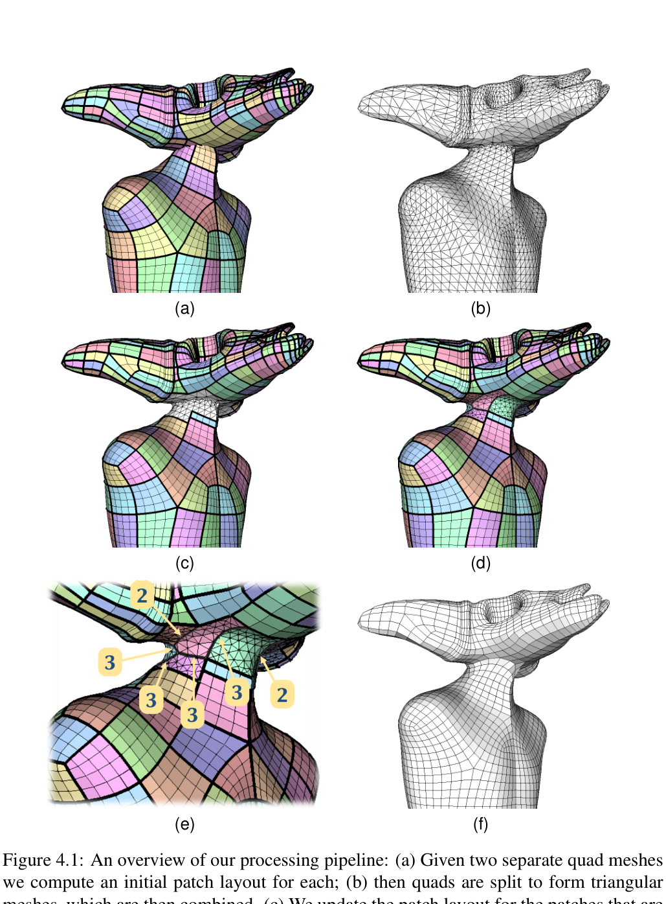

# Modeling Quadrilateral Meshes by Composition：四边形网格的组合式建模

## 基本信息

- **论文/学位论文名称**：*Modeling Quadrilateral Meshes by Composition*
- **作者**：Alex David Hernández Maturrano
- **单位**：COPPE/UFRJ，Systems Engineering and Computer Science
- **时间**：2020 年 12 月
- **类型**：博士学位论文（54 页正文）
- **相关论文**：核心方法基于 *QuadMixer: Layout Preserving Blending of Quadrilateral Meshes*
- **原始文件**：[本地 PDF](file:///Users/eilonxtxue/Downloads/2971.pdf)
- **重要性评估**：★★★★☆（4/5）

---

## 1. 一句话总结

这篇论文提出了一套面向动画资产的四边形网格布尔组合流程：先借助三角网格完成稳健的并、交、差运算，再只对交界线附近的局部区域重新划分 patch 和四边形化，从而尽量保留美术师原先设计的 edge flow，并输出封闭、纯四边形的二流形网格。

---

## 2. 研究问题与动机

影视和游戏中的角色模型通常采用四边形网格，因为规则的 edge loop、edge ring 与特征线对齐后，更适合后续蒙皮、绑定、细分和动画变形。但四边形网格具有较强的全局拓扑约束：在局部增删几何时，修改往往会沿着 edge flow 传播，因此三角网格上成熟的 CSG/Boolean 方法不能直接套用。

已有“按零件拼装模型”的工作大多输出三角网格；若把结果整体重新四边形化，又会破坏原模型中由美术师手工设计的拓扑布局。论文要解决的核心矛盾因此是：**既要获得稳健的几何组合能力，又要尽量不动交界区域之外的原始四边形结构。**

---

## 3. 核心方法

### 3.1 总体思路：把全局问题限制在交界线附近

方法输入两个纯四边形网格，目标是模拟并集、交集和差集等布尔操作。作者并不重新网格化整个模型，而是先提取原始 quad patch layout，随后只重建被交界线影响的小片区域。未参与融合的四边形面保持不变，因此原始 edge flow 能被最大程度继承。

*图 1：论文 Figure 4.1。流程从原始 quad patch layout 出发，经三角化布尔运算、受影响 patch 回缩、交界区域重新分块、边界细分数优化，最终恢复为纯四边形网格。*

### 3.2 六步处理流程

1. **提取 patch layout**：从非四价奇异点发射 separatrix，或使用 motorcycle graph，把输入四边形网格分解成结构化 patch。
2. **三角化并执行稳健布尔运算**：把每个 quad 拆成两个三角形，借助成熟的三角网格 Boolean 实现几何并、交、差。
3. **保留未受影响区域**：识别没有被 Boolean 修改的原始 patch；对部分受影响的 patch 做回缩，得到保留的四边形区域 $Q_0$ 与待重建的三角区域 $T$。
4. **局部平滑与重新分块**：在交界线附近做可控平滑，并根据 cross-field 在 $T$ 上追踪新的子 patch。
5. **整数优化边界细分数**：用整数二次规划平衡两类目标——尽量保持边长均匀，以及让四边形 patch 的对边细分数接近；同时约束新旧区域边界细分数严格一致，并保证每个 patch 满足可四边形化的偶数性条件。
6. **逐 patch 四边形化并缝合**：把 patch 参数化到二维规则多边形，在参数域中完成四边形化，映射回三维后与 $Q_0$ 拼接，形成最终纯四边形网格。

### 3.3 关键技术价值

论文真正有价值的地方不是“又做了一次 Boolean”，而是建立了一个**三角网格负责几何鲁棒性、四边形 patch 负责拓扑质量**的混合管线。它把四边形网格难以局部修改的全局约束，转化为 patch 边界细分数上的整数优化问题；同时还从边界奇偶性出发讨论何时存在有效四边形化，并给出通过细化 polychord 修复不可解边界的方法。

---

## 4. 实验结果

作者在 Intel Core i7-8750H、16GB RAM 的桌面电脑上测试了单线程原型，优化部分使用 Gurobi。实验包括角色头部零件替换、不同属和不同细节模型之间的组合，以及多次迭代合并 Fertility 模型的压力测试。

- 系统能够模拟 **union、intersection、difference** 三类常见布尔操作。
- 在迭代合并测试中，方法持续输出**封闭、二流形、纯四边形表面**。
- 作者报告，交界区域重建没有明显降低整体 quad 质量；直方图中的单元畸变分布与原网格整体接近。
- 多数普通模型组合的总耗时约为 **0.25–3.27 秒**，较重的迭代组合约为 **7.41–14.92 秒**。虽然论文称其为交互式，但在复杂模型上更准确的说法是“秒级交互原型”。
- 结果展示表明，原始网格中未参与融合的 patch 基本保持不变，适合复用已有动画资产，而不必对整个模型重新拓扑。

需要注意的是，这些实验以定性结果、鲁棒性案例和阶段耗时为主，没有今天常见的大规模 benchmark、用户研究或与现代 remeshing 系统的系统性定量比较。

---

## 5. 局限与评价

### 5.1 论文明确承认的局限

1. **尖锐特征保留不足**：尤其在差集操作产生硬边时，平滑和 field 计算容易弱化 sharp feature。
2. **依赖输入分辨率与初始 patch layout**：两个输入网格分辨率接近时效果更好；不同 patch 分解策略也会改变结果。
3. **交互连续性不足**：用户轻微移动两个模型时，最优 patch 拓扑可能突然跳变，导致输出 tessellation 不连续。
4. **极端交叠会失败**：如果 Boolean 影响范围吞掉几乎所有原始 quad，系统无法保留有效 patch 分解，此时应直接采用全局重网格化。
5. **工程实现仍偏原型**：单线程、依赖 Gurobi，复杂案例耗时可达到十余秒，离成熟 DCC 工具中的稳定交互体验仍有距离。

### 5.2 我的评价

这项工作的思路很“生产导向”：它没有追求从零生成全新的最优四边形网格，而是把**已有美术拓扑视为需要保护的资产**。这种立场非常适合角色建模、零件复用和动画资产编辑，也与今天强调“可编辑、可绑定、可进入下游工作流”的 3D 资产生成趋势一致。

从研究史角度看，这篇 2020 年博士论文更像一个几何处理系统总结，而不是当前意义上的生成模型论文。它对今天的启发主要有两点：第一，生成或编辑 3D 资产时，几何正确并不等于生产可用，拓扑和 edge flow 同样重要；第二，复杂网格编辑可以采用“稳健三角几何运算 + 局部结构化四边形重建”的混合策略，而不必在一种表示上解决所有问题。
