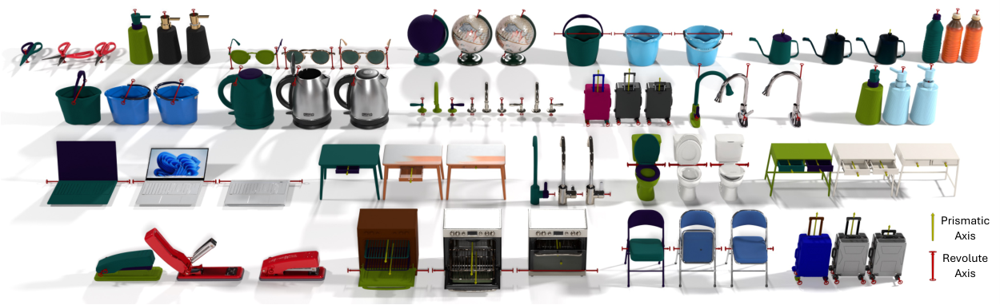
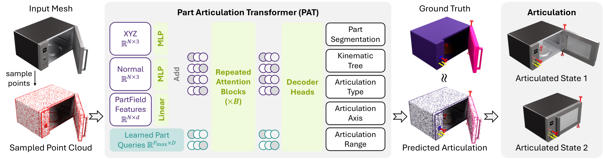
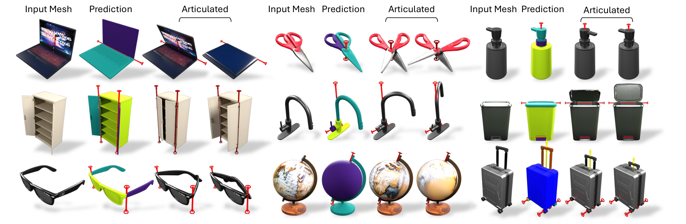
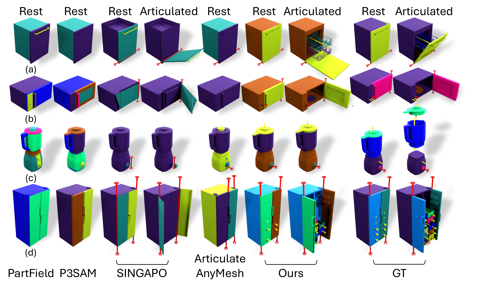
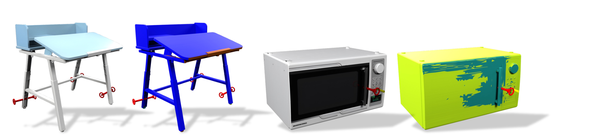

# PARTICULATE：前馈式三维可动部件与关节估计

## 基本信息

- **论文**：PARTICULATE: Feed-Forward 3D Object Articulation
- **作者**：Ruining Li、Yuxin Yao、Chuanxia Zheng、Christian Rupprecht、Shangzhe Wu、Andrea Vedaldi（牛津大学 VGG 组）
- **arXiv**：2512.11798（2025 年 12 月）
- **项目页**：https://ruiningli.com/particulate
- **代码**：论文未披露官方代码仓库（frontmatter 记为 `null`）
- **所属领域**：3D 生成 / 可动性估计（articulation estimation），笔记归档于 Foundations

## 一句话结论

Particulate 提出首个端到端前馈模型，能在约 10 秒内、单次前向传播中，直接从**静态 3D 网格**预测出完整的可动结构——包括可动部件分割、运动学树和运动约束参数（可直接导出 URDF 并导入物理仿真器），无需任何逐对象优化，并在泛化能力与数据效率上大幅超越此前基于优化、扩散或语义分割的方法。

---

## 1. 研究背景与问题定义

### 1.1 研究问题

近两年 3D 资产生成模型（TRELLIS、Hunyuan3D 等）已经能以文本或图像为条件，快速合成外观逼真、几何完整的三维网格。但这类"静态网格"只描述了物体的**外壳形状**，并不包含"物体哪里能转动、门朝哪个方向开、抽屉能拉出多长"这类**可动（articulation）信息**。而机器人操作仿真、物理模拟、动画和具身智能的数据管线，恰恰高度依赖带有可动结构的资产：一个无法打开门的微波炉网格，对仿真器几乎没有价值。

因此，一个与 3D 生成"正交"但同样关键的任务浮出水面：**可动性估计（articulation estimation）**——给定一个静态网格，恢复它的可动部件划分与关节运动约束。Particulate 要解决的就是这个问题。它并不合成几何，而是给"已经存在但不会动"的 3D 资产补上"会动"的结构。

> **图 1（论文 Figure 1，teaser）**：Particulate 的效果总览。模型从静态 3D 网格出发，单次前馈推理出可动结构，覆盖真实扫描与 3D 生成模型合成等多样化资产，并在各部件上标注关节运动（旋转轴 / 移动方向）。这张图的核心信息是"任务的输入端只有静态网格，输出端是完整的可动语义"。来源：论文 Figure 1，https://arxiv.org/html/2512.11798

### 1.2 现有方法的瓶颈

在 Particulate 之前，可动性估计大致有三类路线，各有明显短板：

1. **逐对象优化方法**（如 Articulate-Anything、FreeArt3D、Articulate AnyMesh）：对每个新物体都要做几分钟到几十分钟的迭代优化。Articulate AnyMesh 约 15 分钟、FreeArt3D 约 10 分钟、Kinematify 约 20 分钟。这类方法无法扩展到大规模资产管线。
2. **前馈方法**（如 SINGAPO）：虽然快（约 10 秒），但它依赖多视角 2D 渲染和视觉特征，倾向于把"从外部可见"的语义部件当成可动部件，对**被外壳遮挡的内部结构**（例如烤箱内部的分层、洗衣机的内桶）无能为力。
3. **语义部件分割方法**（如 PartField、P3SAM）：它们解决的是"语义部件分割"，而非"可动部件分割"。语义部件（如"把手的金属圈"）和可动部件（"能转动的整个门"）是两个概念，二者常不一致，且这些方法完全不输出运动约束参数。

此外，论文还指出了一个被长期忽视的**评测协议缺陷**：如果只对"匹配上的部件"计算指标、忽略未匹配部件，那么一个"把整个物体当成单一固定部件"的平凡基线（Naive Baseline）反而能拿到不错甚至最好的分数。这意味着很多旧数字并不可靠，需要一个带惩罚的公平协议（详见 4.2）。

### 1.3 本文核心贡献

1. 提出统一的**关节结构四元组 $(P, S, K, M)$** 参数化，把部件数量、面级分割、运动学树和运动约束全部纳入一个可端到端预测的框架，输出可直接导出为 URDF。
2. 设计 **PAT（Part Articulation Transformer）**：一个约 1.5 亿参数的标准 Transformer，配合可学习"部件查询向量"和专用的解码器头，一次前向同时预测四元组的每个分量。
3. 针对旋转轴位置这一难点，提出**过参数化（over-parameterization）投票**机制，用逐点投影投票取代直接回归，显著提升轴位置估计的鲁棒性。
4. 引入**带未匹配惩罚的评测协议**和新基准 **Lightwheel**（243 个高质量可动资产、14 类），揭示旧协议下 Naive Baseline 的虚高，并为跨域泛化提供更难的测试床。
5. 展示了极强的**数据效率**：仅用约 3,800 个训练对象，就在 PartNet-Mobility 与 Lightwheel 上全面达到 SOTA，且推理仅约 10 秒。

---

## 2. 任务定义与输入输出

### 2.1 输入、输出与假设

**输入**是一个静态三角网格 $\mathcal{M} = (V, F)$，其中 $V$ 是顶点集合、$F$ 是面集合。实际送入网络的并不是原始网格，而是从网格表面采样出的点云 $\mathcal{P} = \{\mathbf{p}_i \in \mathbb{R}^3\}_{i=1}^{N}$，每个点附带三路特征：坐标 $\mathbf{p}_i$、表面法线 $\mathbf{n}_i \in \mathbb{R}^3$，以及从预训练 **PartField** 提取的语义特征 $\mathbf{f}_i \in \mathbb{R}^d$。PartField 是一个训练用于对齐 2D 语义部件的 3D 特征场，为每个点提供全局形状上下文与语义部件先验。

**输出**是完整的可动结构 $\mathcal{A}$，论文将其建模为四元组 $\mathcal{A} = (P, S, K, M)$。这一结构可以直接转换为 URDF（Universal Robot Description Format），导入 MuJoCo 等物理仿真器使用。

论文的核心**假设**有二：其一，物体的运动学结构是以单一基座部件（base part，如微波炉外壳）为根的一棵**树**（arborescence），即每个非基座部件恰好有一个父部件，不存在闭环运动链；其二，每个关节的运动类型属于有限的四类（fixed / prismatic / revolute / both）之一。这两个假设把"任意机构"这一过宽的搜索空间收敛到了"树形运动链 + 参数化关节"这一可学习、可标注的形式。

### 2.2 关键符号和目标函数

| 符号 | 含义 |
|---|---|
| $\mathcal{M}=(V,F)$ | 输入三角网格，$V$ 顶点、$F$ 面 |
| $\mathcal{P}=\{\mathbf{p}_i\}_{i=1}^{N}$ | 从网格采样的点云，训练时 $N=2048$，推理时 $N=102400$ |
| $\mathbf{n}_i, \mathbf{f}_i$ | 点 $i$ 的法向量与 PartField 语义特征 |
| $P \in \mathbb{N}$ | 可动部件数量（未知，需模型推断） |
| $S: [|F|] \to [P]$ | 面到部件的分割映射 |
| $K \subseteq [P]\times[P]$ | 运动学树：有向边 $(p,c)$ 表示部件 $c$ 的父部件是 $p$ |
| $M$ | 运动约束五元组 $(M_{tp}, M_{pd}, M_{ra}, M_{pr}, M_{rr})$ |
| $P_{\max}$ | 部件查询向量个数，取 16（远大于典型部件数） |
| $B$ | 注意力块数量，取 8 |

模型的优化目标是一个多任务监督损失 $\mathcal{L} = \mathcal{L}_S + \mathcal{L}_K + \mathcal{L}_M$，分别对应分割、运动学树和运动约束三组监督信号。它的直觉是：三个分量相互耦合——部件分割错，运动学树和约束必然跟着错；因此把它们放进同一个端到端目标里联合训练，比分别预测再拼装更有利于让几何（分割）、拓扑（树）与物理（运动参数）彼此一致。具体每一项的定义与权重见 3.6。

---

## 3. 核心方法

### 3.1 总体框架

Particulate 的整体结构是"点云编码 → PAT 骨干 → 多路解码头"，全流程端到端、全监督训练。输入点云的三路特征（xyz、法线、PartField 特征）分别经过各自的 MLP / 线性层升维到同一维度 $D$，逐点相加得到点 token $\{\tilde{\mathbf{p}}_i\}_{i=1}^{N}$。由于真实部件数量未知，模型仿照 DETR 初始化一组可学习查询向量 $\{\mathbf{q}_j\}_{j=1}^{P_{\max}}$，让网络自己去"认领"部件。点 token 与部件查询一起送入 $B=8$ 个注意力块（PAT 骨干），经过查询自注意力与查询↔点双向交叉注意力后，得到增强后的点 token 和部件 token；最后这些 latent 向量流入若干个各司其职的解码器头，分别解出四元组 $(P, S, K, M)$ 的各分量。

> **图 2（论文 Figure 2，方法总览）**：左侧为输入点云的三路特征编码（xyz / 法线 / PartField 特征各自映射到 D 维后相加）；中部是 PAT 骨干，由 B 个注意力块对点向量与可学习部件查询交替做自注意力与交叉注意力；右侧是并列的解码器头，分别输出部件分割 S、运动学树 K 与运动约束 M。整图展示了"一个骨干、多路输出"的端到端设计。来源：论文 Figure 2，https://arxiv.org/html/2512.11798

### 3.2 关节结构的四元组编码 (P, S, K, M)

四元组是这篇论文最核心的表示贡献，值得逐项拆解：

- $P \in \mathbb{N}$ 是部件数量，本身就是一个需要模型"猜"的变量。由于 $P_{\max}=16$ 个查询远多于真实部件数，网络只需要学会让多余查询"静默"（不匹配任何真实部件），就能隐式输出正确的 $P$。
- $S: [|F|] \to [P]$ 把每个面分配给一个部件，等价于一个 $N \times P_{\max}$ 的分割 logits 矩阵。它是其余一切的基础：先有部件边界，才有部件之间的关节。
- $K \subseteq [P]\times[P]$ 是运动学树。边 $(p, c) \in K$ 表示部件 $c$ 通过一个关节挂在父部件 $p$ 上。在单基座假设下，$K$ 是以上述基座为根的有向树。模型不是直接输出"树"这个离散对象，而是输出一个**软邻接矩阵** $\tilde{\mathbf{K}}$，其中 $\tilde{\mathbf{K}}_{i,j} = \log \mathbb{P}[i \text{ 是 } j \text{ 的父部件}]$，训练时用二值交叉熵逼近真值邻接矩阵。
- $M$ 是运动约束，下面单独展开。

这个四元组的妙处在于它的**模块化与可导出性**：三个分量各自是标准监督问题（分类、二值分类、回归），但组合起来恰好完整刻画了一个可导入仿真器的可动资产，中间不存在"预测出来了却无法落地"的语义缺口。

### 3.3 运动约束的五个分量

$M$ 是一个五元组 $M = (M_{tp}, M_{pd}, M_{ra}, M_{pr}, M_{rr})$，每个分量刻画"子部件相对父部件如何运动"的一个侧面：

- $M_{tp}: [P] \to \{\text{fixed}, \text{pri}, \text{rev}, \text{both}\}$：运动类型，四选一的分类。`fixed` 表示固定，`pri`（prismatic）表示沿一个方向线性滑动，`rev`（revolute）表示绕一根轴旋转，`both` 表示平移与旋转同时存在。
- $M_{pd}: [P] \to \mathbb{S}^2$：棱柱运动方向，一个单位向量，仅在类型为 `pri` 或 `both` 时有定义。
- $M_{ra}: [P] \to \mathbb{S}^2 \times \mathbb{R}^3$：旋转轴，由轴方向 $\mathbf{d}_{ra} \in \mathbb{S}^2$ 与轴上一点 $\mathbf{x}_{ra} \in \mathbb{R}^3$ 共同确定（空间直线需要 5 个自由度）。
- $M_{pr}: [P] \to \mathbb{R}^2$：棱柱运动范围，编码为 $[-l_{\min}, l_{\max}]$。
- $M_{rr}: [P] \to \mathbb{R}^2$：旋转运动范围，编码为 $[-\theta_{\min}, \theta_{\max}]$，即相对静止姿态允许转动的角度区间。

直觉上，前三个分量回答"怎么动"，后两个回答"能动多远"。后四个分量的有效性都由第一个分量（运动类型）门控：一个 `fixed` 部件的方向和范围分量在监督中被忽略。所有几何量（方向、轴点）都定义在网格 $\mathcal{M}$ 自身的坐标系中，从而保证了预测结果与具体位姿无关、可直接装配进 URDF。

### 3.4 PAT 骨干与查询设计

PAT 骨干是一组标准的 Transformer 注意力块，但论文在注意力拓扑上做了一个务实的选择：**只对查询做自注意力、只做查询↔点之间的交叉注意力，而完全不对点 token 之间做自注意力**。原因是 $N$（点数量，推理时可达十万级）远大于 $P_{\max}=16$，点间全连接自注意力的复杂度是 $O(N^2)$，会迅速耗尽显存；而查询数量极小，查询侧的自注意力与交叉注意力代价几乎可忽略。这种"查询为锚、点为载体"的设计，让模型能把 $N$ 个点的高频几何信息通过交叉注意力"汇聚"进 $P_{\max}$ 个部件查询里，再由查询之间的自注意力协商部件间的拓扑关系。

部件查询 $\{\mathbf{q}_j\}_{j=1}^{P_{\max}}$ 是 DETR 式的可学习向量。它们的作用不是显式对应某个具体部件，而是在训练中通过与匈牙利匹配的绑定，学会"各自负责一块区域 + 一段运动语义"。$P_{\max}=16$ 远大于典型网格的部件数（通常 2~8 个），多余的查询在训练中被推离所有真值部件，从而自然失效。

### 3.5 解码器头与旋转轴过参数化

骨干输出的点 token 与部件 token 被送入多路解码器头：

- **分割头** $h_S$：由点 token 与部件 token 联合计算，输出 $N \times P_{\max}$ 的分割 logits $\tilde{\mathbf{S}}_{i,j} = h_S(\tilde{\mathbf{p}}_i, \tilde{\mathbf{q}}_j)$。
- **运动学树头** $h_K$：输入一对部件 token，输出软邻接矩阵 $\tilde{\mathbf{K}}_{i,j} = h_K(\tilde{\mathbf{q}}_i, \tilde{\mathbf{q}}_j)$。
- **运动类型头** $h_{tp}$：对每个部件 token 输出 4 类 logits。
- **棱柱/旋转范围头** $h_{pr}, h_{rr}$：各输出 2 维范围。
- **棱柱方向头** $h_{pd}$ 与**旋转轴方向头** $h_{rd}$：输出向量后做 $L_2$ 归一化，落到单位球 $\mathbb{S}^2$ 上，以保证方向是合法单位向量。
- **旋转轴位置头** $h_{cp}$：这是全文最精巧的设计。论文不直接回归轴上一点，而是让**属于该部件的每个点**投票预测自己到旋转轴的正交投影：

$$\tilde{\mathbf{x}}_j^i = h_{cp}(\tilde{\mathbf{p}}_j, \tilde{\mathbf{q}}_i) = \arg\min_{\mathbf{x} \in \text{axis}} \lVert \mathbf{x} - \mathbf{p}_j \rVert_2$$

即点 $j$ 预测"我如果绕着部件 $i$ 的轴转，圆心在哪里"；推理时对所有投票点按坐标取**中位数**作为轴位置。这种过参数化的直觉是：轴位置是一个"点云集体属性"而非"单点属性"，直接回归 3 个坐标容易对个别 outlier 过拟合；让上千个点各自投票再做中位数聚合，天然起到了去噪与防过拟合的作用。消融实验（3.5 对应 Table 4 配置 C）证实了这一设计的确有效。

### 3.6 训练目标与损失函数

总损失为三部分之和：

$$\mathcal{L} = \mathcal{L}_S + \mathcal{L}_K + \mathcal{L}_M$$

其中运动约束损失 $\mathcal{L}_M$ 又按分量拆解：

$$\mathcal{L}_M = \mathcal{L}_{M_{tp}} + \mathcal{L}_{M_{pr}} + 0.1\,\mathcal{L}_{M_{rr}} + \mathcal{L}_{M_{pd}} + \mathcal{L}_{d_{ra}} + \mathcal{L}_{x_{ra}}$$

各项含义如下：

| 损失项 | 监督对象 | 形式 |
|---|---|---|
| $\mathcal{L}_S$ | 部件分割 | 交叉熵（CE） |
| $\mathcal{L}_K$ | 运动学树 | 二值交叉熵（BCE） |
| $\mathcal{L}_{M_{tp}}$ | 运动类型 | 交叉熵（4 类） |
| $\mathcal{L}_{M_{pr}}$ | 棱柱范围 | $L_1$ |
| $\mathcal{L}_{M_{rr}}$ | 旋转范围 | $L_1$（权重 0.1） |
| $\mathcal{L}_{M_{pd}}$ | 棱柱方向 | $L_1$ |
| $\mathcal{L}_{d_{ra}}$ | 旋转轴方向 | $L_1$ |
| $\mathcal{L}_{x_{ra}}$ | 旋转轴位置 | $L_1$ |

两个值得注意的细节：第一，旋转范围 $\mathcal{L}_{M_{rr}}$ 被压低到 **0.1** 的权重，说明角度范围这类连续量对整体优化目标的贡献被刻意克制，避免它主导梯度；第二，所有回归量统一用 $L_1$（而非 $L_2$），对少数离群标注更稳健。

由于部件查询是无序的（第 $j$ 个查询不天然对应第 $j$ 个真值部件），训练时需先用**匈牙利匹配**把 $P$ 个真值部件一一对应到 $P_{\max}$ 个查询上，再按匹配结果对齐计算损失：

$$\hat{\pi} = \arg\max_{\pi} \sum_{i=1}^{P} \sum_{j=1}^{N} \mathbf{S}_{j,i}\, \log \frac{\exp(\tilde{\mathbf{S}}_{j,\pi(i)})}{\sum_{k=1}^{P_{\max}} \exp(\tilde{\mathbf{S}}_{j,k})}$$

这里 $\hat{\pi}: [P] \to [P_{\max}]$ 是单射，直观上是在"最大化真值部件被正确查询认领的对数似然"。匹配完成后，预测的列按 $\hat{\pi}$ 置换，再与真值对齐计算各损失。

### 3.7 推理流程与复杂度

推理时点云加大到 $N=102400$ 个点，以保证足够覆盖所有网格面。模型一次前向得到点级分割后，把点级预测**投影回原始网格面**，再按面归属重建完整的可动 3D 模型，最终导出 URDF。整个流程约 10 秒，且不包含任何逐对象优化、渲染或多视角融合。

从复杂度看，瓶颈在点侧的交叉注意力（$O(N \cdot P_{\max} \cdot B)$），因为点间无自注意力，复杂度对 $N$ 是线性的，这也是它能吃下十万级点云的关键。模型总参数量约 1.5 亿，属于中等规模。

---

## 4. 数据集与实验设置

### 4.1 数据集与数据处理

**训练数据**来自两个可动资产数据集：PartNet-Mobility（采用 Liu et al. 2025b 的 train-test 划分）与 GRScenes（使用其全部可动资产）。论文设定 $P_{\max}=16$，丢弃部件数超过 16 的对象，最终训练集约 **3,800 个对象、覆盖 50 个类别**。

**评估数据**来自两个测试床：

- **PartNet-Mobility 测试集**（7 个常见类别），用于同域评估；
- **Lightwheel**（论文新引入的基准）：**243 个高质量可动对象、14 个类别**，由 Lightwheel 制作、采用 CC-BY-NC 许可。其中 stand mixer 与 stovetop 两类是**分布外（OOD）类别**，未出现在 PartNet-Mobility 与 GRScenes 的训练集中，专门用来考验跨域泛化。类别分布为：coffee machine / microwave / refrigerator / sink / toaster / toaster oven 各 25，blender / dishwasher / electric kettle 各 13，oven / range hood / stand mixer 各 12，stove 10，stovetop 8。

**点云处理**：训练时 $N=2048$ 点，其中 50% 在网格表面均匀采样、50% 采样自**锐利边缘**（二面角 $> 30^\circ$ 处）。这个混合采样策略的直觉是：均匀采样覆盖整体形状，边缘采样则强化了部件边界与关节位置等关键几何线索。每次迭代随机采样一个铰接状态并实时计算 PartField 特征（即数据在"开/合"等不同姿态间增强）。点云被归一化到 $[-0.5, 0.5]^3$，再做缩放（$\mathcal{U}(0.95, 1.05)$）与平移（$\mathcal{N}(0, 0.02)^3$）增强。

### 4.2 Baseline 与评价指标

**Baseline** 覆盖三条路线：语义分割方法 **PartField** 与 **P3SAM**，前馈方法 **SINGAPO**（含其 1@10 变体），以及逐对象优化方法 **Articulate AnyMesh**。论文还构造了 **Naive Baseline**（把整个物体当作单一固定部件）作为下界参考。带 $\dagger$ 标记的结果表示方法额外利用了网格连通性（connected components）做后处理细化。

**指标**有三组：

- **gIoU**（广义 IoU，源自 Rezatofighi et al. 2019）：衡量预测部件与真值部件之间的广义交并比，越高越好。
- **PC**（部件级 Chamfer 距离）：预测与真值部件之间基于质心距离做匈牙利匹配后的双向 Chamfer 距离，越低越好。
- **mIoU**：匹配后所有部件对的平均 IoU，越高越好。
- **OC**（全对象 Chamfer 距离）：把预测出的完整可动几何体与真值几何体（都置于完全铰接状态）做双向 Chamfer 距离，不依赖部件匹配，提供更全局的几何度量。

论文最重要的评测贡献是**未匹配部件惩罚机制**。旧协议只对"匹配上的部件对"计分、忽略未匹配部件，导致 Naive Baseline（单一固定部件）反而能靠"没有错配"拿到最高分。为堵住这个漏洞，论文规定未匹配部件按固定值计分：gIoU 记 $\epsilon=-1$、mIoU 记 $\epsilon=0$、PC 记输入网格包围盒对角线长度的一半。所有指标基于从输入网格均匀采样的 $10^6$ 个点计算，并在**静止状态**（rest state）与**完全铰接状态**（每个部件推到最大伸展）两种配置下分别报告。

### 4.3 实现细节

优化器 AdamW，全局 batch size 128，训练 100K 次迭代，硬件为 8 张 H100 GPU。推理点云 $N=102400$。论文未披露学习率调度、PartField 特征维度 $d$ 与骨干隐层维度 $D$ 的具体数值。

---

## 5. 实验结果

### 5.1 主要定量结果

**推理速度**（论文 Table 1）是 Particulate 的第一张成绩单：ArtiLatent 约 30 秒、SINGAPO 约 10 秒、Articulate-Anything 约 10 分钟、FreeArt3D 约 10 分钟、Kinematify 约 20 分钟、Articulate AnyMesh 约 15 分钟，而 Particulate 约 **10 秒**。这说明 Particulate 与最快的 SINGAPO 处于同一量级，同时把"逐对象优化类"方法甩开两个数量级——在需要批量处理成千上万资产的场景里，这个差距是"能用 vs 不能用"的区别，而不只是"快一点"。

**部件分割结果**（论文 Table 2）最能体现方法的绝对优势。在 PartNet-Mobility 上，Particulate 的 gIoU 达 **0.879**（带连通性细化 $\dagger$ 为 0.880）、PC 仅 **0.003**、mIoU 达 **0.883**（$\dagger$ 0.884），而最强的优化式基线 Articulate AnyMesh$\dagger$ 只有 gIoU 0.383 / mIoU 0.542。gIoU 从 0.38 跳到 0.88 是数量级式的提升，说明前馈模型不仅快，在分割精度上也全面反超了需要 15 分钟优化的方法。在更具挑战性的 Lightwheel 上，Particulate$\dagger$ 以 gIoU **0.332**、mIoU **0.576** 领先，但绝对分数明显低于 PartNet-Mobility——这正反映了 Lightwheel 作为跨域/多类别基准的难度，也提示 OOD 泛化仍有很大提升空间。

**运动预测结果**（论文 Table 3，完全铰接状态）更关键，因为它直接衡量"预测的运动约束是否让物体按正确方式动起来"。在 PartNet-Mobility 上，Particulate 的 gIoU **0.842**、PC **0.024**、OC **0.003**，同样遥遥领先。一个值得强调的细节：Articulate AnyMesh 在运动预测评估中被**赋予了每个预测部件的真实运动范围**（特权信息，因为它自身不预测范围），而 Particulate 是纯靠自己端到端预测的范围，即便如此仍然大幅领先——这排除了"胜在评估占便宜"的嫌疑，说明优势来自对运动约束本身的建模能力。

综合三张表，结论是：**在同域（PartNet-Mobility）上 Particulate 是压倒性的 SOTA，在跨域（Lightwheel）上也稳定领先，但绝对分差说明跨域泛化是下一个主战场**。

### 5.2 定性结果

> **图 3（论文 Figure 3，定性结果）**：展示输入网格与预测的可动部件及其运动约束，每个对象分别在两个不同铰接状态（展开/收拢）下呈现；所有输入网格均由现成 3D 生成器合成。这张图的意义在于证明：即便输入是"生成模型凭空造的、没有人工标注的"静态网格，Particulate 仍能给出几何合理、运动自洽的可动结构。来源：论文 Figure 3，https://arxiv.org/html/2512.11798

> **图 4（论文 Figure 4，Lightwheel 定性对比）**：与语义分割方法（PartField、P3SAM）相比，Particulate 的分割更贴合"可动部件"而非"语义部件"；与 Articulate AnyMesh、SINGAPO 相比，后者无法恢复外部视图不可见的内部结构（图中 a、b、d 例），而 Particulate 恢复了大部分内部部件并准确推断其运动约束。这张图集中体现了"可动 vs 语义"与"外表面 vs 内部结构"两条关键能力边界。来源：论文 Figure 4，https://arxiv.org/html/2512.11798

### 5.3 消融实验

论文 Table 4 在 Lightwheel 子集上做了三组消融，全配置记为 $\mathbb{A}$（PM+GRS 双数据集、含 PartField 特征、含轴过参数化）：

- **数据规模（$\mathbb{A}$ vs $\mathbb{B}$，PM only）**：只用 PartNet-Mobility 训练，铰接态 gIoU 从 0.259 微降到 0.231。下降幅度小，说明性能主要来自**简单且数据高效的设计**，而非堆数据；这反过来也意味着当前 3,800 个对象的规模尚未触及方法上限。
- **旋转轴过参数化（$\mathbb{A}$ vs $\mathbb{C}$，直接回归）**：移除过参数化、改用 MLP 直接回归 $\mathbb{R}^6$ 中的轴（Plücker 坐标），gIoU 从 0.259 降到 0.236、mIoU 从 0.551 跌到 0.411。mIoU 的大幅下滑说明过参数化不仅稳住轴位置，还通过投票平均缓解了过拟合，是模型精度的重要支柱。
- **PartField 特征（$\mathbb{A}$ vs $\mathbb{D}$，移除）**：去掉 PartField 后 gIoU 从 0.259 暴跌到 0.174。这是三组中影响最大的一项，说明全局形状上下文与语义先验对"判断哪里是可动部件"几乎不可或缺——纯局部几何（xyz + 法线）不足以支撑可动性理解。

三组消融合起来勾勒出一张清晰的因果图：**语义特征 > 轴过参数化 > 数据规模**，恰好与"表示与先验比数据量更稀缺"的可动性估计现状吻合。

### 5.4 泛化、效率与失败案例

泛化方面，Lightwheel 上的 OOD 类别（stand mixer、stovetop）分数显著低于训练内类别，说明模型对"从未见过的运动学结构"仍会失手。效率方面，10 秒级推理 + 100K 迭代训练（8×H100）意味着无论训练还是部署，成本都远低于优化式方法。

> **图 5（论文 Figure 5，失败案例）**：左图显示模型在具有非典型铰接配置的对象上挣扎；右图显示在缺乏内部结构的 AI 生成形状上失效。这两类失败分别对应"结构分布外"与"生成伪影"两种不同病因，是理解方法边界最直接的证据。来源：论文 Figure 5，https://arxiv.org/html/2512.11798

---

## 6. 与相关工作的关系

可动性估计的邻域可大致划分为四条线，Particulate 与它们的相对位置如下：

- **静态语义部件分割**（PartField、P3SAM 等）：共享"把网格切成部件"的底层能力，但语义部件 ≠ 可动部件，且不输出运动约束。Particulate 的 PartField 特征正来源于此线，属于"借其先验、弃其目标"。
- **逐对象优化**（Articulate-Anything、FreeArt3D、Articulate AnyMesh）：追求单对象高精度，代价是分钟级优化。Particulate 以 10 秒前馈达到甚至超越其精度，动摇了这条路线"慢而精"的正当性。
- **前馈可动性预测**（SINGAPO）：与 Particulate 最接近，同为快速前馈。区别在于 SINGAPO 依赖多视角 2D 渲染、对内部结构不可见；Particulate 直接在 3D 点云上操作并显式建模运动学树与运动约束，是一个更纯粹、更完整的 3D 前馈方案。
- **可动资产生成**（如基于 DSO 的物理合理性后训练等方向）：这是 Particulate 论文明确指向的"下游"，作者把可动性估计定位为大规模 sim-to-real 机器人数据管线中的一环。

简言之，Particulate 的意义不在于发明一个孤立的新模块，而在于把"可动性估计"从"优化或 2D 代理"重定义为"一个干净、可扩展的 3D 前馈预测问题"，并给出了配套的表示、架构与评测协议。

---

## 7. 局限与批判性评价

论文明确承认的局限有四条：

1. **泛化范围有限**：对与训练集运动学结构差异大的对象无法恢复。根源是可用训练数据（约 3,800 个）比其他领域（LAION 图像、Objaverse 静态网格）小几个数量级，这是数据瓶颈而非架构瓶颈。
2. **部件间穿透**：与 3D 生成器结合产出的资产常出现部件间穿插，成因既有生成网格本身的伪影，也有运动预测的不完美。
3. **对 AI 生成网格的鲁棒性不足**：许多生成资产缺乏真实的内部结构，与"训练集里每个对象都有明确定义的内部部件"构成分布偏移，可能导致模型失效。
4. **OOD 类别性能下降**：stand mixer、stovetop 等未见类别上显著退化。

**个人判断**（标注如下，区别于论文结论）：

- **树形假设是当前最大的隐性约束，而非局限本身**。真实机构大量存在闭环运动链（如平行四杆、齿轮联动），论文的单基座树假设把这类结构天然排除在外。对"家具/家电"这类以开合/推拉为主的对象，树假设足够；但对通用机构（机械臂、传动装置）则不够用。这是方法适用边界的根本来源，比作者自述的"数据少"更深刻。
- **"both"运动类型的物理语义较模糊**。四类运动类型里，`both`（同时平移+旋转）在真实关节中相对少见（多对应螺旋/复合运动），把它与 fixed/pri/rev 并列可能使这一类的样本极少、学习困难，论文也未单独报告 `both` 类的准确率。
- **评测虽已加惩罚，但仍以几何一致性为主，缺少"物理可行性"度量**。OC、PC 衡量的是"形状是否对得上"，而非"运动是否满足无穿透、力矩合理"等物理约束——而这恰恰是下游仿真最关心的。论文自己也把"物理合理性"留给未来工作，说明当前指标体系与最终目标之间仍有断层。
- **数据效率是亮点，但也可能被高估**。3,800 个对象达到 SOTA，固然说明设计高效；但消融显示 PartField 特征贡献最大，而 PartField 本身是在更大规模数据上预训练的，因此"数据效率"部分是把负担转移给了预训练特征，而非凭空消失。

---

## 8. 复现与实践建议

**复现门槛**：中等偏高。模型规模约 1.5 亿参数、训练需 8×H100 跑 100K 步，个人难以完整复刻；但核心组件（标准 Transformer + 多路 MLP 头）无奇异算子，架构复刻难度低。**官方代码未披露**（截至本文写作，frontmatter 记为 `null`），是当前最大障碍——四元组编码、匈牙利匹配的置换实现、旋转轴投票聚合这些细节虽在论文中描述清楚，但没有代码仍易在实现细节上走偏。

**数据**：PartNet-Mobility 与 GRScenes 均可公开获取；Lightwheel 基准由论文引入，但能否下载需以项目页为准（论文标注 CC-BY-NC 许可）。PartField 预训练特征需要额外获取其权重。

**实践建议**：

- 若目标只是"给一批静态网格补可动结构"用于仿真，优先考虑直接调用其项目页 Demo（若开放）或等待官方权重，而非自行训练；训练成本与收益在无权重发布时并不划算。
- 若必须复现，建议先冻结 PartField 特征、复现消融配置 $\mathbb{D}$ 以验证数据管线，再逐项加回特征与过参数化——这与论文消融给出的"特征 > 过参数化 > 数据"优先级一致，能最快定位实现错误。
- 部署时点云量（102,400）对显存影响大，可据目标网格复杂度下调；点间无自注意力的设计使显存随 $N$ 线性增长，属可调参数。
- 对 AI 生成网格，建议先做网格清理/内部结构修复，再送入模型，规避论文 Figure 5 右图所示的分布偏移失效。

---

## 9. 个人启发与后续问题

这篇论文对"可动性估计"的启发不止于一个 SOTA 模型，更在于它示范了**如何把一个模糊的 3D 任务"结构化"**：通过 $(P,S,K,M)$ 四元组，把"部件分割 + 拓扑推断 + 参数回归"三个异构子任务收敛到一套可端到端监督的表示里，同时保证输出能直接落地为 URDF。这种"表示设计即任务定义"的思路，对 3D 生成、机器人资产管线等方向都有借鉴价值。

几个值得追问的开放问题：

1. **能否把树形假设放宽到一般图 / 闭环运动链？** 这需要重新设计 $K$ 的表示与解码（软邻接矩阵无法表达闭环约束）。
2. **物理可行性能否进入训练目标？** 在损失中加入穿透惩罚或让预测结果过一个可微物理仿真器，可能同时缓解局限 2 与指标断层。
3. **PartField 式语义先验能否被"可动性专用"的预训练取代？** 消融显示语义特征贡献最大，那么直接预训练一个"可动性感知"的特征场，可能比借用 2D 语义特征更对症。
4. **"both"这类低频运动类型是否需要单独的数据增强或课程学习？** 论文未展开，但在长尾类别上几乎必然存在学习困难。

---

## 10. 材料来源

- 论文 HTML 全文（主来源）：https://arxiv.org/html/2512.11798 （arXiv 2512.11798）
- 论文摘要页：https://arxiv.org/abs/2512.11798
- 项目页（补充）：https://ruiningli.com/particulate
- 图片 5 张均取自 arXiv HTML 版官方图，具体溯源见 `assets/PARTICULATE - 前馈式三维可动部件与关节估计/sources.md`

> 说明：本文所有数字（指标、消融、时间、数据量）均取自论文正文与表格；论文未披露之处（如学习率调度、隐层维度、`both` 类单独精度）已明确标注"论文未披露"，未做任何补造。
