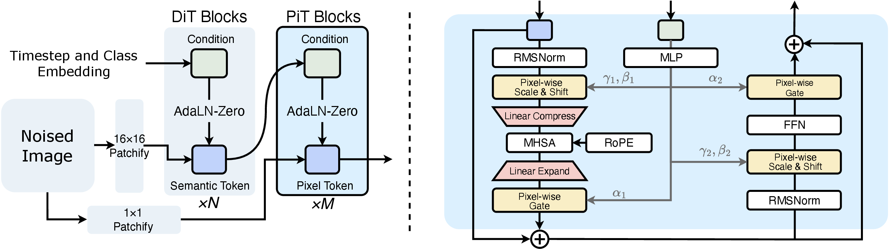
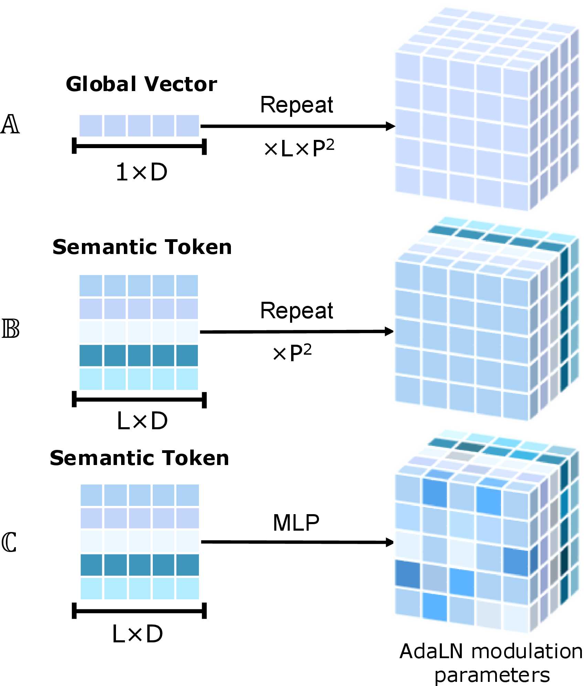
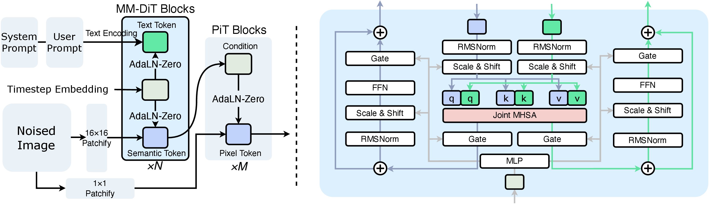

本文以 PixelDiT 官方论文、arXiv PDF/source、项目页与官方代码仓库为准进行整理；用户提供的公众号文章仅作为线索入口，不作为技术事实来源。

## 1. 背景

|   |   |
|---|---|
|论文|[PixelDiT: Pixel Diffusion Transformers for Image Generation](https://arxiv.org/abs/2511.20645)|
|作者 / 机构|Yongsheng Yu, Wei Xiong, Weili Nie, Yichen Sheng, Shiqiu Liu, Jiebo Luo；NVIDIA / University of Rochester|
|发表|CVPR 2026 Oral|
|官方资源|[PDF](https://arxiv.org/pdf/2511.20645.pdf) / [项目页](https://pixeldit.github.io/) / [GitHub](https://github.com/NVlabs/PixelDiT)|
|建议归档领域|基础模块|
|重要性评估|★★★★★（5/5）|

PixelDiT 讨论的核心问题不是“再做一个更大的 latent diffusion”，而是反过来追问：**VAE 这层压缩-解码中间层是不是必须存在**。传统 DiT / LDM 体系依赖预训练 autoencoder，把图像映射到 latent 空间后再做扩散；这样虽然高效，但会引入重建误差、训练目标错配，以及无法真正端到端联合优化的问题。

论文的主张非常明确：如果能够把**全局语义建模**和**逐像素细节建模**拆开，并把像素级计算做得足够高效，那么扩散模型可以直接在 pixel space 里完成训练与采样，无需 VAE。

**为什么值得看：**

- 它不是在 latent recipe 上做微调，而是在扩散模型最底层的数据表示上重新做范式选择。
- 它第一次把“单阶段、端到端、像素空间 DiT”做到了足够有竞争力：ImageNet 256 上 gFID 1.61，512 上 gFID 1.81。
- 论文不仅给出主结果，还把关键 engineering recipe（REPA、token compaction、pixel-wise AdaLN、solver / CFG 设置）讲得很完整，适合做后续像素空间生成或视频生成底座设计参考。

## 2. 文章主线 / 论文线索

### 2.1 主线论文

- **主论文：** [PixelDiT: Pixel Diffusion Transformers for Image Generation](https://arxiv.org/abs/2511.20645)
- **项目页：** [pixeldit.github.io](https://pixeldit.github.io/)
- **代码仓库：** [NVlabs/PixelDiT](https://github.com/NVlabs/PixelDiT)

### 2.2 论文要解决的三个结构性问题

1. **VAE 带来的 lossy reconstruction**：高频纹理、文字、小结构会在编码/解码中受损。
2. **两阶段训练目标不一致**：autoencoder 的重建目标与 diffusion 的生成目标只部分对齐，容易出现 distribution shift。
3. **像素空间扩散过于昂贵**：如果直接对所有像素 token 做全局建模，序列长度和 attention 成本会爆炸。

### 2.3 论文的核心回答

论文提出一个**双层（dual-level）Transformer**：

- **patch-level pathway** 负责全局语义与布局；
- **pixel-level pathway** 负责局部纹理与逐像素细节；
- 两者通过 **pixel-wise AdaLN** 耦合；
- 再通过 **pixel token compaction** 把逐像素建模的注意力成本压到可训练范围内。

换句话说，PixelDiT 的关键不只是“回到 pixel space”，而是提出了一套**让 pixel modeling 真正可训练、可扩展、可收敛**的架构 recipe。

## 3. Pipeline / Architecture + I/O 数据流

### 3.1 总体架构总览

下图是论文 source 中的主架构图，最值得重点看：

> **解读：** 左半是 PixelDiT 的 dual-level 整体框架：noised image 一路 16×16 patchify 进 DiT Blocks（×N，输出 semantic token），另一路 1×1 patchify 进 PiT Blocks（×M，输出 pixel token）。右半是 PiT block 内部细节，依次为 Pixel-wise Scale & Shift（γ₁,β₁）→ Linear Compress → M-HSA (RoPE) → Linear Expand → Pixel-wise Gate（α₁），以及后半段 γ₂,β₂、FFN、α₂ 和前后 RMSNorm。
> **来源：** arXiv:2511.20645v2，Figure 1（Overview of PixelDiT: a dual-level, fully transformer-based diffusion architecture that operates directly in pixel space）。

### 3.2 类条件生成时的完整 I/O 链路

**输入：**

- noised image `x_t`，形状为 `B × C × H × W`
- diffusion timestep `t`
- 类别条件 `y`

**阶段 A：patch-level pathway（全局语义）**

1. 将 `x_t` 做 `p × p` 非重叠 patchify，得到 patch tokens。
2. 通过线性投影映射到隐藏维 `D`。
3. 将 timestep embedding 与 class embedding 组合，经 AdaLN-Zero 调制 patch-level DiT blocks。
4. 经过 `N` 层增强版 DiT block（RMSNorm + 2D RoPE + AdaLN），输出 semantic tokens `s_N`。
5. 定义 `s_cond = s_N + t_embed`，作为后续 pixel-level pathway 的语义条件。

**阶段 B：pixel-level pathway（局部纹理）**

1. 原图同时走一条 `1×1 patchify` 路径，把每个像素映射成 pixel token，形成 `B × H × W × D_pix`。
2. 重排为每个 patch 内含 `p²` 个像素 token 的局部序列。
3. 每个 patch 对应一个 semantic token `s_cond`，由它生成逐像素的 AdaLN 调制参数。
4. 在每个 PiT block 中先做 pixel-wise scale/shift，再做压缩后的 attention，再展开回逐像素表示，再做 FFN 与 gate 调制。
5. 最终输出 pixel-space 的 denoising prediction。

**输出：**

- 训练时，模型输出在 pixel space 中的 **velocity prediction** `v_t`；
- 采样时，经 Rectified Flow + FlowDPMSolver 逐步还原出最终 RGB 图像。

**一句话理解 I/O：** Patch 分支学“这张图整体应该长什么样”，Pixel 分支学“每个像素应该怎么改”；最终输出直接还是像素，而不是 latent。

### 3.3 Pixel-level pathway 的两个关键部件

#### 3.3.1 Pixel-wise AdaLN

> **解读：** 三种 AdaLN 调制粒度对比。(𝔸) 把单个 1×D 全局向量 repeat ×L×P² 广播给所有像素，所有位置共享同一套调制参数；(𝔹) 用 L×D semantic token 在每个 patch 内 repeat ×P²，同一 patch 内像素共享一套参数；(ℂ) 对每个 semantic token 经 MLP 直接生成逐像素的 scale/shift/gate 参数，每个像素独立调制。PixelDiT 采用 (ℂ)，把全局语义投影为逐像素的局部控制信号。
> **来源：** arXiv:2511.20645v2，Figure 2（AdaLN modulation strategies）。

论文专门比较了三种调制方式：

- **全局广播（A）**：一套条件向量广播给所有像素；
- **patch-wise AdaLN（B）**：同一 patch 内所有像素共享同一套调制参数；
- **pixel-wise AdaLN（C）**：对每个 patch 的 semantic token 做线性映射，直接生成 `p²` 组逐像素调制参数。

对应的关键公式是：

$$ \Theta = \Phi(s_{cond}) \in \mathbb{R}^{(B\cdot L)\times p^2 \times 6D_{pix}}$$

然后切分成六组逐像素参数：

- `β1, γ1, α1`
- `β2, γ2, α2`

它们分别作用于 attention 前后的 scale/shift 与 gate。**本质上这是把“全局语义”投影成“每个像素该怎么被调制”的局部控制信号。** 这一步是 PixelDiT 能兼顾语义一致性与高频细节的核心。

#### 3.3.2 Pixel Token Compaction

像素空间扩散最大的算力瓶颈是：如果对 `H × W` 个 pixel token 直接做全局 attention，成本是 `O(N²)`。论文的做法是：

1. 在 patch 内把 `p²` 个 pixel token 先压成 1 个紧凑 token；
2. 对这些压缩后的 patch tokens 做 global attention；
3. 再用 learned expansion 展开回逐像素表示。

压缩与展开分别由：

- `C: R^(p²×D_pix) → R^D`
- `E: R^D → R^(p²×D_pix)`

完成。这个设计把 attention 序列长度从 `H×W` 降到 `L=(H/p)(W/p)`，在 `p=16` 时理论上就是 `256×` 序列缩短；论文给出的 GFLOPs 对比也显示：

- **无 compaction：82,247 GFLOPs，直接 OOM**
- **PixelDiT-XL：311 GFLOPs**

### 3.4 T2I 版本如何改造

> **解读：** T2I 版本只把 patch-level 路径换成 MM-DiT Blocks：System Prompt + User Prompt 经 frozen Gemma-2 编码为 text token，与 timestep embedding 一起在 MM-DiT 中和 image token 做 joint attention（右图 q/k/v 各两组，分别对应文本与图像），输出 semantic token。pixel-level PiT Blocks 仍只接收 semantic token + timestep，不直接接文本，专做细节恢复，体现"多模态对齐留在高层、细节建模留在像素层"的职责分离。
> **来源：** arXiv:2511.20645v2，Figure 6（T2I architecture of PixelDiT with MM-DiT blocks on the patch-level pathway）。

Text-to-Image 版本只改 patch-level pathway：

- 把 patch-level DiT 换成 **MM-DiT blocks**；
- 文本由 **frozen Gemma-2 encoder** 编码；
- 按论文描述，会在用户 prompt 前拼接一个简短 system prompt；
- 图像 token 与文本 token 在 MM-DiT 中做 joint attention。

而 **pixel-level pathway 完全不直接接文本 token**，仍然只接收 semantic tokens + timestep。也就是说：

- 文本先影响高层语义；
- 再由语义 tokens 向 pixel refinement 传递条件；
- pixel stream 本身不承担复杂语言融合任务，只负责细节恢复。

这是一种很值得借鉴的职责分离：**多模态对齐留在高层，细节建模留在像素层。**

### 3.5 训练目标与优化配置

#### 类条件 ImageNet 配置（默认 XL）

- hidden size `D = 1152`
- patch-level 深度 `N = 26`
- pixel-level 深度 `M = 4`
- pixel hidden size `D_pix = 16`
- heads = 16
- patch size `p = 16`
- 参数量 `797M`
- 数据集：ImageNet-1K
- 优化器：AdamW，betas `(0.9, 0.999)`
- batch size：256
- EMA：0.9999
- timestep reweighting：logit-normal sampling
- 训练目标：pixel-space Rectified Flow velocity matching loss
- 辅助目标：REPA，对 patch-level 第 8 层施加 DINOv2 feature alignment，`λ_repa = 0.5`
- 采样器：FlowDPMSolver，默认 100 steps

#### T2I 配置

- 参数量：`1.311B`
- patch-level 深度 `N = 14`
- pixel-level 深度 `M = 2`
- hidden size `D = 1536`
- heads = 24
- `D_pix = 16`
- patch size `p = 16`
- 文本编码器：frozen Gemma-2
- 数据：约 `26M` 组 `1024²` 图文对
- 训练分两阶段：
    - `512×512` 预训练 `400K` iterations，batch `1024`，lr `1e-4`
    - `1024×1024` finetune `100K` iterations，batch `768`，lr `2e-5`
- 512 阶段保留 REPA；1024 阶段将 REPA 关闭
- 推理默认：FlowDPMSolver，25 steps，CFG = 4.5

## 4. 实验与关键信息

### 4.1 主结果：ImageNet 与 T2I

|任务|PixelDiT|对比结论|备注|
|---|---|---|---|
|ImageNet 256×256 class-cond|gFID 1.61|优于 PixelFlow-XL 1.98、PixNerd-XL 1.93、JiT-G 1.82、EPG-XXL/16 1.81|在像素空间方法里达到第一梯队；与强 latent 方法仍有差距，但差距已显著缩小|
|ImageNet 512×512 class-cond|gFID 1.81|优于 EPG-L/32 2.35、PixNerd-XL 2.84、JiT-H 1.94|在 512 分辨率上继续保持像素空间方法优势|
|T2I 512×512|GenEval 0.78 / DPG 83.7|优于 PixNerd 0.73 / 80.9、PixelFlow 0.60 / 77.9、PixArt-Σ 0.52 / 79.5|在 pixel-space T2I 中表现很强|
|T2I 1024×1024|GenEval 0.74 / DPG 83.5|GenEval 高于 FLUX-schnell 0.71、DALL·E 3 的 0.67；DPG 与 DALL·E 3 持平，接近 FLUX-dev 84.0|以 1.3B 参数接近强 latent T2I 系统，说明 pixel-space 路线已具备竞争力|

### 4.2 论文强调的三个经验结论

1. **高效 pixel modeling 是关键矛盾。** 不是“能不能在像素空间做”，而是“怎么把逐像素建模做得足够便宜”。
2. **pixel-wise AdaLN 不是小补丁，而是质量提升关键项。** 80 epoch 时从 3.50 gFID 拉到 2.36；320 epoch 达到 1.61。
3. **REPA 极其重要。** 去掉 REPA 后，80 epoch FID 从 2.36 退化到 6.58，160 epoch 也只有 4.33，说明 patch-level 语义路径需要强表征锚点才能稳定训练。

### 4.3 关键定量结果拆解

#### A. ImageNet 256×256（PixelDiT-XL）

- `80 epochs`：gFID `2.36`，sFID `5.11`，IS `282.3`，Precision `0.80`，Recall `0.57`
- `320 epochs`：gFID `1.61`，sFID `4.68`，IS `292.7`，Precision `0.78`，Recall `0.64`
- `800 epochs`：gFID `1.54`，sFID `4.49`，IS `297.0`，Precision `0.78`，Recall `0.65`

#### B. ImageNet 512×512

- `320 + 40` epochs finetune：gFID `2.21`
- `320 + 530` epochs finetune：gFID `1.81`，sFID `5.61`，IS `278.6`，Precision `0.78`，Recall `0.67`

#### C. T2I 细分结果

- `512×512`：GenEval `0.78`，DPG `83.7`，吞吐 `1.07 samples/s`
- `1024×1024`：GenEval `0.74`，DPG `83.5`，吞吐 `0.33 samples/s`

更细的 category breakdown 也比较亮眼：

- 在 **GenEval 512** 上，PixelDiT 的 overall `0.78`，其中 `Single Object 1.00`、`Counting 0.94`、`Position 0.90`、`Color Attribution 0.65`；
- 在 **GenEval 1024** 上，overall `0.74`，其中 `Single Object 1.00`、`Counting 0.95`、`Color Attribution 0.68`；
- 在 **DPG-Bench 1024** 上，overall `83.5`，relation `91.2`，other `89.6`。

### 4.4 图像编辑里的额外优势：背景和细节保真

论文专门用 FlowEdit 做了一个很有说服力的 case：

- latent diffusion（如 SD3、FLUX）虽然能把 bicycle 改成 motorcycle，
- 但墙上的小字在 VAE reconstruction 阶段就已经被破坏，后续编辑会继续放大误差；
- PixelDiT 因为不经过 VAE，所以未编辑区域能保留得更好。

在 281 个 FlowEdit 样本上的背景一致性指标：

|方法|MSE ↓|SSIM ↑|
|---|---|---|
|FLUX|0.009105|0.8254|
|SD3|0.004349|0.8400|
|PixelDiT|0.001522|0.8628|

这说明 PixelDiT 的收益不只是 benchmark 分数，更直接体现在**局部编辑时的小结构保真**上。

### 4.5 消融实验：哪些模块真的有用

|消融项|结果|结论|
|---|---|---|
|Vanilla DiT/16 直接在 pixel space 做 patch-level 建模|80 ep gFID 9.84|只靠 patch token 学像素空间内容，细节能力明显不够|
|- RoPE / RMSNorm|80 ep gFID 8.53|有帮助，但远不够|
|Dual-level + patch-wise AdaLN，但无 token compaction|OOM|说明像素空间 attention 成本是首要瓶颈|
|- Pixel Token Compaction|80 ep gFID 3.50|压缩后训练终于可行，且质量大幅提升|
|- Pixel-wise AdaLN（完整模型）|80 ep gFID 2.36；320 ep 1.61|逐像素调制是最终把质量拉上来的关键|

此外论文还给出几个很有价值的 engineering 结论：

- **无 PTC**：`82247 GFLOPs`，直接 OOM；完整 PixelDiT-XL 只有 `311 GFLOPs`。
- **去掉 pixel-pathway attention**：`279 GFLOPs`，但 FID 从 `2.36` 退到 `2.56`，说明紧凑 attention 仍然必要。
- **patch size**：大模型在 `p=16` 时已经接近最优，小 patch 的额外收益会随模型变大而减小。
- **深度分配**：`N=26, M=4` 是较优折中；pixel-level 太浅不够学细节，太深则早期收敛变慢。
- **采样步数**：100 steps 对 ImageNet 最稳；25 steps 用于 T2I 是质量与时延折中。

### 4.6 失败尝试 / 负结果

这篇论文一个额外价值是，附录诚实地写了很多“试过但没成”的方向：

- **Factorized spatial modulation（DCT basis）**：比不上 full pixel-wise AdaLN。
- **Haar wavelet pretransform**：没有带来优于直接 pixel-space 建模的效果。
- **cross-attention / self-attention concat 条件注入**：都不如 AdaLN。
- **去掉 REPA**：训练会显著不稳，甚至有发散风险。
- **x-prediction**：有助于缓解 loss spike，但整体不如 velocity prediction。
- **encoder-decoder bottleneck 压缩**：虽然能降算力，但不如 PiT 中的 token compaction 简洁稳健。

这些负结果对后续复现很重要，因为它们基本帮读者排掉了一批“看起来合理但效果不如 paper recipe”的备选路径。

### 4.7 局限性

论文也明确给出两个当前限制：

- `1.3B` T2I 模型在复杂几何/复杂纹理对象上仍有不足，比如手部和复杂建筑；
- pixel-space velocity prediction 训练仍容易出现 loss spike，特别是更深网络和长训练阶段。

## 5. 个人评注 / 下一步

### 5.1 我的判断

**结论：这篇工作不是“又一个更强的扩散模型”，而是一个很可能会持续发酵的底座范式信号。**

我认为它最值得关注的不是单个 benchmark 数字，而是下面三点：

1. **它把“去掉 VAE”从口号变成了可操作 recipe。**过去大家知道 VAE 有损，但通常把它当作必要妥协；PixelDiT 证明只要把 pixel modeling 结构化，端到端 pixel diffusion 也能非常强。
2. **它重新定义了像素空间路线的设计重点。**真正重要的不是盲目细粒度 token 化，而是把 global semantics 和 local refinement 职责拆开，再用轻量高效的方式桥接。
3. **它对后续视频生成 / world model / VLA 底座都有方法学启发。**如果把 `patch-level semantic pathway + pixel-level refinement pathway` 扩展到时空域，就很自然会联想到：
    1. 高层路径负责时空语义、动作约束、全局一致性；
    2. 低层路径负责局部纹理、边缘、短时动态；
    3. 中间通过类似 pixel-wise modulation 的机制把高层语义注入细粒度解码。

### 5.2 对当前“技术视野”的价值

- 放在 **基础模块** 里是合理的，因为它本质上是在重写 diffusion backbone 的表示与计算组织方式。
- 它虽然是图像生成论文，但对**视频生成解码器**、**统一生成底座**、**高保真编辑模型**都很有借鉴价值。
- 如果后续看到视频方向出现 `frame-level semantic path + pixel/patch refinement path`、或者 `no-VAE video diffusion` 的工作，可以把 PixelDiT 当成重要前置参考点。

### 5.3 建议下一步跟踪

- 持续跟踪 PixelDiT 后续是否扩展到视频生成、视频编辑或 3D / world model 方向。
- 对照复盘它与 FLUX / SD3 / latent DiT 在编辑可逆性、局部保真、训练复杂度上的真实 trade-off。
- 关注 token compaction / pixel-wise modulation 能否迁移到时空 Transformer 或统一视觉生成底座。
- 留意是否会出现更大规模数据、更大参数量版本，从而进一步缩小与最强 latent 系统的差距。

**适合记住的关键词：** no VAE、single-stage pixel diffusion、dual-level DiT、pixel-wise AdaLN、pixel token compaction、REPA、editing fidelity。
