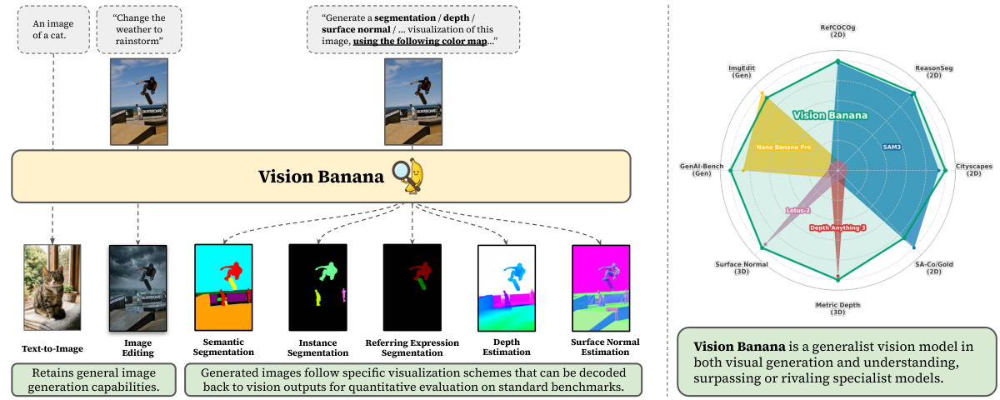
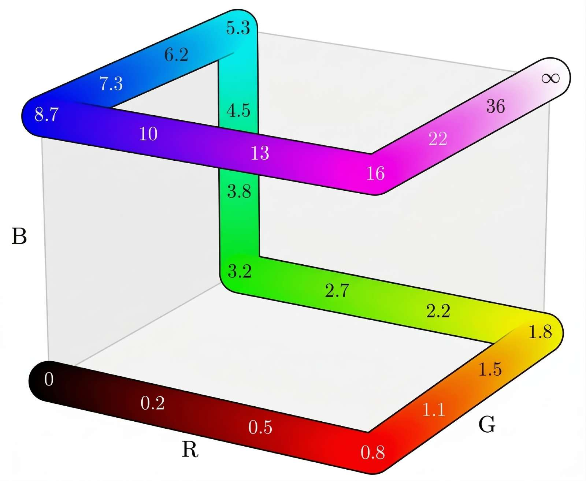
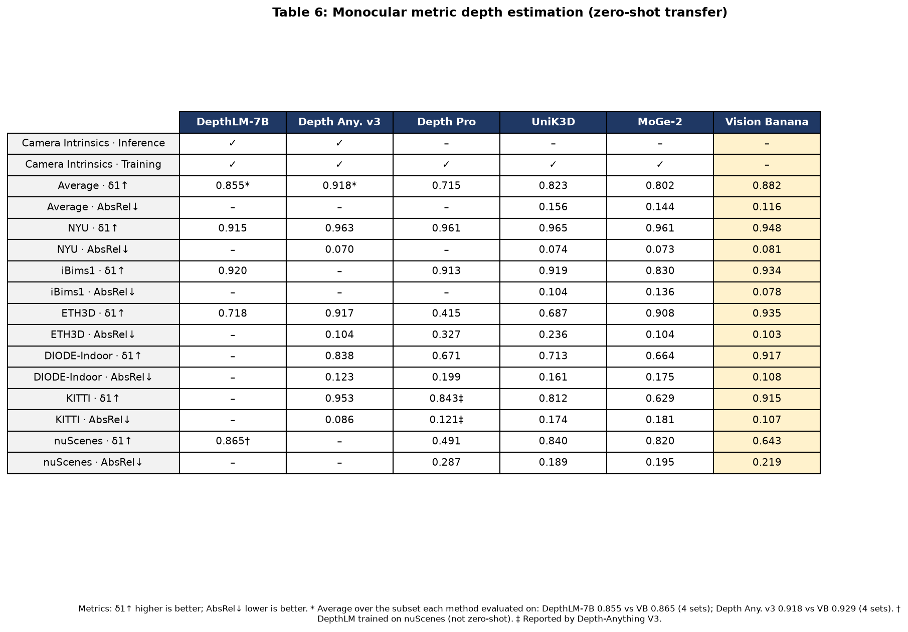

**Paper:** [Image Generators are Generalist Vision Learners](https://arxiv.org/pdf/2604.20329)

**Overall rating:** ★★★★★

**One-line takeaway:** This paper shows that a strong image generator can be turned into a unified vision model for segmentation, depth, and surface normals through lightweight instruction tuning, while largely preserving image generation quality.

## 1. 背景

这篇工作讨论的不是“如何再做一个专用视觉头”，而是一个更大的命题：**图像生成预训练本身，是否已经在内部学到了足够强的视觉理解能力**。作者把这个问题类比到 LLM：语言模型先靠生成式预训练获得通用能力，再靠 instruction tuning 学会把能力稳定地“表达出来”；对应到视觉领域，作者尝试把图像生成模型变成一个统一的视觉理解接口。

论文的核心对象是基于 `Nano Banana Pro` 轻量指令微调得到的 **Vision Banana**。作者没有为每个任务单独设计 specialized head，也没有引入复杂 task-specific loss，而是把不同视觉任务的输出都统一表示成 **RGB 图像**，再通过可逆解码把输出还原成 segmentation mask、metric depth 或 surface normal。

这篇论文值得重点关注，原因有三点：

1. **范式层面很强**：它不是在某个 benchmark 上微调提升几点，而是在论证“image generation pretraining = generalist vision pretraining”。
2. **统一接口很有启发**：把 perception 统一改写为 image generation，有利于把多任务系统、prompt interface 和评测接口统一起来。
3. **对 3D / 几何任务也成立**：不仅做了 2D segmentation，还在 monocular metric depth 和 surface normal 上超过或逼近 specialist。

作为总览，先看论文中的主图：

**图 1（Teaser）解读**：论文主图，展示 Vision Banana 同时支持 2D 分割、metric depth、surface normal 等多种视觉理解任务，并保留图像生成能力。**来源**：arXiv:2604.20329，Figure 1 (teaser.png)。

从这张图可以直接看出作者的主张：**同一个图像生成模型，在保留生成能力的同时，也可以输出可量化评测的视觉理解结果。**

---

## 2. 文章主线 / 论文线索

**论文信息**

- **Title:** Image Generators are Generalist Vision Learners
- **arXiv:** [2604.20329](https://arxiv.org/pdf/2604.20329)
- **Date in paper:** 2026-06-05
- **Project page:** [vision-banana.github.io](https://vision-banana.github.io)

**主线问题**

- 图像/视频生成模型已经表现出很多零样本视觉理解现象，但过去工作往往：
    - 不能稳定输出可评测格式；或
    - 需要重改架构、全量微调，最后牺牲 generality。
- 本文的目标是验证：**只通过轻量 instruction tuning，是否就能把 image generator 内部已有的视觉表征“对齐”出来。**

**论文的核心贡献可以概括为 4 点：**

1. **提出 Vision Banana**：在 `Nano Banana Pro` 上进行轻量 instruction tuning，得到统一视觉模型。
2. **把视觉任务统一为 RGB 图像输出**：语义分割、实例分割、指代表达分割、metric depth、surface normal 都改写为“生成一张符合指定可视化规则的图”。
3. **为几何任务设计可逆编码**：尤其是 metric depth，作者设计了从物理深度到 RGB 的双射编码，使生成图像可以无歧义解码回真实数值。
4. **验证生成能力未明显受损**：在 text-to-image 和 image editing 上，与 base model `Nano Banana Pro` 基本持平。

**我认为最重要的技术判断**

- 这篇论文最重要的不是某一项单点结果，而是它用实验证据支持了一个更激进的命题：
    - **生成式视觉预训练可能正在成为通用视觉底座；**
    - **图像生成可能会像 text generation 之于 NLP 一样，成为统一的任务接口。**

---

## 3. Pipeline / Architecture + I/O 数据流

### 3.1 整体训练思路

Vision Banana 的训练逻辑很简单，但非常关键：

1. 选择一个已经很强的 image generator：`Nano Banana Pro`
2. 向其原始训练 mixture 中，**以很低比例混入 vision task data**
3. 这些 vision task data 的监督目标，不是传统 tensor head，而是**可逆的 RGB 可视化图像**
4. 训练后，模型面对不同 prompt，直接生成符合规则的 RGB 输出
5. 再把 RGB 输出解码回任务空间，计算标准 benchmark 指标

作者明确强调，这种低比例混入的方式本质上是 **lightweight instruction tuning**，而不是对 base generator 做重度 task specialization。

### 3.2 统一 I/O 设计

**输入（Input）**

- 一张 RGB 图像
- 一条自然语言任务指令
- 对某些任务，还会带颜色映射说明
    - 例如 semantic segmentation 的 class-to-color mapping
    - 或 referring segmentation 的 textual query

**输出（Output）**

- 一张 RGB 图像
- 这张图像不是“随便生成”，而是满足指定规则的任务可视化结果
- 再经后处理解码为：
    - segmentation mask
    - metric depth map
    - surface normal map

### 3.3 各任务的数据流

**A. Semantic Segmentation**

1. 输入：原图 + prompt + 类别到颜色的映射
2. 模型输出：每个类别按指定颜色着色的 segmentation visualization
3. 解码：对每个像素找最接近的目标颜色，恢复语义类别
4. 指标：在 Cityscapes 等 benchmark 上计算 mIoU

**B. Instance Segmentation**

1. 输入：原图 + 目标类描述 + 背景颜色
2. 模型输出：同类不同实例使用不同颜色的 mask 图
3. 解码：作者在 Appendix A 给出 multi-stage clustering algorithm，把不同颜色区域聚成单独实例
4. 备注：在 SA-Co/Gold 上，作者先用 `Gemini 3.1 Flash-Lite` 判断 query 是否为 positive，再让 Vision Banana 生成 mask

**C. Referring Expression Segmentation**

1. 输入：原图 + 长文本 query
2. 对简单 referring query：Vision Banana 直接生成对应 mask visualization
3. 对 ReasonSeg 这类复杂 query：先用 `Gemini 2.5 Pro` 把 reasoning query 改写为更直接的描述，再交给 Vision Banana
4. 输出：文本指向对象的 mask visualization，解码后计算 cIoU / gIoU

**D. Metric Depth Estimation**

1. 输入：单张 monocular image + depth estimation prompt
2. 监督目标：不是直接回归 depth tensor，而是生成一张**可逆深度伪彩色图**
3. 编码流程：
    1. 先对真实深度 `d` 做 power transform（论文固定 `λ = -3`, `c = 10/3`）
    2. 把变换后的归一化距离映射到 RGB cube 的分段线性路径上
    3. 得到一张 RGB depth visualization
4. 推理阶段：对模型生成的 RGB 图做反变换，恢复 metric depth
5. 特点：**不依赖 camera intrinsics 做预测**

下面这张图是论文里最关键的方法图之一，展示了作者设计的 depth↔RGB 双射：

**图 5（depth↔RGB 双射）解读**：把 metric depth `d` 经 power transform（λ=-3, c=10/3）映射到 RGB cube 边上的分段线性路径（类似 3D Hilbert 曲线的第一段），使生成图像可无歧义反解码为真实 metric 距离，从而实现"生成即解码"的统一接口。**来源**：arXiv:2604.20329，Figure 5 (assets/color_tubes.jpg)。

**E. Surface Normal Estimation**

1. 输入：单张 RGB 图像 + normal estimation prompt
2. 监督目标：生成 camera-space normal 的 RGB visualization
3. 编码方式：
    1. 使用右手坐标系，`+x` 向右，`+y` 向上，`+z` 朝向相机外
    2. 向量分量直接映射到 RGB 通道
4. 推理阶段：把生成图像解码为 normal vector
5. 优势：相比 depth，不需要额外复杂颜色双射设计，normal 本身就天然适合映射到 RGB

### 3.4 数据来源与训练原则

**2D understanding 数据**

- 使用 web-crawled 2D images 的 in-house model annotations

**3D understanding 数据**

- 使用 rendering engines 生成的 synthetic data

**关键约束**

- 训练混合中 **不包含 evaluation benchmark 的训练数据**
- metric depth 训练 **不使用真实世界 depth 数据**
- depth 任务在训练和推理时都 **不使用 camera intrinsics / extrinsics**

**一个非常值得注意的 I/O 观点：**

本文不是把 generator 当 encoder feature extractor 再外挂 head，而是让模型继续做“生成图像”这件事，只是把输出图像变成了可解码的任务表示。也就是说，**任务统一发生在 output interface，而不是 hidden feature API。**

---

## 4. 实验与关键信息

### 4.1 总体结果

|能力|Benchmark|Vision Banana|Best counterpart in paper|
|---|---|---|---|
|Referring segmentation|RefCOCOg UMD val (cIoU ↑)|73.8|73.4 (SAM3 Agent)|
|Referring segmentation|ReasonSeg val (gIoU ↑)|79.3|77.0 (SAM3 Agent)|
|Semantic segmentation|Cityscapes val (mIoU ↑)|69.9|65.2 (SAM3)|
|Instance segmentation|SA-Co/Gold (cgF1 ↑)|47.5|24.6 (OWLv2)|
|Metric depth|Average of 4 datasets (δ1 ↑)|0.929|0.918 (Depth Anything 3)|
|Surface normal|Average of 4 datasets (mean angle error ↓)|18.928|19.642 (Lotus-2)|
|Text-to-image|GenAI-Bench win rate|53.5%|46.5% (Nano Banana Pro)|
|Image editing|ImgEdit win rate|47.8%|52.2% (Nano Banana Pro)|

### 4.2 2D understanding：不是“会一点”，而是能打 specialist

**Semantic segmentation**

- Cityscapes val 上达到 **69.9 mIoU**
- 超过 `SAM 3` 的 **65.2**
- 关键点在于：通过 prompt 给出完整 class-to-color mapping，模型直接生成可解码的语义分割图

**Instance segmentation**

- SA-Co/Gold 上达到 **47.5 cgF1**
- 对比 `OWLv2` 的 **24.6**，提升很明显
- 但要注意，这个 setting 里作者借助 `Gemini 3.1 Flash-Lite` 做 presence filtering，因此它不是完全单模型闭环

**Referring expression segmentation**

- RefCOCOg UMD val：**73.8 cIoU**，略高于 `SAM3 Agent` 的 **73.4**
- ReasonSeg val：**79.3 gIoU**，高于 `SAM3 Agent` 的 **77.0**
- 对复杂 query，作者依赖 `Gemini 2.5 Pro` 做 query rewriting，所以强项其实是“生成模型 + MLLM reasoning”组合

### 4.3 3D understanding：最值得关注的部分

**Metric depth estimation**

- 六个公开 benchmark 上平均 `δ1 = 0.882`
- 在与 `Depth Anything V3` 共同覆盖的四数据集平均上，Vision Banana 为 **0.929**，超过对方的 **0.918**
- 论文特别强调：
    - **零真实世界 depth 数据训练**
    - **不使用 camera intrinsics / extrinsics**
    - 依赖的是生成预训练中学到的几何与尺度先验

下面这页展示了深度定量结果：

**表 6 解读**：在 NYU / iBims1 / ETH3D / DIODE-Indoor / KITTI / nuScenes 六个 zero-shot benchmark 上，Vision Banana 平均 δ1 = 0.882，超过 UniK3D (0.823) 与 MoGe-2 (0.802)；在与 Depth-Anything V3 共同覆盖的 4 数据集上达 0.929 vs 0.918，且训练/推理均不使用真实深度数据与 camera intrinsics。**来源**：arXiv:2604.20329，Table 6。

作者还展示了从生成深度图解码后再反投影成 3D scene 的可视化结果：

**Surface normal estimation**

- 论文报告其在 indoor datasets 平均 mean / median angle error 上达到最优
- 对 outdoor scenes 也具有竞争力
- 与 `Lotus-2-Normal` 的比较中，作者认为 Vision Banana 的视觉细节更细、更锐利

下面这页同时给出了 normal 定量表和 qualitative comparison：

### 4.4 为什么这些实验结果有意义

我认为实验最有说服力的地方不只是“分数更高”，而是下面四点同时成立：

1. **同一模型统一覆盖 2D + 3D 多任务**
2. **输出接口统一成 RGB image**
3. **depth / normal 这种几何任务也能做强**
4. **生成能力没有明显忘掉**

这意味着：作者不是简单证明 generator feature 有用，而是在证明 **generator 本身可以成为 task interface 层面的 foundation model**。

### 4.5 限制与需要谨慎看的地方

- **基础模型是私有系统**：`Nano Banana Pro` 并非开放模型，因此 recipe 的可复现性目前有限。
- **不是纯单模型闭环**：实例分割和复杂 referring segmentation 都借助了 Gemini 做前处理/判断。
- **任务面仍然有限**：虽然覆盖了 segmentation + depth + normals，但距离“通用视觉系统”仍有明显扩展空间，例如 detection、tracking、pose、video understanding、3D reconstruction、embodied tasks。
- **训练细节仍不够充分**：论文强调 low-ratio mixing，但没有公开到足以让社区严格复现的 recipe 粒度。

**我的判断：**

如果把这篇论文只看作“又一个多任务模型”，会低估它的价值。它真正重要的是给出一种很干净的论证路线：

**不改任务头，而改输出接口；不把 generator 当 feature extractor，而把 generator 直接变成 vision model。**

---

## 5. 个人评注 / 下一步

### 5.1 对“技术视野”的价值

这篇论文我建议归入 **基础模块**，原因是它的核心贡献不在某个具体应用领域，而在于：

- 重新定义了视觉 foundation model 的训练范式
- 把 image generation 提升为统一 perception interface
- 对后续 2D/3D/多模态统一模型都很有启发

从你的关注方向看，这篇工作至少会影响三条线：

1. **基础模块 / 视觉底座**
    1. 生成式预训练是否会取代传统 discriminative pretraining，成为更强视觉底座。
2. **3D 感知与几何理解**
    1. depth / normals 这类几何任务是否可以统一进 generative interface。
3. **多模态系统设计**
    1. 未来 VLM / world model / VLA 是否也可以把更多 perception outputs 改写成可生成、可解码的视觉 token / RGB interface。

### 5.2 我给 5 星的原因

- **概念强**：直接触碰“生成模型是否已经是通用视觉学习器”这个大问题
- **实验证据足够硬**：不是只做 qualitative demo，而是在多套标准 benchmark 上对 specialist 形成正面比较
- **方法设计非常干净**：统一输出接口 + 可逆编码，是一个可迁移的 recipe
- **对 3D 几何任务有效**：这点大幅提升了它对后续研究的参考价值

### 5.3 建议继续跟踪的点

- 是否会出现 **open-source 复现版**，验证该范式是否不依赖私有超大基座
- 这种“RGB task interface”是否能继续扩展到：
    - optical flow
    - pose / keypoint
    - 3D reconstruction
    - video dense prediction
- 在具身或 world model 场景中，是否可以把 action-conditioned perception outputs 也统一为生成式接口
- 如果后续出现同类工作，重点比较三件事：
    - 是否仍保持 generation quality
    - 是否减少对外部 MLLM 的依赖
    - 是否在更多几何/时序任务上保持统一性
