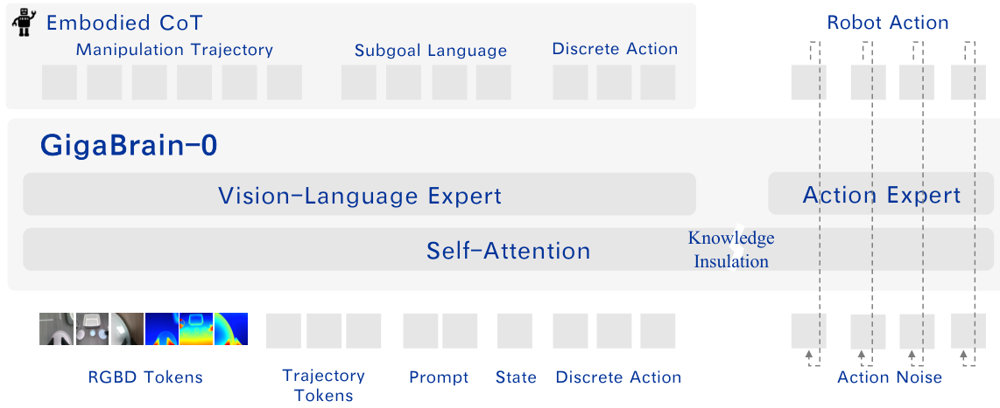
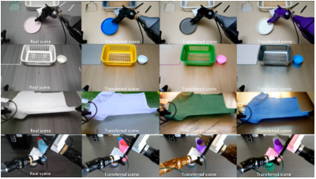
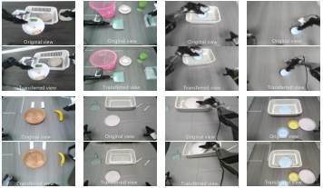
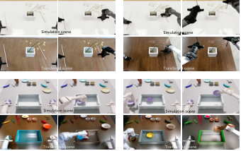
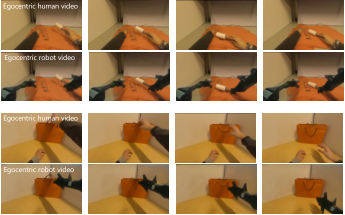
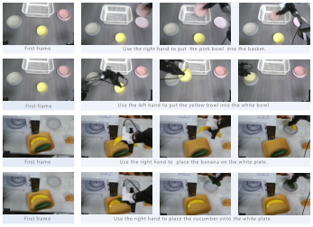
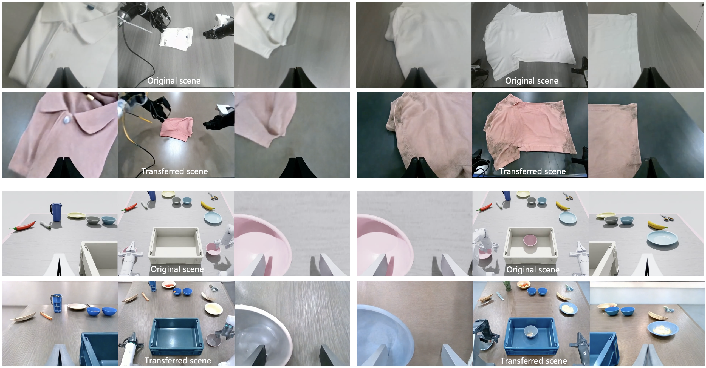
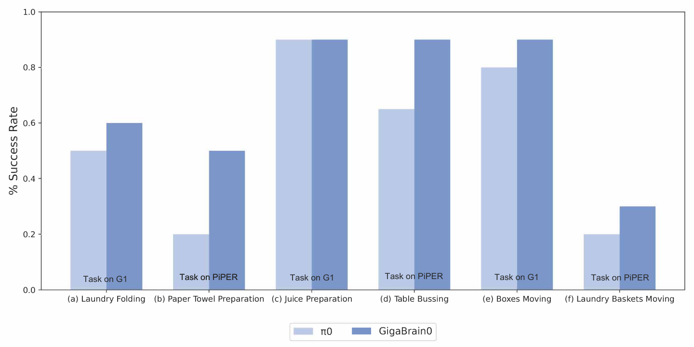
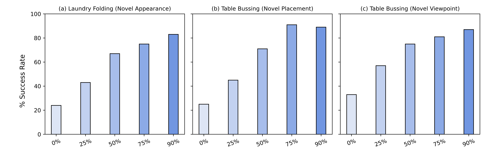

## 1. 背景

**一句话判断：** 这篇论文的核心价值，不是单纯再做一个 VLA backbone，而是把 **world model 前移为 VLA 的数据引擎**，用可规模化生成的数据去缓解真实机器人数据昂贵、单一、难扩展的问题。

**重要性评估：** ★★★★☆（4/5）

**主领域归档建议：** VLA

**为什么值得关注：**

- 它把真实机器人数据瓶颈，转写成“真实数据 + 多种 world-model 生成数据”的混合训练问题。
- 它不是只追求单任务高分，而是同时关注 **长程任务、灵巧操作、移动操作、外观泛化、摆放泛化、视角泛化、端侧部署**。
- 论文还给出一个轻量版 `GigaBrain-0-Small`，显示这条路线不只是研究 demo，也在尝试落到端侧机器人控制。

**原始出处：**

- [arXiv 论文页](https://arxiv.org/abs/2510.19430)
- [官方 PDF](https://arxiv.org/pdf/2510.19430)
- [项目页](https://gigabrain0.github.io)

这篇内容讨论的是一套名为 **GigaBrain-0** 的 Vision-Language-Action 模型。作者认为，现有通用机器人 VLA 的主要瓶颈并不完全在模型结构，而在 **训练数据规模、场景多样性与采集成本**。因此论文的目标是：在不无限增加真实机器人采集量的前提下，用 world model 生成的大规模、多样化、具有物理可行性的训练数据，去提升 VLA 的跨任务与跨环境泛化能力。

---

## 2. 文章主线 / 论文线索

**主论文：**

- **GigaBrain-0: A World Model-Powered Vision-Language-Action Model**

**主线可以拆成三层：**

1. **数据层：** 用 GigaWorld 生成多种增强数据，而不是只依赖真实机器人轨迹。
2. **模型层：** 用 `预训练 VLM + 动作生成专家` 的混合架构，把语义理解和连续动作生成解耦。
3. **监督层：** 通过 **RGBD 输入** 和 **Embodied CoT**，强化空间理解与长程推理能力。

**论文里真正的新意，不只是“用了生成数据”，而是把生成数据做成一个系统性的 recipe：**

- Real2Real transfer：把真实轨迹重渲染成不同纹理、材质、光照与颜色。
- View transfer：在保任务语义的前提下，重建新相机视角。
- Sim2Real transfer：从仿真场景生成轨迹，再做真实化迁移。
- Human video transfer：把第一视角人类操作视频转成机器人可执行演示。
- Video generation + IDM：从单帧与文本提示生成未来操作视频，再反推动作序列。
- Multiview generation：生成跨视角一致的视频，用于提升 3D-aware 训练效果。

**论文最强主张**

- world model 可以作为 **VLA 数据扩展器**
- RGBD 能补足空间几何感知
- Embodied CoT 能提升长程任务执行
- 小模型也能做到端侧实时控制

**论文仍未完全展开的部分**

- GigaWorld 本身的模型与训练细节留待后续 technical report
- 多种生成数据源各自的独立贡献没有做充分 ablation
- 与更多开源/闭源 VLA 的系统对比还不够充分

---

## 3. Pipeline / Architecture + I/O 数据流

### 3.1 总体数据流

**一句话 Pipeline：** `真实/生成混合数据` → `VLM 编码 RGBD + 指令 + 状态` → `Embodied CoT 中间推理` → `DiT 预测连续 action chunks` → `机器人执行动作`

### 3.2 输入 / 中间表示 / 输出

|阶段|内容|技术要点|
|---|---|---|
|输入|RGBD 观测、自然语言任务指令、机器人状态、轨迹 token|视觉输入形状为 `B × H × W × 4`，即 RGB + Depth。若原始数据没有深度，训练集里会用深度估计方法补齐；训练时还会随机丢弃 depth 通道，以兼容推理阶段仅 RGB 的情况。|
|视觉编码|SigLIP / PaliGemma2 体系下的视觉-语言编码|作者以预训练 VLM `PaliGemma2` 负责多模态理解，并将 SigLIP 第一层卷积扩展到 depth 通道，且 depth 新核零初始化，以尽量保留原有 RGB 先验。|
|中间推理 1|Manipulation Trajectory|以 **10 个均匀采样的 2D 关键点** 表示末端执行器在图像平面上的操作轨迹。论文没有做自回归轨迹生成，而是引入 10 个 learnable trajectory tokens，与视觉上下文做双向注意力交互，再用轻量 GRU 回归 2D 坐标。|
|中间推理 2|Subgoal Language|生成自然语言形式的中间目标，帮助长时序任务分阶段推进。|
|中间推理 3|Discrete Action Tokens|离散动作 token 作为 Embodied CoT 的一部分，同时用于提升后续连续动作学习的收敛速度。|
|动作生成|Continuous action chunks|使用 **DiT + flow matching** 预测连续动作片段。语义理解与动作生成由不同 expert 负责，中间通过 `Knowledge Insulation` 降低干扰。|
|输出|机器人动作序列|用于控制 wheeled bi-manual robot，如 Agilex / G1 / PiPER 等平台。|

### 3.3 模型结构拆解

**结构上是一个“语义专家 + 动作专家”的混合体：**

- **Vision-Language Expert：** 负责理解 RGBD 场景、语言指令、状态与 Embodied CoT。
- **Action Expert：** 负责连续动作 chunk 的扩散式生成。
- **Knowledge Insulation：** 用于隔离离散语义推理流与连续动作优化流，减少互相污染。

### 3.4 监督目标

论文联合优化三类目标：

1. **CoT token 的 next-token prediction**：监督 subgoal language 与 discrete action token。
2. **动作 flow matching loss**：监督连续动作 chunk 的生成。
3. **轨迹回归损失**：监督 10 个 2D 轨迹关键点。

### 3.5 数据引擎是怎么工作的

**真实数据部分：**

- 公共数据：AgiBotWorld、RoboMind、Open X-Embodiment。
- 自采数据：来自 Agilex Cobot Magic 与 AgiBot G1，合计 **1182 小时**，覆盖 **3100 平方米**、**14 个真实场景**，包含工业、商业、办公、家庭、实验室等环境。

**标注与处理：**

- 无深度时，用 `MoGe` 估计 metrically scaled depth。
- 长任务的 subgoal 不是纯手工切，而是按 gripper state transition 自动切分，再用 `Qwen-VL-2.5` 生成 subgoal language。
- 2D manipulation trajectory 通过 3D 末端轨迹投影到头戴相机图像平面获得。
- 同一任务最多保留 **50 条**具有多样性的 demonstration，用于去重与提效。

**生成数据部分：**

- **Real2Real**：固定动作语义，改变纹理/材质/颜色/光照。
- **View Transfer**：基于深度重投影到新视角，再用视频补全模型修补遮挡区域。
- **Sim2Real**：在 Isaac Sim 中构造场景，基于 EmbodiedGen / ArtVIP 等资产生成仿真轨迹，再做真实化迁移。
- **Human Video Transfer**：把 EgoDex 第一视角人类手部操作，转成机器人手臂执行版本。
- **Video Generation + IDM**：从单帧和文本提示合成操作视频，再用 Inverse Dynamics Model 反推机器人动作。
- **Multiview Video Generation**：生成多视角一致视频，提升跨视角训练效果。

> 补注：上图为 Multiview Video Generation（论文图 9），生成多视角一致视频，用于提升 3D-aware 训练效果。

---

## 4. 实验与关键信息

### 4.1 主实验设置

论文在两类机器人平台上做实机验证：

- **PiPER 双臂平台**
- **AgiBot G1 平台**

覆盖三类任务：

- **灵巧操作**：laundry folding、paper towel preparation
- **长程任务**：juice preparation、table bussing
- **移动操作**：boxes moving、laundry baskets moving

**各任务微调数据与训练配置：**

- Laundry Folding：300 条 demonstration，batch size 128，40K steps
- Paper Towel Preparation：100 条 demonstration，batch size 128，20K steps
- Table Bussing：100 条 demonstration，batch size 128，20K steps
- Juice Preparation：489 条 demonstration，batch size 128，35K steps
- Boxes Moving：300 条 demonstration，batch size 128，30K steps
- Laundry Baskets Moving：378 条 demonstration，batch size 192，30K steps

对比基线主要是：

- **π0**（使用官方开源代码，并采用相同微调配置）

### 4.2 六个实机任务结果

> 下表数值为根据论文主结果图直接读取的 **近似值**；论文正文只明确写出相对提升幅度，没有单独给出完整数字表。

|任务|π0|GigaBrain-0|解读|
|---|---|---|---|
|Laundry Folding（G1）|约 50%|约 60%|复杂可变形物体操作中有明显提升，说明 RGBD + 生成数据有助于空间理解与接触动作稳定性。|
|Paper Towel Preparation（PiPER）|约 20%|约 50%|提升最明显之一，说明在精细且步骤受约束的灵巧任务中，Embodied CoT 与深度信息的帮助较大。|
|Juice Preparation（G1）|约 90%|约 90%|两者都已较高，说明该任务可能接近当前数据规模下的饱和区。|
|Table Bussing（PiPER）|约 65%|约 90%|长程任务提升非常显著，契合论文关于 subgoal language 与 structured reasoning 的主张。|
|Boxes Moving（G1）|约 80%|约 90%|移动与操作结合场景中继续领先，说明统一 VLA 对全局导航 + 局部交互衔接有效。|
|Laundry Baskets Moving（PiPER）|约 20%|约 30%|有提升，但绝对成功率仍不高，说明这类重物/大物体搬运仍然困难。|

### 4.3 泛化实验：生成数据混合比例 α 的影响

论文单独考察了 **world model 生成数据在训练 batch 中的采样概率 α**。这部分很关键，因为它直接回答了“生成数据到底有没有帮助，以及混多少最合适”。

|实验|0%|25%|50%|75%|90%|结论|
|---|---|---|---|---|---|---|
|Laundry Folding 新外观|约 24%|约 43%|约 67%|约 75%|约 83%|仅用白色衣物真实数据几乎不够；加入 Real2Real 生成数据后，颜色/纹理泛化明显提升。|
|Table Bussing 新摆放|约 25%|约 45%|约 71%|约 91%|约 89%|Sim2Real 补充的摆放多样性非常有效，最佳点大约出现在 75% 左右。|
|Table Bussing 新视角|约 33%|约 57%|约 75%|约 81%|约 87%|View transfer 对跨视角鲁棒性帮助很大，且整体呈现随 α 上升而持续收益的趋势。|

### 4.4 端侧部署结果

`GigaBrain-0-Small` 使用更小的 `SmolVLM2` 和约 **100M action expert**，论文给出的整机对比如下：

|模型|FLOPs|参数量|推理显存|推理时延|成功率|
|---|---|---|---|---|---|
|π0|4400 GFLOPs|3.2B|17.5 GB|1.28 s|80%|
|GigaBrain-0-Small|840 GFLOPs|402M|1.9 GB|0.13 s|80%|

这个结果很有代表性：

- 计算量从 **4400 GFLOPs** 降到 **840 GFLOPs**。
- 参数量从 **3.2B** 降到 **402M**。
- 显存从 **17.5GB** 降到 **1.9GB**。
- 时延从 **1.28s** 降到 **0.13s**。
- 成功率仍保持 **80%**。

也就是说，作者证明了这条路线不只服务大模型训练，也有机会进入边缘机器人部署场景。

### 4.5 我认为最重要的结论

1. **world model 生成数据确实能显著提高 VLA 泛化能力。**
2. **收益并不只在外观泛化，也覆盖摆放变化、相机视角变化和长程操作。**
3. **RGBD + Embodied CoT** 让模型不只是“看懂”，而是更像在做具身任务分解与空间推理。
4. **小模型版结果非常关键**，说明未来这条路线可能走向“训练时重、部署时轻”的工程范式。

---

## 5. 个人评注 / 下一步

**我对这篇论文的定位：** 它不是最纯粹的 world model 论文，也不是最纯粹的 VLA 架构论文；它更像是一篇 **“world model 作为 VLA 数据基础设施”** 的系统型论文。

### 5.1 对当前技术视野的价值

这篇论文最值得你跟踪的地方有三点：

- **它把数据合成问题系统化了。** 不是简单做 augmentation，而是把真实采集、仿真、视角迁移、外观迁移、人类视频迁移、视频生成、IDM 反推动作串成一个统一数据引擎。
- **它把具身推理显式化了。** Embodied CoT 不是只让模型“想一想”，而是把轨迹、子目标语言、离散动作 token 都纳入中间监督。
- **它兼顾端侧部署。** 这对于真正落地机器人系统很重要，不然很多方法只能停留在云端推理或实验室环境。

### 5.2 我觉得仍然需要警惕的问题

- **GigaWorld 细节披露不够完整。** 很多关键模块只在文中概述，作者明确说完整细节会放到后续 technical report。
- **baseline 还不够丰富。** 主实验主要与 `π0` 对比，虽然直观，但不足以完全说明相对所有强 VLA 的优势边界。
- **缺少细粒度 ablation。** 例如 RGBD、Embodied CoT、Knowledge Insulation、不同生成数据源各自贡献多少，论文没有充分拆开。
- **部分任务绝对成功率仍不高。** 例如 laundry baskets moving 依然只有约 30%，说明重物搬运、复杂移动操作仍远未解决。

### 5.3 建议后续跟进

- 继续追踪 **GigaWorld technical report**，重点看：
    - 视频生成 backbone 是什么
    - 质量筛选分数如何定义
    - 多视角一致性是怎么训练出来的
    - IDM 如何保证动作可执行性
- 横向对比这篇论文与以下路线：
    - **DreamGen / GR00T**：同样重视 world-model-generated data
    - **Qwen-VLA / PrimitiveVLA / ReconVLA**：更偏 VLA 范式、监督组织与策略泛化
    - **视频世界模型到机器人策略** 这条线：看它和 action-conditioned world model 的关系
- 如果后续你要做内部追踪，我建议把它同时挂在：
    - **主分类：VLA**
    - **关联观察：世界模型**

**一句话总结：**GigaBrain-0 值得进入你的主线视野，因为它提出了一种很现实的判断：**通用机器人 VLA 的下一步，不一定先靠更大的 policy，而可能先靠更强的数据引擎。**
