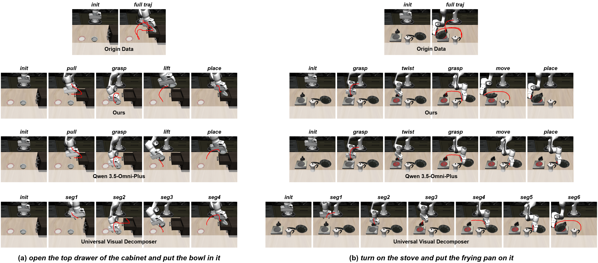
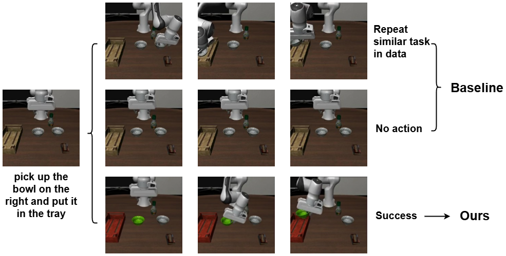
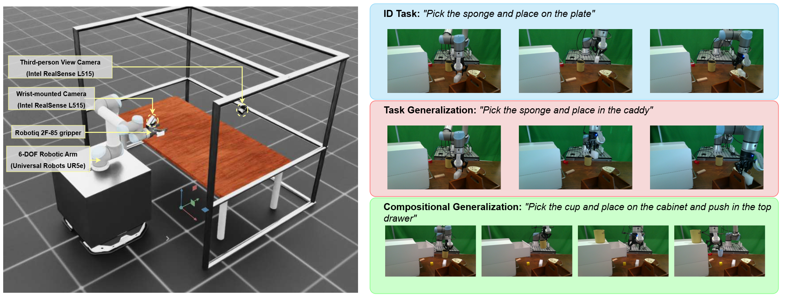

## 背景

PrimitiveVLA 聚焦当前 **Vision-Language-Action（VLA）** 模型在落地到具体机器人任务时的两个核心瓶颈：**数据效率低** 和 **跨任务泛化差**。论文作者认为，问题根源不只在数据量不足，更在于主流方法普遍采用 **从任务指令直接映射到底层控制** 的训练范式，导致模型容易记住某个任务轨迹，而不是学到可复用的运动规律。

**一句话理解：** 这篇工作想把 VLA 从“背整条轨迹”改造成“先拆动作原语、再按任务组装”，让机器人真正学会可迁移、可组合的操作技能。

论文标题：**PrimitiveVLA: Learning Reusable Motion Primitives for Efficient and Generalizable Robotic Manipulation** 原始链接：[arXiv](https://arxiv.org/abs/2605.28634v1)

上图直观对比了两种范式：传统做法把多阶段任务视为一个整体，而 PrimitiveVLA 先把演示轨迹拆成可复用 primitive，再在推理时进行组合，从而支持未见任务和长程任务上的组合泛化。

---

## 目标

这篇论文试图回答三个问题：

1. **能否让 VLA 学到跨任务共享的物理动作模式，而不是任务特定轨迹？**
2. **在不增加标注成本的前提下，能否自动把 demonstration 拆成 primitive 级监督信号？**
3. **推理时能否把这些 primitive 稳定地重新组装起来，支撑闭环执行、未见任务泛化和长时序操作？**

作者给出的核心方案是 **Primitive-Centric Disassemble & Assemble**：

- **训练阶段（Disassembly）**：把完整任务轨迹自动拆成 primitive 片段；
- **推理阶段（Assembly）**：先规划 primitive 序列，再在闭环中按切换条件执行；
- **共享表示层（MCR）**：用统一的 canonical instruction 和 object-centric mask，把不同任务映射到同一 primitive 学习接口。

---

## 进展

### 1. 文章主线 / 核心创新点

**核心创新 1：提出 Primitive-Centric Disassemble & Assemble 新范式**

- 不再把任务指令直接对齐到整段低层控制轨迹。
- 将复杂 manipulation 拆成有限个、可解释、可复用的运动原语（primitive）。
- 论文定义了 11 个 primitive，覆盖抓取、放置、移动、推拉、插入、按压、旋转等常见交互模式。

**核心创新 2：构建自动化 primitive 拆解流程，避免人工精细标注**

- 先让 **VLM** 基于任务指令、视频帧序列和 primitive 库，推理当前任务对应的 primitive sequence。
- 再让 **LLM** 根据 primitive 的物理定义自动生成 Python 规则代码，用状态变化来定位每个 primitive 的边界。
- 这样能把原始 demonstration 自动切分成 primitive 级训练样本。

**核心创新 3：提出 MCR（Multimodal Canonical Representation）统一 primitive 学习接口**

- **语言侧**：把任务相关指令统一为 canonical primitive instruction，例如把“抓黑色碗”统一成“抓取绿色 mask 标出的目标物体”。
- **视觉侧**：通过 SAM / Cutie 生成 object-centric mask，把任务相关上下文放进 masked observation 中。
- 目标是既去掉任务文本噪声，又保留任务对象上下文，减轻 contextual interference。

**核心创新 4：在推理阶段用 Planner + Switch 机制做 primitive 组装**

- 高层由 **VLM planner** 生成 primitive 序列；
- 低层由 fine-tuned VLA 输出连续动作；
- 同时由 **LLM 生成的 switch 代码** 在滑动窗口统计上判断何时切换到下一个 primitive；
- 最终形成双线程闭环执行机制。

### 2. Pipeline / Architecture + I/O 数据流

#### 2.1 训练阶段：Primitive Disassembly

下图为 primitive 自动拆解的可视化对比：PrimitiveVLA 结合 VLM 语义推理与确定性规则代码，相比纯视觉分解与直接 VLM 方法，能更精确稳定地切分出可复用 primitive。

#### 2.2 推理阶段：Primitive Assembly

|阶段|输入|关键处理|输出|
|---|---|---|---|
|Primitive Planner|测试指令 `l_test`、初始观测 `o_0`、Disassembly Library|检索相似 `(instruction, sequence)` 样例后，用 VLM 生成符合训练分布的 primitive 序列|计划序列 `S_plan`|
|Primitive Switch|当前 primitive、历史滑动窗口 `H_t`、切换代码|基于统计量判断当前 primitive 是否完成，并触发切换|下一个 primitive 的执行时机|
|Closed-loop Execution|实时观测、当前 primitive、VLA policy|VLA 生成连续动作；监控线程同时检测切换条件|任务闭环执行结果|

#### 2.3 更细的 I/O 逻辑理解

- **训练输入**：
    - 视觉：第三视角 RGB、腕部相机 RGB
    - 状态：7 维 proprioceptive state
    - 监督来源：从任务轨迹中自动拆出的 primitive 片段
- **训练输出**：
    - 7 维 action（6-DoF delta pose + gripper action）
- **推理输入**：
    - 新任务指令
    - 初始图像与实时观测
    - 检索到的相似 primitive 序列先验
- **推理输出**：
    - 当前 primitive 下的连续控制动作
    - primitive 切换信号
    - 最终多阶段任务完成结果

### 3. 结果与实验发现

#### 3.1 数据效率

- 在 **Libero-90** 上，PrimitiveVLA 让 **OpenVLA** 从 **70.60% 提升到 79.80%**，提升 **9.2 个百分点**。
- 对 **OpenVLA-OFT**，从 **89.70% 提升到 94.70%**。
- 更关键的是，**50% 训练数据** 下：
    - OpenVLA + PrimitiveVLA 达到 **73.40%**，已经超过 100% 数据的原始 OpenVLA（70.60%）；
    - OFT + PrimitiveVLA 在 50% 数据下达到 **92.12%**，也超过 100% 数据 OFT 基线（89.70%）。

#### 3.2 零样本泛化与长程任务

- 在 **Libero-90-Novel** 未见任务上：
    - OpenVLA 从 **7.38%** 提升到 **45.50%**，约 **6×** 增长；
    - OpenVLA-OFT 从 **13.50%** 提升到 **71.00%**；
    - `π0.5` 从 **56.00%** 提升到 **75.50%**。
- 在 **Libero-Long** 长时序任务上：
    - `π0.5` 从 **30.50%** 提升到 **80.25%**，是非常亮眼的结果。

下图为 OOD 任务“把右边的碗拿起来放进托盘”上的泛化执行示例。

#### 3.3 消融结论

- **MCR 更主导 OOD 泛化**：OFT 在 Novel 上由 13.50% 提升到 60.00%。
- **Primitive Disassembly 更主导长程稳定性**：OFT 在 Long 上由 3.75% 提升到 52.30%。
- 两者结合后，最终达到 71.00%（Novel）和 66.50%（Long）的更强效果。

作者在 **UR5e + Robotiq 2F-85 + 双 RealSense L515 相机** 的真实系统上验证：

- ID 任务平均成功率从 **70% 提升到 90%**；
- 未见对象任务中，某项从 **10% 提升到 80%**；
- 组合任务上，baseline 几乎失败，而 PrimitiveVLA 能达到 **60%-70%** 成功率。

**重要性评估：★★★★★（5/5）**

原因有三点：

- 它不是简单换 backbone，而是直接重构了 VLA fine-tuning 的监督组织方式；
- 它把“可复用 primitive”从概念真正落成了训练与推理一体化方案；
- 它同时在数据效率、未见任务泛化、长时序任务和真实机器人上都给出了较完整证据链。

---

## 问题

虽然论文很强，但也有几个需要冷静看的点：

1. **primitive taxonomy 仍是人工预定义的** 当前 11 个 primitive 更适合标准抓手 manipulation，对于更细粒度灵巧手操作、双臂协作、接触丰富任务，覆盖能力还不确定。
2. **自动分段依赖规则代码质量** 尽管作者用 LLM 生成分段与切换逻辑，但这类规则在跨平台、跨传感器、跨 embodiment 场景下的可迁移性，论文尚未完全展开。
3. **MCR 依赖目标 mask 质量** 使用 SAM / Cutie 跟踪物体是有效的，但在遮挡、目标切换、多物体交互时，mask 抖动是否会影响 primitive 学习与切换，需要更多证据。
4. **planner + switch 的系统复杂度不低** 方案效果很好，但工程链路包含 VLM reasoning、LLM codegen、检索增强规划、双线程监控，系统复杂度明显高于 end-to-end 直接 policy。
5. **论文尚未完全证明 primitive 集可持续扩展** 作者也在 limitation 中承认，未来需要探索 unsupervised primitive disassembly 来动态扩展动作空间。

---

## 计划

### 个人评注

这篇论文对当前具身主线很有价值，原因不只是性能涨点，而是它明确提出：**VLA 的泛化问题，很大程度是监督组织方式的问题，而不是单纯 backbone 能力问题。** 这对于后续做算法策略、数据组织和任务编排都很有启发。

我认为它最值得关注的不是某个单点模块，而是以下三个方法论信号：

- **从 task-level supervision 转向 primitive-level supervision**；
- **从单次任务拟合转向 compositional skill reuse**；
- **从 purely end-to-end policy 转向“高层规划 + 低层动作 + 显式切换”混合范式**。

### 与当前技术视野的关系

这篇工作应归入 **VLA** 主领域，但它同时和以下方向强相关：

- **世界模型**：都在尝试通过结构化中间表示提升长程决策；
- **基础模块**：MCR 与表示学习、目标对齐机制相关；
- **具身训练范式**：它对 fine-tuning recipe、数据切分方式、任务编排方式都有直接启发。

### 下一步建议

- 对比 PrimitiveVLA 与 `π0.7`、DreamZero、ReconVLA 在“结构化中间表示”上的差异
- 进一步关注其开源代码与 primitive 分段规则是否公布
- 结合现有 VLA 训练数据，评估是否能在内部任务上复现“按 primitive 重组数据”的 recipe
- 观察其对更复杂 manipulation / 双臂 / dexterous hand 的扩展性

### TODO
