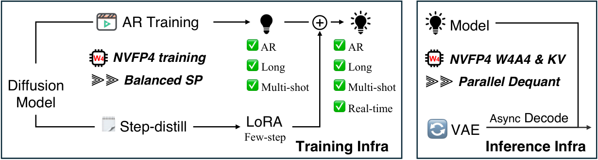
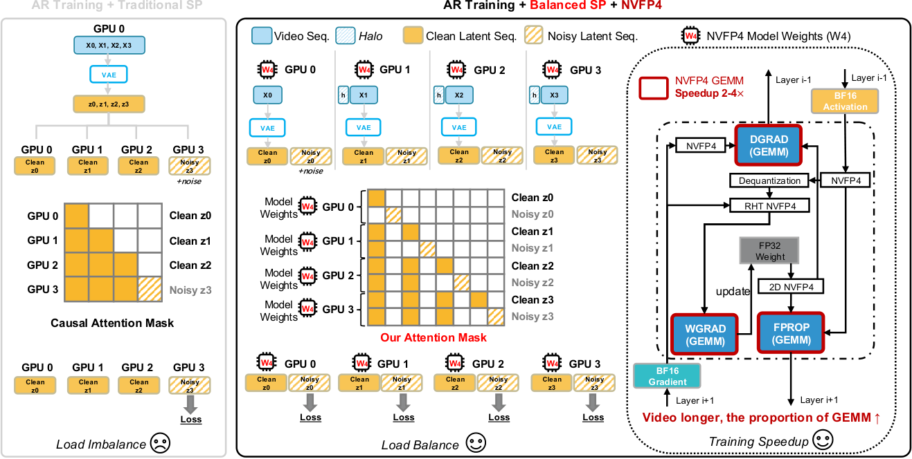
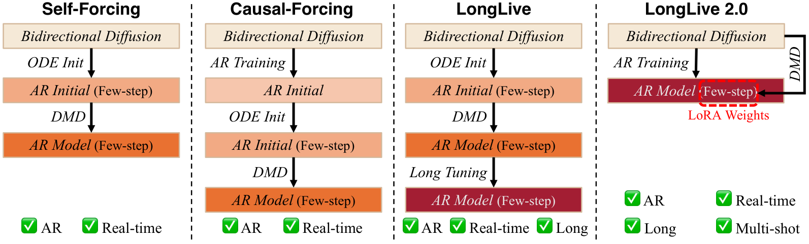
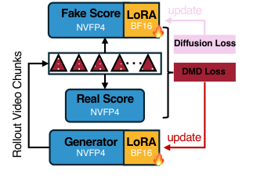
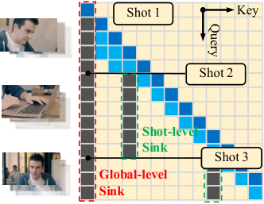
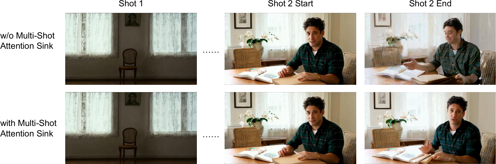
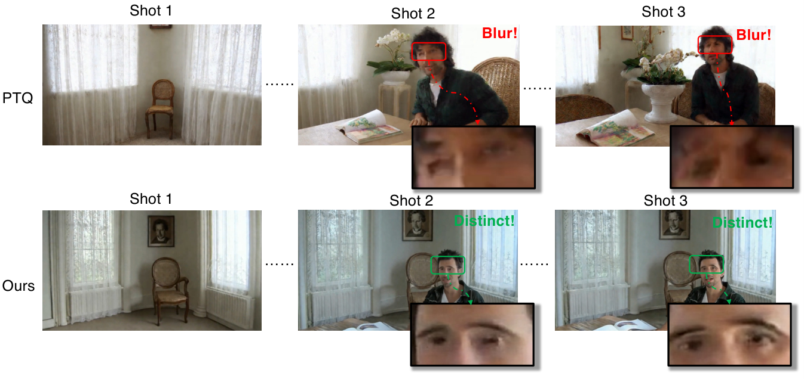
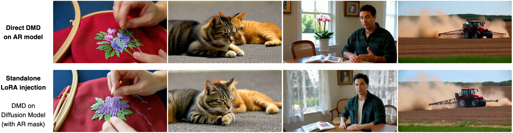

# LongLive-2.0：NVFP4 长视频生成训练与推理系统

## 基本信息

- **论文正式名称**：LongLive-2.0: An NVFP4 Parallel Infrastructure for Long Video Generation
- **作者**：Yukang Chen、Luozhou Wang、Wei Huang、Shuai Yang、Bohan Zhang、Yicheng Xiao、Ruihang Chu、Weian Mao、Qixin Hu、Shaoteng Liu、Yuyang Zhao、Huizi Mao、Ying-Cong Chen、Enze Xie、Xiaojuan Qi、Song Han（NVIDIA 主导，含 MIT、HKU、CUHK 等合作机构）
- **arXiv**：2605.18739（v1 2026-05-18，v2 2026-05-19）
- **代码与模型**：https://github.com/NVlabs/LongLive
- **项目页**：https://nvlabs.github.io/LongLive/LongLive2/
- **基础模型**：Wan2.2-TI2V-5B
- **关键硬件**：NVIDIA GB200 180GB（Blackwell）

## 一句话结论

LongLive-2.0 是首个**贯穿长视频生成训练与推理全链路的 NVFP4 基础设施**：训练侧通过 Balanced SP 平衡 SP 并在 teacher-forcing 布局下复用同一时间 chunk 的 clean/noisy 配对，叠加 NVFP4 端到端低精度，在 64s 长视频上实现 **2.1× 训练加速**；推理侧以 W4A4 NVFP4、KV cache 量化、异步流式 VAE 解码与多镜头 attention sink 共同作用，使 5B 模型在 720p 达到 **45.7 FPS**（2 步）端到端吞吐，并在 VBench / VBench-Long 上同时取得具有竞争力的质量与最优的长视频综合排名。

---

## 1. 研究背景与问题定义

### 1.1 研究问题

长视频生成在两类典型需求下都面临强烈的系统压力：训练侧需要"在极长的时空序列上做扩散学习"，推理侧需要"在低延迟下连续、长时间、可持续地吐出帧"。这两类压力并不是孤立的，**训练配方直接决定推理时的数值格式、蒸馏策略与缓存形态**。但现有工作普遍把"算法改进"与"基础设施"割裂看待——要么只做模型架构，要么只做 PTQ 推理压缩，几乎没有一项工作把"长视频 + 自回归 + chunk-level teacher forcing + NVFP4 低精度"贯穿到训练与推理两端。

论文把这一缺口定义为：长视频生成需要一条**同时覆盖训练与推理的、面向低精度且面向并行扩展**的体系化基础设施，而不是把现有算法简单"压缩一下"。

### 1.2 现有方法的瓶颈

论文从三个层面归纳了既有工作的不足。

**基础设施层面**：以往长视频生成很少有"训练-推理联合 co-design"。在推理侧，量化方法大多采用 post-training quantization（PTQ），导致训练精度与推理精度不一致，进而在长视频这种"对数值误差敏感、且会跨 chunk 累积"的场景中带来质量退化。SP（Sequence Parallelism）虽然能处理长序列，但传统 SP 把 clean history 与 noisy target 拼接成普通长序列后均匀切分，会在 AR 视频 DiT 中引发两类失衡——loss-bearing token 在各 rank 上分布不均，以及 VAE 编码依然在每个 SP rank 上重复进行。

**算法层面**：以 Self-Forcing / Causal-Forcing 为代表的长视频扩散训练流水线过于复杂，通常要依次执行 ODE 初始化、DMD 蒸馏、长视频微调等多个阶段，并且每加一个能力（长视频、交互、多镜头、实时）就要再加一个阶段。这种"补丁式堆叠"既增加调参链路长度，也让算法与基础设施之间的耦合越来越松散。

**部署层面**：真正面向线上场景的指标是**端到端 FPS**，而不是扩散模型自身的 FPS。VAE 解码、KV cache 膨胀、SP 通信、attention sink 设计都会把"模型已经算完一帧"和"用户真正看到一帧"之间拉开很大距离。

### 1.3 本文核心贡献

论文给出三项相互支撑的贡献：

1. **训练基础设施**：提出序列并行的自回归训练范式 Balanced SP，将 clean-history 与 noisy-target 的同一时间 chunk 配对放在同一张 GPU 上，并在 VAE 编码、DiT 注意力、损失计算阶段复用该 chunk ownership；进一步叠加端到端 NVFP4 训练，在 64s 视频上取得约 2.1× 训练加速。
2. **推理基础设施**：在 Blackwell GPU 上启用 W4A4 NVFP4 推理 + KV cache NVFP4 量化 + 异步流式 VAE 解码；在非 Blackwell 架构上用 SP 推理配合量化 KV cache 来逼近实时吞吐。最终在 5B / 720p / 2 步设置下达到 45.7 FPS。
3. **简洁的训练流水线**：凭借稳定的基础设施与高质量长视频数据，把"基础双向扩散模型 → 长视频 AR 微调 → 独立 LoRA few-step 蒸馏"压成两阶段流水线，不再依赖 ODE 初始化与多阶段 DMD，从而支持长视频、交互、多镜头、实时四类能力同时落地。

> 图 1：LongLive-2.0 整体框架。左侧训练侧用 Balanced SP 与 NVFP4 加速 AR 微调，并行用 DMD 蒸馏得到独立 LoRA 权重；右侧推理侧用 W4A4 NVFP4、KV cache 量化与异步 VAE 解码三件套最大化端到端吞吐。
> 来源：论文 Figure 1，第 1 页，https://arxiv.org/abs/2605.18739

---

## 2. 任务定义与输入输出

### 2.1 输入、输出与假设

**输入**：一段长视频（训练阶段取自 16s / 32s / 64s 三个时长桶的 120K 视频，推理阶段可任意长度滚动生成），配合对应的 chunk 级文本提示 $\mathbf{T}_i$（多镜头场景下每段 chunk 独立绑定一个 prompt）。训练时还有 teacher forcing 的标准做法——对当前 chunk 加噪、让模型在自身采样分布下预测。

**输出**：在 chunk 级别自回归展开的长视频 latent 序列，再由 VAE 异步解码为像素。模型本身是一个**以 chunk 为基本生成单元**的 AR 扩散模型，区别于"逐帧"或"逐 latent token"的 AR 形式。

**核心假设**：

- 长视频生成可以分解为一系列"clean history + noisy target"的 chunk 配对；这与 Self-Forcing 提出的高效并行 teacher forcing 兼容。
- 高质量的数据 + 稳定的并行基础设施可以替代 ODE 初始化等算法补偿。
- NVFP4 的数值精度（E2M1 + 16 元素 block scale + FP8 E4M3 block scale + FP32 全局 scale）在端到端训练中是稳定的，并能带来可观的吞吐收益。
- 推理时把 backbone 切到 4A4 W4A4 + 独立 LoRA 权重可以维持质量与 few-step 实时性的平衡。

### 2.2 关键符号和目标函数

论文中最关键的符号与公式集中在 NVFP4 表示、Balanced SP 张量布局、KV cache 量化与多镜头 attention sink 四个地方。

**NVFP4 表示**（论文式 (2)）：给定张量 $\mathbf{X}$，NVFP4 的反量化形式为

$$
\hat{\mathbf{X}} = \hat{\mathbf{X}}^{FP4} \cdot \alpha^{FP8} \cdot \alpha^{FP32}, \quad \hat{\mathbf{X}}^{FP4} \in \mathcal{F}_{E2M1}
$$

其中 $\alpha^{FP8}$ 是按 16 个元素一组的 FP8 E4M3 block scale，$\alpha^{FP32}$ 是 FP32 的张量级全局 scale。直觉是：E2M1 数值集合很粗，所以用两层"放大"（块级 + 张量级）来恢复动态范围；这就是为什么 NVFP4 比 MXFP4 在精细度上更好——更小的 block 与 FP8 block scale 提供了更细粒度的局部动态范围追踪。

**Balanced SP 张量布局**（论文式 (1)）：设 $P$ 为 SP 组大小，$L$ 为 clean+noisy 总 token 长度，$H$ 为注意力头数，$d$ 为头维度，则第 $p$ 个 rank 拥有的 DiT 序列为

$$
\mathbf{z}^{(p)} = [\mathbf{z}_{\text{clean}}^{(p)}, \mathbf{z}_{\text{noisy}}^{(p)}] \in \mathbb{R}^{(L/P) \times H \times d}
$$

即每个 rank 持有**同一时间 chunk 的 clean + noisy 配对**，使得后续 Ulysses All-to-All 后注意力 mask、损失归一化都能在"每个 rank 既有 context 也有 target"的均衡负载下进行。

**Ulysses All-to-All 通信前后的形状变化**（论文式 (7)）：

$$
\mathbf{z}^{(p)} \in \mathbb{R}^{(L/P) \times H \times d} \;\xrightarrow{\text{All-to-All}}\; \tilde{\mathbf{z}}^{(p)} \in \mathbb{R}^{L \times (H/P) \times d}
$$

通信完成后每张卡上仍是全部 token 的完整序列，但只持有 $H/P$ 个头，从而在 attention 内核里计算 full-sequence attention。

**LoRA + 量化骨干权重**（论文式 (4)）：

$$
\mathbf{W} \simeq \text{Dequant}\big(Q_{\text{search}}(\mathbf{W}_0)\big) + \Delta\mathbf{W}, \quad \Delta\mathbf{W} = \frac{\alpha_{\text{LoRA}}}{r} \mathbf{B}\mathbf{A}
$$

其中 $\mathbf{W}_0$ 是预训练骨干，$Q_{\text{search}}$ 是带 adaptive scale search 的 NVFP4 量化，$\mathbf{A}, \mathbf{B}$ 是秩为 $r$ 的低秩矩阵。直觉是：DMD 蒸馏时只更新 LoRA 子空间，比直接 fine-tune 量化后的 backbone 更稳定。

**KV cache 量化存储**：第 $\ell$ 层第 $c$ 个 chunk 的 KV 形状为

$$
\mathbf{K}_{\ell,c}, \mathbf{V}_{\ell,c} \in \mathbb{R}^{T_c \times H \times d}
$$

其中 $T_c = F_c L_f$，每 chunk $F_c = 8$ 帧。Key 在量化前会先做 K-smoothing（去均值）以压缩通道间离群值：

$$
\bar{\mathbf{K}}_{\ell,c}[t,h,:] = \mathbf{K}_{\ell,c}[t,h,:] - \frac{1}{d}\sum_{u=1}^{d} \mathbf{K}_{\ell,c}[t,h,u]
$$

量化后存储从 $4T_cHd$ 字节降到约 $\frac{9}{8}T_cHd$ 字节，约 3.6× 压缩。

**多镜头 Attention Sink 有效 KV 集合**：

$$
K_{\text{eff}}(t) = A_g \cup A_s \cup KV_{[t-W, t)}
$$

其中 $A_g$ 是固定不变的 Global Sink（前 $S_g$ 帧），$A_s$ 是当前 shot 的 Shot-level Sink（前 $S_s$ 帧），每次 scene cut 重新绑定。$W$ 是滑动窗口长度，$A_s$ 只用两个标量指针（start, len）追踪，等价于零显存开销。

---

## 3. 核心方法

### 3.1 总体框架

LongLive-2.0 的方法可以一句话概括为：**用并行与低精度重新组织 AR 长视频 DiT 训练-推理链路，让数据与算力都不再因为"clean / noisy / context / target" 的异构性而浪费**。论文把这条链路拆成"训练基础设施 / 推理基础设施 / 算法级设计"三块，并在训练侧把 Balanced SP 与 NVFP4 叠加，在推理侧把 W4A4 + KV cache 量化 + 异步解码叠加，在算法侧把"clean pipeline + Multi-Shot Attention Sink + 独立 LoRA"叠加，三层之间彼此正交，可以独立消融。

### 3.2 训练侧：Balanced SP

传统 SP 路线（Ulysses 或 Ring）把"clean history + noisy target"这个对 AR 视频 DiT 训练至关重要的结构化信息当成普通长序列来切。论文指出这种"通用化"会带来两个具体损失：第一，拼接序列被均匀切分后会出现 clean-heavy 与 noisy-heavy 的 rank，loss-bearing token 在各 GPU 上严重不均；第二，VAE 阶段仍然在每个 SP rank 上独立编码整段视频（或者在 root rank 编码后 broadcast），导致 latent 准备阶段没有真正享受到序列切分带来的内存与算力节省。

Balanced SP 的解决思路是**让"chunk ownership"贯穿 VAE → clean/noisy 构造 → DiT attention → loss 计算四个阶段**：每张 GPU 只对属于自己的原始视频 chunk $X^{(p)}$ 编码，并在 VAE 编码器的时间感受场之外额外加一段 left halo $h$，编码后丢弃 halo 留下本 rank 的精确 latent chunk $Z^{(p)}$。论文给出量化的复杂度对比——replicated VAE 每 rank 成本为 $O(F)$，而 Balanced SP 把它降到 $O(F/P + h)$，不改变 DiT 的训练目标。

随后每张卡在本地用同一份 chunk latent 同时构造 clean 与 noisy 流，加噪用本地噪声调度实现，避免在某一 rank 上实例化完整 $[\mathbf{z}_{\text{clean}};\mathbf{z}_{\text{noisy}}]$ 再切片。这样在 Ulysses All-to-All 之后，张量天然落在"每个 rank 既有 context 也有 target"的均衡布局，flex_attention 可以直接基于通信后的 token 顺序编译 block-sparse AR mask，省掉了把 token 重新排列回 [all clean; all noisy] 的开销。

> 图 2：训练基础设施对比。左栏 Traditional SP 把 clean+noisy 视为普通拼接序列再均匀切，导致 loss-bearing 负载不均且 VAE 在每张卡上重复；中栏 Balanced SP 用同一时间 chunk 的 clean/noisy 配对布局贯穿 VAE 编码、attention 与 loss；右栏 NVFP4 进一步压缩显存并加速 GEMM。
> 来源：论文 Figure 2，第 3 页，https://arxiv.org/abs/2605.18739

论文在附录 C 进一步给出了**混合并行与全局坐标**的细节：使用 `world_size = dp_size × sp_size`，同一 SP group 内共享样本与 prompt，仅在时间维度切分；RoPE 使用全局 frame index 与 sequence offset，attention mask、supervision mask、loss mask 都基于全局坐标，loss 用全局有效 token 数归一化。附录 C 还详述了 left halo 的精确构造、natural-mask 索引映射、global coordinate 处理与 SP 分片下的 error buffer 设计，保证 SP 实现与非并行实现在优化目标上完全等价。

### 3.3 训练侧：NVFP4 训练

NVFP4 在长视频 DiT 上有特别的价值，因为 AR 视频生成中 GEMM 计算量随视频长度线性增长，且低比特 GEMM 在 Blackwell 上能直接换算成更低的内存带宽和更高的吞吐。论文把 NVFP4 第一次端到端地接到长视频 AR 训练与 DMD 蒸馏上。

**Multi-Shot AR 训练**采用标准 NVFP4 配方：linear 层使用 2D block scaling 处理权重、1D block scaling 处理激活与梯度；数值敏感操作（reduction、normalization 统计、optimizer state）保持更高精度。在 5B 规模下需要自研量化/反量化核与 NVFP4 GEMM CUDA kernel，对 RHT-enabled 分支额外使用 Triton kernel。对梯度最敏感的路径（weight-gradient GEMM 的输入端）在量化前先做 Random Hadamard Transform 散播 block 离群值，遵循既有 NVFP4 训练实践。该方案在 64s 训练设置下贡献约 1.8× 加速。

**Few-step 蒸馏**进一步把 NVFP4 推到 DMD：Real-Score 模型量化到 W4A4 以匹配推理时精度；Fake-Score 与 Generator 也用同一套 W4A4 NVFP4 骨干，骨干冻结，只优化 LoRA 子空间。NVFP4 量化使用 adaptive block scaling——除了标准目标幅值 6，额外评估 4 并选择每 block 误差更低的编码，从而压低 W4A4 推理的权重量化误差。论文给出的权重形式即 §2.2 中的 $\mathbf{W} \simeq \text{Dequant}(Q_{\text{search}}(\mathbf{W}_0)) + \Delta\mathbf{W}$。

### 3.4 推理侧：W4A4 NVFP4 推理

部署阶段模型以 W4A4 NVFP4 执行，可以是"量化骨干 + 独立 LoRA 分支"，也可以是"LoRA 合并后带 fused low-rank kernel 的 W4A4 模型"。AR 长视频生成被反复触发的就是 linear 层与 attention GEMM，BF16 GEMM 替换为 FP4 GEMM 之后内存访问压力按比例下降，理论吞吐上限约为 BF16 的 4×。论文还指出：W4A4 的骨干是用 NVFP4-aware 训练出来的，而不是用 PTQ 后量化得到的，所以它在低精度推理下能更好地保持生成质量。

> 论文 Figure 5（NVFP4 推理基础设施）原图为 TikZ 矢量图，arXiv/ar5iv HTML 未导出独立位图，下文以"模块-输入-输出-作用"四列表格覆盖其内容。

| 模块 | 输入 | 输出 | 作用 |
|---|---|---|---|
| W4A4 NVFP4 推理 | 量化后的权重与激活 | 低精度推理结果 | 把训练-推理两端统一到 NVFP4 体系，压缩内存带宽、提升 GEMM 吞吐 |
| LoRA 合并 | 骨干 W4A4 + LoRA 增量 | 合并后的 W4A4+LoRA 模型 | 用 fused low-rank kernel 进一步省去分支调用开销 |
| 量化权重落盘 | 训练后的 BF16 master 权重 | 仅保留 NVFP4 量化权重 | 减少部署时的常驻显存 |

### 3.5 推理侧：KV 缓存量化

AR 长视频生成的 KV cache 随历史长度线性增长，是长视频推理的主要内存瓶颈。LongLive-2.0 在 chunk 级别对 KV 量化，与 blockwise pipeline 对齐：每 chunk $F_c=8$ 帧、$T_c=F_cL_f$ 个 latent token；按 $\mathbb{R}^{T_c \times H \times d}$ 形态 reshape 到 $\mathbb{R}^{(T_cH)\times d}$ 后独立做 NVFP4 micro-block 量化。Key 在量化前先做 §2.2 中的 K-smoothing 去均值。

存储量从 $4T_cHd$ 字节降到约 $\frac{9}{8}T_cHd$ 字节，约 **3.6× 压缩**。由于 LongLive-2.0 使用 sink-token 滑动窗口，attention 每步可能跨多 chunk 取 KV，因此论文实现了自定义 CUDA parallel dequant kernel 用于窗口内高效重构，使整段 KV 量化/反量化的开销低于 **2%**。

> 来源：论文 §3.2、Figure 5（TikZ 矢量图未导出位图），https://arxiv.org/abs/2605.18739

### 3.6 推理侧：异步流式 VAE 解码

baseline 风格的"集中式 VAE 解码"把所有 latent chunk 累积后再顺序解码，VAE 侧的显存占用为 $O(C \cdot T_c)$，并且在 DiT 算完后还要等 VAE 慢慢吐出，**长视频下端到端延迟被 VAE 拖长**。论文把 VAE 改造成 3D streaming decoder，支持 chunk-by-chunk 解码并立即 offload 到 CPU，把 VAE 显存压到 $O(T_c)$。在此基础上把 VAE 解码放到一张专用 GPU 上，与 P-GPU 上的 DiT SP cluster **异构异步**：DiT cluster 在算 chunk $c+1$ 时，VAE 节点同时解码 chunk $c$。设单 chunk 的去噪与解码耗时为 $t_{\text{DiT}}, t_{\text{VAE}}$，由于实际 $t_{\text{DiT}} \ge t_{\text{VAE}}$，解码几乎被去噪"覆盖"，端到端延迟从 $C(t_{\text{DiT}} + t_{\text{VAE}})$ 降到约 $C \cdot t_{\text{DiT}} + t_{\text{VAE}}$，并保持流式生成的内存高效。

### 3.7 算法级设计：Clean Pipeline 与 DMD-LoRA

论文借助"稳定的基础设施 + 高质量长视频数据"，把基础双向扩散模型直接长视频 AR 微调成"长、交互、多镜头"的 AR 模型，再用独立 LoRA 权重切到 few-step / 实时模式。每一 chunk 在训练时绑定一个文本 prompt $\mathbf{T}_i$，cross-attention 改为 chunk 级 $CrossAttn(\mathbf{Z}_i, \mathbf{T}_i)$，从而支持 shot 切换与"已生成历史不被未来编辑破坏"的性质。

DMD 蒸馏做了两个关键简化：

1. 不再需要原始 LongLive 的多阶段流水线（ODE 初始化 + 短视频 DMD + 流式长视频 DMD），而是**单阶段**直接在 AR 训练好的模型上做 DMD。
2. 不 fine-tune 整个 DiT backbone，**只优化 LoRA 模块**。student / critic / teacher 都从 Wan2.2-TI2V-5B 初始化；训好的 LoRA 可以即插即用地接到 AR 模型上把推理步数从 4 降到 2，类似 LCM-LoRA。论文附录 H 进一步比较了这种"AR 模型上做 DMD"与"diffusion model 上做 DMD"两类策略的差异。

> 图 3：Clean Pipeline 对比。上一行（既有方法）需要基础双向扩散 → AR causal 化 → ODE 初始化 → 短视频 DMD → 长视频 tuning → LoRA 蒸馏等多阶段；下一行（LongLive-2.0）只需基础双向扩散 → 长视频 AR 微调 → 独立 LoRA DMD 蒸馏即可一次性支持长视频、交互、多镜头与实时生成。
> 来源：论文 Figure 3，第 5 页，https://arxiv.org/abs/2605.18739

> 图 4：NVFP4 DMD 训练基础设施。Generator、Real-Score、Fake-Score 三类模型在同一低精度 NVFP4 设定下协同训练，是 LongLive-2.0 端到端 NVFP4 训练的关键证据。
> 来源：论文 Figure 4，第 6 页，https://arxiv.org/abs/2605.18739

### 3.8 算法级设计：Multi-Shot Attention Sink

流式多镜头推理采用滑动窗口 self-attention + KV cache，每步计算量被压到 $O(W \cdot L_c)$，但朴素地丢弃窗外 token 会带来 appearance drift。标准 attention sink 只能 pin 视频最初几帧，单 sink 在多镜头下既不能保持 shot 内一致性，全局 sink 又会丢失身份。

论文提出**多镜头 attention sink**（论文 Figure 6）：两组 anchor 协同工作——

- **Global Sink $A_g$**：视频最开始的 $S_g$ 帧，永久固定以保留全局身份。
- **Shot-level Sink $A_s$**：当前 shot 的最前 $S_s$ 帧，每次 scene cut 重新绑定以维持当前 shot 内的时序一致。

有效 KV 集合即 §2.2 的 $K_{\text{eff}}(t) = A_g \cup A_s \cup KV_{[t-W, t)}$。$A_s$ 仅以两个标量指针（start, len）追踪，在窗口滑过 $A_s$ 之后才"虚拟前置"，等价于零显存开销。

这条设计与 chunk 级 interactive prompting 自然耦合：prompt 切换 $p_k \to p'_k$ 天然意味着 scene cut，触发 $A_s$ 的本地重绑定并刷新后续 cross-attention cache，但 $A_g$ 与已生成历史保持不变，从而在分钟级交互生成中不出现冗余重算。

> 图 6：Multi-Shot Attention Sink 示意。Global-level Sink 始终绑定在视频初始帧，Shot-level Sink 在每个 shot 起始处重绑定，使 attention 在保持全局身份的同时不丢失 shot 内时序一致性。
> 来源：论文 Figure 6，第 7 页，https://arxiv.org/abs/2605.18739

### 3.9 非 Blackwell 部署：SP 推理

Blackwell 之后的所有收益都来自 NVFP4 + 新一代 Tensor Core。在 A100（Ampere）/H100（Hopper）等非 Blackwell 架构上缺少原生低精度 kernel，论文给出**SP 推理**作为补偿方案：把推理时序在多卡上铺开，量化后的 KV cache 还能进一步降低 SP 通信量，使非 Blackwell 部署也能逼近实时生成。论文正文把细节放在附录 D（论文未披露具体 SP 推理的通信模式与切分粒度，附录内容在本次抓取的 HTML 中未完整导出）。**（个人判断）** 这部分意味着 LongLive-2.0 的可移植性是有"硬件代际跳跃依赖"的——在 Blackwell 上拿到最大收益，在更老的卡上至少能维持可用吞吐。

---

## 4. 数据集与实验设置

### 4.1 数据集与数据处理

论文自建多镜头长视频数据集，**120K 长视频**按时长三等分（16–32s / 32–64s / >64s 各 1/3），是支撑"长、交互、多镜头"三能力同时落地的基础。基础模型选择 Wan2.2-TI2V-5B，本身具备文本-图像-视频条件化能力。训练目标采用 clean-context teacher forcing（而非 diffusion forcing），配合 Self-Forcing 提出的高效并行 teacher-forcing 形式，每个 forward pass 同时监督所有 $N$ 个 noisy chunk。评测时不使用训练集，benchmark 数据来自公开集合（VBench 官方 prompts + augmentation；VBench-Long 使用 MovieGenBench prompts）。

### 4.2 Baseline 与评价指标

**短视频评测（VBench）**对比 10 个基线：Self-Forcing、Causal-Forcing、Rolling-Forcing、Context-Forcing、CausVid、SANA Video-480P/720P、Wan2.1-T2V-1.3B、Wan2.2-TI2V-5B、LongLive。报告 Total / Quality / Semantic 分数及吞吐 FPS。

**长视频评测（VBench-Long，60s）**对比 9 个长视频 AR 系统：NOVA、MAGI-1、Causal-Forcing、SkyReels-V2、Self-Forcing、CausVid、Rolling-Forcing、LongLive。指标包括 Subject / Background Consistency、Motion Smoothness、Dynamic Degree、Aesthetic / Imaging Quality 以及综合 Avg. Rank。

**系统效率评测**：自建表格报告训练迭代时间（s）、峰值显存（GB）、端到端生成时间（s）与 FPS。训练加速对比在 BF16 / BF16+SP / BF16+Balanced SP / NVFP4+Balanced SP 四档间进行；推理加速对比从 BF16 → NVFP4 → +NVFP4 KV Cache → +Async Decoding → 3 Steps → 2 Steps 逐档累加。

### 4.3 实现细节

- 基础模型：Wan2.2-TI2V-5B
- 训练精度：端到端 NVFP4，E2M1 + 16 元素 block scale（FP8 E4M3）+ FP32 张量级 scale
- 训练加速硬件：Blackwell（GB200 180GB）；64s 训练设置下 NVFP4 带来约 1.8× 加速
- 蒸馏：单阶段 DMD，仅优化 LoRA，推理从 4 步降到 2 步
- 推理硬件：GB200 180GB；异步解码时使用一张额外 GPU 专用于 VAE
- 工程实现：自研 NVFP4 量化/反量化 CUDA kernel、NVFP4 GEMM kernel、Triton kernel（RHT 路径）、自定义 CUDA parallel KV dequant kernel
- LoRA 与量化骨干合并：支持 fused low-rank kernel 部署
- 长视频训练细节：左 halo $h$、SP 组大小 $P$、block-sparse AR mask 的具体数值论文未披露

---

## 5. 实验结果

### 5.1 主要定量结果：训练效率

Table 1 报告不同输入时长下四种训练配置的端到端迭代时间。**64s 是关键差距点**——BF16 不开 SP 直接 OOM；BF16+SP 还能跑但要 1372.9s/iter；BF16+Balanced SP 降到 1196.5s；**NVFP4+Balanced SP 仅 639.5s，相对 BF16+SP 达到 2.1× 加速**。这说明"长视频变长"是 NVFP4 与 Balanced SP 收益的放大器——视频越长，GEMM 与 VAE 准备在总耗时中的占比越大，低比特 GEMM 与 SP-aware VAE 编码带来的节省就越显著。

| 输入长度 | BF16 无 SP | BF16 + SP | BF16 + Balanced SP | NVFP4 + Balanced SP |
|---|---|---|---|---|
| 16s | 75.3s | 52.2s | 45.8s | **40.1s**（1.3×） |
| 32s | 202.7s | 162.7s | 136.8s | **119.3s**（1.4×） |
| 64s | OOM | 1372.9s | 1196.5s | **639.5s**（2.1×） |

> 表 1：AR 训练迭代时间（秒，论文 Table 1）。加速比为 NVFP4+Balanced SP 相对 BF16+SP。来源：https://arxiv.org/abs/2605.18739

Table 2 报告 DMD 蒸馏阶段显存随量化程度逐步下降：从全 BF16 的 70.5 GB 降到全 NVFP4+LoRA 的 49.0 GB（**0.69×，减少 21.5 GB**）。这意味着 DMD 蒸馏也能装进单卡节点，论文未披露具体节点规模，但这一显存压缩是"在数据中心级别也能跑 few-step 蒸馏"的关键。

| Generator | Real-Score | Fake-Score | 峰值显存 | 比率 |
|---|---|---|---|---|
| BF16 | BF16 | BF16 | 70.5 GB | — |
| NVFP4 | BF16 | BF16 | 63.3 GB | 0.90× |
| NVFP4+LoRA | NVFP4 | BF16 | 57.2 GB | 0.81× |
| NVFP4+LoRA | NVFP4 | NVFP4+LoRA | **49.0 GB** | 0.69× |

> 表 2：DMD 训练逐步量化显存（论文 Table 2）。来源：https://arxiv.org/abs/2605.18739

### 5.2 主要定量结果：推理效率

Table 3 报告推理侧"逐步打开优化"的累加效果。BF16 baseline 24.8 FPS、64s 端到端 112.9s、显存 36.4 GB；NVFP4 直接把 FPS 提到 32.0、显存降到 29.7；再叠加 NVFP4 KV Cache，FPS 略降到 29.7（量化/反量化有少量代价）但显存直接砍到 19.4 GB；异步解码让 64s 端到端时间减半到 57.6s；3 步推到 35.2 FPS；**最终 2 步 + 全部优化达到 45.7 FPS、64s 端到端 36.3s、峰值显存 19.4 GB**。

| 推理设置 | FPS | 16s E2E | 32s E2E | 64s E2E | 总显存 |
|---|---|---|---|---|---|
| BF16 | 24.8 | 26.6s | 53.2s | 112.9s | 36.4 GB |
| + NVFP4 | 32.0 | 22.9s | 46.6s | 96.0s | 29.7 GB |
| + NVFP4 KV Cache | 29.7 | 23.8s | 48.9s | 99.5s | 19.4 GB |
| + Async Decoding | 29.7 | 15.9s | 29.1s | 57.6s | 19.4 GB |
| 3 Steps | 35.2 | 12.7s | 23.2s | 46.0s | 19.4 GB |
| **2 Steps** | **45.7** | **11.2s** | **19.2s** | **36.3s** | 19.4 GB |

> 表 3：推理效率渐进消融（论文 Table 3）。来源：https://arxiv.org/abs/2605.18739

这张表最有信息量的两点：① KV cache 量化不直接加速，但**把常驻显存砍到 19.4 GB（BF16 的 53%）**；② 异步解码让"长视频"成为"实时"的关键开关——它没有提升纯模型 FPS，但让端到端延迟曲线变平。**（个人判断）** 这两类优化在产品化层面比"再快 5%"更有价值，因为它们决定能否在 24GB 消费级显卡上跑 64s 视频。

### 5.3 主要定量结果：VBench / VBench-Long

**VBench（短视频，Table 4）**：LongLive-2.0 5B / 720p / BF16 / 4 步取得 Total 85.06，Quality 86.67，Semantic 78.63，Fps 24.8，**在 5B/720p 这个更高的分辨率档下拿到第一**。NVFP4 4 步仍能维持 Total 84.51、FPS 29.7；2 步 NVFP4 牺牲约 1.4 个 Total 分换来 **45.7 FPS**。论文强调 VBench 会 resize 视频并采样帧，720p 模型不一定始终优于 480p，所以分数略低不直接代表质量更差。

| 模型 | 精度 | 步数 | 分辨率 | FPS | Total | Quality | Semantic |
|---|---|---|---|---|---|---|---|
| Self-Forcing | BF16 | 4 | 832×480 | 21.2 | 84.31 | 85.07 | 81.28 |
| Causal-Forcing | BF16 | 4 | 832×480 | 21.0 | 84.04 | 84.59 | 81.84 |
| Rolling-Forcing | BF16 | 4 | 832×480 | 19.5 | 81.22 | 84.08 | 69.78 |
| Context-Forcing | BF16 | 4 | 832×480 | 17.0 | 83.44 | 84.98 | 77.29 |
| CausVid | BF16 | 4 | 832×480 | 21.2 | 81.20 | 84.05 | 69.80 |
| SANA Video-480P | BF16 | 4 | 832×480 | 13.2 | 84.17 | 84.85 | 81.46 |
| Wan2.1-T2V-1.3B | BF16 | 50 | 832×480 | 1.6 | 84.26 | 85.30 | 80.09 |
| LongLive | BF16 | 4 | 832×480 | 20.7 | 84.87 | 86.97 | 76.47 |
| **LongLive-2.0** | BF16 | 4 | 1280×720 | 24.8 | **85.06** | 86.67 | 78.63 |
| LongLive-2.0 | NVFP4 | 4 | 1280×720 | 29.7 | 84.51 | 86.43 | 76.81 |
| LongLive-2.0 | NVFP4 | 2 | 1280×720 | **45.7** | 83.14 | 85.40 | 74.12 |

> 表 4：VBench 对比（论文 Table 4）。来源：https://arxiv.org/abs/2605.18739

**VBench-Long（60s 长视频，Table 5）**：LongLive-2.0 BF16 版取得 **Avg. Rank 3.67（综合第一）**，Subject Consistency 97.48、Background Consistency 97.00 都是该列最高或并列最高。NVFP4 版在 Subject Consistency 上更进一步到 **97.62（所有方法最佳）**。Dynamic Degree 60.62 高于 LongLive 的 44.56，说明模型在多镜头切换时仍能保留明显运动。**（个人判断）** LongLive-2.0 的"长视频综合第一"是它最具说服力的对外信号——NVFP4 是加速手段，质量不降反升。

| 方法 | Avg. Rank | Subject Cons. | Background Cons. | Motion Smooth. | Dynamic Degree | Aesthetic | Imaging |
|---|---|---|---|---|---|---|---|
| NOVA | 8.50 | 77.50 | 88.06 | 98.94 | 12.00 | 47.53 | 44.97 |
| MAGI-1 | 6.67 | 79.46 | 87.76 | 99.26 | 56.00 | 52.10 | 54.54 |
| Causal-Forcing | 6.50 | 93.52 | 94.12 | 95.74 | 72.32 | 51.24 | 62.30 |
| SkyReels-V2 | 6.00 | 84.99 | 89.95 | 98.67 | 44.00 | 57.64 | 66.67 |
| Self-Forcing | 5.83 | 95.84 | 95.27 | 98.20 | 51.72 | 56.05 | 62.22 |
| CausVid | 5.33 | 86.75 | 89.85 | 98.47 | 52.00 | 62.88 | 67.47 |
| Rolling-Forcing | 4.50 | 94.09 | 94.47 | 98.65 | 36.00 | 63.50 | 72.42 |
| LongLive | 4.17 | 97.13 | 95.89 | 98.61 | 44.56 | 58.17 | 67.56 |
| **LongLive-2.0** | **3.67** | 97.48 | **97.00** | 98.86 | 60.62 | 53.68 | 65.51 |
| LongLive-2.0 → NVFP4 | 3.83 | **97.62** | 96.97 | 98.94 | 45.88 | 53.72 | 66.24 |

> 表 5：VBench-Long 对比（论文 Table 5）。来源：https://arxiv.org/abs/2605.18739

### 5.4 定性结果

论文展示了若干定性结果，最具代表性的是多镜头 Attention Sink 的消融与 PTQ vs NVFP4 训练感知量化的对比。

> 图 7：Multi-Shot Attention Sink 消融。上一行未启用 multi-shot attention sink 时，从 Shot 1 的椅子场景切到 Shot 2 的人物时人物身份开始漂移、Shot 2 End 出现重复纹理；下一行启用 multi-shot attention sink 后，Shot 1 椅子场景保持稳定，Shot 2 的人物身份与外观在镜头末仍清晰可辨，验证了双 sink 设计在身份保持与 shot 内一致性上同时有效。
> 来源：论文 Figure 7，第 7 页，https://arxiv.org/abs/2605.18739

> 图 8：PTQ vs Ours（NVFP4-aware 训练）的多镜头生成对比。上一行 PTQ 路线从 Shot 2 开始人物脸部开始 Blur、Shot 3 进一步退化；下一行 Ours 路线脸部保持 Distinct，身份与细节在镜头切换后仍清晰。说明仅靠 PTQ 难以稳定长视频多镜头生成，而 NVFP4-aware 训练是 LongLive-2.0 端到端低精度路线在质量上不掉档的关键。
> 来源：论文附录 F，https://arxiv.org/abs/2605.18739

> 图 9：附录 H 的 DMD 蒸馏策略对比。上一行"Direct DMD on AR model"在多场景下出现明显瑕疵（绣花模糊、猫的姿态僵硬、人物手部消失、拖拉机烟雾异常）；中间行"Standalone LoRA injection"（论文采用路线）保持稳定的画面与动作；下一行"DMD on Diffusion Model (with AR mask)"作为对照组。说明在 AR 模型上做 DMD 时只更新 LoRA 子空间，比直接在 AR 模型上做 full DMD 蒸馏更稳。
> 来源：论文附录 H，https://arxiv.org/abs/2605.18739

### 5.5 消融实验

论文的消融可以归纳为五组：

1. **训练迭代时间消融（Table 1）**：BF16 / BF16+SP / BF16+Balanced SP / NVFP4+Balanced SP 四档。结论：Balanced SP 单独在 64s 已经把 BF16+SP 的 1372.9s 压到 1196.5s（-12.8%），NVFP4 再叠加 1.8× 加速到 639.5s，**两者是相互放大的正交贡献**。
2. **DMD 蒸馏显存消融（Table 2）**：从全 BF16 70.5 GB 依次降级到全 NVFP4+LoRA 49.0 GB（0.69×）。说明 LoRA-only 的更新策略不仅稳，还能把"全精度"在 DMD 阶段的内存压力抹平一档。
3. **推理优化累加消融（Table 3）**：在 GB200 上"BF16 → NVFP4 → +KV Cache → +Async Decoding → 3 步 → 2 步"六档。说明长视频端到端延迟的"主减速带"是 VAE 解码与步数，而不是 NVFP4 本身；NVFP4 真正的杀手锏是常驻显存下降。
4. **NVFP4 量化方法消融（附录 F）**：adaptive block scaling 在目标幅值 6 之外评估 4 并选误差更低的 block 编码，降低 W4A4 推理的权重量化误差，Figure 8 给出 PTQ vs Ours 的视觉对比。
5. **DMD 策略消融（附录 H）**：Figure 9 比较三类 DMD 蒸馏路线，Standalone LoRA injection 在多场景下最稳。

### 5.6 失败案例与不足

论文没有专门列出失败案例，但从数据与定性图中可读出几个边界：

- 2 步推理比 4 步在 VBench Total 上掉约 1.4 分（85.06 → 83.14）、Semantic 掉 4.5 分（78.63 → 74.12）。**（个人判断）** 实时模式仍是以"语义服从速度"的妥协，对 prompt 的精细遵守会下降。
- 720p 模型在 VBench 上不一定始终优于 480p 模型，论文明确指出 VBench 会 resize 视频并采样帧。
- PTQ 路线在多镜头下出现明显 Blur，说明仅靠"训完再量化"在长视频多镜头场景是不够的，必须走 NVFP4-aware 训练 + LoRA-only DMD 的组合。
- 非 Blackwell 硬件没有原生 NVFP4 kernel，论文用 SP 推理补偿但未给出该路径下的具体 FPS（论文未披露）。

---

## 6. 与相关工作的关系

LongLive-2.0 横跨三条相关工作线，每条都明确"接住"了什么、又"绕开了"什么。

**长视频生成**这一线，论文把 CausVid、MAGI-1、AAPT、Self-Forcing、LongLive、Self-Forcing++、Rolling Forcing、Causal Forcing、Context Forcing、HiAR、Diagonal Distillation、LoL、Deep Forcing、Relax Forcing、MemRoPE、VideoSSM、Hybrid Forcing、Quant VideoGen、FlowCache、SCOPE、Helios 等统一归为"AR 长视频扩散的算法演进"。论文的核心判断是：这些工作的能力已经足够，但**每一项都默认了一个稳定、可控、可工程化的基础设施**——LongLive-2.0 补的就是这块底板。同时把 FLEX、Test-Time Correction、FreeLOC、PackForcing、Anchor Forcing、ShotStream 等 training-free 路线视作"对 AR 长视频的另一种思路"，并明确"不在这条线上做延伸"。

**FP4 量化**这一线，论文把 PTQ/QAT 路线、MXFP4/NVFP4 数值格式、Random Hadamard Transform、Four Over Six、low-bit adapter 等都归为"FP4 通用方法论"，并明确指出：现有 FP4 研究主要面向 LLM pretraining / finetuning 或通用低比特推理，**没有人系统地研究过"自回归长视频"这种"时空序列极长 + 反复触发相同 GEMM + KV cache 随历史线性膨胀 + 对训练/蒸馏/部署精度一致性极度敏感"的场景**。LongLive-2.0 的定位是把这套数值体系首次接到 AR 长视频生成上。

**Sequence Parallelism**这一线，论文对比 Ring-style SP、DeepSpeed-Ulysses、USP（Ulysses + Ring 混合）、StreamFusion、Dynamic Sequence Parallelism（DSP）、Megatron Core 的 Dynamic Context Parallelism，明确指出这些工作大多优化"通用长序列的通信调度与激活内存"，并没有处理"同一时间 chunk 既是 clean context 又是 noisy target、VAE 编码按 SP 切分后能否等价于全量编码"这两个 AR 长视频 DiT 训练特有的耦合问题。Balanced SP 在 DeepSpeed-Ulysses 之上做了专门改造。

---

## 7. 局限与批判性评价

论文自陈的局限性集中在硬件依赖。NVFP4 推理加速只在 Blackwell（如 GB200）上有效，因为新一代 Tensor Core 与优化 kernel 都需要硬件支持；A100（Ampere）/H100（Hopper）缺少原生支持，论文用 SP 推理补偿但没给出该路径下的具体 FPS。**（个人判断）** 这是工程可迁移性的硬约束——对没有 Blackwell 卡的团队，论文的 2.1× / 1.84× / 45.7 FPS 数字不能直接复制。

其他需要保持冷静的点：

- **创新重心是系统而非生成范式**：论文没有提出新的 AR 视频生成机制，它把已有的 AR chunk-level diffusion 做得"更可训、更可跑"。如果团队本身已经在做 AR 长视频生成，论文的真正价值在 Balanced SP + NVFP4 + 异步解码的工程化配方；如果团队还在用双向扩散 + sliding window，论文的 LoRA-only DMD / Multi-Shot Attention Sink 是值得直接借鉴的算法增量。
- **质量-速度 trade-off 仍存在**：2 步推理在 VBench Semantic 上掉 4.5 分，说明实时模式对 prompt 精细遵守下降；论文没有讨论"prompt 复杂度过高时"是否还能维持 45.7 FPS。
- **数据来源与潜在偏差**：120K 长视频的来源、版权、镜头分布与多样性未披露；不同 prompt 分布下模型表现是否一致，论文没有消融。
- **与 LongLive-1.0 的真正差距未量化**：论文通过 VBench-Long 的 Avg. Rank 把 LongLive-1.0 挤到 4.17，但二者训练数据、训练步数、蒸馏策略并不完全可比，论文未做 head-to-head 的同口径对照（论文未披露）。
- **生成质量的鲁棒性未充分讨论**：图 9 显示"Direct DMD on AR model"会出现绣花模糊、猫姿态僵硬、人物手部消失、拖拉机烟雾异常等失败，说明"AR 模型上 full DMD"路线是不稳定的；论文选择绕开这条路线，但**没有给出"哪些 AR 训练配置容易触发这种不稳定"的可操作诊断**。
- **能耗与部署成本未披露**：NVFP4 训练在降低单 GPU 算时的同时，论文没有报告"是否在墙钟、能耗、碳排上也线性下降"。

---

## 8. 复现与实践建议

- **基模选择**：直接复用 Wan2.2-TI2V-5B，与论文保持一致可减少变量；其他基模需要重新验证 NVFP4-aware 训练的稳定性。
- **训练硬件**：要复现 64s 的 2.1× 加速必须用 Blackwell 节点（GB200 180GB 是论文报告配置）。A100 / H100 上建议直接走 SP 推理补偿路线。
- **数据准备**：120K 多镜头长视频是论文自家数据。**（个人判断）** 复现时建议先用公开长视频集合（如 Pexels / MovieGen / 自采）+ captioning pipeline 拼一个等量基线，再观察 NVFP4 训练是否稳定。
- **关键工程项**：
  - 自研 NVFP4 量化/反量化 CUDA kernel（5B 规模下无现成通用实现）；
  - 自研 NVFP4 GEMM kernel；
  - 对 RHT-enabled 分支使用 Triton kernel；
  - 自定义 CUDA parallel dequant kernel 以保证 KV cache 量化/反量化总开销 < 2%；
  - 异步流式 VAE 解码需要把 3D VAE 改造为支持 chunk-by-chunk 解码 + 立即 offload 到 CPU，并独立占用一张 GPU。
- **算法配方**：使用 clean-context teacher forcing + Self-Forcing 风格的并行 teacher forcing；不要尝试 ODE 初始化 + 多阶段 DMD 的旧路线；DMD 阶段只优化 LoRA 子空间。
- **推理部署**：优先 W4A4+LoRA 合并 fused low-rank kernel 路径；KV cache 量化在多 chunk 滑动窗口下是默认必选；异步解码至少需要 2 张 GPU（DiT SP cluster + VAE node）。
- **代码与模型**：https://github.com/NVlabs/LongLive ；项目页 https://nvlabs.github.io/LongLive/LongLive2/

---

## 9. 个人启发与后续问题

1. **低精度从推理走向训练是确定的方向**。LongLive-2.0 把 NVFP4 推到 AR 长视频训练 + DMD 蒸馏，并在质量上不掉档，这把"低精度=部署技巧"提升为"低精度=训练范式"。后续值得持续跟踪 NVFP4 训练在 Sora 类大规模预训练上的可迁移性，以及 NVFP5 / NVFP6 等更深位宽的扩展是否还有空间。
2. **基础设施反过来简化算法**。论文最值得借鉴的不是 2.1× / 1.84× 这两个数字，而是"稳定基础设施 + 高质量数据 → 砍掉 ODE 初始化与多阶段 DMD → 简化为两阶段流水线"这条逻辑。它提示我们：很多"算法补丁"可能只是"基础设施不稳"的代理变量。
3. **Multi-Shot Attention Sink 是一种可借鉴的工程设计**。双 sink（global + shot-level）以两个标量指针实现零显存重绑，对任何"既要全局身份又要分段一致"的流式任务（视频、音频、长文档检索）都有可移植性。
4. **质量-速度 trade-off 的真实边界仍未触底**。2 步推理的 Semantic 掉 4.5 分是当前的"代价线"；后续如果能把 DMD 与一致性解码（Consistency Models、MeanFlow、sCM）耦合，可能在 1-2 步下逼近 4 步质量。
5. **待解答的问题**：
   - 在 RTX 5090（Blackwell 消费级）上，LongLive-2.0 的训练与推理收益曲线如何？
   - 异步解码在单卡 + unified memory 架构下能否等效实现，从而把 2 GPU 部署压到 1 GPU？
   - NVFP4-aware 训练是否能与 RLHF / RL post-training 兼容？
   - 数据集 120K 的镜头分布与 captioning 质量是否真的是 LongLive-2.0 多镜头优势的来源，还是模型架构本身足够？
   - LoRA-only DMD 路线在 5B 以上规模是否仍然稳定？

---

## 10. 材料来源

- 论文 arXiv：https://arxiv.org/abs/2605.18739
- 论文 HTML（实验材料主来源）：https://arxiv.org/html/2605.18739v2
- 论文 PDF：https://arxiv.org/pdf/2605.18739
- 代码与模型：https://github.com/NVlabs/LongLive
- 项目页：https://nvlabs.github.io/LongLive/LongLive2/

| 本地文件 | 材料类型 | 原始来源 | 论文位置 | 用途 |
|---|---|---|---|---|
| `assets/LongLive-2.0 - NVFP4长视频生成训练与推理系统/fig1-overall.png` | 总体框架图 | arXiv HTML 2605.18739v2/fig1-overall.png | Figure 1, p.1 | 1.3 / 3.1 章节 |
| `assets/LongLive-2.0 - NVFP4长视频生成训练与推理系统/fig3-training-pipeline-v7.png` | 训练基础设施对比 | arXiv HTML 2605.18739v2/fig3-training-pipeline-v7.png | Figure 2, p.3 | 3.2 章节 |
| `assets/LongLive-2.0 - NVFP4长视频生成训练与推理系统/Fig-clean-pipeline.png` | Clean Pipeline 对比 | arXiv HTML 2605.18739v2/Fig-clean-pipeline.png | Figure 3, p.5 | 3.7 章节 |
| `assets/LongLive-2.0 - NVFP4长视频生成训练与推理系统/nvfp4_dmd.png` | NVFP4 DMD 训练基础设施 | arXiv HTML 2605.18739v2/nvfp4_dmd.png | Figure 4, p.6 | 3.3 / 3.7 章节 |
| `assets/LongLive-2.0 - NVFP4长视频生成训练与推理系统/shot-level-sink.png` | Multi-Shot Attention Sink 示意 | arXiv HTML 2605.18739v2/shot-level-sink.png | Figure 6, p.7 | 3.8 章节 |
| `assets/LongLive-2.0 - NVFP4长视频生成训练与推理系统/shot-level-sink-ablation.png` | Multi-Shot Attention Sink 消融 | arXiv HTML 2605.18739v2/shot-level-sink-ablation.png | Figure 7, p.7 | 5.4 章节 |
| `assets/LongLive-2.0 - NVFP4长视频生成训练与推理系统/ptq_nvfp4.png` | PTQ vs Ours 多镜头对比 | arXiv HTML 2605.18739v2/ptq_nvfp4.png | 附录 F | 5.4 章节 |
| `assets/LongLive-2.0 - NVFP4长视频生成训练与推理系统/DMD_comparison.png` | DMD 蒸馏策略对比 | arXiv HTML 2605.18739v2/figs/DMD_comparison.png | 附录 H | 5.4 章节 |
