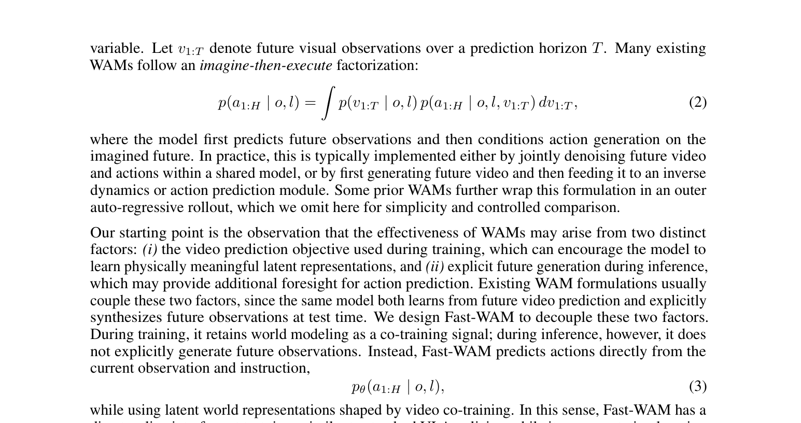

# Fast-WAM：无测试时未来想象的世界动作模型

## 基本信息

- **论文全名**：Fast-WAM: Do World Action Models Need Test-time Future Imagination?
- **作者**：Tianyuan Yuan、Zibin Dong、Yicheng Liu、Hang Zhao
- **作者单位**：清华大学交叉信息研究院（IIIS）、银河通用（Galaxea AI）
- **发表**：arXiv preprint 2603.16666v2，2026-03-23
- **论文链接**：https://arxiv.org/abs/2603.16666
- **项目页面**：https://yuantianyuan01.github.io/FastWAM/
- **代码**：论文未披露（frontmatter `code: null`）
- **核心问题**：世界动作模型（WAM）的性能收益，究竟来自**训练期视频建模**，还是**测试期显式未来想象**？
- **重要性评估**：★★★★☆（4/5）

## 一句话结论

Fast-WAM 通过四个受控变体证明：WAM 的价值**主要来自训练期的视频建模目标**（它塑造了视频 DiT 的世界表征），而**不是**测试期的显式未来生成。据此它把"视频预测作为训练目标"与"视频生成作为推理流程"解耦——训练时保留视频联合训练、推理时只做一次前向编码后直接输出动作，即可在**无任何具身预训练**的前提下打平最强 WAM 基线（RoboTwin 91.8%、LIBERO 97.6%），并把推理延迟压到 **190 ms**，比 imagine-then-execute 类 WAM 快 4 倍以上。

---

## 1. 研究背景与问题定义

### 1.1 研究问题

世界动作模型（World Action Models, WAMs）是近年具身控制领域对主流 VLA（Vision-Language-Action）模型的一类替代方案。VLA 模型把"视觉—语言—动作"压缩成一条直接策略 $p(a \mid o, l)$，从大规模视觉语言数据继承语义先验，但本质上是静态图像—文本建模，**不显式建模"物理世界在动作作用下的演化"**。WAM 的诱惑正在于此：它在预测动作的同时显式预测未来视觉观测，相当于让模型先"学会世界动力学"，再据此决策。

本文要回答的问题非常聚焦：在 WAM 中，**测试时是否真的需要显式"想象未来"？** 如果不需要，那么 WAM 那套昂贵的迭代去噪就可以整体省掉，其部署形态将大幅简化。

### 1.2 现有方法的瓶颈

当前绝大多数 WAM 遵循 imagine-then-execute（先想象后执行）范式。按对"未来视频"与"动作"两个 token 流的组织方式，可归为两类（对应论文 Figure 1 的 (A)(B)）：

- **(A) 联合建模（Joint-modeling）**：未来视频 token 与动作 token 在同一去噪过程中耦合生成，代表工作有 Motus、Unified World Models（UWM）、Cosmos Policy 等。
- **(B) 因果式（Causal / video-then-action）**：先生成未来视频观测，再用逆动力学模型（IDM）从未来表征取动作，代表工作有 LingBot-VA、Vidar、UniPi 等。

这两条路线的共同代价是：**测试时需要迭代去噪生成未来视频帧，推理延迟极高**（本文测得 Fast-WAM-IDM 达 810 ms、Joint 达 580 ms），严重妨碍在线实时控制。更根本的问题在于：过去一年关于 WAM 的工作都隐含了一个**未经检验的假设**——"显式生成未来是必要的"。因为现有 WAM 把"训练期视频预测目标"和"测试期未来生成"这两件事耦合在同一个模型里，任何单点结果都无法判断性能收益到底来自哪一个。

### 1.3 本文核心贡献

1. **提出 Fast-WAM**：训练期保留视频联合训练、推理期跳过未来预测，直接从世界表征单次前向生成动作的 WAM。
2. **严格受控消融**：在同一骨干、同一 tokenization、同一训练 recipe 下构建四个变体（Fast-WAM / Fast-WAM-Joint / Fast-WAM-IDM / Fast-WAM w.o. video co-train），把"训练期视频目标"与"测试期未来生成"两个因素拆开独立评估。
3. **给出清晰结论**：视频预测的主要价值在于改善**训练期的世界表征**，而非测试期生成未来观测；去掉视频联合训练造成的掉点，远大于"做不做未来想象"之间的差距。
4. **实践价值**：在无具身预训练下达到 SOTA 水平，推理延迟 190 ms，具备真实机器人实时部署的可行性。

> 图 1：三种 WAM 范式的对比。(A) 联合建模 WAM 同时去噪未来视频 token 与动作 token；(B) 因果式 WAM 先生成未来观测、再条件化动作预测；(C) Fast-WAM 保留训练期视频联合训练，但推理时移除显式未来生成，从潜在世界表征单次前向直接预测动作。这张图是全文立意的核心——(A)(B) 都把"未来生成"当作推理的必要环节，而 (C) 说明它只是可选的训练信号。  
> 来源：论文 Figure 1，https://arxiv.org/abs/2603.16666

---

## 2. 任务定义与输入输出

### 2.1 输入、输出与假设

Fast-WAM 承接标准的视觉运动策略（visuomotor policy）设定，输入输出与 VLA 模型完全一致：

- **输入**：
  - 当前视觉观测 $o$（RGB 图像；多相机时**拼接为单张图像**后送入 VAE）；
  - 语言任务指令 $l$（经预训练 T5 文本编码器编码）。
- **输出**：动作块（action chunk）$a_{1:H}$，动作视界 $H = 32$。
- **假设**：观测空间与动作空间的定义沿用所评测基准（RoboTwin 2.0 与 LIBERO）的设定；模型不接收任何历史观测序列之外的状态信息。

与 WAM 的关键差异在于中间变量的处理：标准视觉运动策略直接建模条件分布 $p(a_{1:H} \mid o, l)$；WAM 则显式引入未来视觉观测 $v_{1:T}$ 作为中间变量，采用 imagine-then-execute 分解：

$$p(a_{1:H} \mid o, l) = \int p(v_{1:T} \mid o, l)\, p(a_{1:H} \mid o, l, v_{1:T})\, dv_{1:T}$$

Fast-WAM 把这条链简化回直接策略形式：

$$p_\theta(a_{1:H} \mid o, l) = p_\theta(a_{1:H} \mid z(o, l))$$

其中 $z(o, l)$ 是视频骨干网络对当前观测—语言上下文做**一次前向编码**得到的隐式世界表征，**不是**通过显式去噪未来帧采样得到的。这句话是整个方法的技术支点：接口上退回 VLA，表征上仍是 WAM。

### 2.2 关键符号和目标函数

| 符号 | 含义 |
|------|------|
| $o, l$ | 当前观测、语言指令 |
| $a_{1:H}$ | 动作块，$H=32$ |
| $v_{1:T}$ / $z_{1:T}$ | 未来视频帧 / 其 latent（视频分支） |
| $z(o,l)$ | 视频骨干单次前向得到的隐式世界表征 |
| $f_\theta$ | 预测速度场（flow matching 的向量场） |
| $\lambda$ | 视频联合训练损失的权重（论文未披露具体数值） |

视频侧的时间处理：视频帧做 **4× 时间下采样**，每个 chunk 对应 **9 帧**（即 $T=9$）。这些细节决定了视频分支的 token 规模与显存占用，是理解"为什么未来生成贵、而单次编码便宜"的量化基础。

---

## 3. 核心方法

### 3.1 总体框架

Fast-WAM 的骨架是 **Wan2.2-5B** 视频扩散 Transformer（video DiT），并复用其预训练的 T5 文本编码器与视频 VAE。在视频骨干之上，作者加了一个 **1B 的 action expert DiT**，与视频分支共享注意力，构成 **Mixture-of-Transformer（MoT）** 双分支结构，整体约 **6B 参数**。action expert 与视频分支共享同一架构，仅把隐藏维度降到 $d_a = 1024$。

整体思路可一句话概括：**把"视频预测是训练目标"与"视频生成是推理流程"解耦**。训练时未来视频作为辅助监督信号，对视频 DiT 的表征施加"物理先验"的塑形压力；推理时未来视频分支彻底消失，视频 DiT 只对当前观测做一次前向编码，把世界表征喂给 action expert 生成动作。

### 3.2 关键模块一：token 分组与结构化注意力掩码

输入 token 被分成三组：

1. **第一帧的干净 latent token**：当前观测经 VAE 编码后得到的干净 latent，作为共享视觉锚点；
2. **未来帧的带噪 latent token**：训练时用于视频建模，推理时**彻底丢弃**；
3. **动作 token**：由 action expert 处理。

所有 token 组都通过 cross-attention 接收文本条件。解耦的关键是一张**结构化注意力掩码**（Figure 2(b)）：

- 未来带噪视频 token 在视频分支内**双向**互相关注，并可访问干净第一帧 token；
- 动作 token 在动作分支内**双向**互相关注，也可访问干净第一帧 token；
- **动作 token 不能关注未来视频 token**——这是防止"未来信息泄漏进动作分支"的硬约束；
- 干净第一帧 token 不关注任何其他 token。

这张掩码在数学上保证了：即便训练时未来帧与动作共享同一个前向，未来信息也**不可能**通过注意力直接流入动作分支；动作分支能"看到"的未来，只可能通过视频 DiT 编码出的、经由共享参数塑造的表征间接传递。这正是后续消融实验"干净"的前提。

> 图 2：Fast-WAM 的模型架构与注意力掩码。(a) 视频 DiT（Wan2.2-5B）与 action expert DiT（1B）组成 MoT 共享注意力双分支，三组 token 通过 cross-attention 接入文本条件；(b) 训练/推理掩码：动作 token 看不到未来视频 token，第一帧 token 不关注任何其他 token，推理时未来视频分支被整体移除。该图说明了"训练期视频目标"与"推理期未来生成"如何在同一个网络里被物理隔离。  
> 来源：论文 Figure 2，https://arxiv.org/abs/2603.16666

### 3.3 关键模块二：四个受控变体

为了解耦"训练期视频目标"与"测试期未来生成"两个因素，作者在**完全共享**骨干、tokenization 与训练 recipe 的前提下，只沿两个轴做修改，得到四个变体：

| 变体 | 训练期视频目标 | 推理期未来生成 | 类比范式 |
|------|:---:|:---:|------|
| **Fast-WAM**（主模型） | ✅ | ❌（单次前向） | 直接策略接口 |
| Fast-WAM-Joint | ✅ | ✅（联合去噪） | 图 1(A)：UniSim / Cosmos Policy / Motus |
| Fast-WAM-IDM | ✅ | ✅（先未来、再 IDM 取动作） | 图 1(B)：LingBot-VA / Vidar |
| Fast-WAM w.o. video co-train | ❌ | ❌ | 仅控制目标贡献 |

两两对比即可独立读出两个因素各自的贡献：

- **Fast-WAM vs. Joint/IDM**：控制"训练期视频目标"不变，只改变"推理期是否想象未来"，隔离出**未来想象**的收益；
- **Fast-WAM vs. w.o. video co-train**：控制"推理期无未来生成"不变，只改变"训练期是否有视频目标"，隔离出**视频联合训练**的收益。

这是本文实验设计的核心，也是结论可信度的来源——它避免了跨论文比较时骨干、数据、recipe 差异带来的混淆。

### 3.4 训练目标与损失函数

采用统一的 **flow matching（流匹配）** 目标，动作与未来视频 latent 共享同一套噪声插值与速度场预测。对目标 $y$（可以是动作 $a_{1:H}$ 或视频 latent $z_{1:T}$），先构造噪声插值样本：

$$y_t = (1-t)\,y + t\,\varepsilon,\qquad \varepsilon \sim \mathcal{N}(0, I),\quad t \in (0,1)$$

直观上，$t=0$ 时 $y_t$ 就是干净目标 $y$，$t=1$ 时退化为纯噪声 $\varepsilon$；模型学习的是一个从噪声到数据的**速度场**（velocity field）$(\varepsilon - y)$，而非直接预测噪声或数据。对应的 flow matching 损失为：

$$\mathcal{L}_{\mathrm{FM}}(y) = \mathbb{E}_{y,\varepsilon,t}\left[\left\|f_\theta(y_t, t, o, l) - (\varepsilon - y)\right\|_2^2\right]$$

其中 $f_\theta$ 是模型预测的速度场，$o, l$ 是观测与语言条件，$\|\cdot\|_2$ 为 L2 范数。两个具体目标分别为：

- **动作预测损失** $\mathcal{L}_{\mathrm{act}} = \mathcal{L}_{\mathrm{FM}}(a_{1:H})$；
- **视频联合训练损失** $\mathcal{L}_{\mathrm{vid}} = \mathcal{L}_{\mathrm{FM}}(z_{1:T})$，其中 $z_{1:T}$ 是未来视频帧的 latent。

总目标：

$$\mathcal{L} = \mathcal{L}_{\mathrm{act}} + \lambda\,\mathcal{L}_{\mathrm{vid}}$$

$\lambda$ 平衡动作学习与视频联合训练的权重（**论文未披露具体数值**）。时间步 $t$ 的采样使用 **logit-normal** 噪声调度，训练与推理一致。视频预测在此处扮演的角色是"辅助任务"：它不直接决定推理时的输出，而是通过对共享视频 DiT 参数施加梯度压力，把物理规律"压"进表征 $z(o,l)$。

### 3.5 推理流程与复杂度

推理时未来视频分支被整体移除，流程退化为三步：

1. 对当前观测 $o$ 经 VAE 编码，取第一帧干净 latent token；
2. 送入 video DiT **单次前向**，得到隐式世界表征 $z(o,l)$；
3. action expert 基于 $z(o,l)$ 去噪出动作块 $a_{1:H}$。

推理参数：**10 步去噪、CFG 缩放 = 1.0**（即无分类器引导），logit-normal 噪声调度。实测延迟 **190 ms**（推理 GPU 为 NVIDIA RTX 5090D V2 32GB）。作为对比，同框架下的 Fast-WAM-Joint 为 580 ms、Fast-WAM-IDM 为 810 ms——去掉显式未来生成带来 3~4 倍加速。复杂度上的本质差别在于：imagine-then-execute 需要为**整段未来视频 latent**（每 chunk 9 帧）执行完整的迭代去噪，而 Fast-WAM 只对**动作 token**（维度远小于视频 latent）做 10 步去噪，视频侧仅一次前向。

---

## 4. 数据集与实验设置

### 4.1 数据集与数据处理

- **RoboTwin 2.0**：双臂协调操作基准，50+ 任务。训练数据为 2,500 条干净场景演示 + 25,000 条重度场景随机化演示；训练 30k 步。评估在干净（Clean）与随机化（Rand.）两种设置下各测 100 次/任务。
- **LIBERO**：四个子套件 LIBERO-Spatial / Object / Goal / Long，每套件 500 条演示、10 个任务，共 40 任务；每套件训练 20k 步，评估为 40 任务 × 50 次 × 多随机种子共 2,000 次试验。
- **真实世界叠毛巾**：Galaxea R1 Lite 平台上的长程变形物体操作，60 小时遥操作数据，训练 30k 步；指标为平均成功率与平均完成时间。

数据处理要点：多相机图像**拼接为单张**后输入 VAE；视频帧 4× 时间下采样、每 chunk 9 帧；动作视界 $H=32$。

### 4.2 Baseline 与评价指标

对比对象覆盖两类：

- **VLA 强基线**：$\pi_0$、$\pi_{0.5}$、OpenVLA（LIBERO 中）；
- **WAM 强基线**：Motus、LingBot-VA（以及它们的 Wan2.2 变体，用于剥离"具身预训练"的影响）。

评价指标：仿真为**任务成功率**（%）；真实世界为**成功率 + 平均完成时间**；效率维度为**单次推理延迟**（ms）。是否使用具身预训练（embodied pretraining）被显式标注为表格一列，是本文公平性论证的关键维度。

### 4.3 实现细节

| 项目 | 配置 |
|------|------|
| 骨干 | Wan2.2-5B 视频 DiT + 预训练 T5 编码器 + 视频 VAE |
| action expert | 隐藏维度 $d_a=1024$，约 1B 参数 |
| 总参数 | 约 6B |
| 优化器 | AdamW |
| 学习率 | $1\times10^{-4}$ |
| 权重衰减 | 0.01 |
| 调度 | Cosine annealing |
| 精度 | 混合精度 |
| 梯度裁剪 | 1.0 |
| 噪声调度 | logit-normal |
| 推理 | 10 步去噪，CFG=1.0，RTX 5090D V2 32GB |
| 训练步数 | LIBERO 20k / RoboTwin 30k / 真实世界 30k |

两个关键"未披露"：**训练 batch size、训练 GPU 数量与型号均未披露**；$\lambda$ 的具体数值也未给出。Fast-WAM-IDM 特有细节：训练时对 GT 视频 token 以概率 $p=0.5$ 施加噪声增强（沿用 LingBot-VA 的做法，用于在"先未来后动作"的推理下稳定 IDM）。

---

## 5. 实验结果

### 5.1 主要定量结果

**RoboTwin 2.0（Table 1，成功率 %）**：

| 方法 | 具身预训练 | Clean | Rand. | 平均 |
|------|:---:|------:|------:|------:|
| $\pi_0$ | ✅ | 65.92 | 58.40 | 62.2 |
| $\pi_{0.5}$ | ✅ | 82.74 | 76.76 | 79.8 |
| Motus | ✅ | 88.66 | 87.02 | 87.8 |
| Motus (from Wan2.2) | ❌ | 77.56 | 77.00 | 77.3 |
| LingBot-VA | ✅ | 92.90 | 91.50 | 92.2 |
| LingBot-VA (from Wan2.2) | ❌ | 80.60 | – | 80.6 |
| **Fast-WAM (Ours)** | ❌ | **91.88** | **91.78** | **91.8** |
| Fast-WAM-Joint | ❌ | 90.84 | 90.32 | 90.6 |
| Fast-WAM-IDM | ❌ | 91.16 | 91.34 | 91.3 |
| Fast-WAM w.o. video co-train | ❌ | 82.76 | 84.80 | 83.8 |

**LIBERO（Table 2，成功率 %）**：

| 方法 | 具身预训练 | Spatial | Object | Goal | Long | 平均 |
|------|:---:|------:|------:|------:|------:|------:|
| OpenVLA | ✅ | 84.7 | 88.4 | 79.2 | 53.7 | 76.5 |
| $\pi_0$ | ✅ | 96.8 | 98.8 | 95.8 | 85.2 | 94.1 |
| $\pi_{0.5}$ | ✅ | 98.8 | 98.2 | 98.0 | 92.4 | 96.9 |
| LingBot-VA | ✅ | 98.5 | 99.6 | 97.2 | 98.5 | 98.5 |
| Motus | ✅ | 96.8 | 99.8 | 96.6 | 97.6 | 97.7 |
| **Fast-WAM (Ours)** | ❌ | **98.2** | **100.0** | **97.0** | **95.2** | **97.6** |
| Fast-WAM-Joint | ❌ | 99.6 | 99.4 | 98.2 | 96.8 | 98.5 |
| Fast-WAM-IDM | ❌ | 98.8 | 97.8 | 97.8 | 97.6 | 98.0 |
| Fast-WAM w.o. video co-train | ❌ | 89.2 | 99.2 | 95.4 | 90.0 | 93.5 |

这两张表**说明了三件事**：

1. **无需具身预训练即可打平 SOTA**。Fast-WAM 在 RoboTwin 上 91.8%，与最强 WAM 基线 LingBot-VA（92.2%）几乎打平，LIBERO 上 97.6% 与 Motus（97.7%）、LingBot-VA（98.5%）处于同一水平——而后者全都用了具身预训练。对比同源的 Wan2.2 变体（Motus from Wan2.2 仅 77.3%、LingBot-VA from Wan2.2 仅 80.6%），说明**通用视频预训练（Wan2.2-5B）+ 视频联合训练已经足够把"世界动力学"耦合进来**，具身预训练不是必要条件。
2. **三个带视频联合训练的变体高度接近**（RoboTwin 90.6~91.8%，LIBERO 97.6~98.5%）。无论是"联合去噪"还是"先想象再取动作"，相对 Fast-WAM 都没有明显收益——**推理时做不做未来想象，几乎不影响结果**。
3. **去掉视频联合训练掉点显著**：RoboTwin 91.8%→83.8%（−8 个百分点），LIBERO 97.6%→93.5%（−4.1 个百分点），其中 Spatial（98.2→89.2）与 Long（95.2→90.0）子集退化最明显。**训练期视频目标才是 WAM 收益的主要来源**。

### 5.2 定性结果

真实世界任务是 Galaxea R1 Lite 平台上的**长程叠毛巾**（可变形的软体物体，需要长视界规划与精确闭环）。Figure 3 展示的是任务场景，Figure 4 汇总了成功率、完成时间与延迟三个维度的结果。

> 图 3：真实世界长程叠毛巾任务在 Galaxea R1 Lite 平台上的执行场景。该任务选用可变形物体，比刚体抓取更依赖长程时序推理与持续闭环，是检验"世界表征是否真的有用"的合适探针。  
> 来源：论文 Figure 3，https://arxiv.org/abs/2603.16666

> 图 4：真实世界叠毛巾任务的结果。左图：成功率 vs. 平均完成时间（左上角更优）；右图：各变体的推理延迟对比。图中可见 Fast-WAM 的成功率与 $\pi_{0.5}$ 相当但延迟远低于 Joint/IDM；去掉视频联合训练的变体成功率骤降、完成时间最长。  
> 来源：论文 Figure 4，https://arxiv.org/abs/2603.16666

从 Figure 4 读出：

- **延迟**：Fast-WAM 190 ms，Fast-WAM-Joint 580 ms，Fast-WAM-IDM 810 ms——去掉显式未来生成带来 3~4 倍加速。
- **成功率**：Fast-WAM 与有预训练的 $\pi_{0.5}$ 相当（约 0.8）；Fast-WAM-IDM 成功率最高（约 0.9），但完成时间更长（约 180 s），说明"更充分的未来想象"在真实世界略有成功率优势，但要付出时间代价。
- **完成时间**：Fast-WAM 约 150 s，比 Joint/IDM 略快——实时性直接转化为任务完成效率。
- **去掉视频联合训练则崩溃**：成功率跌到约 0.1，完成时间最长。真实世界中视频目标的作用比仿真更突出。

### 5.3 消融实验

核心消融就是"移除视频联合训练"这一个动作，但在三个场景下结论一致：

| 场景 | Fast-WAM | w.o. video co-train | 掉点 |
|------|------:|------:|------:|
| RoboTwin 平均 | 91.8 | 83.8 | −8.0 |
| LIBERO 平均 | 97.6 | 93.5 | −4.1 |
| 真实世界成功率 | ~0.8 | ~0.1 | 崩溃 |

这个消融**说明了什么**：视频联合训练对表征的贡献，远大于"推理时是否显式生成未来"的贡献（后者在三个带视频变体间只造成 ≤1.2 个百分点的波动）。换言之，视频建模的**训练信号价值** >> 未来生成的**推理使用价值**。

### 5.4 泛化、效率与失败案例

**任务级方差（附录 Table 3 的逐任务数据）暴露了方法的不稳定面**：RoboTwin 的 "Open Microwave" 任务上，Fast-WAM 为 Clean 62 / Rand. 45，而 Fast-WAM-Joint 竟掉到 Clean 3 / Rand. 14——同一个联合去噪变体在部分任务上会出现灾难性塌缩，且塌缩位置因变体而异（如 "Press Stapler" 上 Joint 52/50 明显弱于 Fast-WAM 90/97，而 "Hanging Mug" 上 Joint 71/56 反而强于 Fast-WAM 58/62）。这说明**任务级性能高度依赖任务性质与变体的匹配关系**，平均数掩盖了相当可观的方差；也提示 Fast-WAM 在需要精确闭环的接触密集任务（微波炉、挂杯子）上仍是短板。

**效率维度是本文最硬的结论**：190 ms 的单次推理延迟已进入真实机器人实时控制区间，且这是"无分类器引导 + 单次视频前向"共同作用的结果。

**失败/退化案例**可归纳为三类：(1) 去掉视频联合训练后，LIBERO-Spatial（98.2→89.2）与真实世界叠毛巾（~0.8→~0.1）的大幅退化，说明空间关系推理与长程软体操作最依赖视频目标塑造的表征；(2) 联合去噪变体在 Open Microwave 上的塌缩，说明 imagine-then-execute 的"想象"可能引入噪声而非帮助；(3) 真实世界中 IDM 成功率最高但最慢，说明未来想象与效率之间存在明确 trade-off。

---

## 6. 与相关工作的关系

- **VLA 策略**（OpenVLA、$\pi_0$、$\pi_{0.5}$、RT-2、GR00T N1、RDT-1B、SmolVLA、DexVLA、Gemini Robotics、Galaxea G0）：从大规模视觉语言骨干继承语义先验，但基于静态图像—文本，不显式建模物理演化。Fast-WAM 保留了 VLA 的"直接策略"推理接口，却换用 WAM 式的视频目标驱动表征学习。
- **视频生成用于机器人控制**（UniPi、GR-1/GR-2、RoboDreamer、DreamGen、Vidar、Gen2Act）：把视频生成当作规划/表征工具，但多数仍把"生成"当作推理必经环节。
- **联合建模 WAM**（Motus、UWM、Cosmos Policy、RynnVLA-002、WorldVLA、FLARE、Act2Goal）：对应 Figure 1(A)。
- **视频-然后-动作 WAM**（LingBot-VA、Vidar、UniPi）：对应 Figure 1(B)。
- **最相关且最接近"去未来化"的工作**：**VPP**（Video Prediction Policy，从视频扩散模型提取预测性视觉表征去条件化策略）与 **UVA**（Unified Video Action Model，联合建模视频与动作但在测试时跳过视频解码以加速）。Fast-WAM 与 UVA 的差别在于：UVA 只是"跳过解码"这一工程优化，而 Fast-WAM 通过受控变体**第一次把训练期视频目标与测试期未来想象的系统性贡献分开量化**，从而把"要不要想象"从一个工程选择升级为一个可证伪的科学命题。

---

## 7. 局限与批判性评价

**论文明确/隐含承认的局限**：

- 论文没有独立的 Limitations 章节，仅在结论中指出未来方向是"研究更大规模预训练数据与模型扩展对该设计的影响"——即当前结论的**尺度鲁棒性未知**。
- 动作块生成仅在 $H=32$ 单步设定下评估，未讨论外层自回归 rollout、长程拼接中的误差累积与漂移问题。
- 真实世界实验仅"叠毛巾"一个任务，对其他长程任务（整理、备餐等）的泛化性未经检验。

**批判性评价（含个人判断）**：

- 本文最大的贡献是**实验设计而非新架构**：四个同源变体的受控对比，把"WAM 需要测试时想象"从行业默认假设变成了可证伪命题，证据强度显著高于再堆一个更强的未来生成器。（个人判断）这类"拆解共识"的工作通常不立刻产生 SOTA，但会重塑后续工作的设计空间——可预期"去掉视频目标"会成为后续 WAM 论文的标准 ablation。
- **未披露项削弱了可复现性**：$\lambda$ 数值、batch size、训练 GPU 规模均未给出，导致"视频联合训练"这一核心操作的具体配比无法直接复现。（个人判断）这尤其遗憾，因为本文的结论恰恰依赖 $\lambda$ 的合理选择；缺少它，读者无法判断"训练期视频目标"的收益在多大程度上来自权重调优。
- **"无需具身预训练"结论的边界**：作者声称无具身预训练打平 SOTA，但 Wan2.2-5B 本身是海量互联网视频预训练的产物，其"视频物理先验"其实已部分内化于权重中。（个人判断）更准确的说法应是"无需**具身**预训练，但依赖**通用视频**预训练"；对一个完全没有视频先验的小型骨干，结论未必成立。
- **任务级方差被平均数掩盖**：Open Microwave 等任务的变体间剧烈波动说明结论并非均匀成立，接触密集、闭环要求高的任务仍可能从未来想象中获益。
- 效率结论（190 ms）依赖无 CFG 与 10 步去噪，若后续为提升精度引入 CFG 或多步，加速红利会缩水。

---

## 8. 复现与实践建议

- **复现门槛**：核心是 Wan2.2-5B 视频 DiT + 1B action expert 的 MoT 双分支，约 6B 参数。训练步数不多（LIBERO 20k / RoboTwin 30k），但 6B 模型的混合精度训练仍需多卡显存；**训练 GPU 数量与 batch size 论文未披露**，实际复现需自行搜索配比。
- **数据需求**：RoboTwin 2.0 与 LIBERO 均为公开基准，数据可获取；真实世界部分需 60 小时遥操作，成本较高。相对而言，无具身预训练的设计显著降低了"先收集海量机器人轨迹"的前置门槛。
- **关键超参**：$\lambda$（视频损失权重）是决定"视频目标是否有效"的旋钮，但论文未给数值，**建议复现时对 $\lambda$ 做网格搜索**，这是本方法最敏感、也最缺信息的一环。（个人判断）
- **推理部署**：10 步去噪、CFG=1.0、单卡 RTX 5090D V2 即可 190 ms，部署形态简单，实时性可期；若在低端卡上部署，可进一步压缩视频 VAE 编码与动作去噪步数。
- **迁移价值**：Fast-WAM 的"训练期视频 + 推理期直接策略"范式不绑定 Wan2.2-5B，可套到任意视频 backbone 与任意动作头（不一定是 MoT）上；对想用"视频先验"但又被未来生成延迟劝退的团队，这是一条低成本的迁移路径。

---

## 9. 个人启发与后续问题

1. **"训练目标"与"推理流程"的分离是通用方法论**。Fast-WAM 用视频预测当训练信号、却不在推理时用它，这一思路可以推广到其他"昂贵的中间表示"——例如 3D 显式表征、物理仿真、语义地图等，都可能存在"训练有用、推理多余"的情形。（个人判断）
2. **表征红利 vs. 生成红利需要分别记账**。过去 WAM 论文常把"预测未来视频"当作整体卖点，很少区分它作为训练信号与作为推理产物两种角色。Fast-WAM 提供了一个干净的"记账"模板：固定骨干、固定 recipe，只改推理形态与训练目标，做 2×2 消融。
3. **后续值得追问的问题**：(a) 更大规模视频/机器人数据下，"训练期视频目标"的红利是增大、饱和还是反噬（多任务干扰）？(b) 是否存在需要"真想象"的任务族（如多步操作前必须推理中间状态）？(c) 视频目标与直接的动作预测目标能否用更轻的替代（如 JEPA 式的表征预测）实现同等塑形效果，从而彻底摆脱对视频 VAE/DiT 的依赖？（个人判断）

---

## 10. 材料来源

- **论文原文**：arXiv:2603.16666，https://arxiv.org/abs/2603.16666 （精读主来源，HTML 版 https://arxiv.org/html/2603.16666）
- **项目页面**：https://yuantianyuan01.github.io/FastWAM/
- **本地图片**：
  - `fig1_wam_paradigms.png` — 论文 Figure 1（三种 WAM 范式对比）；
  - `fig2_architecture.png` — 论文 Figure 2（架构与注意力掩码）；
  - `fig3_towel_folding.png` — 论文 Figure 3（真实世界叠毛巾任务场景）；
  - `fig4_real_world_results.png` — 论文 Figure 4（真实世界成功率/完成时间/延迟）。
- **数据/基准**：RoboTwin 2.0、LIBERO（公开基准）；真实世界数据为作者自采遥操作数据（未公开）。
- 注：本文基于 arXiv HTML 全文精读；`sources/paper.pdf` 与独立 `sources.md` 未在本目录单独建立，图片沿用既有相对路径。
