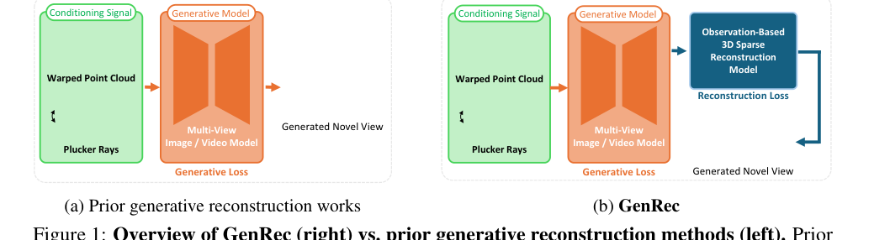
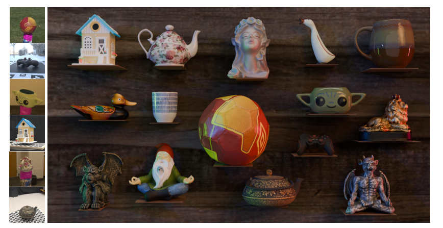
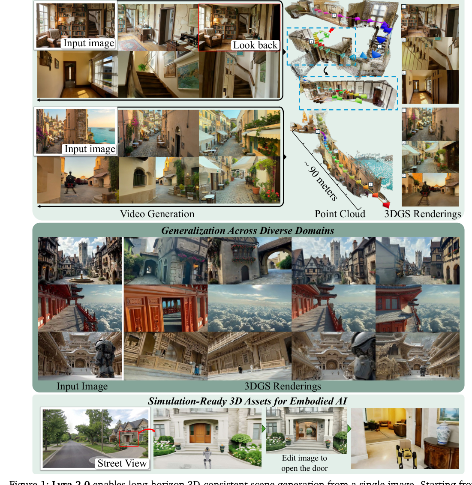
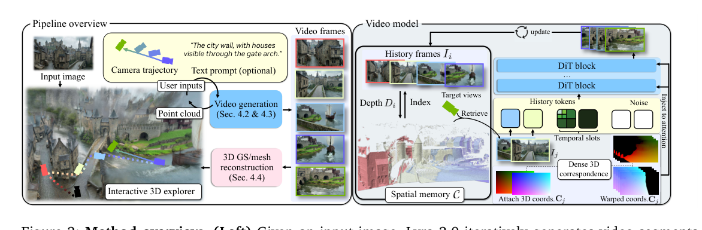
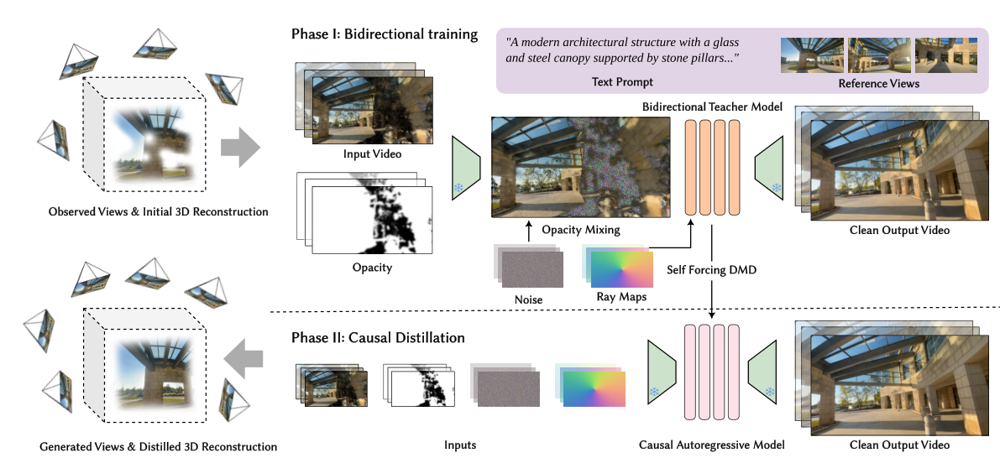
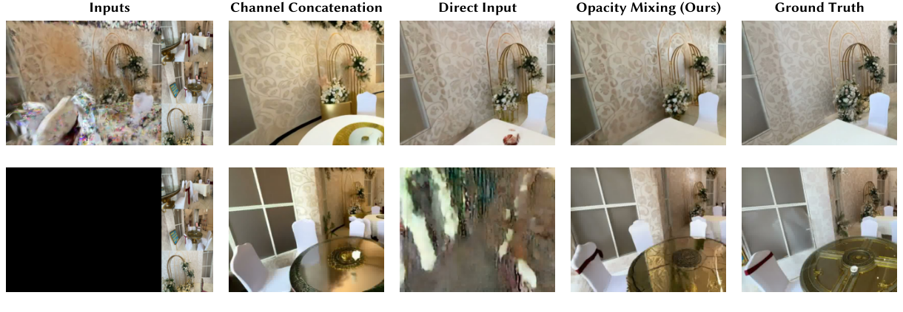

# 前馈式三维重建与生成式补全：领域分析报告

## 基本信息

**报告主题**：从「重建观测」到「补全未观测」——前馈式三维重建与生成式视图合成的范式演化

**覆盖范围**：2020.03（NeRF）— 2026.08（GenRec），重点为 2023.11 之后

**核心论文**：LSRM（arXiv 2604.05182）、Lyra 2.0（arXiv 2604.13036）、ArtiFixer（SIGGRAPH 2026）、GenRec（arXiv 2608.17832）

**撰写日期**：2026-08-20

**报告定位**：以「问题演化」为主轴梳理技术脉络，回答「为什么后面的工作会出现」，而非按方法罗列

---

## 1. 研究背景

### 1.1 问题的原始形态

给定一个物体或场景的若干张二维照片，恢复其三维结构，并能从任意新视角渲染出照片级真实的图像。这是计算机视觉的经典逆问题，传统解法是多视图几何：SfM 求相机位姿，MVS 求稠密深度，泊松重建出网格。

2020 年 NeRF 出现后，这个问题被重写为「优化一个可微渲染的神经场，使其渲染结果匹配输入照片」。2023 年 3D Gaussian Splatting 把表示从隐式 MLP 换成显式高斯基元，把渲染从体积采样换成光栅化 splatting，实现了实时渲染。

至此，观测充分时的重建基本被解决——只要拍了足够多、覆盖足够全、标定足够准的照片，NeRF 与 3DGS 能给出极高质量的结果。

### 1.2 真正的困难：三个「不够」

问题在于现实中永远做不到「足够」。领域真正的痛点集中在三处。

**视图不够（sparse view）**。只有 3 张、6 张、甚至 1 张照片。此时重建问题严重欠约束，出现 shape-radiance ambiguity——一个几何完全错误的表示，也能完美复现所有训练图像。

**覆盖不够（under-observed regions）**。即使拍了很多张，也总有没拍到的角落：遮挡后方、拍摄体积之外、朝下的桌面底部。一旦相机移到这些区域，NeRF 与 3DGS 只能依靠表示自身的平滑性外插，结果是浮点、空洞、鬼影。

**时间不够（per-scene optimization cost）**。每个场景都要从头优化几分钟到几小时，无法泛化，无法产品化。

### 1.3 两个「不够」引出两条相反的技术路线

这是理解整个领域最关键的一步。上述困难在方法层面分裂成两个目标截然相反的方向。

| | 路线 A：回归式前馈重建 | 路线 B：生成式补全 |
|---|---|---|
| 要解决 | 时间不够 + 视图不够 | 覆盖不够 |
| 核心诉求 | 一次前向把观测到的东西还原准 | 给没观测到的地方编出可信内容 |
| 数学性质 | 确定性回归，目标唯一 | 分布匹配，目标是一个后验分布 |
| 禁止行为 | 不许发明内容，发明即错误 | 必须发明内容，不发明就是空洞 |
| 评价指标 | PSNR / Chamfer Distance / 重光照误差 | FID / LPIPS / 人类主观质量 |
| 代表血脉 | LRM → GS-LRM → LIRM → LSRM | ReconFusion → CAT3D → Difix3D+ → ArtiFixer / Lyra 2.0 |

一个常见误解是把「前馈」当作范式标签。这个词只描述推理时是否需要 per-scene 优化，不描述模型在做什么。真正的分野是**允不允许模型编造内容**。

GenRec 论文的开篇图把这个分野画得最清楚：以往方法（左）无论像素是否被观测到，都用同一个生成损失监督；GenRec（右）额外引出一条基于观测的重建支路，两条通路既不共享参数也不共享梯度。

---

## 2. 问题的三次转移

回看六年，这个领域的核心问题被替换过三次。每次转移都不是因为上一个问题解决得完美，而是因为上一个问题的瓶颈转移到了别处。

### 2.1 转移一（2020 → 2023）：从「怎么表示」到「怎么加速」

核心问题是如何用神经网络表示并渲染三维场景。NeRF（2020）确立范式，Instant-NGP（2022）用哈希编码把训练压到秒级，3DGS（2023.08）用显式高斯与光栅化实现实时渲染。

结果是表示与渲染效率问题被基本关闭，3DGS 成为事实标准。新瓶颈随之暴露：per-scene 优化无法泛化，稀疏输入下崩溃。

### 2.2 转移二（2023 → 2025）：从「怎么加速」到「怎么泛化」

这次转移同时催生了两条路线，是本领域最重要的分水岭。

路线 A 的答案是把重建做成一个大模型。LRM（2023.11）第一次证明，用 5 亿参数的 transformer 在百万级三维物体上训练，可以做到单图 5 秒出 NeRF，完全不需要 per-scene 优化。这条路径迅速迭代出 GS-LRM、MeshLRM、LIRM。

路线 B 的答案是把二维大模型的先验搬进三维。ReconFusion（2023.12）第一次系统性地做这件事，用一个为新视角合成训练的扩散模型，在 NeRF 优化过程中对未观测视角施加 sample loss 正则。CAT3D（2024.05）进一步用多视图扩散一次生成大量视角再重建。

共同的新瓶颈是：路线 A 保真度追不上 dense-view 优化，且完全不会补全；路线 B 太慢（每步都要 query 扩散模型），且生成内容与已有场景不一致。

### 2.3 转移三（2025 → 2026，进行中）

这是当下正在发生的转移，也是理解 LSRM、ArtiFixer、Lyra 2.0、GenRec 的正确框架。问题被重新表述为：

> 当输入信息在物理上不足以确定答案时，如何让模型既尊重已有观测（保真），又在空白处产生合理内容（生成），并且知道这两者的边界在哪里？

这句话里的三个要求，正对应了 2026 年这批工作各自攻击的点。

---

## 3. 技术时间线

### 3.1 阶段零：奠基（2020 — 2023.08）

| 时间 | 工作 | 解决了什么 | 留下什么问题 |
|---|---|---|---|
| 2020.03 | NeRF (ECCV 2020) | 可微体渲染 + MLP 实现照片级新视角合成，确立神经渲染范式 | 训练与渲染都极慢 |
| 2022.01 | Instant-NGP | 多分辨率哈希编码，训练压缩到秒级 | 仍是 per-scene，稀疏视图崩溃 |
| 2023.08 | 3D Gaussian Splatting (SIGGRAPH 2023) | 显式高斯 + 光栅化，实时渲染且高质量，取代 NeRF 成为主流表示 | per-scene 优化，欠观测区产生浮点与空洞 |

这个阶段的定性结论是：观测充分时的重建问题被解决。所有后续工作都建立在「3DGS 在观测充分处已经足够好，问题在别处」这一前提上。

### 3.2 阶段一：两条路线分道扬镳（2023.11 — 2024.12）

路线 A：大重建模型。

| 时间 | 工作 | 解决了什么 | 关键设计 |
|---|---|---|---|
| 2023.11.08 | LRM (ICLR 2024)，Adobe / ANU | 首次证明前馈重建可行，单图 5 秒出 NeRF | 5 亿参数 transformer，triplane 表示，百万级物体训练 |
| 2024 | GS-LRM (ECCV 2024)，Adobe | 输出 3D 高斯，2-4 张 posed 图 0.23 秒 | 像素对齐高斯，可同时训物体与场景 |
| 2025.04 | LIRM (CVPR 2025)，Meta Reality Labs | 首个 1 秒内联合重建形状、材质、视角相关辐射场的前馈模型，输出可重光照资产 | 渐进式 update 模块；hexa-plane neural SDF；神经方向编码 |

这条路线在 2024 年末的状态是：速度问题彻底解决（亚秒级），但保真度仍明显落后于 dense-view 优化，尤其是精细纹理。而且它们完全不做补全，未观测区域就是模糊或错误。

路线 B：把扩散先验引入三维。

| 时间 | 工作 | 解决了什么 | 关键设计 |
|---|---|---|---|
| 2023.12 | ReconFusion (CVPR 2024)，Columbia / Google | 首次系统性用扩散先验正则化稀疏视图重建，3/9 视图下防止灾难性失败 | PixelNeRF 式特征 + 扩散模型，在随机新视角施加 sample loss，从不一致的单帧采样中蒸馏出一致三维 |
| 2024.05 | CAT3D (NeurIPS 2024 Oral)，Google DeepMind | 多视图扩散一次生成大量一致视角再重建，1 分钟训练 + 浏览器 60FPS | 多视图扩散，统一 text-to-3D / image-to-3D / few-view |

这条路线在 2024 年末的状态是：证明了生成先验确实能补全空洞，但代价高昂——多步扩散、每个优化步都要 query 模型、只能处理小规模物体级场景。

### 3.3 阶段二：效率与一致性的攻坚（2025）

这一年的主题是把生成先验的成本压下来，同时把相机可控与三维一致做扎实。

| 时间 | 工作 | 解决了什么 | 关键设计与代价 |
|---|---|---|---|
| 2025.03 | Difix3D+ (CVPR 2025)，NVIDIA Toronto AI | 把扩散成本从多步压到单步，首次实现神经增强器实时后处理，同一模型兼容 NeRF 与 3DGS | 核心洞察是神经渲染伪影的分布与扩散模型 t≈200 处的噪声图像分布高度相似，单步去噪即可去伪影而保语义。A100 上 76ms/帧，FID 相对基线降 60-70% |
| 2025.03 | GEN3C (CVPR 2025 Highlight)，NVIDIA | 用显式 3D cache 实现精确相机控制 | 把三维一致性从网络隐式学习变成显式几何约束。代价是 cache 渲染质量退化会直接拖累生成质量 |
| 2025.03 | VGGT (CVPR 2025 Best Paper)，Oxford VGG / Meta | 位姿、深度、点图、点轨迹一次前向全出，无需优化后处理 | 标准 transformer + 交替注意力（frame-wise / global），无 3D 归纳偏置。宣告几何基础模型时代到来 |
| 2025.09 | Lyra 1.0 (ICLR 2026)，NVIDIA SIL | 提出生成式重建范式，视频扩散模型自蒸馏，单图或单视频前馈生成 3D/4D 场景 | 用视频模型生成的虚拟拍摄喂给前馈重建 |
| 2025.11 | Depth Anything 3 (ICLR 2026 Oral)，ByteDance Seed | 几何估计被商品化，任意数量视图、有无位姿均可，位姿精度超 VGGT 35.7%，几何精度超 23.6% | 极简建模：单个 plain transformer（DINOv2 骨干）+ 单一 depth-ray 预测目标 |

2025 年最重要的隐性结论来自 DA3 论文：冻结骨干加一个简单 DPT 头预测高斯参数，就能打败 pixelSplat、MVSplat、DepthSplat 等专用前馈 3DGS 架构，而且 NVS 质量排名与几何质量排名完全一致。这句话的含义是——**专用 NVS 架构的时代结束了**，未来的提升来自更好的几何骨干。

### 3.4 阶段三：当下（2026）

2026 年这批工作，可以理解为对同一个矛盾给出的四种不同层面的解法，详见第 4 章。

---

## 4. 核心方法：四篇细读

### 4.1 LSRM（2026.04.06，Meta Reality Labs）

**要解决的问题**：前馈物体重建的精细纹理保真度始终追不上 dense-view 优化。

**核心命题**：这个差距的根源不是架构，而是上下文窗口太小。

下图是 LSRM 的效果总览：左侧为 6–18 张输入图像，右侧为单次前向生成的显式网格与纹理，并可进一步预测 BRDF 用于重光照。

| | LIRM（前 SOTA） | LSRM | 倍数 |
|---|---|---|---|
| object token | 约 14K（hexa-plane 48×48×6） | 约 300K | 20× |
| image token | 约 32K | 约 100K | 2× |
| 输入图像 | ≤8 | 12-18 | — |

为了 scale 上去，论文有三个工程贡献。

#### 4.1.1 Coarse-to-fine 稀疏残差管线

Stage 1 训 dense 低分辨率模型（体素 16³，解码 64³）；Stage 2 冻结它，只在 informative 区域预测高分辨率残差（体素 96³，解码 384³）。Informative token 选择上，图像侧丢背景 patch，体积侧用 Stage 1 的 SDF 只保留「贴近表面（|s| ≤ τ）或被表面穿过（SDF 变号）」的体素。

一个关键经验是预测残差远优于直接回归高分辨率体，且结构对齐使 Stage 2 可直接继承 Stage 1 权重。设计上故意「宁多不少」地保留表面附近体素，使 Stage 2 能修正 Stage 1 的几何错误。

#### 4.1.2 3D-aware spatial routing

这是本文最有洞察的部分。原生 NSA 靠 query 与压缩 KV 的 attention score 选块。作者观察到浅层 transformer 经常选不到空间上真正相关的块，误差会级联传播。

解法是放弃 attention score，改用显式几何距离——用已知相机参数把 query 的 3D 坐标投影到各图像平面，按真实欧氏距离选块。收益是 +0.36 至 +0.59 dB，定性上让原本糊掉的小号文字变可读、修复扭曲人脸。

#### 4.1.3 Block-aware 序列并行与 All-gather-KV

稀疏 tokenization 导致各样本活跃 token 数剧烈波动，产生 straggler GPU。早期方案用 reservoir sampling 截断 token，会丢掉多达三分之一的活跃 token 导致优化不稳定。

解法是以空间块为单位切分（同块 token 必在同一 GPU，保证 window attention 与 KV 压缩零跨卡通信），并利用 GQA 的高 KV 压缩率 all-gather KV 而 query 保持本地。

#### 4.1.4 结果与局限

定量结果（GSO 数据集 NVS）：

| Metric | Mesh-LRM | GS-LRM | LIRM | LSRM dense only | LSRM Full |
|---|---|---|---|---|---|
| PSNR ↑ | 28.13 | 30.52 | 30.65 | 28.45 | **33.08** |
| LPIPS ↓ | 0.093 | 0.050 | 0.054 | 0.079 | **0.028** |

三个最有说服力的对照：相比最强 baseline LIRM，PSNR +2.43 dB、LPIPS 降 48%；LSRM 用 8 张图（32.46dB）超过 LIRM 用 16 张图（30.56dB）近 2dB，且从未在少视图上 fine-tune；dense 阶段单独跑只有 28.45dB，还不如 GS-LRM，说明增益几乎全部来自扩大 context 而非骨干。此外 LSRM 8-16 视图的 PSNR 超过 64 视图的 3DGS。

逆渲染扩展上，ORB 的 LPIPS 达 0.022，追平并超过 SOTA 优化方法 NeuralPBIR（0.023）；Chamfer Distance 0.29 显著优于所有方法（LIRM 0.38，NeuralPBIR 0.43）。

成本是 128×H100 训 15 天，推理峰值 40GB 显存、约 5 秒每物体。局限明确写了：罐头上的小号配料表仍不可读；roughness 与 metallic 估计仍不准；albedo 全局偏移歧义会不成比例惩罚 PSNR。Future work 明确指向把这套框架扩展到大规模场景重建。

### 4.2 Lyra 2.0（2026.04.14，NVIDIA SIL）

**要解决的问题**：长程探索（走过几百帧后回头看）的两种退化。空间遗忘指早期帧掉出上下文窗口，回访时模型只能重新编造，全局布局崩坏；时间漂移指自回归误差累积，产生色偏、纹理抖动、几何扭曲。

下图展示了从单张输入图像出发生成可探索三维世界的完整能力：上半部分注意「Look back」标注——相机绕行后回望，场景保持一致；点云跨度达约 90 米。

#### 4.2.1 关键洞察：几何只做路由

这是四篇中思想最优雅的设计。以往做法（Gen3C 与 SPMem 路线）累积一个全局点云、渲染它当条件，这有误差放大问题——生成瑕疵污染几何，坏几何又污染后续生成。Lyra 2 的解法是把两件事切开：

> 3D 几何仅用于信息路由（决定检索哪些历史帧、建立哪些空间对应），外观合成完全交给扩散先验。

下图右半部分即为该机制：Spatial memory 存储 per-frame 深度与点云，用于检索目标视角可见的历史帧，并建立 Dense 3D correspondence 后注入 DiT 的注意力层。

三个具体设计都很讲究。

**per-frame 点云，绝不融合成全局点云**。因为深度是在生成帧而非真实图像上估的，越往后质量越差。融合就是把跨视图误配准累积成一个损坏的重建。

**几何感知检索**。把每个历史帧的降采样点云投到目标视角，逐像素取最小投影深度处理遮挡，深度差小于 δ 判定可见，可见点数即为该帧的可见性分数。训练时按分数比例采样使模型鲁棒；推理时贪心最大化覆盖，迭代选择覆盖最多「尚未覆盖目标像素」的帧，避免选一堆相邻冗余视角。效果是即使几百帧后回访，也能通过 3D 重叠自然召回。

**warp 规范坐标而非 RGB**。原文明确论证：warped RGB 必然带 disocclusion 空洞、拉伸伪影、深度边界渗色，若以此为条件，视频模型会倾向于重新生成这些伪影——「warped image 成了绕过生成先验的拐杖，而不是给它信息」。规范坐标携带同样的几何对应信息，却不含任何外观内容。

实现上为第 j 个检索帧赋予规范坐标图（三通道为 u、v、2j/(N_s−1)），前向 warp 后附加 warped depth 作第四通道，经位置编码与学习 MLP 聚合，加到每个 transformer block 的 self-attention token 上。

#### 4.2.2 self-augmentation 对抗漂移

根因是 observation bias：训练时条件是 ground-truth 历史，推理时条件是自己的不完美输出。解法是以概率 p 采样 t ~ U(0, 0.5)，按 flow matching schedule 给历史 latent 加噪，让模型一步去噪得到近似重建，用它替换干净历史作为条件，但监督目标仍是用干净历史编码的当前帧：

$$z^{hist}_t=(1-t)z^{hist}_0+t\epsilon$$

$$\tilde{z}^{hist}_0=z^{hist}_t-t\cdot v_\theta(z^{hist}_t,t,c)$$

这等于强迫模型学会从自己的劣化输出中恢复，而非传播错误。开销仅一次额外 DiT 前向，相比 Self-Forcing 需要 35 步去噪模拟，代价极低。

#### 4.2.3 结果与局限

三维场景生成结果（Tanks and Temples）：

| Method | LPIPS-P↓ | LPIPS-G↓ | FID↓ | Subj. Qual.↑ |
|---|---|---|---|---|
| GEN3C + DAv3 | 0.511 | 0.694 | 125.19 | 5.38 |
| CaM + DAv3 | 0.423 | 0.693 | 94.02 | 9.79 |
| SPMem + DAv3 | 0.412 | 0.666 | 94.11 | 9.95 |
| Ours + DAv3 | 0.409 | 0.648 | 79.36 | 14.42 |
| **Ours Full** | **0.372** | **0.629** | **72.47** | **18.80** |

消融中最值得注意的一条张力：

| 变体 | Subj. Qual.↑ | Style Consist.↑ | Camera Ctrl.↑ |
|---|---|---|---|
| 完整模型 | 43.35 | **85.07** | **63.87** |
| w/o Self-Augmentation | **47.88** | 77.98 | 53.92 |
| w/ Global Point Cloud | 44.58 | 82.42 | 49.86 |

去掉 self-augmentation 后单帧主观质量反而更好，但长程一致性大幅崩坏。这是典型的短期指标与长程目标冲突，也说明了为什么单看 PSNR 或 FID 会误判。

三维重建那一步用 Depth Anything v3 前馈预测 per-pixel 3DGS 属性，但做了两处改动：修改 Gaussian DPT 头输出 k×k 降采样特征图，把高斯数量减少 k²（原版每像素一个高斯，高分辨率下爆炸）；在自己生成的场景上 fine-tune，提升对生成数据中细微几何不一致的鲁棒性。

性能上全模型约 194 秒每 80 帧（单 GB200），DMD 4 步蒸馏版约 15 秒（13× 加速），per-frame 质量相当甚至略好，仅相机可控性略降。局限是仅静态场景不建模动态，且继承训练数据特性（DL3DV 的曝光变化会被复现，导致前馈 3DGS 重建出现伪影）。

### 4.3 ArtiFixer（2026.06，SIGGRAPH 2026，NVIDIA SIL × ETH Zürich）

**要解决的问题**：前人用生成先验修 3DGS 有两个短板。可扩展性上，图像扩散或双向视频模型单次能生成的视图数有限，需要昂贵的迭代蒸馏才能保证一致性；质量上，在完全未观测区域（输入像素全黑）会模式崩塌。

整体是两阶段管线：Phase I 用不透明度混合训练双向教师，Phase II 通过 Self-Forcing DMD 蒸馏成因果自回归模型。

#### 4.3.1 核心贡献一：opacity mixing

问题的本质是生成的起点选错了，而两种既有选择各有其死法。下图是最直观的证据——注意第二行左侧输入几乎全黑（完全未观测），Channel Concatenation 与 Direct Input 两种做法都明显崩坏，只有不透明度混合给出了合理结果。

| 起点策略 | 后果 | MipNeRF360 消融 |
|---|---|---|
| 纯高斯噪声 + 退化图通道拼接 | 语义对，但与已有内容显著不一致 | PSNR 14.52 / FID 87.55 |
| 直接从退化渲染起 | 一致性好，但空白区域源分布退化为零处的 Dirac 质量，模式崩塌 | PSNR 17.34 / FID 87.06 |
| 按不透明度混合（本文） | 两者兼得 | **PSNR 17.99 / FID 69.43** |

核心公式：

$$z_{mix}=O_z\cdot z_{deg}+(1-O_z)\cdot\epsilon$$

其中 $O_z$ 是渲染不透明度图经 max pooling 降到 latent 分辨率（max pooling 保证不丢失任何源信息）。不透明度为 1 处退化为原渲染保住一致性，为 0 处退化为标准高斯先验保住生成能力，中间连续插值。作者明确指出这与 blended diffusion 等 inpainting 方法概念相通，但用的是连续的不透明度信号而非二值掩码——这正是渲染管线天然产出的东西。

条件注入的工程细节上，Plücker 射线图与不透明度图都绕过 VAE（更高效，且在渲染全空时仍能控相机）：

$$T_r:=T_s+f_r(\text{PixelUnshuffle}(R))$$

$$T_o:=T_r+f_o(\text{PixelUnshuffle}(O))$$

其中 $f_r$、$f_o$、$V_n$ 全部零初始化以兼容预训练权重。

#### 4.3.2 核心贡献二：因果蒸馏

Phase I 训双向教师（Wan 2.1 T2V-14B，冻结 VAE 与文本编码器），Phase II 蒸馏成因果自回归模型。初始化上不用前人昂贵的 ODE 轨迹数据集协议，而是直接施加 block-causal mask 加 Diffusion Forcing 式逐帧不同噪声水平；自回归 rollout 用 Self-Forcing 式，通过 KV cache 条件于已生成 chunk；最后用 DMD 压到 4 步。

一个反直觉的发现是作者说不需要长视频训练。因为退化渲染与参考视图本身就是足够强的锚点，条件信号已足以抑制误差累积。所以只训 81 帧，推理时滚动 KV cache 即可泛化到任意长度，反而因为在同等算力下训了更多样的短视频而加速收敛。

#### 4.3.3 结果与局限

MipNeRF360 稀疏视图 PSNR：

| Method | 3-view | 6-view | 9-view |
|---|---|---|---|
| GenFusion | 15.29 | 17.16 | 18.36 |
| GSFixer | 15.61 | 17.27 | 18.63 |
| CAT3D | 16.62 | 17.72 | 18.67 |
| ArtiFixer | 17.06 | 18.64 | 19.96 |
| ArtiFixer3D | 17.29 | **18.95** | **20.24** |
| ArtiFixer3D+ | **17.51** | 18.95 | 20.16 |

DL3DV 新内容生成（大面积未观测）中，ArtiFixer 达 19.75dB，相比次优的 GenFusion（17.03）高 2.7dB。

速度上（单 GB300），Wan 2.1 T2V-14B 双向仅 0.12 FPS，ArtiFixer 14B 达 8.36 FPS（70× 加速），1.3B 变体达 34.38 FPS，ArtiFixer3D 以原生 3DGUT 速度渲染达 268 FPS。

三变体的取舍沿袭 Difix3D+ 的命名法：ArtiFixer 由自回归生成器直接出图最锐利；ArtiFixer3D 把输出蒸馏回 3DGS 最一致但略模糊；ArtiFixer3D+ 在 3D 表示上再跑一遍生成器做后处理，兼顾两者。

局限（原文 Appendix E）是仍显著慢于直接渲染神经表示；分块解码引入延迟对具身 AI 不利；14B 变体受骨干限制在 720p；偶尔糊掉细节与文字；条件缺失或高度退化时可能出现细微色偏。

### 4.4 GenRec（2026.08.18，ETH Zürich / KAIST / Google / Microsoft）

四篇中最新的，也是问题意识最清楚的。论文开篇的论断是：

> 稀疏输入的生成式新视角合成，很少是全重建或全生成：某个源视图能看见的像素有唯一正确值（仅受视角相关着色调制）；而遮挡处或采集体积之外的像素，容许一个合理补全的分布。既有方法用单一统一的 loss 混淆了这两种 regime，即使通过 warped 点云或投影深度注入了场景几何，仍然模糊了几何保真与创造性幻觉的界线。

解法是三层隔离，层层递进（架构对比见 1.3 节的图）。

#### 4.4.1 架构层

多视图 flow matching 骨干，联合去噪 RGB 与 scene coordinate map 两个共配准模态。起点是预训练 v-prediction latent diffusion，经 Diff2Flow 闭式重参数化转成 flow velocity；多视图化沿用 SpatialGen 的 block 扩展方式；两轴注意力扩展包括 cross-view attention（跨全部目标视图）与零初始化的 cross-modal attention（耦合同视图的 RGB 与 SC token，零初始化保证训练起点完整保留预训练先验）。

条件张量为「带噪潜变量 + Plücker ray map + 池化观测掩码 + 模态专属 warp 的 VAE 编码」，分别告诉网络「证据在哪」「证据是什么」「每像素对应哪条 3D 射线」。

像素空间 refinement 阶段的动机是 latent 生成模型经 VAE decoder 存在光度上限，对幻觉内容可接受，但在有证据约束处成为瓶颈。它包含两个组件：几何感知 decoder adapter（零初始化 1×1 skip 卷积把 warped 条件的 VAE 特征加性注入 decoder 每个 up-block 前，做法承自 img2img-turbo 与 Difix3D+，配合 LoRA）；稀疏 3D 重建分支（输出残差，仅在观测像素上加回）。后者用解码出的 SC 预计算每个目标像素的 K 个几何最近源像素，把 attention 限制在该固定邻域避免二次复杂度，并在 attention logits 中加入几何距离先验；第二块做 cross-target attention 跨其他目标视图检索几何近邻，解决 per-view refinement 在不同帧观察同一表面时的不一致。

#### 4.4.2 监督层：掩码门控

观测掩码由「单目深度（DA3）+ 前向 warp」预计算得到（软掩码非二值）。unobserved 区域只受 flow matching 的分布匹配监督；observed 区域额外获得 masked ℓ1 与 LPIPS 的回归感知监督。并用 masked stop-gradient 防止 adapter 在 disoccluded 区域漂移：

$$\tilde{Y}=O\odot Y+(1-O)\odot\text{sg}(Y)$$

#### 4.4.3 梯度层：完全解耦

两阶段训练，Phase 1 只训骨干，Phase 2 冻结骨干只训 decoder adapter 与重建分支，输入是骨干的 detached 输出。Phase 2 的梯度根本到不了骨干参数。

还有一个训练细节值得注意（iterative-denoising supervision）：不用「在 noise-data 直线上采样再喂给 refinement」的朴素做法，因为那与推理时多步 Euler 轨迹的累积误差分布不匹配；而是从纯噪声真实积分 flow 到时刻 t 再监督。

#### 4.4.4 结果与局限

定量结果（RealEstate10K 单视图外插）：

| Method | G-PSNR↑ | G-FID↓ | Obs-PSNR↑ | Unobs-PSNR↑ | Inf. Time |
|---|---|---|---|---|---|
| SEVA | 13.50 | 41.64 | 15.97 | 12.40 | ~20s |
| LVSM | 13.81 | 57.89 | 16.32 | 12.61 | ~1s |
| GEN3C | 15.24 | 35.68 | 18.13 | 13.63 | ~1200s |
| **GenRec** | **17.05** | **33.09** | **20.85** | **14.18** | ~11s |

相比 Gen3C，Global +1.81dB，Observed +2.72dB，Unobserved +0.55dB，FID 降 2.59，速度约 109× 快。注意分区指标才看得出增益高度集中在观测区域，这正是它的设计意图。

两个消融结论最有价值：

| Row | Rec. 分支 | Gate | 梯度回传 | G-PSNR↑ | G-FID↓ |
|---|---|---|---|---|---|
| (a) | ✗ | ✓ | – | 16.51 | 36.84 |
| (b) | ✓ | ✗ | ✗ | 16.97 | 40.43 |
| (c) | ✓ | ✓ | ✓ | 16.99 | 34.92 |
| **(d) 完整** | ✓ | ✓ | ✗ | **17.05** | **33.09** |

(b) 对比 (d)，去掉 mask gating 使 FID 恶化 7.34，尽管 (b) 容量更高。(c) 对比 (d)，允许重建梯度回传骨干的 (c) 在所有指标上都不如完全隔离的 (d)，即使 (c) 可训练参数更多，说明额外的回归梯度既没改善重建也没改善生成。

一个漂亮的泛化性是训练时最多只见 2 个输入视图，4 与 6 视图是 zero-shot：

| 视图数 | Gen3C | GenRec | 差距 |
|---|---|---|---|
| 2 | 15.70 | **19.80** | +4.10 |
| 4 | 20.80 | **23.68**（OOD） | +2.88 |
| 6 | 20.86 | **24.07**（OOD） | +3.21 |

趋势比幅度更有意义：4 到 6 视图 GenRec 还能涨 0.39dB，Gen3C 只涨 0.06 已饱和。原因是更多源视图提高每帧的 observed 占比，正是重建分支的用武之地；而 warp-as-target 形式一旦 cache 覆盖目标就停止受益。

局限是质量上界受单目深度前端约束；受算力与双模态性质叠加限制，目前只能在每场景有限视图数上训练，但这是预算限制而非架构限制——架构对源视图数是线性复杂度。

---

## 5. 四条路线横向对比

| 维度 | LSRM | ArtiFixer | Lyra 2.0 | GenRec |
|---|---|---|---|---|
| 时间 / 机构 | 2026.04 Meta | 2026.06 NVIDIA×ETH | 2026.04 NVIDIA | 2026.08 ETH×Google |
| 输入 | posed 稀疏图 + mask | 已有 3DGS 渲染 + 参考视图 | 单图 + 相机轨迹 | 1-2 张 unposed 图 |
| 是否要位姿 | **要**（前提条件） | 要（渲染自带） | 不要（轨迹用户给） | **不要**（DA3 估计） |
| 规模 | 物体级 | 场景级 | 大规模可探索场景 | 场景级 |
| 自己产 3D 吗 | 是（稀疏体素 + SDF） | **不**（3DGS 的插件） | 是（前馈 3DGS + mesh） | 部分（SC map 当模态） |
| 核心矛盾解法 | 不涉及（纯回归） | 噪声起点连续插值 | 信息通道分工 | 监督与梯度硬隔离 |
| 生成骨干 | 无（DINOv3 冻结特征） | Wan 2.1-14B | Wan 2.1-14B | LDM + Diff2Flow |
| 主要增益 | +2.43dB PSNR | +2.7dB / 70× 快 | 800+ 帧一致 | Obs +2.72dB / 109× 快 |
| 可重光照 | **是（BRDF）** | 否 | 否 | 否 |
| 训练成本 | 128×H100 × 15 天 | 128×H100 约 15k GPU·h | — | — |
| 最大局限 | 只做单物体、要 posed | 720p 上限、仍慢于直接渲染 | 仅静态场景 | 受深度前端上界约束 |

一句话区分：LSRM 回答「这个东西真实长什么样」；ArtiFixer 回答「这块烂了怎么补」；Lyra 2.0 回答「这个世界继续走下去会是什么样」；GenRec 回答「哪块该忠实、哪块该编」。

---

## 6. 当前正在攻坚的六个问题

基于四篇论文的 limitations 与 future work，以及横向对比暴露的空白，按重要性排序。

### 6.1 保真与生成的最优配平机制

这是全领域正在收敛的同一个矛盾，2026 年出现了三种不同层面的解法，且它们互不冲突。

| 解法层面 | 代表 | 机制 |
|---|---|---|
| 噪声起点 | ArtiFixer | opacity mixing，按不透明度在渲染与噪声间连续插值 |
| 监督与梯度 | GenRec | mask gating 加两阶段梯度隔离 |
| 信息通道 | Lyra 2.0 | 几何只路由不画像素 |

开放问题是三者能否叠加。理论上可以——opacity mixing 作用于扩散起点，mask gating 作用于 loss，几何路由作用于条件通道，是三个正交的设计空间。但目前没有任何工作尝试组合，这是个明显的空白。

### 6.2 物体级与场景级的鸿沟

这是最值得盯的方向。LSRM 这条线能出 BRDF、可重光照、能进图形管线，但只做单物体且必须 posed 输入；场景级那条线可探索、感知质量高，但拿不出可重光照资产，几何精度也够不上生产要求。

LSRM 的 future work 明确写了要扩到大场景，但难点是实质性的：物体级可以假设 bounding sphere 归一化，场景级没有这个先验；物体级 informative token 选择靠前景 mask，场景级没有前景背景之分；场景级必然遇到未观测区域，而 LSRM 这条线在设计上不做补全。

换个说法：路线 A 扩到场景级，就必然要面对路线 B 的问题；而路线 B 想产出生产级资产，就必然要面对路线 A 的精度要求。两条线的合流是迟早的事，而目前还没有人做成。

### 6.3 长程一致性与单帧质量的张力

Lyra 2.0 的消融暴露了一个残酷的事实：去掉 self-augmentation 后单帧主观质量更好（47.88 对 43.35），但 Style Consistency 从 85.07 崩到 77.98。也就是说当前的训练目标在「每帧好看」和「整体一致」之间存在真实的取舍，self-augmentation 是用牺牲单帧质量换长程稳定。这个 trade-off 有没有帕累托改进的余地，是开放问题。

同类张力也出现在 ArtiFixer 的三变体上：最锐利、最一致、折中三者不可兼得，本质上是同一个矛盾在推理阶段的显现。

### 6.4 几何前端的精度上界

GenRec 的 limitation 直白写了质量上界受单目深度前端约束。Lyra 2.0 也承认深度在生成帧上估会随时间退化，这正是它坚持 per-frame 点云而不融合的原因。

这意味着整个领域现在有一个共享的上游依赖：DA3、VGGT、MapAnything 这一层的精度，直接决定了下游一堆方法的天花板。DA3 的一个发现让这件事更突出——NVS 质量排名与几何质量排名完全一致，说明下游提升可以简单地通过换更好的几何骨干获得。好处是路径清晰，坏处是大家都被同一个瓶颈卡住。

### 6.5 效率：从「可交互」到「真正实时」

| Method | 速度 | 状态 |
|---|---|---|
| Wan 2.1-14B 双向 | 0.12 FPS | 不可用 |
| ArtiFixer 14B | 8.36 FPS | 勉强可交互 |
| ArtiFixer 1.3B | 34.38 FPS | 可交互 |
| ArtiFixer3D（纯 3DGS 渲染） | 268 FPS | 真正实时 |

ArtiFixer 自己的 limitation 说得很清楚：仍显著慢于直接渲染神经表示，分块解码引入的延迟对具身 AI 不利。它列的 future work 是进一步减少去噪步数、实现单帧解码同时保持时序一致、用视频超分补上分辨率差距。

这里有个结构性矛盾：ArtiFixer3D 能跑 268 FPS 但略微模糊，直接用生成器最锐利但只有 8 FPS。「实时」和「最高质量」目前是两个不同的变体，而非同一个模型。

### 6.6 逆渲染的 ill-posed 残余

LSRM 虽然在 LPIPS 与 Chamfer Distance 上追平并超过了 SOTA 优化方法，但明确承认 roughness 与 metallic 的准确估计仍不理想；albedo、roughness、metallic 存在全局偏移歧义，会不成比例地惩罚 PSNR（这解释了为何它 PSNR 提升温和而 LPIPS 提升显著）；极精细细节仍不可读。

这是个物理上的 ill-posed 问题，不是靠 scale 就能解决的——单从 RGB 观测，材质与光照的分解本身就有歧义。

---

## 7. 评测体系的分裂：一个成熟标志

全局平均 PSNR 已经不足以区分这批方法了。原因很简单：当一个方法在未观测区域编得很好看时，PSNR 会因为编的内容与 ground truth 不同而下降；而一个保守地输出模糊平均值的方法，PSNR 反而更高。单一指标无法区分「修得准」和「编得好看」。

于是 2026 年这批工作各自引入了新的评测维度。

| 工作 | 新增评测方式 | 想测什么 |
|---|---|---|
| GenRec | observed / unobserved 分区报告 PSNR 与 SSIM | 分离重建保真与生成质量 |
| GenRec | 掩码统一采用 Gen3C 的 forward-warping | 保证跨方法可比 |
| Lyra 2.0 | WorldScore 的 Style Consistency（首末帧漂移） | 长程视觉漂移 |
| Lyra 2.0 | WorldScore 的 Camera Controllability | 相机位姿精度 |
| Lyra 2.0 | SLAM 估深的重投影误差 | 生成视频的 3D 一致性 |
| Lyra 2.0 | LPIPS-P（渲染对生成视频）与 LPIPS-G（渲染对 GT） | 分离视频本身的 3D 一致性与重建质量 |
| ArtiFixer | MEt3R + MASt3R 深度重投影 / RAFT 光流 | 多视图一致性 |
| LSRM | Chamfer Distance + normal / depth 误差 | 几何精度而非仅外观 |

这个分裂说明领域已经承认「重建」和「生成」是两个需要分开衡量的目标。GenRec 的分区指标尤其重要，它让「增益来自哪里」这个问题第一次可以被定量回答。一个领域开始认真设计评测指标，通常意味着它已经过了「随便涨点就能发论文」的阶段。

---

## 8. 局限与评价

### 8.1 已经确立的五个事实

位姿估计被商品化了。DA3 位姿精度超 VGGT 35.7%、几何精度 23.6%，且开源。「需要 COLMAP 跑几小时」不再是前提。

专用 NVS 架构的时代结束了。DA3 论文证明冻结几何骨干加简单 DPT 头就能打败 pixelSplat、MVSplat、DepthSplat，且 NVS 排名与几何排名完全一致。未来的提升来自更好的几何骨干，不是更精巧的 epipolar 或 cost volume 设计。

per-scene 优化在稀疏输入场景下被前馈加生成先验取代。MipNeRF360 3-view 上 3DGS 只有 13.06dB，ArtiFixer3D+ 达 17.51dB。

「蒸馏成少步或自回归」已成标配。Difix 单步、ArtiFixer 4 步 DMD、Lyra 2 4 步 DMD。可交互帧率不再是研究之后的工程问题，而是论文的核心贡献之一。

评测从单一 PSNR 分裂成保真与生成两套。

### 8.2 尚未解决的三个结构性问题

物体级（可重光照、高精度、要 posed）与场景级（可探索、感知好、不可重光照）之间没有桥；保真与生成的配平有三种解法但无人尝试组合；质量与实时性目前是两个不同的模型变体而非同一个。

### 8.3 接下来可能发生什么

短期内可预期的是：三种配平机制的组合工作出现（opacity mixing 加 mask gating 是最自然的组合）；更多工作直接把 DA3 当默认前端，几何前端的选择不再是论文的贡献点；ArtiFixer 式的因果自回归加 DMD 蒸馏成为生成式补全的标准配方；分区评测成为审稿人期待的标配。

中期值得盯的方向包括：LSRM 扩到场景级（作者已明确写在 future work），这是两条路线合流的最可能路径；动态场景（Lyra 2.0 的第一条 limitation 就是仅静态，而 Gen3C 已能处理单目动态视频，L4GM 已做过 4D LRM，材料是齐的）；具身 AI 的实际需求驱动（Lyra 2.0 已导出到 Isaac Sim，下游需求会反过来定义什么叫足够好）。

一个被低估的问题是光度一致性。目前所有生成式方法的光度一致性都是靠训练数据碰运气。Lyra 2.0 直言 DL3DV 数据集的曝光变化会被模型复现，进而导致前馈 3DGS 重建出现伪影。它建议的解法是在网络内处理光度稳定性，或用游戏引擎生成光度一致的合成数据。这是个不起眼但会卡住产品化的问题。

### 8.4 一句话总览

这个领域正在从「如何把观测到的东西重建准」转向「如何在观测不足时可信地补全」。这个转向的技术后果是三重的：位姿估计被基础模型吃掉、per-scene 优化被前馈加生成先验取代、评测从单一 PSNR 分裂成保真与生成两套指标。LSRM、ArtiFixer、Lyra 2.0、GenRec 分别站在这个转向上的四个不同位置——它们看起来相似，是因为共享同一个时代背景，而不是共享同一套方法。

---

## 9. 关键文献索引

### 9.1 细读的四篇（2026）

| 工作 | 出处与作者 | 链接 |
|---|---|---|
| LSRM: High-Fidelity Object-Centric Reconstruction via Scaled Context Windows | arXiv 2604.05182（v1 2026.04.06 / v3 2026.07.22），Zhengqin Li, Cheng Zhang, Jakob Engel, Zhao Dong（Meta Reality Labs） | https://arxiv.org/abs/2604.05182 |
| Lyra 2.0: Explorable Generative 3D Worlds | arXiv 2604.13036（2026.04.14），Tianchang Shen, Sherwin Bahmani 等（NVIDIA SIL） | https://arxiv.org/abs/2604.13036 |
| ArtiFixer: Enhancing and Extending 3D Reconstruction with Auto-Regressive Diffusion Models | SIGGRAPH 2026，Riccardo de Lutio, Tobias Fischer, Haithem Turki 等（NVIDIA × ETH Zürich） | https://research.nvidia.com/labs/sil/projects/artifixer/ |
| GenRec: Knowing Where to Reconstruct and Where to Generate | arXiv 2608.17832（2026.08.18），Ata Çelen, Jaewoo Jung, Daniel Barath 等（ETH Zürich / KAIST / Google / Microsoft） | https://arxiv.org/abs/2608.17832 |

### 9.2 直接前置工作

| 工作 | 时间 / 出处 | 在本脉络中的角色 |
|---|---|---|
| NeRF | 2020.03 / ECCV 2020 | 范式奠基 |
| Instant-NGP | 2022.01 / SIGGRAPH 2022 | 训练加速 |
| 3D Gaussian Splatting | 2023.08 / SIGGRAPH 2023 | 事实标准表示 |
| LRM | 2023.11.08 / ICLR 2024 | 路线 A 起点 |
| ReconFusion | 2023.12 / CVPR 2024 | 路线 B 起点 |
| GS-LRM | 2024 / ECCV 2024 | 前馈输出高斯 |
| CAT3D | 2024.05 / NeurIPS 2024 Oral | 多视图扩散 |
| VGGT | 2025.03 / CVPR 2025 Best Paper | 几何基础模型时代开启 |
| Difix3D+ | 2025.03 / CVPR 2025 | 单步扩散修伪影，ArtiFixer 直接前身 |
| GEN3C | 2025.03 / CVPR 2025 Highlight | 3D cache 相机控制，主要对比基线 |
| LIRM | 2025.04 / CVPR 2025 | LSRM 的直接前身（同作者） |
| Lyra 1.0 | 2025.09 / ICLR 2026 | 生成式重建范式 |
| Depth Anything 3 | 2025.11 / ICLR 2026 Oral | GenRec 前端 + Lyra2 重建器，共享上游 |
| SpatialGen | 2025.08 / 3DV 2026 | GenRec 的 VAE 与多视图化方案来源 |
| Wan 2.1 T2V | 2025 | ArtiFixer 与 Lyra 2.0 共同骨干 |

### 9.3 关键技术组件溯源

| 组件 | 来源 | 被谁用 |
|---|---|---|
| Native Sparse Attention | DeepSeek NSA / native-sparse-attention-triton | LSRM |
| 空间块划分 | Direct3D-S2 | LSRM |
| DMD | Yin et al. 2024 | ArtiFixer, Lyra 2.0 |
| Self-Forcing | Huang et al. 2025 | ArtiFixer（完整采用）, Lyra 2.0（轻量替代） |
| Diffusion Forcing | Chen et al. 2025 | ArtiFixer（因果初始化） |
| FramePack | — | Lyra 2.0（时间槽压缩） |
| Diff2Flow | Schusterbauer et al. CVPR 2025 | GenRec（v-pred 转 flow） |
| Plücker ray 编码 | — | 全部四篇 |
| 零初始化 skip / LoRA 注入 | img2img-turbo, Difix3D+ | GenRec |

---

*本报告基于四篇论文全文（含附录）、项目页与相关前置文献的细读整理，定量数字均取自原论文表格。文中插图裁剪自各论文原文。*
