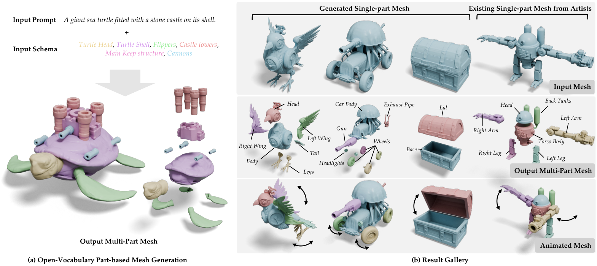
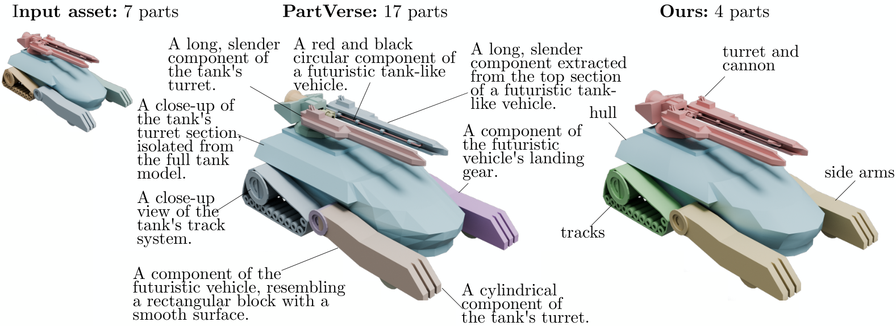
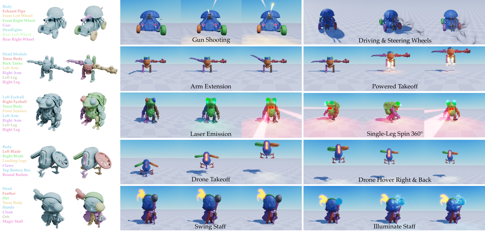

**一句话判断：** CubePart 把“3D 生成”往“游戏引擎可直接使用的结构化资产生成”推进了一步。它不是只生成一个整体 mesh，而是允许用户在推理时用自然语言 schema 明确指定要拆成哪些零件、每个零件叫什么，再直接输出可挂脚本的多部件网格。

## 1. 背景

这篇文章解读的是 Roblox Foundation AI Team 联合 Carnegie Mellon University 与 Stanford University 的论文 **CubePart: An Open-Vocabulary Part-Controllable 3D Generator**，arXiv 于 2026-05-27 上线，SIGGRAPH 2026 收录。

文章聚焦一个很实际的落地问题：现有 3D 生成模型通常输出单体网格，或者输出不可控的任意分块，难以直接对齐游戏引擎、仿真系统和动画脚本所需要的**语义零件结构**。例如赛车需要独立轮子、机器人需要可单独控制的手臂、宝箱需要可开合的盖子，这些都依赖明确的 part schema。

**为什么值得关注：**

- 它解决的不是“再把几何质量做高一点”的边际改进，而是 3D 资产从“能生成”到“能直接用”的接口问题。
- 它把 part schema 作为显式控制信号，第一次把**开放词汇零件控制**带入 3D 生成。
- 它同时做了模型和数据：不仅提出两阶段生成架构，还构建了 **462K 资产、约 202 万零件** 的开放词汇部件数据引擎。

**重要性评估：** ★★★★☆（4/5）



## 2. 目标

从论文与文章的共同主线看，CubePart 的目标可以概括为 3 点：

1. **开放词汇部件控制**：允许用户在推理时写任意零件名，而不是被固定词表约束。
2. **生成可用的多部件网格**：输出的每个 part 都是独立且结构完整的 mesh，而不是仅做语义分割标签。
3. **直接服务下游交互逻辑**：生成结果可以直接对接游戏引擎中的动画、物理和脚本行为，减少人工拆模与重命名。

更具体地说，CubePart 希望解决这样一个 I/O 约束问题：

- **输入侧**不只是一个全局文本 prompt，还包括一份由用户定义的 schema。
- **输出侧**不只是“长得像”的 3D 对象，而是“结构上符合下游控制逻辑”的多部件对象。

## 3. 进展

### 3.1 文章主线 / 论文线索

**主论文：** [CubePart: An Open-Vocabulary Part-Controllable 3D Generator](https://arxiv.org/abs/2605.28763)

**相关资源：**

- [项目主页](https://cubepart.github.io/)
- [GitHub Repo](https://github.com/Roblox/cube/tree/main/cubepart)
- [Hugging Face 模型](https://huggingface.co/Roblox/cubepart)
- [在线 Demo](https://huggingface.co/spaces/Roblox/cubepart-demo)
- [微信公众号原文](https://mp.weixin.qq.com/s/YvscqEVimQEWDp1_p1N2Sg)

文章把工作拆成两条主线来讲：

- **模型主线**：如何让生成模型既看到全局形状，又能按 schema 拆出语义一致、边界尽量清楚的多个 part。
- **数据主线**：如何构建足够大、足够干净、支持开放词汇的 part-labeled 3D 数据集，让模型真正学会“任意零件命名”。

### 3.2 Pipeline / Architecture + I/O 数据流

**整体 Pipeline：**

1. **输入定义**
    1. 全局文本描述：例如 `a jellyfish-themed race car`
    2. 用户定义的零件 schema：例如 `car body, front left wheel, front right wheel, rear left wheel, rear right wheel, gun, headlights`
2. **Stage 1：整体形状生成**
    1. 基于 `vecset diffusion` 的扩散框架。
    2. 以 MM-DiT 作为多模态扩散 Transformer 核心。
    3. 文本编码使用精简版 Qwen-VL。
    4. 做 `schema-aware finetuning`：把 part schema 拼进 prompt，让模型在整体形状 latent 中预留并对齐各个零件的几何位置。
3. **Stage 2：从整体 latent 解耦出多个零件 latent**
    1. 以上一阶段的整体 latent 作为全局上下文。
    2. 为每个 schema element 生成一个独立 part latent。
    3. 通过 **Cross-Part Attention Residual Block** 在 part latent 之间交换上下文，减少零件间重叠、缺失和边界错乱。
4. **解码与输出**
    1. 每个 part latent 单独解码为 mesh。
    2. 最终输出为一组可组装成完整对象的多网格结构，每个网格与 schema 中一个 part name 对齐。

**I/O 数据流可总结为：**

- **输入 I：** 自然语言对象描述
- **输入 II：** 开放词汇 part schema
- **中间表示 I：** 整体对象 shape latent
- **中间表示 II：** 每个零件的 part latent + 跨零件注意力交互
- **输出：** 一组语义可控、可单独操作的 mesh parts
- **下游消费方式：** 绑定动画、物理、脚本行为

**一个关键理解：** CubePart 并不是先生成一个完整网格再做后处理切割，而是把“零件结构”前置进生成过程本身，因此输出天然更适合下游游戏逻辑消费。


### 3.3 关键模块细节

#### 模块 A：Schema-aware Finetuning

论文把 schema 直接拼进文本 prompt，例如：

```Plain
A jellyfish-themed race car. This object contains the following parts: car body, front left wheel, front right wheel, rear left wheel, rear right wheel, gun, headlights.
```

这样做的作用是：

- 让模型在生成整体形状时，就考虑“必须包含哪些零件”；
- 降低某些 part 缺失、比例异常或语义不对齐的问题；
- 把“零件结构约束”注入到 Stage 1，而不是等到 Stage 2 再补救。

#### 模块 B：Cross-Part Attention Residual Block

这是论文最核心的结构创新之一。

它被插在预训练模型若干层中，以**零初始化**方式加入，不直接破坏原有预训练权重。其作用是：

- 让不同 part latent 能看到彼此的上下文；
- 帮助模型判断 part 边界、邻接关系和互斥区域；
- 在保留预训练先验的同时，引入 part-level coordination。

论文中的消融结果表明：

- 去掉 Cross-Part Attention 后，part-level F-score 从 **0.743** 下降到 **0.398**；
- 若改用更直接修改预训练层的设计，效果也明显不如默认方案。

> 说明：Cross-Part Attention 模块结构图在 arXiv HTML 版为 SVG 矢量图（未提供 PNG），此处不再插入图片。

### 3.4 数据流水线

我认为这篇工作真正“硬核”的地方不只在模型，而在数据。

论文构建了一个大规模开放词汇部件数据引擎：

- **462K** 资产
- **约 202 万** 零件
- 数据来源包含 Objaverse / Sketchfab 系列、商业授权数据库以及 Roblox 内部资产

其标注流水线大致分为：

1. **预处理**：过滤退化几何，仅保留 2 到 32 个零件的资产；
2. **VLM 质量过滤**：从多视角渲染判断资产质量，只保留中档以上；
3. **VLM 零件聚类与命名**：
    1. 从 14 个轨道视角渲染两组图像；
    2. 用类似 Set-of-Mark 的方式标出候选零件；
    3. 借助 GPT-5 做语义聚类与短名称命名；
    4. 把过细、过碎、带视角噪声的 mesh 分块整理成更符合“游戏开发者认知”的 part schema。

这条数据链路的意义在于：

- 它不是简单把原始 mesh split 当作 part label；
- 它试图把“几何碎片”提升到“语义零件”；
- 它决定了模型最终是否真的理解开放词汇 schema，而不是只背固定分类词表。



### 3.5 实验与发现

**实验结果：**

- 在 PartObjaverse-Tiny 上，CubePart 的 **part-level F-score = 0.743**，**object-level F-score = 0.974**。
- 相较 HoloPart、PartCrafter、PartPacker、OmniPart 等方法，在 schema 遵从性与几何保真度之间取得了更好的平衡。
- 推理速度上，H200 环境下 Stage 1 约 **2-3 秒**，Stage 2 约 **3-4 秒**。

**实际应用展示：**

- 生成的赛车可直接让轮子旋转、灯光闪烁、炮台发射；
- 机器人手臂、无人机螺旋桨、法杖与宝珠等部件都能按 part 级别绑定行为；
- 说明输出结果不是“只适合展示的静态网格”，而是真能进入引擎交互闭环。



## 4. 问题

这篇工作虽然方向很对，但也有几个明确约束：

1. **只支持刚体分解**
    1. 当前输出的是可独立运动的刚性 part。
    2. 不生成蒙皮权重，暂时不适合直接服务需要骨骼变形的角色动画。
2. **零件边界仍可能穿插**
    1. Cross-Part Attention 虽然显著缓解了 interpenetration，但接触区域仍可能出现 artifact。
3. **方向语义偶尔混淆**
    1. 像 `front-left wheel` / `front-right wheel`、`left arm` / `right arm` 这类方向敏感 part，依然可能被搞反。
    2. 根因主要来自训练数据中 VLM 标注的方向噪声。
4. **细粒度零件可能丢失**
    1. 当 schema 很长、对象细节很密时，小零件可能被合并或省略。
5. **数据链对强 VLM 依赖较高**
    1. 论文把 GPT-5 用在零件聚类与命名环节，说明整个开放词汇 part 数据引擎对 VLM 能力高度敏感。
    2. 一旦某类资产的多视图语义理解不稳定，训练数据就会带噪。

**我最关注的风险点：** 这类“生成可用资产”的方法，真正决定落地上限的往往不是 demo 漂不漂亮，而是 schema 命中率、边界干净程度、左右/前后方位一致性，以及进入真实生产后需要多少人工修补。

## 5. 计划

**个人评注：**

- 这篇工作非常适合放入“3D生成”主线，而不是三维重建。它的核心不是恢复已有几何，而是让生成模型按应用逻辑产出结构化资产。
- 如果后续 Roblox 沿着 Cube 系列继续推进，这条线很可能会从“part-controllable 3D generation”进一步走向“behavior-ready / rig-ready / editable 3D agents assets”。
- 对当前技术视野而言，值得重点跟踪它和 **PartCrafter / HoloPart / OmniPart / PartPacker** 这些工作在控制接口、数据构建和下游可用性上的进一步分化。

**TODO：** __________
