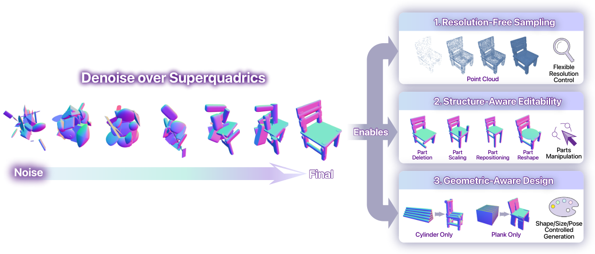
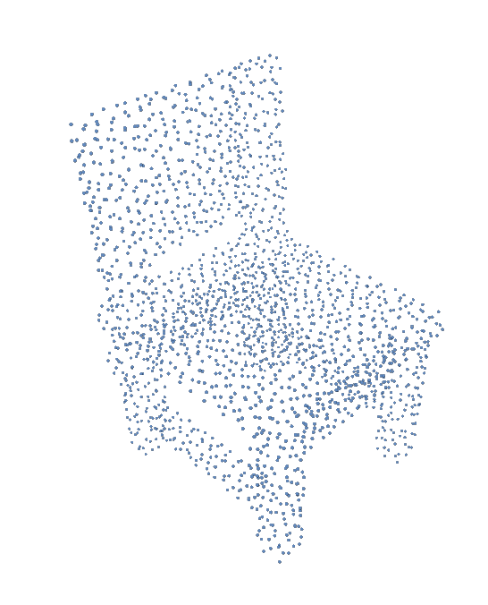

**一句话结论：** 这篇 ICML 2026 论文把 3D diffusion 的生成空间，从体素/点云/网格这类**高维稠密几何**，改成了**低维、可解释的 superquadric 基元 token 空间**。它不追求在 ShapeNet 上把所有质量指标都做到第一，而是明确换来更好的**效率、结构可编辑性、几何约束可控性**。

**重要性评估：★★★★☆（4/5）**

**归档领域：** 3D生成

## 1. 背景

这条小红书内容的主线，是一篇已被 **ICML 2026** 接收的论文 **Rethinking 3D Shape Generation: Diffusion over Superquadrics**。原帖强调的核心判断很准确：过去很多 3D diffusion 方法都在高维几何表示上做去噪，而这篇工作尝试把生成对象改写成**一组结构化几何基元**，从而把生成问题变成“在 primitive space 中扩散”。

从问题设定看，这篇论文主要面向 **unconditional 3D shape generation**。作者并没有直接去做 text-to-3D / image-to-3D，而是先在 ShapeNet 的 Chair / Airplane / Car 三类上验证：如果把表示换掉，能否在保持一定生成质量的前提下，大幅改善效率和可控性。

这篇工作值得关注，原因主要有三点：

1. 它讨论的不是“更大的 backbone”，而是**生成表示本身是否该换**。
2. 它把 3D 生成里的“编辑”和“约束设计”变成了 token 级显式操作，而不是后处理 hack。
3. 它虽然只在 ShapeNet 上做了较干净的实验，但路线天然更贴近**结构先行、再细化**的 3D 资产生成思路，也和可仿真资产、具身场景建模存在潜在衔接。

## 2. 文章主线 / 论文线索

|项目|内容|说明|
|---|---|---|
|论文名称|Rethinking 3D Shape Generation: Diffusion over Superquadrics|简称 **DoSs**|
|接收信息|Accepted to ICML 2026|来自 arXiv 元数据|
|作者|Zhiyang Liu, Wanze Li, Yuwei Wu, Chengran Yuan, Jiawei Sun, Rui Zheng, Marcelo H Ang Jr|主要来自新加坡国立大学 / 新加坡科技设计大学|
|原始外部线索|[小红书帖子](http://xhslink.com/o/9YOkzTN3pdz)|标题：ICML: 3D生成新范式! 从高维几何到基元几何|
|官方论文|[arXiv 论文页](https://arxiv.org/abs/2606.08957) / [PDF](https://arxiv.org/pdf/2606.08957)|本次总结以官方论文原文为准|

**核心主张：**

- 传统 3D diffusion 常在点云、体素、网格等**高基数状态空间**里去噪，状态维度大、采样成本高，也不利于做显式结构控制。
- DoSs 把一个 shape 表示成若干个 **superquadric primitives**，每个 primitive 都有位置、旋转、尺寸、形状和存在性。
- 这样 diffusion 的对象不再是稠密几何场，而是一组**低维、可解释的 token**。

**与相关工作的关系：**

- 它不是单纯沿着 latent diffusion 再压一次维度；作者强调 latent/triplane 虽然更紧凑，但**解释性和几何约束能力不足**。
- 它也不是 superquadric reconstruction / decomposition 的延伸应用，而是直接在 superquadric 集合上学习**类别级生成先验**。

## 3. Pipeline / Architecture + I/O 数据流

### 3.1 总体 Pipeline

1. **训练数据准备**
    1. 输入：ShapeNet mesh
    2. 处理：用 **Marching-Primitives** 从 signed-distance representation 中拟合 superquadrics
    3. 输出：每个对象的一组 superquadric primitives
2. **Token 化表示**
    1. 每个 primitive 对应一个 15 维 token：
        
        - translation `t_k`：3 维
        - rotation `r_k`：6 维连续旋转表示
        - axis length `a_k`：3 维
        - shape exponents `ε_k`：2 维
        - existence score `e_k`：1 维
            
    2. 整体表示为 `K_max × 15`，其中 `K_max = 128`
    3. 不足的 primitive 用全 0 行补齐；有效 primitive 由 existence channel 区分
3. **Token-space diffusion**
    1. 在固定长度 token tensor 上做 DDPM 去噪
    2. backbone 是 **1D convolutional U-Net**
    3. 为了让 token 序列稳定可学，作者引入**确定性 canonical ordering**
4. **解码为点云 / 几何结果**
    1. 根据 `e_k > τ_e` 选出有效 primitive，其中 `τ_e = 0.5`
    2. 把 6D rotation 解码成有效旋转矩阵
    3. 对每个 superquadric 采样表面点
    4. 过滤掉落在其他 primitive 内部的点
    5. 再做 FPS，得到任意点数的输出点云
5. **编辑 / 设计控制**
    1. 直接改 token 就能做 part deletion / scaling / repositioning / reshape
    2. 也可以在采样时施加约束，实现 cylinder-only / plank-only 之类的 geometry-aware design

### 3.2 I/O 视角下的输入输出逻辑

|阶段|输入|输出|
|---|---|---|
|几何抽象|ShapeNet mesh / SDF 表示|一组 superquadrics primitives|
|Tokenization|primitive set|`K_max × 15` token tensor|
|Diffusion|高斯噪声 token tensor|去噪后的 primitive token tensor|
|Resolution-free decoding|有效 primitive tokens + 目标点数 N|任意分辨率点云|
|Structure-aware edit|已生成 token + 编辑指令|修改后的结构化 shape|
|Constrained design|采样过程 + 几何约束集合 Ω|满足指定几何先验的生成结果|

### 3.3 三个关键设计点

#### A. Existence token：解决“每个物体部件数不同”

扩散模型要求固定维度状态，但不同 shape 的 primitive 数量并不一致。作者通过给每个 slot 增加 `existence score`，把“这个 slot 是否真的存在一个部件”显式编码进状态里。这个设计是全文最关键的工程化改造之一。

#### B. 6D rotation：解决 SO(3) 直接扩散不稳定

如果直接对 Euler angle 或 quaternion 做欧式高斯扰动，会有周期性 / 不连续性问题。作者采用连续 6D rotation representation，再用 Gram-Schmidt 正交化恢复旋转矩阵，避免了训练时把几何上接近但坐标上不连续的姿态混在一起。

#### C. Canonical ordering：解决 primitive set 的排列歧义

同一个物体的 primitive 集合，本质上是无序集合。如果每次顺序不同，token-space 里的监督会很乱。作者因此先做**确定性排序**，比较了：

- 按体积排序
- 按垂直位置排序

实验表明，**按体积排序**效果最好。

### 3.4 这篇方法真正“新”的地方

它的创新不在于提出某个更强大的 3D backbone，而在于把 3D diffusion 的生成变量，从“海量几何值”改写成“少量结构化部件参数”。这带来三个直接后果：

1. **状态维度显著下降**：从几十 KB、几百 KB 甚至更大，压到约 **7KB**。
2. **控制接口变得显式**：删除部件、调尺寸、改姿态、指定圆柱形腿，不再需要隐式 latent 操作。
3. **采样与设计耦合得更自然**：约束不是事后修，而是采样过程中直接投影到 token 参数上。

## 4. 实验与关键信息

### 4.1 数据、指标与实现设定

- **数据集：** ShapeNet
- **类别：** Chair / Airplane / Car
- **primitive 提取：** Marching-Primitives
- **评测：** 1-NNA@CD、COV@CD
- **评测点数：** 每个 shape 解码后采样 2048 个点
- **训练：** 4000 epochs，Adam，learning rate = `1e-4`，batch size = `64`
- **硬件：** 单张 RTX 4090
- **训练成本：** 约 **2 小时 / 类别**，**2GB VRAM**
- **推理：** 100 denoising steps，batch size = 1，约 **0.6s / shape**

### 4.2 主结果：效率优势非常明显，质量上“有竞争力但不全面领先”

|方法|扩散状态|大小(KB)|速度(s)|Chair 1-NNA|Chair COV|Airplane 1-NNA|Car 1-NNA|
|---|---|---|---|---|---|---|---|
|DPM|points (2048×3)|24|22.8|60.05|44.86|76.42|68.89|
|PVD|points (2048×3)|24|29.9|57.09|36.68|73.82|54.55|
|LION|latent (128+8192)|33|27.12|53.70|48.94|67.41|53.41|
|DiT-3D|voxels (32^3×3)|384|12|49.11|52.45|62.35|48.24|
|**DoSs**|**superquadrics (128×15)**|**7**|**0.6**|53.80|51.31|**61.92**|57.50|

**如何解读这张表：**

- **效率层面**：DoSs 的优势很直接，扩散状态约 **7KB**，采样约 **0.6s**，明显优于多数 baseline。
- **质量层面**：它并不是所有指标都第一。
    - Chair / Car 上，DiT-3D 的分布匹配更强。
    - Airplane 上，DoSs 的 1-NNA 最优。
- **真正想证明的点**：作者不是要宣布“视觉质量全面 SOTA”，而是证明**把扩散空间换到 primitive token 后，效率—可控性—质量之间可以达到一个很有吸引力的平衡点**。

### 4.3 消融实验：existence token 是最关键的

作者重点消融了三件事：

1. **是否使用 existence token**
2. **是否使用 6D rotation**
3. **primitive 的 canonical ordering 怎么排**

结论：

- **existence token 贡献最大**：
    - 去掉它后，Chair 上 1-NNA / COV 退化到 **93.32 / 19.91**。
    - 加回 existence token 后立刻恢复到 **58.36 / 48.41**。
- **6D rotation 有增益，但不是最大头**：
    - 从 **57.57 / 50.37** 改进到更稳定的结果。
- **排序策略确实重要**：
    - volume-based sorting 最终最好，达到 **53.80 / 51.31**。

这说明 DoSs 的成功，不只是“换了表示”这么简单，而是要把**变长集合、旋转连续性、排列歧义**这三个 token 化细节一起处理好。

### 4.4 论文强调的三个能力

#### 能力 1：Resolution-free decoding

同一组 superquadric token，可以解码成不同点数的点云，不需要重新跑 diffusion。这意味着生成和展示分辨率解耦。

从论文给出的例子看，DoSs 在椅子这种强结构对象上，往往能生成**更完整、更规整的部件布局**；但作者也很诚实地指出，这并不必然在 CD 指标上全面占优，因为点采样分布、平滑程度、局部细节都会影响 Chamfer Distance。

#### 能力 2：Structure-aware editability

通过直接改 token 参数，可以做：

- 删除某个 part
- 放大/缩小某个 part
- 改变某个 part 的位置和姿态
- 改变 roundness / sharpness

这比在点云、体素、隐式场上做局部可控编辑更自然，因为那些表示里“一个零件”通常并不是稳定、显式、独立的变量。

#### 能力 3：Geometric-aware design

作者展示了在采样过程中施加约束：

- 把某些 primitive 限制成 cylinder-like
- 把某些 primitive 限制成 plank-like

本质上就是把“几何模板”直接写进 denoising 过程。这对家具类、结构化部件类资产很有启发性。

### 4.5 限制与风险

论文明确承认了以下限制：

1. **表达能力受 primitive 上限与基元形式约束**
    1. 细薄结构、尖锐边界、深凹结构、复杂拓扑，不如 dense field / mesh 好表达。
2. **依赖 superquadric fitting 质量**
    1. 如果预处理拟合不稳定，会把噪声直接带进 token 空间。
3. **参数非唯一性问题**
    1. 多组 superquadric 参数可能对应接近的曲面，导致 token-space 分布更“多模态”，增加学习难度。
4. **评测与视觉感知可能不一致**
    1. CD-based 评测对点密度、采样方式比较敏感，未必完全反映视觉结构质量。

## 5. 个人评注 / 下一步

### 5.1 我的判断

**这是篇“表示层重构”型论文，不是简单的 backbone 叠料。**

我认为它最有价值的地方，不是现在这版实验里某个 benchmark 数字，而是它提供了一个很清晰的 3D 生成新范式：

- 先在**结构化、低维、可解释的 primitive 空间**里生成对象骨架与部件布局；
- 再视需要向更高保真 mesh / implicit / field 空间细化。

这条路线非常适合下列方向继续延展：

- **可编辑 3D 资产生成**：先出可操作结构，再补外观细节
- **具身 / 仿真资产生成**：因为部件、尺寸、接触、对称、支撑等约束更容易显式施加
- **世界模型 / 物理一致性建模**：显式 primitive token 对接约束优化比 dense geometry 更自然

### 5.2 为什么我给 4/5 星，而不是 5/5

**给高分的原因：**

- 表示切换非常干净，逻辑完整。
- token 设计和实验闭环比较扎实。
- 编辑与约束能力不是附带展示，而是由表示天然支持。

**没给满分的原因：**

- 当前验证仍然局限在 ShapeNet 的 unconditional setting。
- fidelity 并没有全面超过强 dense baseline。
- superquadric 本身的表达上限，会限制复杂 3D 几何的最终上界。

所以我更愿意把它看成一篇**方向感很强的路线论文**：它证明“primitive-space diffusion 值得做”，但离通用、高保真、工业级 3D foundation generation 还有明显距离。

### 5.3 对后续追踪的建议

建议重点继续跟三类后续工作：

1. **Primitive → High-fidelity refinement**
    1. 是否会出现“先生成 superquadric skeleton，再细化到 mesh / implicit surface”的两阶段系统。
2. **面向 text/image 条件的扩展**
    1. 当前是 unconditional。若把这种表示迁移到 image-to-3D / text-to-3D，会非常有意思。
3. **面向物理与功能约束的生成**
    1. 如 articulated objects、接触 / 支撑 / 稳定性约束、仿真可用资产生成。

**适合放进技术视野的原因：** 这篇论文不是在现有 3D diffusion 路线上做局部提效，而是把“扩散到底该在什么表示上进行”这个问题重新打开了。对后续 3D 资产生成、结构化编辑、物理约束生成，都是一条值得持续追踪的主线。

暂时无法在飞书文档外展示此内容
