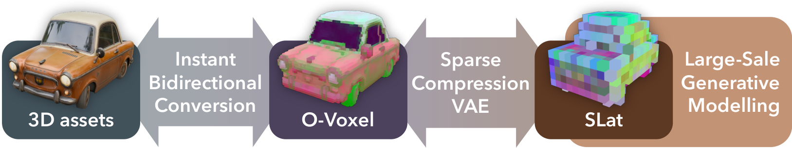
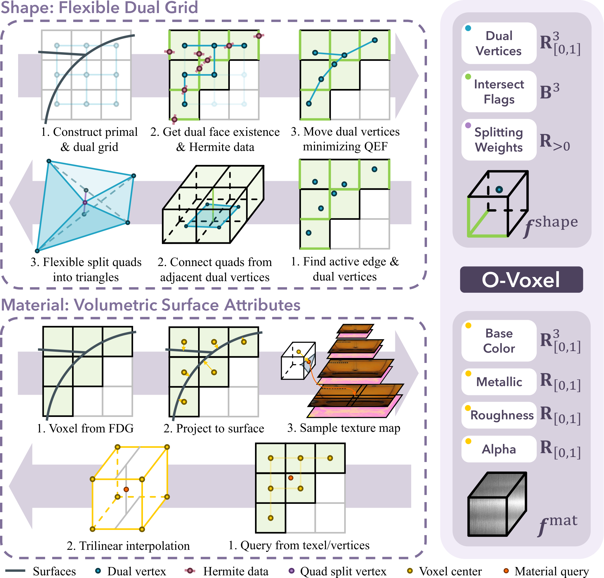

**归档结论：** 这篇公众号文章对应的主论文是 **Native and Compact Structured Latents for 3D Generation（TRELLIS.2）**。主线价值在于：提出统一编码几何与材质的 **O-Voxel** 表示，并用 **SC-VAE + 4B flow-matching** 把原生 3D 资产压到紧凑潜空间后直接做高质量生成。

## 背景

这篇内容围绕公众号《【顶会精读】新稀疏体素搞定高质量3D生成》展开，主论文是 [Native and Compact Structured Latents for 3D Generation](https://arxiv.org/abs/2512.14692)，项目页为 [TRELLIS.2](https://microsoft.github.io/TRELLIS.2/)。

论文想解决的是当前 3D 生成表示的两个老问题：

- 一类表示对**复杂拓扑**支持不稳，遇到开放曲面、非流形结构、内部结构时容易失真；
- 另一类做法把**几何**和**外观/材质**分开建模，后续需要再对齐，系统链路长、损失大。

这项工作值得关注，原因有三点：

1. 它直接面向**可用的 3D 资产生成**，不是只追求渲染截图效果；
2. 它把 **PBR 材质属性**纳入统一表示，利于后续进入真实制作/编辑流程；
3. 项目页给出了比较明确的工程信号，例如 **4B 参数规模**、**1024³/1536³ 分辨率**与较高效率，说明其目标不是概念验证，而是大规模 3D 生成系统。

## 目标

**论文目标**

- 学习一种来自原生 3D 数据的**结构化紧凑潜表示**；
- 在统一表示里同时表达**几何拓扑 + 表面外观/PBR 属性**；
- 支撑大规模 3D 生成模型训练，并在推理阶段保持可接受效率。

**文章主线 / 论文线索**

- **主论文：** Native and Compact Structured Latents for 3D Generation
- **核心方法名：** O-Voxel、SC-VAE（Sparse Compression VAE）、4B flow-matching model
- **项目名：** TRELLIS.2
- **可确认出处：** [arXiv 摘要页](https://arxiv.org/abs/2512.14692)、[项目页](https://microsoft.github.io/TRELLIS.2/)、[公众号原文](https://mp.weixin.qq.com/s/8eORJ_6CLZKVBWGoka3_jA)

**重要性评估：★★★★★（5/5）**

它代表 3D 生成从“单纯生成形状/贴图”进一步走向“直接生成工业可用资产”的路线：统一表示、支持复杂拓扑、支持完整材质、且生成效率有工程可落地迹象。

## 进展

### Pipeline / Architecture + I/O 数据流

结合论文摘要、项目页与公众号解读，可以将其主流程梳理为：

1. **输入层（Input）**
    1. 输入是**原生 3D 资产**，项目页明确提到可从 **textured mesh** 变换到 O-Voxel；
    2. 公众号解读中也将输入概括为原生 3D 网格/体素资产。
2. **表示变换层：Mesh / Asset → O-Voxel**
    1. 论文提出 **O-Voxel（Omni-Voxel）**；
    2. 它不是只存 occupancy 的普通稀疏体素，而是统一编码**几何信息**与**外观/PBR 属性**；
    3. 项目页进一步说明其可覆盖 **Base Color、Metallic、Roughness、Alpha** 等表面属性，并强调可处理 **open surface / non-manifold / internal structure**。

    > 论文图 3：O-Voxel 表示示意，统一编码几何与 PBR 材质属性。
    > 
3. **压缩编码层：O-Voxel → Structured Latent**
    1. 使用 **SC-VAE** 对稀疏体素数据进行压缩；
    2. 项目页给出的明确信号是 **16× spatial compression**，并在 1024³ 分辨率下压到约 **9.6K latent tokens**；
    3. 这一层的目标是把高维原生 3D 表示压到足够紧凑、又尽量不损失感知质量的潜空间。
4. **生成建模层：Structured Latent → Generated Latent**
    1. 论文摘要明确写到：训练了**4B 参数**的大规模 **flow-matching** 模型，在紧凑潜空间中进行 3D 生成。
5. **解码输出层：Latent → 3D Asset**
    1. 生成出的潜变量再经解码得到最终 3D 资产；
    2. 输出是带**完整材质/PBR 属性**的高分辨率 3D 资产，而不是仅几何壳体；
    3. 项目页显示其可达到 **512³ / 1024³ / 1536³** 分辨率级别。

### 关键模块与 I/O 关系

|模块|输入|输出|
|---|---|---|
|O-Voxel 表示|原生 3D 资产中的几何与表面属性|统一承载几何 + 外观信息的稀疏体素表示|
|SC-VAE|O-Voxel 稀疏体素|紧凑 structured latent|
|Flow-matching 生成模型|结构化潜变量|生成后的潜变量样本|
|解码器|生成潜变量|高质量、带材质的 3D 资产|

### 当前可确认的实验与工程信号

- **论文摘要可确认：** 生成资产的几何与材质质量**显著超过现有模型**。
- **项目页可确认：**
    - 使用 **4B 参数**模型；
    - 支持高分辨率输出，公开展示到 **1536³**；
    - 强调 **原生 3D VAE + 紧凑 latent** 带来的效率与保真度优势。
- **公众号解读补充：** 文章给出了一些更细的实验数字和工程推断，但其中部分细节未在当前已核验的一手摘要页中逐条出现，因此更适合作为**二次解读线索**，不应直接视为本文档中的“已核验结论”。

## 问题

从当前已核验材料看，这项工作虽然很强，但仍有几个需要继续追的问题：

1. **超高分辨率下的稳定性与成本边界**
    1. 项目页展示到 1536³，但不同类别、不同拓扑复杂度下的显存/时间曲线还需要系统确认。
2. **对特殊资产类型的泛化能力**
    1. 例如极薄结构、线框结构、骨骼绑定角色、复杂透明材质等，是否能稳定保持几何与材质质量，当前公开材料还不够充分。
3. **潜空间可控性与编辑性**
    1. 论文路线强调“紧凑 structured latent”，但跨类别插值、局部编辑、可控部件生成等能力，仍值得继续核验。
4. **工程接入成本**
    1. 虽然它在表示上统一了几何和材质，但若要真正接到现有资产生产链路，还要看导出格式、拓扑清洁度、UV/材质兼容性与后处理需求。

**信息完整性说明：** 当前总结主要依据 **arXiv 摘要页 + 官方项目页 + 公众号长文**。其中凡是论文摘要和项目页能直接确认的内容，我都按“已确认”表述；凡是公众号中的扩展数字、训练配置推断或批判性分析，我在文中都按“二次解读/待进一步核验”处理，避免把推断当成原论文事实。

## 计划

**建议后续跟进动作**

- 下载并通读论文全文，补齐正式实验表、消融实验与损失函数细节
- 检查官方代码仓库中的 O-Voxel 数据结构、编码/解码接口与导出资产格式
- 对照现有 3D 生成路线（如 mesh / NeRF / 3DGS / part-based asset generation）补一版更系统的横向对比
- 评估它与当前关注方向（可用资产生成、可编辑生成、工业生产链路）的结合点

**TODO**

---
