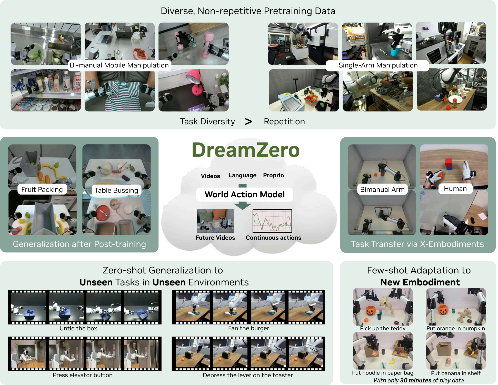
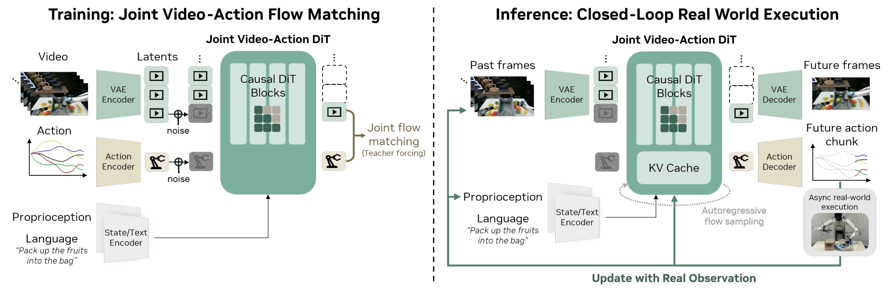
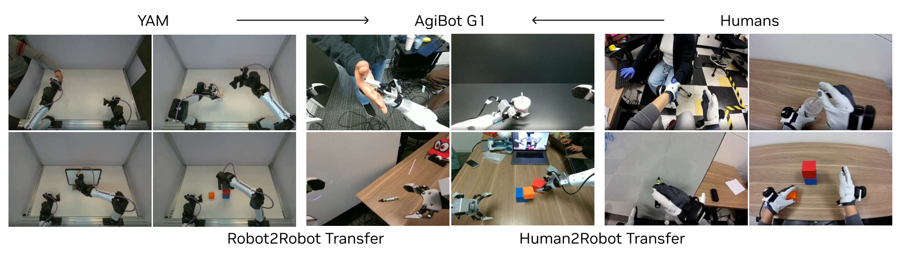

## 背景

这篇公众号文章围绕 **DreamZero** 展开，核心论文是 **World Action Models are Zero-shot Policies**。文章重点讨论：为什么现有 VLA 模型在语义泛化上很强，但在新环境中的**新物理动作泛化**仍然不足，以及视频世界模型能否直接变成机器人策略。

**一句话抓主线：** DreamZero 不再直接学习“观测到动作”，而是学习“观测 + 语言 + 本体状态 -> 未来视频 + 动作”，把**未来视觉状态**当作动作生成的核心中间表示。

从原文可确认的信息看，这篇工作由 NVIDIA 团队提出，arXiv 编号为 `2602.15922`，同时提供了[项目页](https://dreamzero0.github.io/)、[代码仓库](https://github.com/dreamzero0/dreamzero)与模型/数据入口。它值得纳入技术视野，原因是它把 **视频扩散模型、世界模型、VLA、跨 embodiment 迁移、实时机器人控制** 这些原本相对分散的线索，收敛到一个统一框架里。

## 目标

### 1. 文章主线 / 论文线索

- **核心论文：** [World Action Models are Zero-shot Policies](https://arxiv.org/abs/2602.15922)
- **模型名：** DreamZero
- **项目页：** [dreamzero0.github.io](https://dreamzero0.github.io/)
- **代码仓库：** [github.com/dreamzero0/dreamzero](https://github.com/dreamzero0/dreamzero)
- **补充出处：** [OpenReview 页面](https://openreview.net/forum?id=cd33uUB609)

### 2. 论文试图解决的问题

现有 VLA 通常擅长以下能力：

- 理解语言指令
- 识别新物体或新目标
- 在分布内任务中完成基本操控

但它们对以下能力仍然较弱：

- **未见物理动作** 的零样本泛化
- **新环境 / 新布局** 下的动作稳定性
- **跨 embodiment** 的快速迁移

DreamZero 的目标不是简单提升某个 benchmark 分数，而是验证一个更强命题：**视频世界模型是否可以直接充当零样本机器人策略的 backbone。**

## 进展

### 1. Pipeline / Architecture + I/O 数据流

DreamZero 可以概括成一个 **World Action Model (WAM)**：

|阶段|输入 / 输出|说明|
|---|---|---|
|输入侧|过去观测视频、语言指令、proprioceptive state|视频提供场景与时序上下文，语言提供任务目标，本体状态提供机器人当前可执行条件。|
|中间表示|future video|模型先预测未来世界应如何演化；这部分相当于隐式 visual planning。|
|动作生成|future action chunk|在未来视频条件下生成连续动作块，可理解为 inverse dynamics。|
|输出侧|未来视频 + 连续动作|两个模态是联合建模、联合去噪，而不是分成两个完全独立的模型。|

论文中的核心联合分布可写成：

暂时无法在飞书文档外展示此内容

### 2. 关键方法设计

- **Backbone：** 采用预训练 `Wan2.1-I2V-14B-480P` 视频扩散模型作为主干。
- **机器人特化模块：** 仅新增少量机器人相关参数，如 state encoder、action encoder、action decoder。
- **联合建模：** video latent 与 action 一起做 denoise / flow matching。
- **多视角输入：** 多相机画面被拼成 composite video frame，而不是重写视频 backbone。
- **闭环推理：** 每执行一个 action chunk，就把真实观察重新写回 cache，避免长期依赖自己生成的视频。

论文 Figure 4（模型架构）直观展示了视觉上下文（VAE 编码）、语言指令、本体状态三路输入经自回归 DiT backbone 联合预测未来视频与动作的完整数据流：

### 3. DreamZero-Flash 与实时部署

文章还介绍了 **DreamZero-Flash**，其关键点是将 **video noise schedule** 与 **action noise schedule** 解耦，让动作头学会在较 noisy 的视觉上下文中依旧输出可执行动作。

这对应一个非常实际的问题：少步甚至单步推理时，视频 latent 可能还不够“干净”，但机器人动作已经必须执行。DreamZero-Flash 本质上是在训练期提前适配这个部署约束。

### 4. 实验与关键信息

**原文与论文中可确认的关键结果：**

- 在 **AgiBot G1 seen-task 零样本新环境** 评测中，DreamZero 达到 **62.2% average task progress**，显著高于文中最强 pretrained VLA baseline 的 **27.4%**。
- 在 **unseen-task** 评测中达到 **39.5%**，仍明显优于 VLA baselines。
- 借助 CFG parallelism、DiT caching、`torch.compile`、CUDA Graphs、kernel / scheduler 优化、NVFP4 quantization 以及 DreamZero-Flash，作者报告累计约 **38×** 推理加速，使 14B 自回归视频扩散模型达到约 **7Hz** 闭环控制。
- 在 **cross-embodiment transfer** 上，只需 **10–20 分钟** 的人类或其他机器人视频，就能显著提升 unseen task 表现；同时还展示了只用 **30 分钟 play data** 即可完成新 embodiment 适配。

**我认为最值得记住的实验结论：** DreamZero 的收益不只是“视频预测辅助动作”，而是证明了**未来视觉状态可以成为零样本机器人策略的核心中间变量**。

### 5. 重要性评估

**重要性：★★★★★（5/5）**

原因：

1. 它不是在现有 VLA 范式上做局部改良，而是在训练目标层面把 policy 学习改写成 **world modeling + inverse dynamics** 的联合问题。
2. 它把公开视频扩散 backbone 真正拉进了机器人闭环控制，并且给出了较完整的工程加速路径。
3. 它同时覆盖了 **零样本泛化、跨 embodiment 迁移、实时部署** 三条高价值主线，后续很可能影响具身基础模型的主流路线。

## 问题

从目前可确认信息看，这条路线仍有几个值得持续跟踪的点：

- **视频预测误差是否会误导动作：** 如果 future video 偏离真实可达轨迹，动作模块可能会忠实执行错误 visual plan。
- **工程门槛较高：** 14B 级视频扩散模型要真正跑到闭环控制，仍依赖较重的系统级优化栈。
- **公开复现与论文结果之间可能存在落差：** 文章已提到部分 AgiBot 级数据与部分模拟环境支持尚未完全公开。
- **动作 horizon 与控制稳定性权衡：** 该路线非常依赖 chunk 级动作设计与 cache 回写策略，后续要看在更复杂任务上的稳定性。

## 计划

### 1. 对当前技术视野的价值判断

这篇工作应优先放入 **VLA** 主领域，而不是“世界模型”。原因是它虽然方法核心是 world model / WAM，但最终目标与评测主线仍然聚焦于**视觉-语言-动作策略学习、机器人零样本泛化与 embodiment 迁移**。

### 2. 建议后续跟进方向

- 继续跟踪 DreamZero 开源仓库中 **PolaRiS / Genie 3.0 simulation support** 的落地情况。
- 补读论文原文中的训练细节、数据组织与 Algorithm 1/2，尤其关注 **KV cache 回写** 与 **chunk-wise teacher forcing** 的实现方式。
- 与近期 VLA / world model 路线做并读：比较其是否真正把“未来状态建模”变成了动作生成的必要中间层，而非辅助损失。

### 3. TODO
