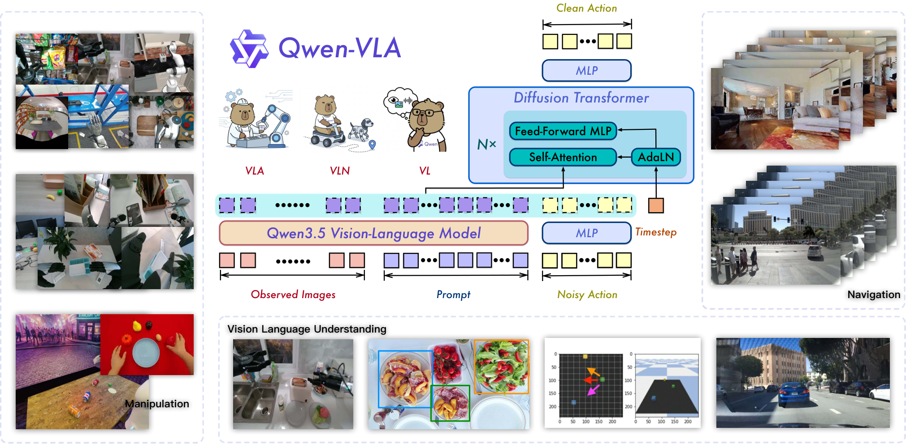
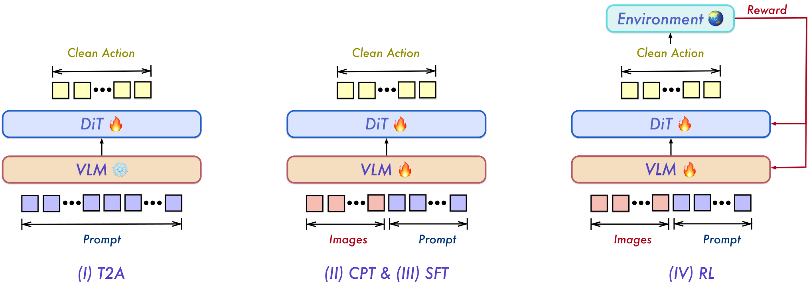

## 背景

这篇内容围绕 **Qwen-VLA** 展开，主论文为 **Qwen-VLA: Unifying Vision-Language-Action Modeling across Tasks, Environments, and Robot Embodiments**，对应 [arXiv 2605.30280](https://arxiv.org/abs/2605.30280)。文章讨论的核心不是“再做一个机器人策略模型”，而是尝试把**机械臂操作、视觉导航、人类第一视角动作、轨迹预测**统一到一个 **Vision-Language-Action** 基础模型里。

它值得关注，原因在于当前很多具身模型都强依赖单任务、单环境、单 embodiment 训练：换机器人本体、换控制接口、换任务族后，迁移往往很弱。Qwen-VLA 提出的统一视角是：这些看似不同的问题，本质上都可以改写为**在视觉与语言条件下预测未来动作/轨迹序列**。

**一句话判断：** Qwen-VLA 的价值不只是把 Qwen 从“看懂”推进到“会动”，更重要的是它给出了一条可扩展的统一 recipe：用同一套 VLM + 连续动作生成器，跨任务、跨环境、跨机器人本体学习 transferable 的动作表示。

---

## 目标

本文希望解决的核心问题可以概括为一句话：

**能否用一个统一模型，同时处理多种 embodied 决策任务，而不是为 manipulation、navigation、trajectory prediction、不同机器人本体分别训练割裂的 specialist policy？**

更具体地说，作者要同时回答以下几个技术问题：

1. 如何把 **操作、导航、人类动作、轨迹预测** 放进同一个建模框架？
2. 如何在不强行统一物理语义的前提下，支持 **不同 robot embodiment / 控制接口 / 动作维度**？
3. 如何让 VLM 的**视觉理解、空间 grounding、语言推理**真正接到连续动作生成上？
4. 如何让预训练得到的表征在 **多 benchmark、OOD 场景、真实机器人部署** 上体现收益？

---

## 进展

### 1. 文章主线 / 论文线索

- **主论文：** Qwen-VLA: Unifying Vision-Language-Action Modeling across Tasks, Environments, and Robot Embodiments
- **论文链接：** [arXiv 2605.30280](https://arxiv.org/abs/2605.30280)
- **代码仓库：** [QwenLM/Qwen-VLA](https://github.com/QwenLM/Qwen-VLA)
- **文章来源：** [微信公众号原文](https://mp.weixin.qq.com/s/ZiY7YwQOYAoz56dcKt3W0w)
- **提交时间：** 2026-05-28（arXiv）
- **文章发布时间：** 2026-05-31（公众号）

### 2. 主要创新总结

**创新 1：把多类 embodied 任务统一为 action-and-trajectory prediction。**传统上 manipulation、VLN、egocentric action、trajectory prediction 常被拆成不同问题；Qwen-VLA 则把它们统一改写成“在视觉 + 语言 + embodiment 条件下生成未来动作/轨迹序列”。这个抽象层次比按任务类别分模型更通用。

**创新 2：Qwen3.5 VLM + DiT-based action decoder 的双模块设计。**前端 Qwen3.5 负责感知、理解、空间推理和任务语义对齐；后端 Diffusion Transformer 负责连续动作 chunk 生成。它没有直接把动作离散成 token 逐个输出，而是用 diffusion / flow-matching 风格对连续控制轨迹建模，更贴合机器人控制的连续、高维、时间相关特性。

**创新 3：用 embodiment-aware prompt 统一不同机器人本体。**作者没有强迫所有机器人的动作映射到同一个物理语义空间，而是把 robot tag、单/双臂、控制频率、chunk size、控制约定等元信息写进 prompt，让模型在统一接口下理解“当前我在控制哪种身体”。这是一种更现实、工程上更可扩展的统一方式。

**创新 4：用统一 action tensor + mask 兼容不同动作维度。**各机器人样本都映射到固定形状的 `H × K` 动作张量：`H` 是时间长度，`K` 是最大动作通道数。真实动作填前若干维，其余维度 zero-padding，并用 mask 避免无效维度影响 loss。这样同一个 DiT decoder 可以学习末端位姿、关节角、夹爪、灵巧手、导航 waypoint 等不同动作类型。

**创新 5：分阶段训练 recipe 比“端到端一锅炖”更有条理。**Qwen-VLA 采用四阶段训练：

1. **T2A：** 仅用语言指令 + embodiment prompt 预训练动作先验；
2. **CPT：** 加入图像，对齐视觉 grounding 与动作先验；
3. **SFT：** 用更高质量多任务数据与真实部署相关数据做监督微调；
4. **RL：** 用 PPO 按任务成功率进一步优化，得到 Qwen-VLA-Instruct。

**创新 6：把多源 embodied 数据真正混到一起。**训练数据覆盖机器人操作轨迹、人类第一视角数据、导航数据、仿真轨迹、空间 grounding、自动驾驶 VQA 与通用 vision-language 数据。这里的关键不是简单堆数据，而是让不同数据源分别补齐低层动作控制、空间理解、长时序指令跟随和跨 embodiment 泛化能力。

**重要性评估：★★★★★（5/5）**

**判断理由：**

- **方向级价值强：** 它代表 Qwen 从 VLM 真正迈向 VLA，是具身基础模型的重要节点；
- **统一视角清晰：** 不是只做 benchmark engineering，而是在任务抽象层面给出统一范式；
- **工程启发大：** embodiment prompt + 统一 action tensor 的设计，对后续跨平台机器人训练很有参考意义；
- **实验覆盖广：** 同时覆盖 manipulation、navigation、真实机器人 OOD 与动态操作，证明 recipe 不是只在单一任务上成立。

### 3. Pipeline / Architecture + I/O 数据流

|阶段|输入|关键处理|输出|
|---|---|---|---|
|任务条件建模|视觉观察（图像 / 视频）、语言指令、embodiment-aware prompt|把机器人本体、控制频率、动作长度、任务指令统一组织成模型条件输入|统一条件表示|
|感知与理解|视觉 token + 文本 token|Qwen3.5 VLM 进行视觉理解、空间定位、语言推理与任务语义对齐|hidden states / 任务相关语义表示|
|连续动作生成|hidden states + noisy action chunk|DiT-based action decoder 通过 diffusion / flow matching 逐步去噪，生成未来连续动作序列|clean action chunk / trajectory|
|执行接口适配|统一 action tensor + 有效维度 mask|按当前 embodiment 解释有效动作维度与控制语义|可直接执行的控制序列或 waypoint|

**I/O 重点拆解：**

- **输入：** 当前视觉观测 + 自然语言任务指令 + embodiment-aware prompt；
- **中间表示：** Qwen3.5 产生的多模态语义表示，以及 `H × K` 统一动作张量；
- **输出：** 未来一段连续动作或轨迹，可对应机械臂控制、导航 waypoint、人类动作轨迹等；
- **原文未明确说明的点：** 文章未给出每类 embodiment 在统一张量里的完整通道定义细表，具体 dataset-specific normalization 细节需要进一步查论文正文与代码。

下面两张图分别对应文章中的**整体架构**与**训练流程**：

### 4. 实验与关键发现

**多任务 benchmark 表现：**

- LIBERO：**97.9**
- Simpler-WidowX：**73.7**
- RoboTwin-Easy / Hard：**86.1 / 87.2**
- R2R：**69.0 OSR**
- RxR：**59.6 SR**
- ALOHA 真实机器人平均 OOD 成功率：**76.9%**
- DOMINO 动态操作零样本成功率：**26.6%**

**最值得注意的实验结论有三点：**

1. **Generalist policy 真的能打多个 benchmark。** 论文显示一个统一模型并不一定弱于 specialist，至少在多个 manipulation / navigation benchmark 上，Qwen-VLA 已经证明“联合训练 + 统一接口”是可行路线。
2. **预训练带来真实 OOD 收益。** 真实 ALOHA 实验中，从头训练平均成功率约为 36.2%，而基于预训练再微调可到 76.9%，说明收益不只是架构换新，而是来自大规模多源 VLA 预训练。
3. **统一的不只是任务，而是泛化机制。** 场景布局、背景、光照、物体配置、语言表述和 robot embodiment 变化下仍能保持较强表现，说明模型学到了一定程度的 transferable grounding 与动作表征。

### 5. 个人评注

我认为这篇工作的真正启发，不是“Qwen 也做了机器人”，而是它把当前具身领域几条分散主线——**VLM、机器人操作、导航、egocentric 数据、连续动作生成**——收束到同一个 recipe 里。

对后续跟踪尤其值得关注的有三点：

- **动作生成范式：** 用 DiT 而非离散 token autoregressive head，说明 VLA 的动作端很可能继续向连续生成模型演化；
- **统一接口设计：** embodiment-aware prompt + zero-padding + mask 的组合，是多平台训练里很实用的工程抽象；
- **数据组织方式：** 人类第一视角、仿真、导航和机器人轨迹如何配比与协同，可能会成为后续 generalist embodied model 的关键 recipe。

如果后面要继续深挖，我会优先看三件事：

1. 代码里各 embodiment 的 action schema 与 normalization 细节；
2. RL 阶段具体如何把成功率奖励接到多任务统一训练里；
3. 是否存在更强的 cross-embodiment transfer 评测，而不只是同平台内微调后的泛化。

---

## 问题

这篇工作很强，但也有几个需要继续观察的问题：

1. **统一接口不等于统一语义。** 当前方案更像“统一训练与输入接口”，而不是学到了完全共享的动作语义空间；跨 embodiment 的深层迁移能力还需要更严格检验。
2. **多源数据 recipe 仍偏经验工程。** 各类数据比例、质量过滤、任务混采策略对最终性能的影响，文章里还没有完全展开。
3. **真实世界闭环鲁棒性仍有上限。** 即便 OOD 成绩很亮眼，真实机器人部署中的长程失败恢复、感知漂移、接触不确定性等问题仍然存在。
4. **统一模型的成本问题。** 这种 generalist VLA 往往伴随更高训练成本、数据组织复杂度和部署门槛，后续是否能形成性价比足够高的工业路线，还需要继续观察。

---

## 计划

**建议的下一步跟踪动作：**

1. 对照论文正文与代码，补一版 **embodiment schema / action channel 定义** 的精细拆解；
2. 关注后续是否放出更多真实机器人 demo、训练配置和 ablation；
3. 与近期的 ReconVLA、PrimitiveVLA、DreamZero 等工作做一次 **统一视角对比**；
4. TODO：__________
