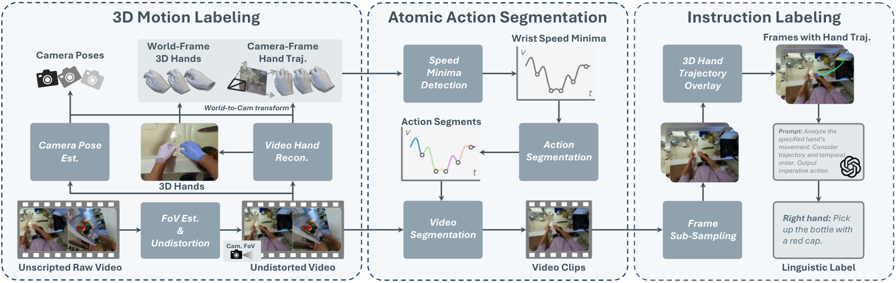
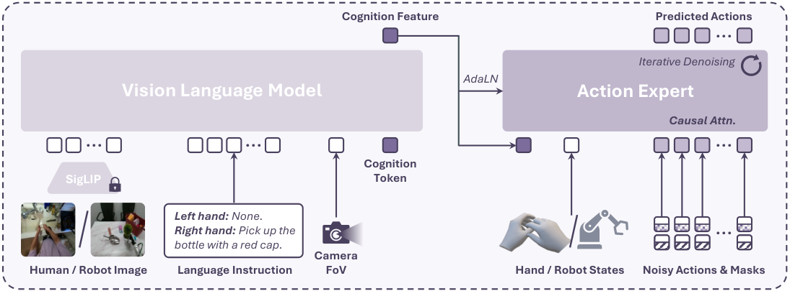
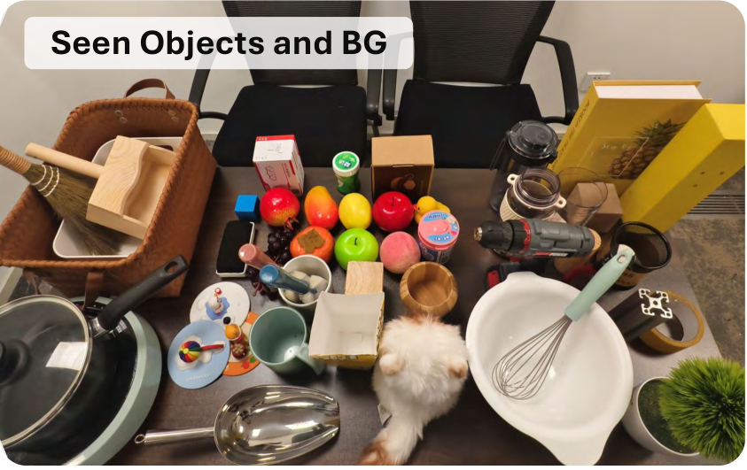
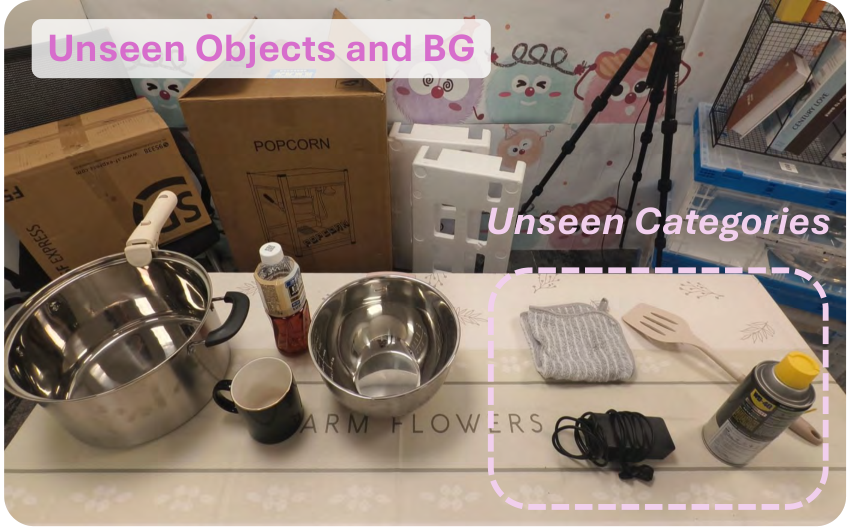

**结论先看：** 这篇工作提出 **VITRA**，核心贡献不是再造一个更大的机器人数据集，而是把 **海量无标注真实人类活动视频** 自动转成与机器人操控 VLA 数据 **粒度对齐、标签对齐、动作空间可对接** 的预训练数据。它把“互联网视频规模”真正接到了具身操控预训练上。

## 1. 背景

这篇内容介绍的是清华大学与微软亚洲研究院提出的 **VITRA**。论文关注的是一个长期存在但一直难以真正做大的问题：**灵巧手 VLA 模型的预训练数据太少、太贵，而且实验室采集数据的场景和技能覆盖非常有限**。

传统机器人数据通常依赖实验室遥操作采集，标注规整，但成本高、规模小、物体和环境单一。与之相对，互联网上已经存在海量第一视角人类活动视频，里面包含大量“手-物交互”知识，但这些视频缺少可直接用于机器人训练的 3D 动作、时间切分和语言指令。

因此，这篇工作真正想解决的问题是：**能否把无脚本、无标签、无动作标注的真实人类视频，自动转成机器人 VLA 可直接使用的训练样本。** 这也是它值得关注的原因——如果这条路成立，VLA 预训练的数据扩展性会被明显打开。

## 2. 文章主线 / 论文线索

- **论文题目：** Scalable Vision-Language-Action Model Pretraining for Robotic Manipulation with Real-Life Human Activity Videos
- **方法名：** VITRA
- **作者单位：** 清华大学、Microsoft Research Asia
- **原始论文：** [arXiv 2510.21571](https://arxiv.org/abs/2510.21571)
- **项目页：** [VITRA Project](https://microsoft.github.io/VITRA/)
- **文章来源：** [微信公众号原文](https://mp.weixin.qq.com/s/mA2FDEyl-aj7UWzgpyFjlg)

**重要性评估：★★★★★（5/5）**

这是一个很值得持续跟踪的 **VLA / 具身预训练主线工作**。它同时回答了三个关键问题：

- **数据从哪里来：** 从真实人类活动视频中来；
- **怎么变成机器人可学的数据：** 做 3D 动作恢复、原子动作切分、语言指令标注；
- **是否真的能迁移到机器人：** 论文给出了真实机器人微调后的显著收益。

## 3. Pipeline / Architecture + I/O 数据流

### 3.1 数据构建 Pipeline

VITRA 的核心是把原始长视频变成原子级 VLA 训练片段。整体流程如下：

**阶段 1：3D Motion Labeling**

- **输入：** 非结构化第一视角人类活动视频。
- **关键处理：**
    - 判断相机静止或运动；
    - 估计相机内参与 FoV，并做畸变矫正；
    - 使用 **HaWoR** 重建逐帧手部 3D 姿态；
    - 使用改造后的 **MegaSAM + MoGe-2** 获取相机位姿；
    - 融合后得到世界坐标系下的双手 3D 轨迹。
- **输出：** 带相机轨迹、手部 6D wrist pose、关节角的逐帧 3D 运动序列。

**阶段 2：Atomic Action Segmentation**

- **输入：** 世界坐标系下的手部 3D 轨迹。
- **关键处理：** 检测腕部速度局部极小值，用作动作切分点；左右手独立处理。
- **输出：** 与机器人数据粒度接近的 **原子动作片段**。

**阶段 3：Instruction Labeling**

- **输入：** 动作片段 + 采样帧 + 投影后的手部轨迹可视化。
- **关键处理：** 调用 **GPT-4.1**，基于“帧内容 + 轨迹走向 + 时间顺序”生成祈使句指令，并过滤无语义动作。
- **输出：** 语言指令，如 `Pick up the red bottle`。

### 3.2 模型架构与 I/O

论文在数据之上设计了一个适配灵巧手操控的 VLA 模型：

**模型输入：**

- 图像观测 `o_t`
- 语言指令 `l`
- 当前手部状态 `s_t`
    - 腕部平移 / 旋转
    - 手部关节角
- 相机 FoV token

**中间模块：**

- **VLM Backbone：** 采用 **PaliGemma-2 3B**，视觉编码器为 **SigLIP**，语言侧为 **Gemma-2**；
- **Cognition Token：** 作为感知与动作之间的桥接条件；
- **Action Expert：** 采用 **DiT-Base** 扩散动作专家；
- **AdaLN 条件注入：** 将 cognition feature 注入 DiT；
- **Causal Attention：** 避免片段尾部零填充污染早期动作预测；
- **Action Mask：** 对单手无标注维度屏蔽损失。

**模型输出：**

- 未来 **16 步** 手部动作序列；
- 动作表示包括双手的：
    - 相对 wrist translation
    - 相对 wrist rotation
    - 15 个关节的角度参数

**I/O 逻辑的关键点：**

这篇工作的真正价值，不只是“用视频做预训练”，而是把人类视频处理成了 **与机器人 VLA 训练样本格式尽量一致** 的数据：

- **输入侧对齐：** 图像 + 指令 + 当前状态；
- **输出侧对齐：** 多步显式 3D 动作序列；
- **训练粒度对齐：** 原子动作片段，而不是整段长视频。

## 4. 实验与关键信息

### 4.1 数据集规模与多样性

论文基于 **Ego4D、Epic-Kitchen、EgoExo4D、SSV2** 构建 Hand VLA 数据集：

- **约 100 万条 episode**
- **约 2600 万帧图像**
- 覆盖做饭、清洁、维修、制作等真实生活场景
- 包含丰富物体类别、动作类型和环境变化

相比传统实验室机器人数据，这套数据最大的优势不是“更干净”，而是 **真实世界多样性显著更强**。

### 4.2 零样本人类动作预测

在完全未见过的真实场景中，预训练模型显著优于对比方法：

- **Hand-object distance** 从 Being-H0 的 `19.1 / 18.4 cm` 降到 **`8.8 / 6.2 cm`**；
- 用户评分从 `0.15` 提升到 **`1.91`**。

这说明模型不仅能“看懂要做什么”，还能在动作层面预测出更合理的手部轨迹。

### 4.3 真实机器人微调结果

微调后，模型在真实灵巧手机器人任务上的提升非常明显：

- **Seen tasks 平均成功率：** 提升到 **71.0%**；
- **Unseen tasks 平均成功率：** 提升到 **64.6%**；
- 明显高于 VPP、π0、无 VLA 预训练、OXE 预训练等对比项。

*微调任务（seen）环境示例*

*未见物体/背景（unseen）环境示例*

### 4.4 Scaling 行为

论文的一个非常强的信号是：**性能随预训练数据规模增加而持续提升**。

- 在对数尺度下，抓取任务性能随数据量近似线性改善；
- 即使只用 10% 数据，效果也已优于一些更大但多样性不足的实验室数据方案；
- 论文明确强调：**多样性** 与泛化收益高度相关。

### 4.5 限制与假设

- 目前主要依赖第一视角人类视频，数据来源仍有偏置；
- 3D 手部重建与相机跟踪本身会有噪声；
- 当前重点仍是 **原子动作**，长时序任务规划尚未真正解决；
- 动作空间映射到不同机器人手型时仍需要额外对齐设计。

## 5. 个人评注 / 下一步

### 5.1 这条内容对技术视野的价值

这篇工作很适合归到 **VLA** 主线，并作为“**可扩展具身预训练数据范式**”的代表案例持续跟踪。它比很多只讨论模型结构的小改进更重要，因为它直接触及了 VLA 当前最硬的瓶颈：**预训练数据规模与多样性不足**。

### 5.2 与既有关注方向的关系

它同时连接了几个值得长期观察的方向：

- **VLA 预训练**：如何把互联网级数据接入机器人学习；
- **人类视频到动作监督的转换**：从弱结构视频中提取显式动作；
- **具身泛化**：如何提升对 unseen object / unseen background / unseen category 的鲁棒性；
- **显式动作监督 vs. latent action**：论文结果显示显式 3D action 在迁移到真实机器人时更稳定。

### 5.3 建议的下一步

1. 跟进其开源数据与模型是否真正发布，以及数据许可边界；
2. 重点关注它和 **latent action pretraining**、**world model 预训练**、**视频生成预训练** 在机器人泛化上的差异；
3. 进一步看它是否能扩展到 **双手协同、长时序任务、触觉输入、多视角输入**；
4. 如果后续出现复现或衍生工作，可以重点拆解其 **动作切分策略** 与 **人类手到机器人手动作空间映射** 是否具备可迁移性。

**一句话评价：** VITRA 不是单纯把“人类视频”当作视觉预训练材料，而是把它们真正加工成了机器人可学习的 **动作级 VLA 数据**，这是它最有方法论价值的地方。
