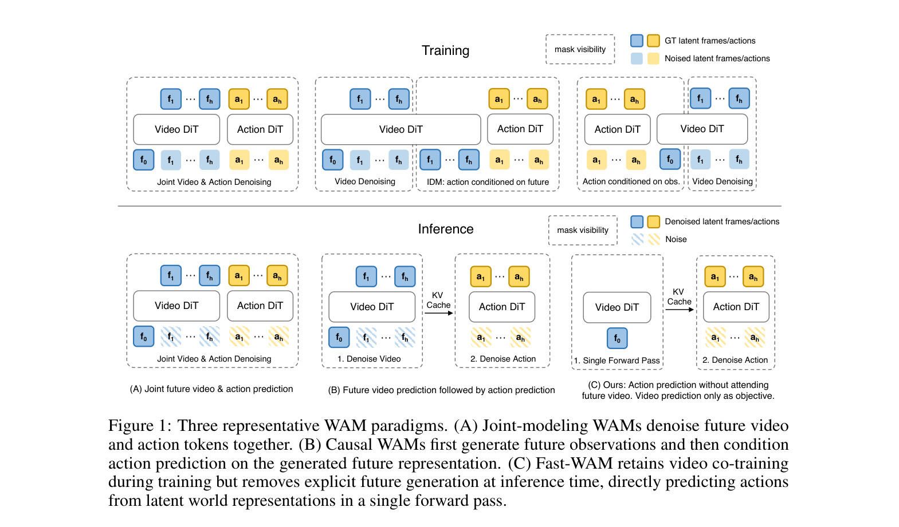
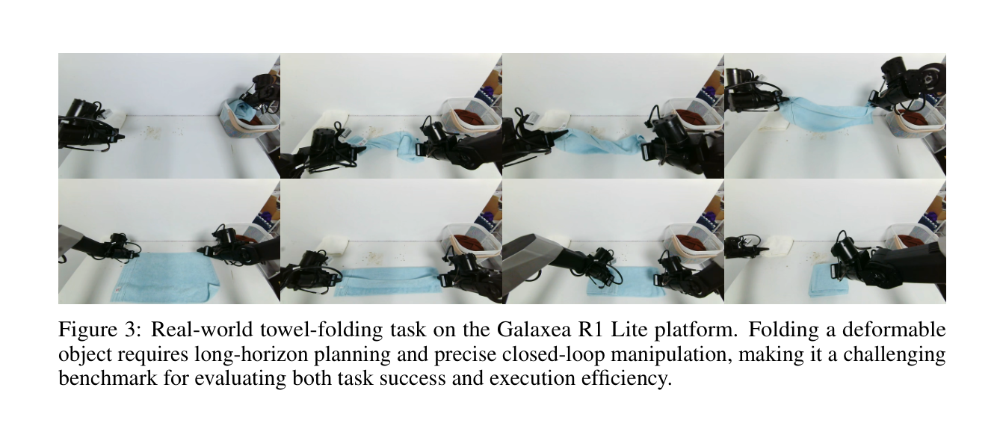
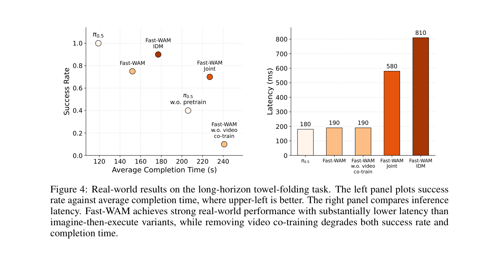

# Fast-WAM: Do World Action Models Need Test-time Future Imagination? 阅读总结

## 基本信息

**论文链接**：https://arxiv.org/abs/2603.16666

**项目页面**：https://yuantianyuan01.github.io/FastWAM/

**作者单位**：清华大学 IIIS、银河通用（Galaxea AI）

**作者**：Tianyuan Yuan、Zibin Dong、Yicheng Liu、Hang Zhao

**发表**：arXiv preprint 2603.16666v2, 2026.03.23

**核心问题**：世界动作模型（WAM）的性能收益主要来自训练期视频建模，还是测试期显式未来想象？

**重要性评估**：★★★★☆（4/5）—— 对 WAM 范式提出根本性质疑，给出清晰可复用的架构范式，对实时机器人部署有直接价值

---

## 研究背景

世界动作模型（World Action Models, WAMs）把"预测未来视频"和"预测动作"放进统一框架，相比主流的视觉-语言-动作（VLA）模型，多了一层显式建模世界动力学的诱惑。直觉上，如果模型能先"想象"出执行动作后的视觉未来，再据此选择动作，规划能力应该更强——这就是当前 WAM 普遍采用的 imagine-then-execute 范式。

但这条路线有一个明确的代价：测试时需要迭代去噪生成未来视频帧，推理延迟极高。LingBot-VA、Unified World Models、Motus 等代表工作的多步扩散，让在线实时控制变得困难。更深一层看，过去一年关于 WAM 的所有工作都隐含一个未经检验的假设——**显式生成未来是必要的**。

本文把这件事拆成两个独立因素：

- **训练期视频预测目标**：让视频分支学到物理合理的世界表征；
- **测试期显式未来生成**：在推理时实际去噪出未来帧，再据此选动作。

现有 WAM 把这两件事耦合在同一模型中，无法判断性能收益到底来自哪个。Fast-WAM 想回答的核心问题就是：在 WAM 中，**测试时是否真的需要"想象未来"**？如果答案是不需要，那么想象的成本就完全可以省掉，WAM 的部署形态会大幅简化。

论文把现有范式归为三类（如图 1）。(A) 联合建模：未来视频与动作在同一去噪过程中耦合；(B) 因果式：先生成未来视频，再用逆动力学取动作；(C) Fast-WAM：训练期保留视频联合训练，推理期跳过未来预测，直接从世界表征生成动作。

---

## 核心方法

### 总体思路

Fast-WAM 的做法可以一句话讲清楚：**把"视频预测是训练目标"与"视频生成是推理流程"解耦**。训练时仍用未来视频作为辅助监督信号塑造视频 DiT 的表征；推理时则彻底丢掉未来视频分支，只让视频 DiT 对当前观测做一次前向编码，把得到的"世界表征"喂给动作专家生成动作。这与 VLA 模型的"直接策略"接口完全一致，但表征学习仍由 WAM 式的视频目标驱动。

形式上，Fast-WAM 把动作分布写成 $p_\theta(a_{1:H} \mid o, l) = p_\theta(a_{1:H} \mid z(o, l))$，其中 $z(o, l)$ 是视频 DiT 对当前观测-语言上下文做一次前向编码得到的隐式世界表征。关键区别在于：$z(o, l)$ 不是通过显式去噪未来帧采样得到的，而是通过一次编码得到的。

### 模型架构

骨架是 Wan2.2-5B 的视频扩散 Transformer（video DiT），自带 T5 文本编码器和视频 VAE。Fast-WAM 在此基础上加一个 1B 的 action expert DiT，组成 Mixture-of-Transformer（MoT）共享注意力的双分支结构，整体约 6B 参数。

输入 token 分三组：

- **第一帧的干净 latent token**（共享视觉锚点）；
- **未来帧的带噪 latent token**（训练时用于视频建模，推理时彻底丢弃）；
- **动作 token**（由 action expert 处理）。

所有 token 都通过 cross-attention 接收文本条件。关键是一个结构化注意力掩码：动作 token 不能看到未来视频 token，未来视频 token 仅用于训练期的去噪监督；它们都允许看到第一帧的干净 token，第一帧 token 不关注其他任何 token。这样，未来信息绝不会泄漏到动作分支。

### 训练目标

采用统一的流匹配（flow matching）目标。对动作 $a_{1:H}$ 和未来视频 latent $z_{1:T}$ 分别构造噪声插值样本 $y_t = (1-t)y + t\varepsilon$，模型预测速度场：

$$\mathcal{L}_{\mathrm{FM}}(y) = \mathbb{E}_{y,\varepsilon,t}\left[\|f_\theta(y_t, t, o, l) - (\varepsilon - y)\|_2^2\right]$$

总体目标 $\mathcal{L} = \mathcal{L}_{\mathrm{act}} + \lambda \mathcal{L}_{\mathrm{vid}}$，其中 $\lambda$ 平衡动作学习与视频联合训练。视频预测作为辅助任务，对视频 DiT 的表征形成物理先验的塑形压力。

### 推理流程

推理时未来视频分支直接消失：只保留第一帧的干净 token，送入 video DiT 做一次前向，得到动作专家需要的隐式世界表征 $z(o, l)$，再由 action DiT 一步去噪出动作 chunk。10 步去噪、CFG=1.0，延迟压到 190 ms。

### 受控变体：把两个因素拆开

为了解耦"训练期视频目标"与"推理期未来生成"两个因素，作者在统一框架下构建了四个变体，所有变体共享 backbone、tokenization 和训练 recipe，只在两个轴上做修改：

| 变体 | 训练期视频目标 | 推理期未来生成 | 含义 |
|------|----------------|----------------|------|
| Fast-WAM | ✅ | ❌（单次前向） | 本文方法 |
| Fast-WAM-Joint | ✅ | ✅（联合去噪） | 类比 UniSim / Cosmos Policy |
| Fast-WAM-IDM | ✅ | ✅（先生成未来，再 IDM 取动作） | 类比 LingBot-VA |
| Fast-WAM w.o. video co-train | ❌ | ❌ | 仅控制训练目标贡献 |

通过这四个变体的两两对比，可以独立评估"训练期视频目标"和"推理期未来想象"各自的贡献——这是本文实验设计的关键。

---

## 实验结果

### 仿真基准

在 RoboTwin 2.0（双臂操作，50+ 任务）和 LIBERO（4 个 suite，40 任务）两个基准上评估。所有方法训练 20k-30k 步，Fast-WAM 不使用任何具身预训练。结果如下：

| 方法 | 具身预训练 | RoboTwin Avg | LIBERO Avg |
|------|-----------|--------------|------------|
| $\pi_0$ | ✅ | 62.2 | 94.1 |
| $\pi_{0.5}$ | ✅ | 79.8 | 96.9 |
| Motus | ✅ | 87.8 | 97.7 |
| LingBot-VA | ✅ | 92.2 | 98.5 |
| **Fast-WAM (Ours)** | ❌ | **91.8** | **97.6** |
| Fast-WAM-Joint | ❌ | 90.6 | 98.5 |
| Fast-WAM-IDM | ❌ | 91.3 | 98.0 |
| Fast-WAM w.o. video co-train | ❌ | 83.8 | 93.5 |

三个关键观察：

**第一，Fast-WAM 在没有任何具身预训练的前提下，与当前最强的 WAM 工作打平。** RoboTwin 91.8% vs LingBot-VA 92.2%，LIBERO 97.6% vs LingBot-VA 98.5% / Motus 97.7%。这说明基于通用视频预训练（Wan2.2-5B）的 WAM 训练，已经足够把"具身经验"和"世界动力学"耦合进来，不需要额外的具身数据预训练。

**第二，三个带视频联合训练的变体性能高度接近**（RoboTwin 90.6-91.8%，LIBERO 97.6-98.5%）。无论是"先想象再取动作"还是"联合去噪"，都几乎没有相对 Fast-WAM 的明显收益。换言之，**推理时做不做未来想象，几乎不影响最终结果**。

**第三，去掉视频联合训练则掉得很惨**：RoboTwin 跌 8 个百分点（91.8→83.8），LIBERO 跌 4 个百分点（97.6→93.5），尤其 Spatial 与 Long 子集退化明显。**训练期视频目标才是 WAM 收益的主要来源**。

### 真实世界叠毛巾任务

任务设定为 Galaxea R1 Lite 平台上的长程叠毛巾（变形物体），是评估长程规划与闭环控制效率的合适基准。60 小时遥操作数据，30k 步训练，报告成功率与平均完成时间。

从图 4 可见：

- **Fast-WAM 推理延迟仅 190 ms**，而 Fast-WAM-Joint 580 ms、Fast-WAM-IDM 810 ms——快 3-4 倍以上。这是去掉显式未来生成最直接的收益。
- **Fast-WAM 成功率与 $\pi_{0.5}$ 相当**（~0.8），完成时间 150 s 左右，比 Joint/IDM 略快。Fast-WAM-IDM 成功率最高（~0.9），但完成时间更长（~180 s）。
- **去掉视频联合训练则彻底崩溃**：成功率从 0.7-0.9 跌到 0.1，完成时间最长。视频目标对真实世界任务的贡献比仿真更突出。

总体上，这是一个"在仿真和真实世界都成立"的结论：**训练期视频目标塑造的世界表征是关键，推理期是否显式生成未来只是效率问题**。

---

## 局限与评价

**优点**：

- 提出一个对 WAM 范式具有根本性质疑的清晰问题，并通过严格受控变体给出了强证据。这比再加一个新的"imagine-then-execute"工作有意义得多。
- 架构简洁，结论可复用：Fast-WAM 的"训练期视频 + 推理期直接策略"范式，可以直接套到其他视频 backbone（不只是 Wan2.2-5B）和其他动作头（不一定是 MoT）上。
- 数据效率高：无需具身预训练就能追平有预训练的强基线，对资源受限的实验室非常友好。
- 延迟压到 190 ms 的实时水平，是真正能部署到真实机器人的工作。

**局限**：

- 只在"单步动作块生成（horizon=32）"下评估，没有讨论外层自回归 rollout 或长程规划场景。对真实长程任务里动作块的拼接与漂移问题没有触及。
- 没有讨论更大规模预训练数据（更多机器人轨迹、更多互联网视频）以及更大模型规模下，这一结论是否依然成立。视频建模的"表征红利"很可能随数据规模有变化。
- 真实世界实验仅"叠毛巾"一个任务，对其他长程任务（如整理桌面、备餐）的泛化性需要更多验证。
- 训练目标 $\mathcal{L} = \mathcal{L}_{\mathrm{act}} + \lambda \mathcal{L}_{\mathrm{vid}}$ 中 $\lambda$ 的选择对结果有影响，但论文没有系统 ablation。

**个人评价**：Fast-WAM 的价值不只在这一个模型上，而在它把"WAM 是否需要测试时未来想象"这件事从假设变成可证伪的命题。这种"拆解既有共识"的提问方式在 WAM 这类快速演化的领域特别稀缺——大家都在堆"更强的未来生成器"，而本文直接质疑"生成本身可能没必要"。这种工作通常不会立刻变成 SOTA，但会重塑后续工作的设计空间。可以预期，未来 WAM 工作的报告里，"去掉视频目标"会成为一个标准 ablation。另一个值得注意的副产品是"无需具身预训练"——这对大公司实验室是小事，对高校和初创团队是显著降低门槛。
