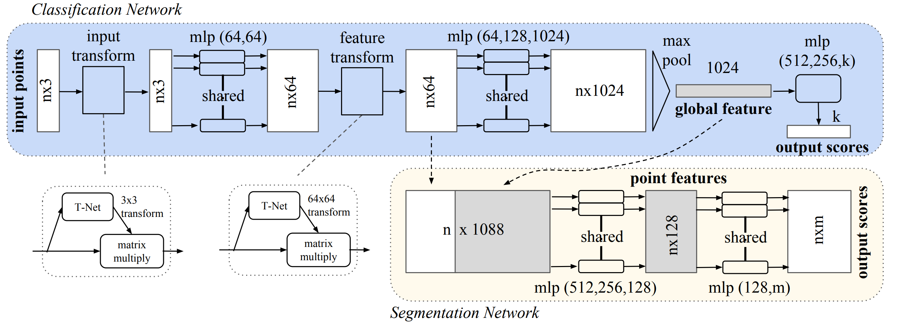
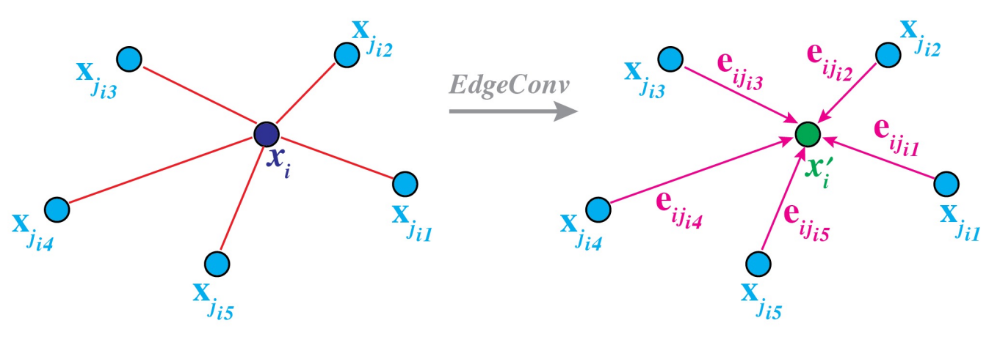
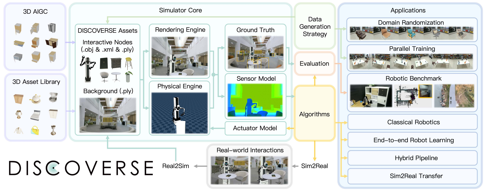
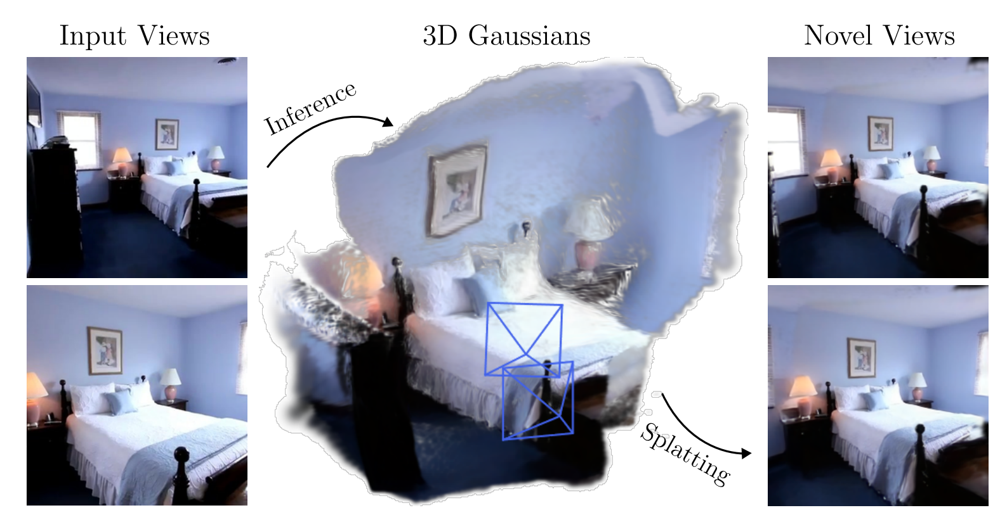
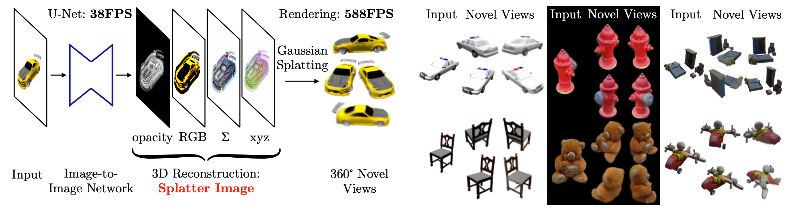
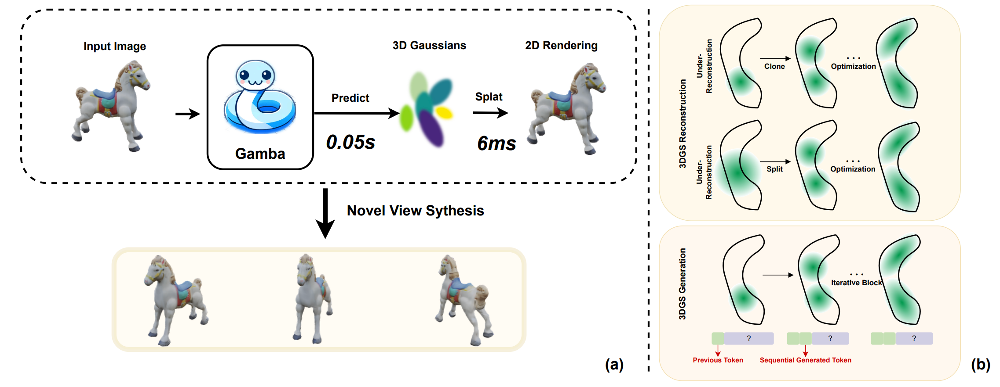

### 传统三维重建
#### 1.Structure-from-Motion Revisited
三维场景重建的现代流程通常始于运动恢复结构（Structure-from-Motion, SfM）。SfM 的核心目标是从一系列无序的二维图像中，同时恢复出相机的位姿（位置和朝向）。 Schönberger 与 Frahm（2016）的研究对增量式 SfM 流程进行了多维度革新：在特征提取阶段采用鲁棒性更强的局部特征（如 SIFT），通过暴力匹配结合 RANSAC 算法去除误匹配。在初始化阶段，从两帧图像的基础矩阵估计本质矩阵，进而分解得到初始相机外参与三维点云。在增量扩展阶段，通过透视 n 点（PnP）算法求解新图像的位姿，结合三角化生成新三维点，并引入 Bundle Adjustment（BA）优化策略 —— 通过最小化 3D 点在图像上的重投影误差，同时优化所有相机参数与三维点坐标，大幅提升位姿估计与稀疏几何的精度。最后通过外点过滤机制剔除低置信度三维点，保证稀疏点云的可靠性。该研究首次实现了 SfM 方法在大规模图像集上的高效、鲁棒运行，为后续开源工具的开发奠定了理论基础。

在此基础上，COLMAP (Schönberger et al., 2016) 作为集成 SfM 与 MVS 的开源软件库应运而生，成为三维重建领域的事实标准工具。其架构采用模块化设计，涵盖图像特征提取、特征匹配、增量式 SfM、稠密 MVS、网格重建等核心模块，支持 C++ 原生调用与 Python 绑定，兼顾了运行效率与易用性。在 SfM 模块中，COLMAP 严格遵循增量式优化框架，默认采用 SIFT 特征，支持多种相机模型（针孔相机、鱼眼相机等），可自适应处理无序图像序列、光照变化、尺度差异等复杂场景。在 MVS 模块中，通过多视图立体匹配技术，在 SfM 稀疏点云的基础上生成稠密点云或网格模型，填补了 SfM 与高精度重建之间的鸿沟。

#### 2.KinectFusion: Real-Time Dense Surface Mapping and Tracking

KinectFusion 是实时稠密重建领域的开创性工作。它利用Kinect深度相机，实现了在普通PC上对动态场景进行实时（~30fps）的、亚厘米级精度的稠密表面重建和相机跟踪。其核心创新在于引入了GPU加速的迭代最近点（ICP）算法和TSDF（Truncated Signed Distance Function）体积融合技术，使得在短时间内积累并融合大量深度帧成为可能。其重建结果是一个静态的体积网格，无法处理大范围运动或长时间的场景变化，也完全不具备语义理解能力。它代表了从离线重建向在线、实时重建的重要跨越，但其输出仍停留在纯几何层面，未能满足更高层次的智能需求。

### 点云处理
#### PointNet: Deep Learning on Point Sets for 3D Classification and Segmentation

PointNet 是点云深度学习领域的开山之作。它首次证明了可以直接在无序的点云数据上应用深度神经网络，而无需将其转换为体素或网格等结构化表示。其核心创新在于设计了一个简单的网络架构，包含一个共享的MLP（多层感知机）用于提取每个点的特征，以及一个对称函数（最大池化）用于聚合所有点的信息，从而保证了网络对输入点云顺序的不变性，它的主要缺点是忽略了点与点之间的局部结构信息，导致在处理复杂形状时性能有限。

#### Dynamic Graph CNN for Learning on Point Clouds

DGCNN 则是从全局特征提取向局部结构建模演进的代表性工作，它是在 PointNet 的基础上进行了重要改进。通过引入动态图（Dynamic Graph）的概念，使模型重点理解点云中的局部几何结构。在每一层网络中，它会根据当前层的特征重新计算点与点之间的K近邻关系，构建一个动态的图结构，然后在这个图上应用图卷积操作来捕捉局部上下文信息。它使网络能够适应不同层次的语义信息，从而更好地建模点云的局部结构。DGCNN 解决了 PointNet 忽略局部结构的问题，在点云分割和分类任务上取得了显著优于 PointNet 的性能。然而，它的计算复杂度较高，且图的构建依赖于欧氏距离，对于非均匀采样的点云可能不够鲁棒。

#### NeRF: Representing Scenes as Neural Radiance Fields for View Synthesis
https://hjfy.top/arxiv/2003.08934

在三维场景新视角合成的研究中，NeRF（神经辐射场）作为一种通过神经网络隐式表达 3D 场景的技术，其核心是提出 5D 神经辐射场来表征复杂场景：以位置$(x,y,z)$与相机方向$(\theta,\phi)$构成的 5D 信息为输入，经神经网络映射输出 RGB 颜色与体密度（记为$F_\theta = (x,d) \to (\boldsymbol{c}, \sigma)$，其中体密度$\sigma$仅与位置相关、颜色$\boldsymbol{c}$关联位置与方向），并通过沿相机射线随机采样 5D 点实现数据输入。为实现可微的渲染过程，NeRF 基于体渲染（volume rendering）技术，结合吸收、放射等光学效应，将最终颜色定义为
$$
C(\mathbf{r}) = \int_{t_{\text{near}}}^{t_{\text{far}}} T(t)\sigma(\mathbf{r}(t))\mathbf{c}(\mathbf{r}(t), \mathbf{d}) dt
$$
其中透射率$T(t) = \exp\left( -\int_{t_{\text{near}}}^{t} \sigma(\mathbf{r}(s)) ds \right)$。
针对 MLP 对高频信息拟合不足的问题，NeRF 引入位置编码（Positional encoding），通过高频函数
$$
\gamma(p) = \left( \sin(2^0 \pi p), \cos(2^0 \pi p), ..., \sin(2^{L-1} \pi p), \cos(2^{L-1} \pi p) \right)
$$
将输入映射到高维空间（坐标取$L=10$、视角方向取$L=4$，输入维度从 5 扩展至 76）；同时采用分层体采样（Hierarchical volume sampling）提升效率：先采样 64 个点得到概率密度，再分区域采样 128 个点，合并后同时优化粗、细网络，损失函数定义为
$$
\mathcal{L} = \sum_{\mathbf{r} \in \mathcal{R}} \left\| \hat{C}_c(\mathbf{r}) - C(\mathbf{r}) \right\|^2 + \left\| \hat{C}_f(\mathbf{r}) - C(\mathbf{r}) \right\|^2
$$
最终实现高质量的场景新视角合成。

Fourier features let networks learn high frequency functions in low dimensional domains这篇论文并非独立的重建方法，而是对NeRF性能提升至关重要的技术贡献。它发现标准的MLP网络难以学习高频细节（如锐利边缘、精细纹理），这是NeRF早期版本渲染质量不佳的原因之一。为此，作者提出了一种“位置编码”（Positional Encoding）技术，将输入坐标映射到一个高维的傅里叶特征空间，从而使网络更容易学习高频函数。其主要创新在于“高频编码技巧”，它解决了“如何让神经网络有效学习复杂、高频的视觉信号”的技术瓶颈。这一技术被迅速采纳为NeRF的标准组件，极大地提升了其渲染质量和收敛速度。虽然它本身不解决重建或理解问题，但它是使NeRF从理论走向实用的关键一环，体现了底层技术突破对整个领域发展的巨大推动力。

#### Instant Neural Graphics Primitives with a Multiresolution Hash Encoding
Instant NGP作为一项重要技术，与 NeRF 存在显著技术差异：NeRF 是对图像中每个像素生成射线，将场景所有信息存储于 MLP 中，而 Instant NGP 则是将 3D 模型信息编码到哈希表中，再以该哈希表作为 MLP 的输入，大幅缩小了 MLP 的规模。其核心的哈希编码流程为，先将空间划分为网格，网格顶点对应量化坐标，再建立网格顶点坐标到长度为T的哈希表的索引，随后对输入点x找到其相邻网格顶点，通过哈希函数获取顶点在哈希表中的索引并取出对应值，最后利用相邻顶点的值通过线性插值得到输入点x的最终编码值。位置编码作为将低维输入映射到高维空间的关键手段，分为固定编码和可学习编码两类，其中固定编码采用固定映射方式，如 NeRF 的频率编码，将$(x,y,z)$映射为$(x,\sin2^0x,\cos2^0x,y,\sin2^0y,\cos2^0y,z,\sin2^0z,\cos2^0z…)$，维度从 3 维扩展为$3+6*L$维（L为频率层级），可学习编码的编码则由模型学习得到而非固定映射，实现方式是通过 Dense Grid 对网格顶点的编码进行学习，分为单分辨率与多分辨率两种。单分辨率编码是将三维空间缩放到$[0,1]$区间，划分为n×n×n网格（如128×128×128），每个网格顶点的编码维度为 16 时总参数数量为 33.6M，但这种编码方式仅 2.57% 的编码对应场景表面且缺乏平滑性；多分辨率编码的参数少于单分辨率却效果更优，不过若为提升效果缩小网格，参数数量会呈三次方增长，因此其核心需求是仅在物体区域进行合理编码，无需关注空区域。多分辨率哈希编码的具体实现步骤为，先按多分辨率方式将三维空间划分为不同大小的网格，再让每个网格点通过哈希函数映射到哈希表对应位置，为每个分辨率的网格分配独立哈希表，低分辨率哈希表较短、高分辨率哈希表较长，接着对哈希表中的每项对应网格点的可学习编码进行学习，最后借助哈希表长度远小于原网格顶点数的特性实现参数压缩，如\(512×512×512=2^{27}\)的网格可压缩至\(2^{24}\)规模，其哈希函数为\(h(x) = \left( \bigoplus_{i=1}^{d} x_i \pi_i \right) \mod T\)，其中\(\pi_1=1\)、\(\pi_2=2654435761\)、\(\pi_3=805459861\)，实际计算为\((x*\pi_1) \oplus (y*\pi_2) \oplus (z*\pi_3) \mod T\)，而哈希冲突的处理则是利用空网格在反向传播中无作用的特点，借助稀疏性降低冲突影响，且多分辨率下粗网格的规模与哈希表长度接近，几乎不会产生冲突。该技术的核心参数包括层级数L（16）、哈希表大小T（\(2^{14}\)到\(2^{24}\)）、特征维度F（2）等，实验结果显示，其训练速度较 NeRF 的频率编码快 8 倍以上，且重建精度有所提升，如 PSNR 从 22.90 提升至 24.58。

Multiview Neural Surface Reconstruction by Disentangling Geometry and Appearance
这篇论文试图解决NeRF的一个根本性问题：其隐式表示将几何和外观耦合在一起，导致难以分离和操控。作者提出了一种“解耦”的方法，将场景分解为一个独立的几何表面（由一个隐式函数定义）和一个独立的外观场（定义表面的颜色和材质）。通过引入额外的约束（如法向一致性），网络可以学习到更合理的几何和外观。其主要创新在于“几何-外观解耦”，它解决了“如何从NeRF中分离出纯净的几何结构”的难题，为后续的语义注入和几何编辑提供了便利。虽然其解耦效果并非完美，但它开辟了从“整体建模”向“分治建模”的新思路，是迈向可解释、可操作的3D表示的重要一步。

Semantic NeRF 是将语义信息引入NeRF框架的早期代表性工作。它在标准NeRF的基础上增加了一个分支，用于预测每个采样点的语义标签（如“墙壁”、“椅子”）。通过共享底层特征，实现了重建和语义预测的联合优化。然而，其局限性在于语义预测是像素级的，缺乏实例区分能力，且语义信息并未反向指导几何重建过程，两者仍是松耦合的。它标志着NeRF从“纯视觉”向“语义视觉”的初步迈进，但距离真正的“理解”还有很大差距。

InstanceNeRF 在 Semantic NeRF 的基础上更进一步，实现了对场景中不同物体实例的区分。它在NeRF中增加了实例分割分支，为每个采样点预测一个实例ID。可以在NeRF的场景中识别和区分不同的物体实例，是迈向高级场景理解的关键一步。通过实例ID，可以对场景中的物体进行单独的操作或查询。然而，其局限性在于实例分割的精度受制于NeRF本身的采样密度，且实例信息同样未用于指导几何重建，两者依然是平行的。它代表了从“类别级语义”向“实例级语义”的演进，为构建更精细的场景模型奠定了基础。

3DGS 是对NeRF的一次颠覆性革新。它放弃了隐式神经网络，转而采用一种显式的、基于3D高斯分布的表示方法。场景由数百万个带有位置、协方差、颜色和透明度属性的高斯椭球组成。在渲染过程中，每个三维高斯都会投影到二维屏幕上形成一个椭圆形的二维高斯分布，其在屏幕空间的形状与方向由三维协方差经过投影雅可比矩阵变换得到。渲染阶段通过对这些二维高斯进行逐像素的累积融合，实现了与体渲染类似的 alpha blending 效果，渲染过程完全采用 GPU 的并行光栅化管线，速度通常可达到数十至数百帧每秒，使得交互式和实时应用成为可能。

在外观建模方面，3DGS 使用球谐函数作为视角相关颜色建模方式，以替代 NeRF 中依赖 MLP 的可视角反射模型。球谐函数具有显式、可微、计算成本低的优点，能够在保证渲染质量的前提下有效表达视角相关的光照变化。由于3DGS本质上依赖大量局部高斯体来近似场景几何，对于具有复杂拓扑结构、薄结构或需要连续隐式场先验的任务表达能力较差。此外，3DGS 的表示虽然显式，却缺乏高层语义结构，因此直接进行语义理解、场景编辑或跨视角一致的形变操作仍具有一定难度。

SemGaussian Pipeline
SemGaussian 是首批尝试为3DGS注入语义信息的工作之一。它利用一个预训练的视觉-语言模型（如CLIP），将每个3D高斯点与一个开放词汇的语义嵌入向量关联起来。利用开放词汇语义嵌入的方式，解决了“如何让3DGS理解任意类别语义”的问题，避免对固定类别集的依赖。通过优化高斯参数和语义嵌入，模型可以实现新视角合成和开放词汇的语义查询。然而，其语义信息是附加的，并未反向指导高斯本身的几何优化（如位置、协方差），两者仍是松耦合的。

Adaptive Density Control for 3D Gaussian Splatting
原始3DGS的高斯密度控制依赖于一个静态的SfM点云，这限制了其在复杂区域（如细节丰富的纹理或稀疏的背景）的表现力。该工作提出了一种自适应的密度控制机制，在训练过程中动态地分裂或克隆高斯点，以更好地覆盖场景。通过自动优化高斯分布以适应场景复杂度的方式，使模型在训练过程中动态进行高斯管理，从而在细节保留和渲染效率之间取得更好的平衡。为后续语义信息对密度分配的潜在指导提供了思路。

Editing 3D Scenes with Gaussian Splatting 探索了3DGS的可编辑性。由于高斯椭球显式参数化的特点，3DGS天然比NeRF更容易进行编辑。这篇论文展示了如何对选定的高斯子集进行移动、缩放、删除或风格迁移等操作，并能实时看到编辑效果。基于此可以做到直观、实时的3D场景编辑，可以让用户方便地修改神经渲染场景。然而，编辑操作是几何和外观层面的，虽然有部分的场景语义信息的加入，但并未实现对场景深层语义的理解与联动编辑，编辑后的场景可能出现几何冲突或语义逻辑矛盾。

GS-NeRF: Bridging Gaussian Splatting and Neural Radiance Fields
该工作试图融合3DGS和NeRF的优点。它使用3DGS作为快速、显式的几何表示，同时用一个轻量级的NeRF网络来建模精细的外观细节和光照效果。其核心创新在于“混合表示”，可以在保持3DGS效率的同时，获得NeRF级别的精细外观。通过这种结合，模型在复杂光照和非朗伯反射材质上表现更佳。然而，混合架构增加了系统复杂性，且语义理解问题仍未解决。

将语义分割能力引入3DGS是一个新兴的研究热点。作为开创性探索，SemGaussian (Chen et al., 2023) 首次在3DGS框架内实现了开放词汇的语义查询，证明了其承载语义信息的潜力。紧随其后，3D Segment Anything (Wu et al., 2024) 巧妙地将强大的2D基础模型SAM与3DGS相结合，通过多视角2D分割结果的融合，实现了零样本的3D场景分割，为该方向提供了极具价值的技术范式。这些工作表明，3DGS的显式点云式表示，使其天然适合作为3D分割的载体，可以借鉴和改造点云分割领域成熟的模型架构（如PointNet++, Qi et al., 2017）进行处理。

《Rethinking End-to-End 2D to 3D Scene Segmentation in Gaussian Splatting》
该工作首次提出了一种端到端的联合优化框架，将3D高斯的几何参数（位置、协方差）与语义分割标签进行协同学习。其核心创新在于引入了“语义引导的几何正则化”机制，使语义信息能反向约束几何形状的优化，从而在根本上解决了重建与分割任务割裂的问题。对于您的研究，此工作提供了最直接的理论框架和方法论启示，证明了在3DGS内部实现几何-语义深度融合的可行性，是您构建一体化模型的重要基石和对标基准。

《Gaussian Grouping: Segment and Edit Anything in 3D Scenes》

该论文开创性地利用自监督2D视觉特征（如DINO），通过在3D高斯点集上进行聚类分组，实现了无需任何3D标注的、交互式的“零样本”3D分割与编辑。其主要创新在于将3DGS的显式表示优势与强大的2D基础模型相结合，提供了一种极其灵活、用户友好的场景理解与操作范式。对您的研究而言，此工作展示了3DGS在交互性和易用性方面的巨大潜力，并为您提供了一条可行的技术路径——即利用2D预训练模型来驱动3D语义理解，尤其适用于标注数据稀缺的场景。

《Segment Any 3D Gaussians》 (Wu et al., arXiv:2401.02093)

该研究系统性地将Segment Anything Model (SAM) 这一强大的2D基础模型迁移到3DGS领域。其核心创新在于设计了一套鲁棒的多视角2D分割结果融合与优化流程，将2D掩码“提升”为一致的3D语义标签。在您的论文中，此工作是连接2D与3D世界的关键桥梁。它提供了一种务实、高效的方案，使您能够利用海量、高质量的2D分割数据来监督3DGS的语义学习，是您解决3D语义数据瓶颈问题的核心技术参考。

FlashSplat: 2D to 3D Gaussian Splatting Segmentation Solved Optimally》

该工作从最优传输（Optimal Transport）的理论高度，为2D到3D分割的提升问题提供了数学上最优且端到端可微的解决方案。其主要创新在于将多视角语义一致性建模为一个全局优化问题，显著提升了3D分割结果的几何一致性与鲁棒性。对您的研究，此工作提供了处理多视角信息融合的先进理论工具。当您需要确保分割结果在复杂视角下依然保持稳定和准确时，FlashSplat的优化框架可作为您模型后端或损失函数设计的重要借鉴。

《Editing Conditional Radiance Fields》

尽管该工作基于NeRF而非3DGS，但其核心贡献在于为隐式神经表示（如NeRF）设计了一种条件化的、局部的编辑机制。其创新点在于通过插入轻量级编辑模块，实现了对预训练大型模型的高效、语义化修改。在您的论文中，此工作扮演着重要的对比和衬托角色。它深刻揭示了隐式表示（NeRF），从而有力地论证了转向显式、可编辑的3DGS表示进行场景理解研究的必要性和优越性。

VGGT通过视觉特征引导几何 Transformer 的注意力机制，实现视觉语义与几何结构的精准对齐，解决传统 Transformer 在 3D 重建中缺乏视觉语义指导、几何建模与图像内容脱节的问题。在本论文中，其视觉 - 几何注意力对齐机制为融合模型的跨模态融合模块提供直接参考，罗列该文献是因为本研究的核心是语义与几何的协同建模，该文献的注意力对齐思路可有效解决跨模态特征融合不充分的问题。

IGGT: INSTANCE-GROUNDED GEOMETRY TRANSFORMER FOR SEMANTIC 3D RECONSTRUCTION
作为重建与理解统一框架的代表性研究，其核心创新是提出实例接地（Instance-Grounded）机制，通过几何 Transformer 将场景实例语义与三维几何结构进行端到端绑定，同时构建 InsScene-15K 大规模实例级数据集，解决传统方法中几何重建与语义理解分离导致的一致性差、实例级建模缺失的问题。在本论文中，该文献是 “统一框架设计” 的核心参考，其 Instance-Grounded 机制为设计语义 - 几何协同模块提供直接思路，所构建的数据集可作为模型训练与评估的基准，罗列该文献是因为它首次系统性实现了实例级语义与几何重建的深度融合，为本研究明确了核心技术路线与数据支撑方案。

该研究提出首个统一、模块化的基于 3D 高斯溅射（3DGS）的机器人仿真框架 DISCOVERSE，核心创新是构建完整 Real2Sim 流水线，通过 Mesh-Gaussian 迁移、物理重光照等技术，合成复杂真实场景的高保真几何与外观，同时无缝集成 3DGS 渲染引擎、MuJoCo 物理引擎与 ROS2 接口，支持多传感器并行仿真与精确物理模拟，解决传统仿真器 Sim2Real 视觉差距大、配置复杂、鲁棒性不足的问题。在本论文中，其 3DGS 与物理引擎的融合思路可为 “重建 - 理解 - 应用” 全链路提供参考，所提高保真场景生成方案能支撑融合模型的真实场景适配验证，罗列该文献是因为它拓展了 3D 重建与理解技术在机器人仿真的应用场景，其模块化架构也为融合模型的工程化部署提供了关键参考。

pixelSplat（CVPR 2024 Oral, Best Paper Runner-Up）是 feed-forward 3D Gaussian Splatting 领域的开创性工作之一，其核心贡献在于首次将 3D 高斯表示成功嵌入端到端可微的深度学习框架中。传统基于 per-scene optimization 的 3DGS 方法依赖不可微的启发式策略（如 pruning 与 division）来动态调整高斯基元数量，这在泛化建模中不可行。为克服局部极小值问题，pixelSplat 提出通过编码器预测每个像素对应高斯位置的概率分布，并借助重参数化技巧实现可微采样，从而在训练过程中隐式地生成或删除高斯，保持梯度流畅通。该方法仅需一对图像输入，利用对极 Transformer 学习跨视图特征，展现出强大的可扩展性。然而，其几何重建质量受限于从图像特征到深度分布映射的固有模糊性，常在弱纹理或遮挡区域产生噪声与几何伪影，限制了其在高精度场景中的应用。

Splatter Image（CVPR 2024）则以极简设计实现了超高效的单视图重建。其核心思想是将输入图像通过一个 2D U-Net 映射为“Splatter Image”——一幅每像素对应一个 3D 高斯参数的图像。这种 pixel-aligned 表示将 3D 重建问题转化为 image-to-image 翻译任务，避免了复杂的 3D 算子，大幅提升了计算效率。尤为引人注目的是，即便仅观测单侧视角，网络仍能借助训练先验隐式编码物体背面信息：通过调整深度与 3D 偏移量，将部分高斯分配至不可见区域，从而实现近似 360° 重建。然而，该方法主要适用于对象级重建，面对大规模或复杂场景时，单视图固有的几何模糊性使其泛化能力显著受限。

AGG（TMLR 2024）进一步探索了生成式建模范式在 3DGS 中的潜力，提出一种级联式摊销生成架构。该方法包含一个粗生成器预测稀疏高斯混合，以及一个超分辨率模块生成密集高斯表示。通过分阶段建模，AGG 在保持端到端可训练性的同时，实现了从粗到细的细节恢复。尽管未开源，其设计思路为平衡重建效率与细节保真度提供了新视角，也反映了生成模型从 NeRF 向显式表示迁移的趋势。

Gamba（TPAMI 2025）则另辟蹊径，首次将状态空间模型 Mamba 引入 3D 重建领域。与主流 Transformer 架构不同，Gamba 利用 Mamba 的长程建模能力与线性计算复杂度优势，直接从单视图图像预测 3D 高斯参数，仅通过多视角渲染损失进行监督。该工作不仅验证了非注意力架构在 3D 感知任务中的可行性，也拓展了 feed-forward 3DGS 的模型多样性，为高效、可扩展的 3D 生成提供了新路径。

MVSplat（Oral，进入 ECCV 2024，）成为多视图 feed-forward 3DGS 的代表性突破。该方法通过 plane sweeping 构建多视图 cost volume，以此编码跨视角几何一致性，并联合预测深度与其他高斯属性。其核心洞见在于：将高斯中心定位问题重新表述为基于特征匹配识别表面点的任务，显著降低了学习难度。MVSplat 以轻量模型实现高效重建，但其性能仍受制于传统多视图立体视觉的固有缺陷，如遮挡与无纹理区域的匹配失败，这促使后续工作探索与单目深度先验的融合。

GRM（ECCV 2024）则代表了大模型在 3D 重建中的前沿探索。该方法构建了一个纯 Transformer 架构的大型高斯重建模型，将输入像素直接映射为 pixel-aligned 3D 高斯，摒弃了 triplane 等中间表示。其创新之处在于设计了一种基于窗口化自注意力的上采样器，能高效传递非局部视觉线索，从而生成密集高斯集。尽管尚未开源，GRM 展示了大模型在 3D 重建与生成中的广阔前景，也预示着“3D 大模型”时代的来临。

GS-LRM（ECCV 2024）进一步简化架构，提出一种无需 triplane 的 LRM 变体。它将输入图像分块后送入 Transformer，直接回归每个像素对应的 3D 高斯参数。由于输入与输出在像素空间对齐，该方法能更好地保留高频细节，并灵活适应不同分辨率输入，克服了固定 triplane 分辨率的限制。这种“像素到高斯”的直接映射范式，为高效、高保真重建提供了新路径，也反映了从中间表示向端到端对齐的架构演进趋势。

latentSplat（ECCV 2024）则从概率生成角度切入，构建了一个变分自编码器框架。其编码器通过极线 Transformer 生成潜在 3D 高斯表示，解码器则结合 VAE-GAN 结构实现高效渲染。该方法探索了 3DGS 的概率生成能力，并尝试通过球谐函数系数的采样实现语义控制，为可控 3D 内容生成奠定基础，尽管其计算开销与训练稳定性仍需进一步优化。

MVSGaussian（ECCV 2024）系统性地分析了泛化 3DGS 面临的三大挑战：表示泛化性、渲染复杂性与时序微调效率，并提出综合解决方案。该方法利用 MVS 编码几何感知的像素对齐高斯；引入混合渲染（splatting + volume rendering）提升新视角合成质量；并通过多视图几何一致性聚合策略，为 per-scene 微调提供高质量初始化。其端到端可训练框架兼顾效率与质量，为实用化部署提供了可行路径。

Gaussian Graph Network（NeurIPS 2024）从关系建模角度突破传统 pixel-aligned 假设。该方法构建高斯图，将高斯视为图节点，并设计高斯权重矩阵与高斯池化操作，在高斯域内显式建模组间交互。通过图网络传播信息，GGN 有效缓解了多视图高斯简单聚合导致的伪影与冗余问题，提升了表示一致性与结构完整性，首次将图网络思想成功拓展至显式 3D 表示学习。

TranSplat（AAAI 2025）聚焦于多视图匹配的鲁棒性问题，尤其针对稀疏视图中存在大量非重叠或相似区域的场景。其提出 Depth-Aware Deformable Matching Transformer（DDMT）模块，结合单目深度先验与可变形注意力机制，优先匹配高置信度深度候选点，并通过 U-Net 进一步细化深度分布。尽管推理时间略有增加，但其在几何一致深度估计上的改进为高斯定位提供了更可靠基础，体现了先验引导与精细化匹配的结合价值。

HiSplat（ICLR 2025）则引入分层表示机制，以解决单尺度高斯难以兼顾大结构与细纹理的问题。其采用 coarse-to-fine U-Net 提取多尺度特征，并设计“错误感知模块”与“调制融合模块”：前者引导细粒度高斯补偿粗粒度误差（高斯补偿），后者基于渲染质量重新加权大尺度高斯不透明度（高斯修复）。通过联合优化多尺度高斯，HiSplat 在大规模场景重建中显著减少裂缝、模糊与错位伪影，为显式表示引入层次化建模范式。

DepthSplat（CVPR 2025）将 3DGS 与深度估计两大任务深度耦合。它集成预训练单目深度模型（如 Depth Anything v2）到多视图 cost volume 中，在保持多视角一致性的前提下提升遮挡与弱纹理区域的深度鲁棒性。更重要的是，该工作反向证明：3D 高斯重建可作为无监督预训练目标，用于从大规模多视图数据中学习更强深度模型，实现了双向增益，推动了跨任务协同学习的发展。

MonoSplat（CVPR 2025）则进一步简化架构，直接利用冻结的单目深度基础模型，通过单目-多目特征适配器将单视图特征转换为具跨视角感知能力的表示，并集成到高斯预测中。相比双分支设计，MonoSplat 避免了参数冗余，在零样本泛化场景下展现出更强鲁棒性，验证了基础模型先验在 3D 重建中的巨大潜力，也呼应了“利用预训练大模型赋能下游任务”的通用范式。

JointSplat 探索了光流与深度的联合优化，通过概率机制融合二者信息以提升稀疏视图下的深度估计精度；而 PM-Loss 则引入 3D 点图作为直接几何监督，突破传统仅依赖 2D 渲染损失的局限，显著增强形状保真度，体现了从纯图像监督向几何约束融合的演进趋势。

在应用拓展方面，Generalizable Human Gaussians 与 HumanSplat 共同推动了人体 3DGS 的泛化能力，前者利用多支架 UV 空间聚合几何与外观，后者融合多视图扩散先验与人体结构先验；DrivingForward 实现了面向自动驾驶的环视场景实时重建；EVolSplat 提出基于体素的高斯表示以提升城市场景效率；而 X-GRM 则将 feed-forward 3DGS 首次应用于医学影像领域，从稀疏 X 射线重建 CT 体积，展示了该范式在跨模态三维感知中的广阔前景。