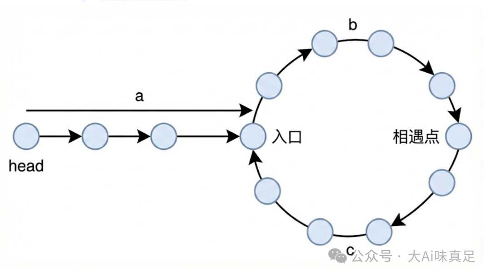

**第一次相遇时，两个指针各走了多远？**

- slow 走了：a + b
- fast 走了：a + b + n(b + c)，其中 n 是 fast 在环里绕的圈数，n ≥ 1

因为 fast 的速度是 slow 的两倍，所以 fast 走的距离是 slow 的两倍：
2(a + b) = a + b + n(b + c)  
化简：a + b = n(b + c)
变形：a = n(b + c) - b = (n-1)(b + c) + c  
**这个等式在说什么？**
a = (n-1) 圈环长 + c
意思是：从 head 走到环入口的距离 a，等于从相遇点出发绕 (n-1) 圈再走 c 步的距离。
当 n = 1 时（最简单的情况）：**a = c**
也就是说，从 head 到入口的距离，恰好等于从相遇点到入口的距离！

所以我们让一个指针从 head 出发，一个从相遇点出发，都一步一步走，它们一定会在入口相遇。
