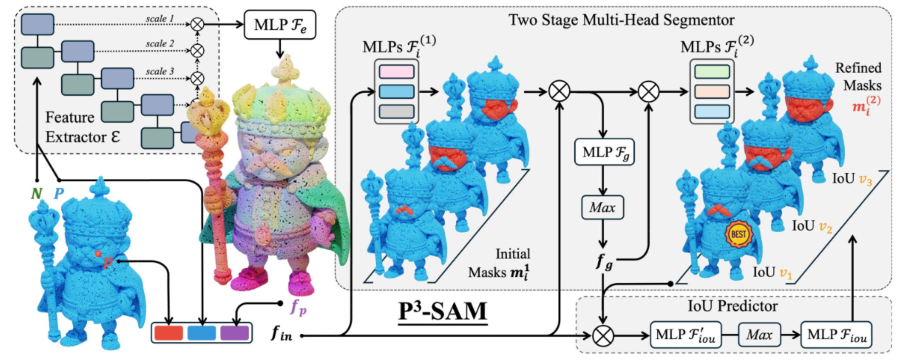
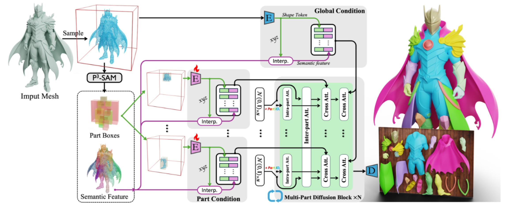

# P3-SAM

https://hjfy.top/arxiv/2509.06784

通过某个点提示就能分割出某个部件

输入点云被送入**特征提取器**以获得**逐点特征**。这些特征、点提示以及原始点云随后被送入一个**两阶段多掩码分割器**，以在不同尺度下获得**三个**掩码。最后，使用 IoU 预测器评估掩码的质量，并选择最佳的一个作为最终预测

**@ 输入：**
- 输入网格 M 采样的点云 $P\in R^{N_p \times 3}$ 
- 输入网格 M 采样的点云法向量 $P\in R^{N_p \times 3}$ 
- 指示待分隔部件的点 $P\in R^{N_p \times 3}$ 
**@ 输出：**

**1、特征提取器：**

最近的点云编码器在各种点云任务上取得了优异的结果，尤其是自监督预训练的 Point Transformer V3 ，即 Sonata 。我们随后采用**带有预训练权重的 Sonata 作为特征提取器 $\mathcal{E}$，** 以从点云中提取多尺度特征。然后将这些多尺度特征进行聚合，并使用一个权重共享的 MLP $\mathcal{F}_e$ 来获得逐点特征 $f$，

$$
f_{\rm p} = \mathcal{F}_e\left(\mathcal{E}(\mathbf{P},N)_1, \mathcal{E}(\mathbf{P},N)_2, \dots, \mathcal{E}(\mathbf{P},N)_n\right)
$$

其中下标表示不同尺度下的特征。这些逐点特征只需预测一次，即可用于通过不同的点提示预测部件掩码。

**2、两阶段多头分割器：**

部件数据集整合了多种数据源，这些数据源可能涉及不同的粒度以及冲突的部件分离标准。
点提示在指示部件的具体尺度时可能存在歧义，如 SAM 中所述

因此，我们采用**多头分割器在多个尺度上预测多种替代掩码**，以缓解这种冲突和歧义。
多头分割器包含两阶段预测过程。
==第一阶段==，三个 MLP $\mathcal{F}_i^{(1)}$ 采用**混合输入 $f_{\rm in}$**，包括逐点特征 $f_{\rm p}$、输入点 $\mathbf{P}$ 以及 $N_p$ 个点提示的副本 $\mathbf{p}$，来预测三个不同的掩码：

$$
m_i^{(1)} = \mathcal{F}_i^{(1)}(f_{\rm in}) = \mathcal{F}_i^{(1)}(f_{\rm p}, \mathbf{P}, \mathbf{p}),\ i=1,2,3
$$

然而，第一阶段是一种简单实现，缺乏全局信息的支持。

==在第二阶段==，引入全局特征，并基于第一阶段的结果重新预测三个掩码。如图\ref{fig:your_fig_label}所示，我们使用一个 MLP $\mathcal{F}_g$ 预测逐点特征，并沿点维度进行最大汇聚。我们利用一个 MLP $\mathcal{F}_g$ 预测逐点特征，并沿点维度进行最大汇聚以获得全局特征：

$$
f_g = {\rm MaxPool}\left(\mathcal{F}_g(f_{\rm in}, m_1^{(1)}, m_2^{(1)}, m_3^{(1)})\right)
$$

==最后==，三个新的 MLP $\mathcal{F}_i^{(2)}$ 用于基于全局特征和第一阶段的结果预测更精确的结果：

$$
m_i^{(2)} = \mathcal{F}_i^{(2)}(f_{\rm in}, f_g, m_1^{(1)}, m_2^{(1)}, m_3^{(1)}),\ i=1,2,3
$$在第二阶段优化第一阶段结果的同时，初始掩码 $m_i^{(1)}$ 也有助于第二阶段将全局特征提取聚焦于需要分割的部件，使特征抽取更加高效，并提升分割结果的准确率。 

**3、IoU 预测器：**

为了实现对最佳掩码的自动识别，我们引入了一个 IoU 预测器来评估 $m_1^{(2)}, m_2^{(2)}, m_3^{(2)}$ 的质量，并选择最佳掩码作为网络的最终预测结果。该评估通过直接预测**预测掩码与真实值掩码之间的 IoU 值来实现**。IoU 预测器首先使用一个 MLP $\mathcal{F}'_{\rm iou}$ 和最大汇聚从全局特征以及第二阶段的三个掩码中获取全局特征，然后利用另一个 MLP $\mathcal{F}_{\rm iou}$ 预测三个 IoU 值：
$$

v_1, v_2, v_3 = \mathcal{F}_{\rm iou}\left({\rm MaxPool}\left(\mathcal{F}'_{\rm iou}(f_{\rm in}, f_g, m_1^{(2)}, m_2^{(2)}, m_3^{(2)})\right)\right)

$$
两阶段多头分割器和 IoU 预测器是轻量级模型，能够实现实时计算。因此，一旦提取了给定 3D 模型的全局特征，我们的 $\text{P}^3$-SAM 即可用于实时交互式分割。 

# X-part

https://hjfy.top/arxiv/2509.08643

在部件级别生成形状面临两大挑战：
1）分解后的几何结构必须保持有意义的部件级语义；
2）生成过程必须恢复内部区域的几何上合理的结构

一种基于扩散的框架，该框架将整体网格分解为语义上有意义且结构上一致的 3D 部分。该方法利用最先进的分割器 P3 -SAM Ma et al.(2025) 自动生成**初始部分分割、边界框和语义特征**。随后，形状分解在同步的多部分扩散过程中执行。

为了实现对分解过程的可控性，我们设计了基于边界框的逐部分提示提取模块

P3-SAM 得到的是点级特征
