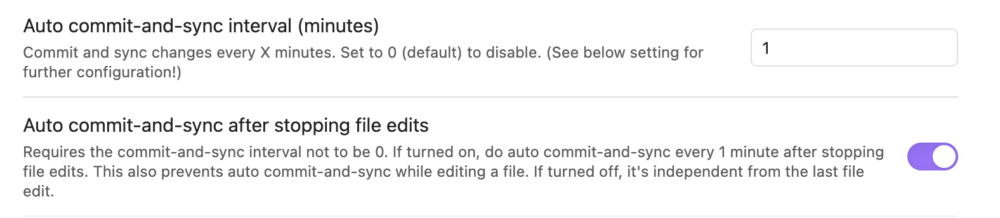
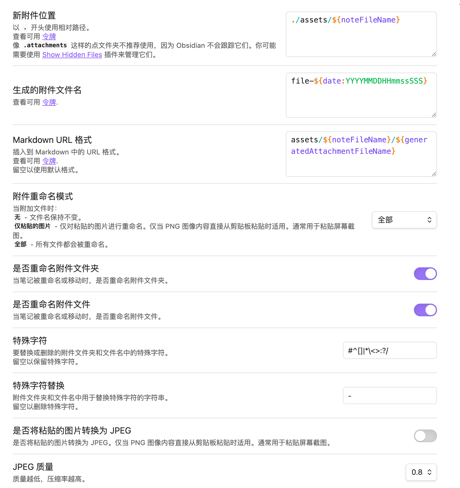

# obsidian_bk 
备份文件设置

> 2.84 C@U.YZ qeo:/ 08/03 Obsidian邪修用法，免费云同步，AI，手机端，进阶技巧 这两年我换了 N 个笔记工具，最终我还是选择了 Obsidian。 我有三个必须使用Obsidian理由，1.数据安全。2. 界面丝滑流畅 3. 跟AI工具绝配。 # AI # AI新星计划 # 笔记 # 学习 # 计算机  https://v.douyin.com/KVUGmSZuj3A/ 复制此链接，打开Dou音搜索，直接观看视频！

obsidian需要安装的插件：

1. Git
两个比较重要的设置

2. Custom Attachment Location
设置复制的图片保存位置，比较重要～
