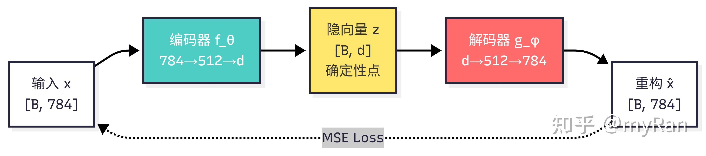
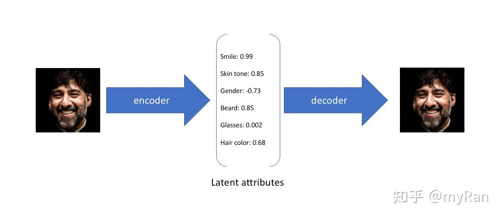
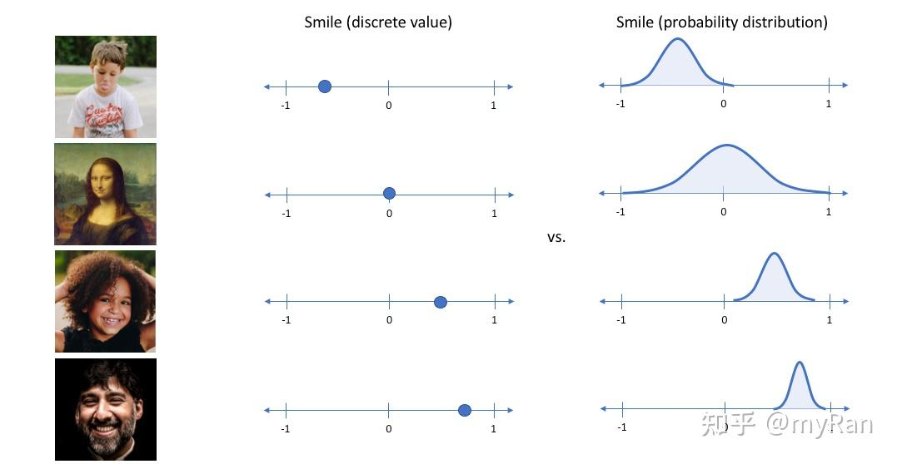
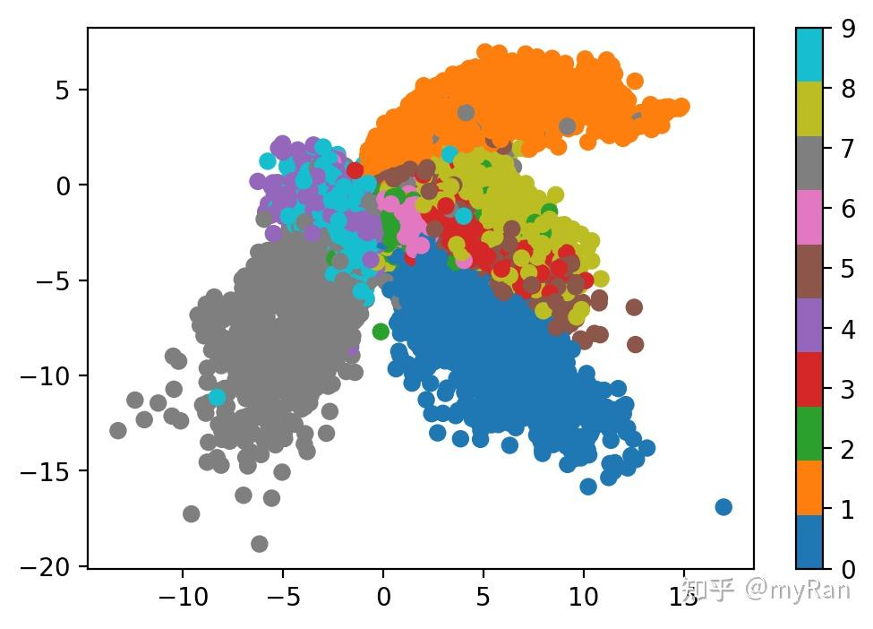
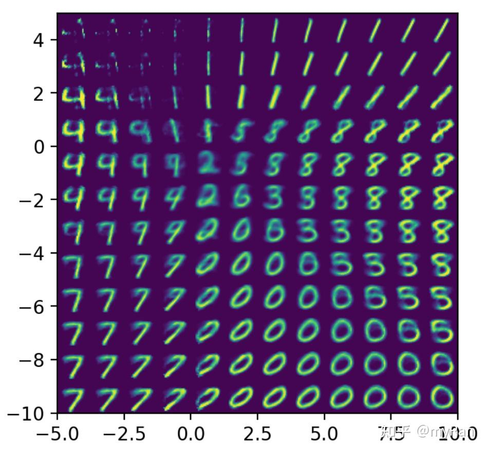
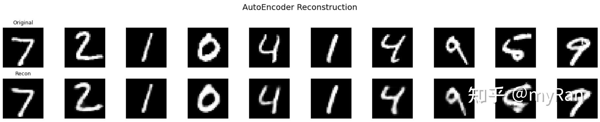
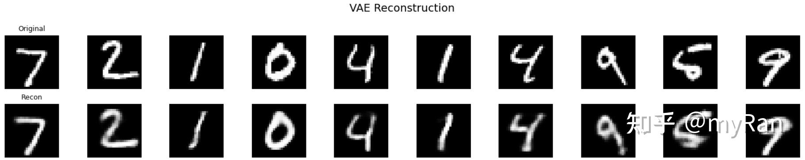
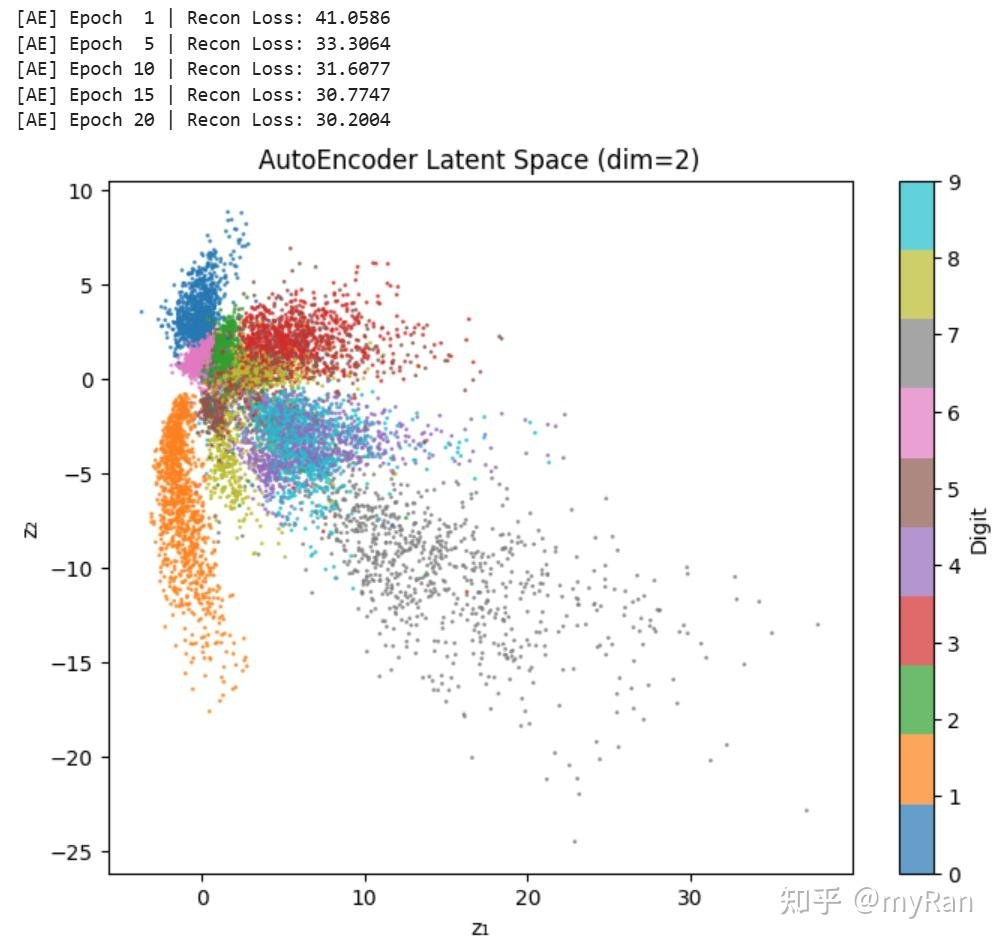
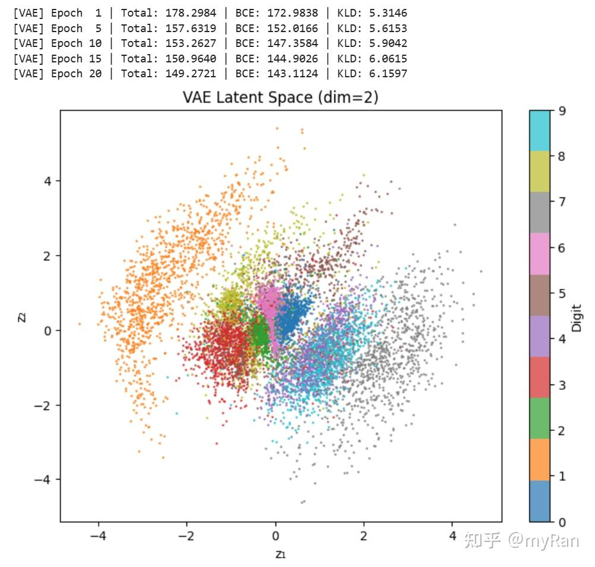
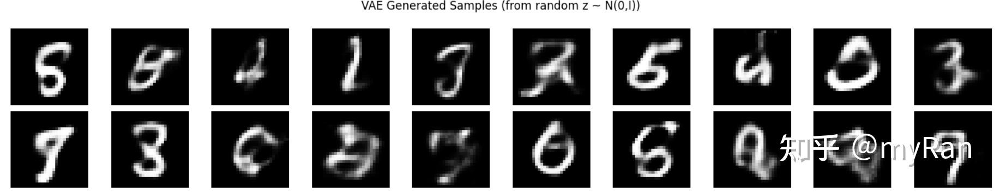

# 从PCA到VAE：隐空间的变化

> 来源：知乎专栏 [从PCA到VAE：隐空间的变化](https://zhuanlan.zhihu.com/p/2030298269679662210)　作者：myRan　采集日期：2026-08-06
目录

## 前言

最近在阅读一些关于解决VLM幻觉问题的论文时，我发现**Latent Space（隐空间）**是一个高频出现的概念。其本质可以理解为在神经网络的隐藏层中对数据的隐式表示进行建模，并通过引入先验约束或正则化，使模型在特定场景或方法下获得优于现有SOTA的表现。

在和朋友健身聊天时，我们也讨论到，Latent Space其实可以从另一个角度理解为一种降维操作——即对原始数据进行压缩表示。在当前尚未系统学习信息论的情况下，我对信息压缩的理解仍停留在较浅层面，但这种压缩视角依然提供了一个直观的认知。

进一步来看，以Q-Former为代表的方法也体现了类似思想。面对编码器输出的高维潜在表示，可以通过再次映射到更紧凑的隐空间，实现对信息的提炼与压缩，从而提高表示效率与下游任务性能。

因此，我想从降维出发，梳理相关的理论知识，以求更深的理解。降维是机器学习中常见的一类问题。本文以”隐空间如何一步步变得更好”为主线，从最经典的**PCA**出发，经过**自编码器（AE）**的非线性扩展，最终到达**变分自编码器（VAE）**的概率生成框架。每一种方法我都尝试给出较为严格的数学推导，并在MNIST上提供完整的PyTorch实现，标注每一步的张量形状变化。

## 一、隐空间

数据往往是高维的，一张28×28的灰度手写数字图片就有784个像素维度。但**流形假说**告诉我们：这些高维数据实际上分布在一个低维流形上，这个流形由少数潜在变量所参数化。换句话说，描述一张手写数字的本质信息，可能只需要几个维度，比如笔画粗细、倾斜角度、数字类别等。

找到这个低维表示的空间，就叫做**隐空间（Latent Space）**。

隐空间方法演化过程

> 流形假说（Manifold Hypothesis）：虽然数据存在于一个高维空间中，但**真实有效的数据只分布在其中一个低维的、连续的结构（流形）上**。数据的**表面维度很高，**但它的**内在自由度很低。**我的理解是观测到的数据其实是真实有效数据综合作用的结果，例如对于三维空间中的各种奇形怪状的物体，我们只需要获得其二维平面的坐标以及对应的映射关系即可。这样就能把需要采集的数据量大大降低，而神经网络在理论上能够拟合任意的映射关系。

## 二、隐空间的四种方法

### 2.1 线性投影PCA

主成分分析(PCA)是最经典的降维方法。**在所有 $d$ 维线性子空间中，找到使数据投影后重构误差最小的那一个**。

**2.1.1 问题形式化**

设有 $N$ 个已中心化（ $\frac{1}{N}\sum x_i = 0$ ）的数据点 $x_1, \ldots, x_N \in \mathbb{R}^D$ 。我们希望找到一组正交基 $\{u_1, u_2, \ldots, u_d\}$ （ $d < D$ ），使得数据在该子空间上的投影尽可能保留原始信息。

将正交基排成矩阵 $U_d = [u_1, \ldots, u_d] \in \mathbb{R}^{D \times d}$ （列正交： $U_d^\top U_d = I_d$ ），则

- **编码（投影）**： $z_i = U_d^\top x_i \in \mathbb{R}^d$
- **解码（重构）**： $\hat{x}_i = U_d z_i = U_d U_d^\top x_i \in \mathbb{R}^D$

优化目标为最小化总重构误差

$$\min_{U_d: U_d^\top U_d = I_d} \sum_{i=1}^{N} \| x_i - U_d U_d^\top x_i \|^2$$

**2.1.2 求解**

利用 $\|a\|^2 = a^\top a$ 和投影矩阵的幂等性 $(U_d U_d^\top)^2 = U_d U_d^\top$ ，展开目标函数

$$\sum_{i=1}^N \|x_i - U_d U_d^\top x_i\|^2 = \sum_{i=1}^N \|x_i\|^2 - \sum_{i=1}^N \|U_d^\top x_i\|^2$$

第一项 $\sum \|x_i\|^2$ 是常数，所以最小化重构误差等价于**最大化投影后的总方差**：

$$\max_{U_d: U_d^\top U_d = I_d} \sum_{i=1}^{N} \| U_d^\top x_i \|^2 = \max_{U_d} \; \text{tr}(U_d^\top X X^\top U_d)$$

其中 $X = [x_1, \ldots, x_N] \in \mathbb{R}^{D \times N}$ 是数据矩阵。

引入样本协方差矩阵 $C = \frac{1}{N} XX^\top \in \mathbb{R}^{D \times D}$ ，该矩阵显然对称半正定，上述问题等价于

$$\max_{U_d: U_d^\top U_d = I_d} \; \text{tr}(U_d^\top C \, U_d)$$

用拉格朗日乘子法，设 $\Lambda$ 为对称乘子矩阵，令 $\frac{\partial}{\partial U_d}[\text{tr}(U_d^\top C U_d) - \text{tr}(\Lambda(U_d^\top U_d - I))] = 0$ ，得到：

$$C \, U_d = U_d \Lambda$$

这意味着 $U_d$ 的每一列都是 $C$ 的特征向量。代入目标函数

$$\text{tr}(U_d^\top C \, U_d) = \text{tr}(U_d^\top U_d \Lambda) = \text{tr}(\Lambda) = \sum_{j=1}^{d} \lambda_j$$

所以要最大化目标，就应该选取 **$C$ 的前 $d$ 个最大特征值对应的特征向量**。

> 一年前学最优化方法，这部分精彩的推导记忆尤新。

**2.1.3 PCA的数据流**


利用Encoder-Decoder架构描述数据流动

**2.1.4 PCA的局限性**

PCA优雅而高效，但它有局限

- **只能做线性变换。**如果数据的低维结构是**非线性流形**，比如手写数字的变形，线性投影无法捕捉。
- **编码和解码互为转置。** $W = U_d^\top$ , $V = U_d$ ，自由度受限。
- **没有学习能力。**一旦数据分布变化，必须重新做特征分解。

### 2.2 编码器Encoder

编码器是最基础的组件，它就是一个参数化的映射函数：

$$z = f_\theta(x)$$

其中 $x \in \mathbb{R}^D$ 是输入数据，比如784维的图片向量， $z \in \mathbb{R}^d$ 是低维表示（ $d \ll D$ ）， $\theta$ 是可学习参数。

编码器是一个**确定性**的函数，同一个输入 $x$ ，永远得到同一个 $z$ 。单独的编码器不能独立训练，它必须搭配一个下游目标。最常见的两种搭配方式：

- **搭配分类器**：编码器 + 分类头，用交叉熵损失训练，这就是普通的分类网络的前半部分
- **搭配解码器**：编码器 + 解码器，用重构损失训练，这就是自编码器


编码器的上下游

### 2.3 自编码器AutoEncoder

PCA用线性变换做编码和解码，效果受限于数据的线性结构。一个自然的想法是**用神经网络替代线性变换**，让编码器和解码器都可以**学习任意非线性映射**，这就是自编码器。

> 自编码器 = 编码器 + 解码器，通过自己重构自己来学习数据的压缩表示。

**编码器**（Encoder）：

$$z = f_\theta(x), \quad z \in \mathbb{R}^d$$

**解码器**（Decoder）：

$$\hat{x} = g_\phi(z), \quad \hat{x} \in \mathbb{R}^D$$

**损失函数**为最小化重构误差

$$\mathcal{L}_{AE} = \frac{1}{N} \sum_{i=1}^{N} \| x_i - \hat{x}_i \|^2 = \frac{1}{N} \sum_{i=1}^{N} \| x_i - g_\phi(f_\theta(x_i)) \|^2$$

这个目标很直观，输入一张图，压缩成低维编码，再从编码恢复出图，要求恢复得尽可能像原图。


自编码器模型架构。编码器将输入压缩到低维瓶颈层，解码器再从中恢复原始输入。（图源：Lilian Weng, “From Autoencoder to Beta-VAE”）



自编码器的数据流动

由前文推导可知，当编码器和解码器都是线性的时候，AE学到的隐空间等价于PCA的主成分子空间。也就是线性AE的最优解恰好就是数据协方差矩阵的前 $d$ 个特征向量张成的空间。下面给出严格的数学证明。

> 为了给出证明，又把去年的最优化方法PPT翻出来狠狠抄🤯

**定理：线性自编码器等价于PCA**

**问题设定**

设有 $N$ 个已中心化的数据点 $x_1, x_2, \ldots, x_N \in \mathbb{R}^D$ ，拼成数据矩阵 $X = [x_1, x_2, \ldots, x_N] \in \mathbb{R}^{D \times N}$ 。

定义**线性自编码器**

- 编码器 $W \in \mathbb{R}^{d \times D}$ ： $z = Wx$
- 解码器 $V \in \mathbb{R}^{D \times d}$ ： $\hat{x} = Vz = VWx$

优化目标为最小化所有样本上的总重构误差：

$$\min_{W, V} \; \mathcal{L}(W, V) = \sum_{i=1}^{N} \| x_i - VWx_i \|^2 = \| X - VWX \|_F^2$$

其中 $\| \cdot \|_F$ 为 Frobenius 范数。

> **定理**：上述优化问题的最小值为 $\sum_{j=d+1}^{r} \sigma_j^2$ （ $\sigma_j$ 为 $X$ 的奇异值降序排列， $r = \text{rank}(X)$ ），且最优重构 $VWX$ 等于 $X$ 的**秩- $d$ 截断 SVD** $X_d$ 。最优解 $V$ 的列空间与数据协方差矩阵 $C = \frac{1}{N}XX^\top$ 的前 $d$ 个特征向量所张成的子空间一致。

**证明**

**第一步：将问题转化为低秩逼近问题**

令 $M = VW \in \mathbb{R}^{D \times D}$ 。由于 $V \in \mathbb{R}^{D \times d}$ 、 $W \in \mathbb{R}^{d \times D}$ ，所以：

$$\text{rank}(M) = \text{rank}(VW) \leq \min(\text{rank}(V), \text{rank}(W)) \leq d$$

因此 $MX$ 的秩至多为 $d$ ：

$$\text{rank}(MX) \leq \text{rank}(M) \leq d$$

记 $B = MX$ ，则我们要在**所有秩不超过 $d$ 的矩阵 $B$** 中寻找使 $\|X - B\|_F^2$ 最小的那个。受限更强的原问题 $\mathcal{S_1}​=\{VWX\}$ ，放松后的问题 $\mathcal{S_2}​=\{B:rank(B)≤d\}$ ，注意到所有 $VWX$ 都是 $rank ≤ d$ ，但不是所有 $rank ≤ d$ 的矩阵都能写成 $VWX$ ，所以 $\mathcal{S_2}$ 的可行域包含了 $\{VWX : V \in \mathbb{R}^{D \times d}, W \in \mathbb{R}^{d \times D}\}$ ，也就是 $\mathcal{S_1}​⊆ \mathcal{S_2}$ 。在**更大的集合里找最优值，一定更小或相等。**

$$\[ \min_{B \in \mathcal{S}_2} \|X - B\|_F^2 \;\le\; \min_{B \in \mathcal{S}_1} \|X - B\|_F^2 \]$$

**第二步：利用Eckart-Young-Mirsky定理确定下界**

对 $X$ 做奇异值分解

$$X = U \Sigma Q^\top$$

其中 $U \in \mathbb{R}^{D \times D}$ 为正交矩阵， $Q \in \mathbb{R}^{N \times N}$ 为正交矩阵， $\Sigma \in \mathbb{R}^{D \times N}$ 为对角矩阵，对角元素 $\sigma_1 \geq \sigma_2 \geq \cdots \geq \sigma_r > 0$ 。

记 $X$ 的秩- $d$ 截断SVD为：

$$X_d = U_d \, \Sigma_d \, Q_d^\top$$

其中 $U_d \in \mathbb{R}^{D \times d}$ 取 $U$ 的前 $d$ 列， $\Sigma_d = \text{diag}(\sigma_1, \ldots, \sigma_d) \in \mathbb{R}^{d \times d}$ ， $Q_d \in \mathbb{R}^{N \times d}$ 取 $Q$ 的前 $d$ 列。

**EYM定理**指出，在所有秩不超过 $d$ 的矩阵中， $X_d$ 是 $X$ 在Frobenius范数意义下的**最佳逼近**

$$\| X - B \|_F^2 \geq \| X - X_d \|_F^2 = \sum_{j=d+1}^{r} \sigma_j^2, \quad \forall \; B \text{ s.t. } \text{rank}(B) \leq d$$

**第三步：证明该下界可由线性AE达到**

现在我们需要构造具体的 $V^*, W^*$ ，使得 $V^* W^* X = X_d$ 。

取

$$V^* = U_d, \quad W^* = U_d^\top$$

验证：由 $U$ 是正交矩阵且 $U_d$ 是其前 $d$ 列，有 $U_d^\top U_d = I_d$ 。于是

$$V^* W^* X = U_d \, U_d^\top \, X$$

展开 $U_d^\top X$

$$U_d^\top X = U_d^\top \, U \Sigma Q^\top = \begin{bmatrix} I_d & \mathbf{0}_{d \times (D-d)} \end{bmatrix} \Sigma Q^\top = \Sigma_d \, Q_d^\top \in \mathbb{R}^{d \times N}$$

这里用到了 $U_d^\top U = [I_d \mid \mathbf{0}]$ ，以及 $\Sigma$ 矩阵前 $d$ 行只在前 $d$ 个对角位置有非零元素 $\sigma_1, \ldots, \sigma_d$ ， $Q^\top$ 的前 $d$ 行恰好就是 $Q_d^\top$ 。因此

$$U_d(U_d^\top X) = U_d \, \Sigma_d \, Q_d^\top = X_d \quad$$

下界达到，故最小重构误差为

$$\mathcal{L}^* = \| X - X_d \|_F^2 = \sum_{j=d+1}^{r} \sigma_j^2$$

**第四步：将结论联系到PCA**

数据的样本协方差矩阵为

$$C = \frac{1}{N} X X^\top = \frac{1}{N} U \Sigma \Sigma^\top U^\top = U \, \text{diag}\!\left(\frac{\sigma_1^2}{N}, \ldots, \frac{\sigma_D^2}{N}\right) U^\top$$

这正是 $C$ 的特征分解。 $C$ 的特征值为 $\lambda_j = \sigma_j^2 / N$ ，对应的特征向量恰为 $U$ 的各列 $u_1, u_2, \ldots, u_D$ 。

PCA 选取前 $d$ 个最大特征值对应的特征向量 $u_1, \ldots, u_d$ （即 $U_d$ 的列）作为主成分方向，将数据投影到该子空间： $\hat{x}_i^{PCA} = U_d U_d^\top x_i$ 。

而线性 AE 的最优解正是 $V^* W^* = U_d U_d^\top$ ，最优重构同样为 $\hat{x}_i^{AE} = U_d U_d^\top x_i$ 。

线性自编码器的最优解就是向数据协方差矩阵前 $d$ 个特征向量所张成的子空间做正交投影，与PCA完全等价。

注意，**重构算子** $VW$ 是唯一的，即正交投影到主子空间，但最优解 $V, W$ 本身不是唯一的，中间可以插一个可逆变换 $A$ ，最优解不唯一。任何满足 $\text{col}(V) = \text{col}(U_d)$ 的可逆变换 $V = U_d A$ 、 $W = A^{-1} U_d^\top$ （ $A \in \mathbb{R}^{d \times d}$ 可逆）都能达到同样的最小值。它们的重构矩阵 $VW = U_d A A^{-1} U_d^\top = U_d U_d^\top$ 相同。也就是说，**隐空间的坐标可以旋转，但其张成的子空间是唯一确定的**，恰好就是PCA的主成分子空间。

但AE有一个根本性的问题，即**隐空间没有正则化**。编码器可以把不同的数字映射到隐空间中完全不相邻的区域，区域之间的空白地带解码出来就是毫无意义的噪声。这意味着不能从隐空间随机采样来生成新的、有意义的图片。所以AE下游不能够是生成任务，或者说生产任务的效果会很差。

### 2.4 变分自编码器VAE

VAE是Kingma和Welling在2013年提出的，它从根本上改变了编码的方式，**不再把输入编码成一个确定的点，而是编码成一个概率分布**。

下面两张图直观展示了AE与VAE的核心区别。AE将每个属性编码为一个确定的值，而VAE将每个属性编码为一个概率分布：



普通自编码器中，每个隐变量属性被编码为一个确定的数值。（图源：Jeremy Jordan, “Variational autoencoders”）



变分自编码器中，每个隐变量属性被编码为一个概率分布（均值 + 方差）。（图源：同上）


每次对隐空间进行采样生成

**2.4.1 概率图模型视角**

VAE 的生成过程是这样的

1.  从先验分布中采样一个隐变量： $z \sim p(z) = \mathcal{N}(0, I)$
2.  根据隐变量生成数据： $x \sim p_\theta(x|z)$

我们的目标是最大化数据的边际似然

$$p_\theta(x) = \int p_\theta(x|z) \, p(z) \, dz$$

然而，该积分通常是不可解析计算的，因为条件分布 $p_\theta(x|z)$ 由神经网络参数化，使得该高维积分不存在闭式解。此外，它要对所有可能的 $z$ 求积分，这是一个极高维的问题，实际操作是十分困难的。为此，我们尝试引入潜变量的后验分布

$\[ p_\theta(z|x) = \frac{p_\theta(x|z)p(z)}{p_\theta(x)} \]$ 然而，该后验同样不可直接计算。

**2.4.2 变分推断与ELBO**

既然真实后验 $p_\theta(z|x)$ 算不出来，我们就用一个参数化的分布 $q_\phi(z|x)$ 去**近似**它。这就是变分推断的核心思想。

从对数边际似然出发

$$\log p_\theta(x) = \log \int p_\theta(x|z) \, p(z) \, dz$$

通过引入 $q_\phi(z|x)$ 并利用 Jensen 不等式，可以推导出**证据下界（ELBO）**：

$$\log p_\theta(x) \geq \underbrace{\mathbb{E}_{q_\phi(z|x)}[\log p_\theta(x|z)]}_{\text{重构项}} - \underbrace{D_{KL}(q_\phi(z|x) \| p(z))}_{\text{正则项}}$$

这个推导的详细过程如下

$$\begin{aligned} \log p_\theta(x) &= \log \int p_\theta(x|z) p(z) dz \\ &= \log \int \frac{q_\phi(z|x)}{q_\phi(z|x)} p_\theta(x|z) p(z) dz \\ &= \log \mathbb{E}_{q_\phi(z|x)} \left[ \frac{p_\theta(x|z) p(z)}{q_\phi(z|x)} \right] \\ &\geq \mathbb{E}_{q_\phi(z|x)} \left[ \log \frac{p_\theta(x|z) p(z)}{q_\phi(z|x)} \right] \quad \text{(Jensen 不等式)} \\ &= \mathbb{E}_{q_\phi(z|x)}[\log p_\theta(x|z)] - D_{KL}(q_\phi(z|x) \| p(z)) \end{aligned}$$

实际上，等号差的那部分正好是 $D_{KL}(q_\phi(z|x) \| p_\theta(z|x)) \geq 0$ ，所以ELBO确实是下界 $\[ \log p_\theta(x) = \underbrace{ \mathbb{E}_{q_\phi(z|x)}\big[\log p_\theta(x|z)\big] - D_{\mathrm{KL}}\!\big(q_\phi(z|x)\,\|\,p(z)\big) }_{\text{ELBO}} + D_{\mathrm{KL}}\!\big(q_\phi(z|x)\,\|\,p_\theta(z|x)\big) \]$ 2.4.3 VAE的具体假设

在标准 VAE 中，我们做如下假设

- **先验**： $p(z) = \mathcal{N}(0, I)$
- **近似后验**（编码器）： $q_\phi(z|x) = \mathcal{N}(\mu_\phi(x), \text{diag}(\sigma^2_\phi(x)))$
- **似然**（解码器）： $p_\theta(x|z)$ 取高斯或伯努利分布

编码器网络输出的不再是 $z$ 本身，而是分布的两个参数 $\mu$ 和 $\log \sigma^2$ 。


VAE 的网络架构。编码器输出均值 μ 和方差 σ，采样得到隐向量 z 后送入解码器重构。

**2.4.4 重参数化技巧**

从 $q_\phi(z|x) = \mathcal{N}(\mu, \sigma^2)$ 中采样 $z$ 这个操作不可导，没法做反向传播。Kingma把采样操作重写为：

$$z = \mu + \sigma \odot \epsilon, \quad \epsilon \sim \mathcal{N}(0, I)$$

这样，随机性被转移到了 $\epsilon$ 上，而 $z$ 关于 $\mu$ 和 $\sigma$ 是可导的，梯度可以正常回传。


重参数化技巧。将随机采样操作转化为确定性计算 + 外部噪声，使得梯度可以通过 μ 和 σ 回传。（图源：Jeremy Jordan）

**2.4.5 VAE的最终损失函数**

对于MNIST这种像素值归一化到 $[0, 1]$ 的图像，重构项常用BCE，也就是二元交叉熵，将每个像素视为伯努利分布的参数，KL 项有闭合解

$$\mathcal{L}_{VAE} = \underbrace{-\sum_{j=1}^{D} \left[ x_j \log \hat{x}_j + (1-x_j) \log(1-\hat{x}_j) \right]}_{\text{BCE 重构损失}} + \underbrace{\frac{1}{2} \sum_{j=1}^{d} \left( \mu_j^2 + \sigma_j^2 - \log \sigma_j^2 - 1 \right)}_{\text{KL 散度}}$$


### 2.5 隐空间结构的直觉理解

**PCA的隐空间**：是一个**由正交特征向量张成的线性子空间**。它的优点是结构非常规整，各主成分正交、按方差排序，但只能捕捉数据的线性结构。把MNIST投到**2D**主成分上，你会发现不同数字之间高度重叠。因为手写数字的差异是高度非线性的，**两个主成分**根本无法分开它们。

**AE的隐空间**：编码器可以把**数据映射到隐空间中任意的位置，只要解码器能把它还原就行**。结果就是不同类别的数据被映射到不连续的孤岛上，岛与岛之间的空白区域解码出来是无意义的噪声。

**VAE的隐空间：KL散度正则项迫使编码器输出的分布趋近标准正态分布**，这意味着

- **均值被拉向原点,**不同类别不会离得太远
- **方差被拉向1,**每个编码点周围都有模糊地带

结果是隐空间变得连续而平滑，相似的数字平滑过渡，你可以从隐空间中任意位置采样并解码出有意义的图片。

下面两张图分别展示了AE的隐空间散点图和从隐空间均匀采样后解码的结果，可以明显看到空洞区域解码出的无意义噪声：



AutoEncoder 的 2D 隐空间可视化。不同颜色代表不同数字类别，注意类别之间存在大片空白区域。



从 AE 隐空间均匀网格采样后解码的结果。左上角等空白区域解码出的图像模糊无意义。

### 2.6 优缺点与使用场景

**PCA**

- 优点：有解析解，计算高效；数学性质清晰，满足正交、方差最大化；除了 $d$ ，无超参数
- 缺点：只能做线性变换，无法捕捉非线性结构；不能增量学习
- 场景：数据预处理与可视化、特征工程中的降噪、高维数据的初步探索

**编码器**

- 优点：结构简单，搭配下游任务灵活
- 缺点：不能独立使用，必须配合目标函数
- 场景：分类网络的特征提取器、对比学习中的表示学习

**自编码器（AE）**

- 优点：无监督学习，训练简单；重构精度高
- 缺点：隐空间不连续，不能做生成；容易过拟合为恒等映射
- 场景：数据压缩与降维、异常检测（即重构误差大）、去噪自编码器

**变分自编码器（VAE）**

- 优点：隐空间连续可采样，是真正的**生成模型**；有坚实的概率论基础；隐空间可解释性强
- 缺点：生成图像偏模糊，因为优化的是像素级期望；训练中重构质量和 KL 项需要平衡
- 场景：图像生成、数据增强、药物分子设计、隐空间插值、**扩散模型的前身**

## 三、KL 散度

这部分涉及到了KL散度，顺便把这部分推导整理一下。

### 3.1 数学定义

对于两个概率分布 $P$ 和 $Q$ ：

**离散形式**：

$$D_{KL}(P \| Q) = \sum_{x} P(x) \log \frac{P(x)}{Q(x)}$$

**连续形式**：

$$D_{KL}(P \| Q) = \int_{-\infty}^{\infty} p(x) \log \frac{p(x)}{q(x)} dx$$

### 3.2 含义

KL散度衡量的是**用分布 $Q$ 去近似分布 $P$ 时，损失了多少信息**。

从信息论的角度，它等于**交叉熵减去信息熵**

$$D_{KL}(P \| Q) = H(P, Q) - H(P)$$

其中 $H(P, Q) = -\sum P(x) \log Q(x)$ 是交叉熵， $H(P) = -\sum P(x) \log P(x)$ 是信息熵。

信息熵 $H(P)$ 是编码 $P$ 所需的最小平均比特数，交叉熵 $H(P, Q)$ 是用 $Q$ 的编码方案去编码 $P$ 所需的平均比特数。KL散度就是多花了多少比特，用来衡量学习到的分布的好坏。

### 3.3 重要性质

1.  **非负性**： $D_{KL}(P \| Q) \geq 0$ ，等号当且仅当 $P = Q$
2.  **不对称性**： $D_{KL}(P \| Q) \neq D_{KL}(Q \| P)$ ，所以它不是真正的距离
3.  **不满足三角不等式**

$D_{KL}(P \| Q)$ 是”用 $Q$ 近似 $P$ “的代价，而 $D_{KL}(Q \| P)$ 是”用 $P$ 近似 $Q$ “的代价，两者意义完全不同。在VAE中我们用的是 $D_{KL}(q_\phi(z|x) \| p(z))$ ，即用先验 $p(z)$ 去衡量近似后验 $q_\phi(z|x)$ 偏离了多少。

### 3.4 两个高斯分布的KL散度闭合解

当 $P = \mathcal{N}(\mu_1, \sigma_1^2)$ ， $Q = \mathcal{N}(\mu_2, \sigma_2^2)$ 时：

$$D_{KL}(P \| Q) = \log \frac{\sigma_2}{\sigma_1} + \frac{\sigma_1^2 + (\mu_1 - \mu_2)^2}{2\sigma_2^2} - \frac{1}{2}$$

在VAE中， $Q = \mathcal{N}(0, 1)$ （标准正态先验）， $P = \mathcal{N}(\mu, \sigma^2)$ （编码器输出），代入得到

$$D_{KL} = -\frac{1}{2} \sum_{j=1}^{d} \left(1 + \log \sigma_j^2 - \mu_j^2 - \sigma_j^2 \right)$$

这就是代码中KL损失的来源。推导过程中所有项都有含义

- $\mu_j^2$ 项：惩罚均值偏离原点
- $\sigma_j^2$ 项：惩罚方差偏离 1
- $\log \sigma_j^2$ 项：防止方差坍缩到 0

除了 VAE之外，KL散度还是用在

- **知识蒸馏**：让学生模型的输出分布接近教师模型
- **强化学习PPO**：限制策略更新幅度， $D_{KL}(\pi_{old} \| \pi_{new})$ 不能太大
- **GAN的理论分析**：原始GAN优化的是KL 散度的对称版本JS散度
- **信息瓶颈理论**：分析神经网络的信息压缩行为，Q-Former也可以使用
- **大模型**：RLHF中约束模型不偏离参考策略太远

## 四、MNIST完整代码实现

下面我们用PyTorch在MNIST上实现四个模型（PCA、Encoder+分类头、AE、VAE），统一使用全连接结构，方便对比。

### 4.1 环境与数据准备

```python
import torch
import torch.nn as nn
import torch.nn.functional as F
from torchvision import datasets, transforms
from torch.utils.data import DataLoader
import matplotlib.pyplot as plt
import numpy as np

# ======== 超参数 ========
BATCH_SIZE = 128
EPOCHS = 20
LATENT_DIM = 20    # 隐空间维度
HIDDEN_DIM = 512   # 隐藏层维度
LR = 1e-3
DEVICE = torch.device('cuda' if torch.cuda.is_available() else 'cpu')

# ======== 数据加载 ========
transform = transforms.ToTensor()  # 将图片转为 [0,1] 的张量

train_dataset = datasets.MNIST('./data', train=True, download=True, transform=transform)
test_dataset  = datasets.MNIST('./data', train=False, download=True, transform=transform)

train_loader = DataLoader(train_dataset, batch_size=BATCH_SIZE, shuffle=True)
test_loader  = DataLoader(test_dataset,  batch_size=BATCH_SIZE, shuffle=False)

# 验证数据形状
x_sample, y_sample = next(iter(train_loader))
print(f"输入 batch 形状: {x_sample.shape}")   # [128, 1, 28, 28]
print(f"标签 batch 形状: {y_sample.shape}")   # [128]
print(f"像素值范围: [{x_sample.min():.1f}, {x_sample.max():.1f}]")  # [0.0, 1.0]
```

输出正常，在当前目录下创建`data/`目录，并下载MINST数据集


### 4.2 PCA

PCA不需要训练神经网络，直接用SVD分解即可。我们既用sklearn的现成实现，也手写一个PyTorch版本来展示数据流。

```python
from sklearn.decomposition import PCA

# 模型 0: PCA

# 准备数据：将所有训练图片展平为 [60000, 784] 的矩阵
X_train_flat = train_dataset.data.float().view(-1, 784) / 255.0   # [60000, 784]
X_test_flat  = test_dataset.data.float().view(-1, 784) / 255.0    # [10000, 784]
y_test       = test_dataset.targets.numpy()

# 用 sklearn 的 PCA，保留 20 个主成分（与后续模型的 LATENT_DIM=20 对齐）
pca = PCA(n_components=LATENT_DIM)  # LATENT_DIM = 20
pca.fit(X_train_flat.numpy())

# 编码（投影）
Z_train = pca.transform(X_train_flat.numpy())   # [60000, 20]
Z_test  = pca.transform(X_test_flat.numpy())     # [10000, 20]

# 解码（重构）
X_train_recon = pca.inverse_transform(Z_train)   # [60000, 784]
X_test_recon  = pca.inverse_transform(Z_test)     # [10000, 784]

# 计算重构误差
pca_recon_error = np.mean((X_test_flat.numpy() - X_test_recon) ** 2)
print(f"[PCA] 主成分数: {LATENT_DIM}")
print(f"[PCA] 累计方差解释率: {pca.explained_variance_ratio_.sum()*100:.2f}%")
print(f"[PCA] 测试集 MSE 重构误差: {pca_recon_error:.6f}")
```


同时我们也手写一个PyTorch版PCA，展示和AE的对应关系：

```python
# PyTorch 手写 PCA
def torch_pca(X, d):
    """
    X: [N, D] 中心化后的数据
    d: 保留的主成分个数
    返回: 投影矩阵 W [D, d]，均值 mu [D]
    """
    mu = X.mean(dim=0)                         # [784]
    X_centered = X - mu                         # [N, 784]
    # SVD 分解: X_centered = U @ S @ V^T
    U, S, Vt = torch.linalg.svd(X_centered, full_matrices=False)
    # V 的前 d 列就是主成分方向
    W = Vt[:d].T                                # [784, d]
    return W, mu

W_pca, mu_pca = torch_pca(X_train_flat, LATENT_DIM)

# 编码与解码
z_pca  = (X_test_flat - mu_pca) @ W_pca          # [10000, 20]  编码
x_pca_recon = z_pca @ W_pca.T + mu_pca           # [10000, 784] 解码
print(f"[PCA-PyTorch] MSE: {F.mse_loss(x_pca_recon, X_test_flat).item():.6f}")
```

输出的MSE和sklearn一致：


### 4.3 Encoder + 分类头

纯编码器不能独立训练，我们给它配一个分类头，做手写数字识别。

```python
# 模型 1: Encoder + 分类头

import torch
import torch.nn as nn
from torch.utils.data import DataLoader
from torchvision import datasets, transforms

# 超参数
LATENT_DIM = 20
HIDDEN_DIM = 512
BATCH_SIZE = 64
EPOCHS = 20
LR = 1e-3

DEVICE = torch.device("cuda" if torch.cuda.is_available() else "cpu")

# 数据集
transform = transforms.ToTensor()

train_dataset = datasets.MNIST(
    root="./data",
    train=True,
    download=True,
    transform=transform
)

train_loader = DataLoader(
    train_dataset,
    batch_size=BATCH_SIZE,
    shuffle=True
)

# 模型 1: Encoder + 分类头
class EncoderClassifier(nn.Module):
    """
    编码器 + 分类头
    数据流:
    [B, 1, 28, 28] -> flatten [B, 784] -> encoder [B, 20] -> classifier [B, 10]
    """

    def __init__(self, latent_dim=LATENT_DIM, num_classes=10):
        super().__init__()

        self.encoder = nn.Sequential(
            nn.Linear(784, HIDDEN_DIM),          # [B, 784] -> [B, 512]
            nn.ReLU(),
            nn.Linear(HIDDEN_DIM, latent_dim),   # [B, 512] -> [B, 20]
            nn.ReLU(),
        )

        self.classifier = nn.Linear(latent_dim, num_classes)  # [B, 20] -> [B, 10]

    def forward(self, x):
        # x: [B, 1, 28, 28]
        x = x.view(x.size(0), -1)        # [B, 784]
        z = self.encoder(x)              # [B, 20]
        logits = self.classifier(z)      # [B, 10]
        return logits, z

# 训练函数
def train_encoder(model, train_loader, epochs=EPOCHS):
    model.to(DEVICE)

    optimizer = torch.optim.Adam(model.parameters(), lr=LR)
    criterion = nn.CrossEntropyLoss()

    for epoch in range(1, epochs + 1):
        model.train()

        total_loss = 0.0
        correct = 0
        total = 0

        for x, y in train_loader:
            x = x.to(DEVICE)
            y = y.to(DEVICE)

            logits, _ = model(x)
            loss = criterion(logits, y)

            optimizer.zero_grad()
            loss.backward()
            optimizer.step()

            total_loss += loss.item() * x.size(0)
            correct += (logits.argmax(dim=1) == y).sum().item()
            total += x.size(0)

        if epoch % 5 == 0 or epoch == 1:
            avg_loss = total_loss / total
            acc = correct / total * 100
            print(f"[Encoder] Epoch {epoch:2d} | Loss: {avg_loss:.4f} | Acc: {acc:.2f}%")

    return model

# 开始训练
encoder_model = EncoderClassifier()
encoder_model = train_encoder(encoder_model, train_loader)
```

训练20轮，可以看出准确率已经非常高了。


### 4.4 AutoEncoder

```python
# 模型 2: AutoEncoder

class AutoEncoder(nn.Module):
    """
    自编码器
    编码: [B, 784] -> [B, 512] -> [B, 20]
    解码: [B, 20] -> [B, 512] -> [B, 784]
    """
    def __init__(self, latent_dim=LATENT_DIM):
        super().__init__()
        # 编码器: 784 -> 512 -> latent_dim
        self.encoder = nn.Sequential(
            nn.Linear(784, HIDDEN_DIM),         # [B, 784] -> [B, 512]
            nn.ReLU(),
            nn.Linear(HIDDEN_DIM, latent_dim),  # [B, 512] -> [B, 20]
        )
        # 解码器: latent_dim -> 512 -> 784
        self.decoder = nn.Sequential(
            nn.Linear(latent_dim, HIDDEN_DIM),  # [B, 20]  -> [B, 512]
            nn.ReLU(),
            nn.Linear(HIDDEN_DIM, 784),         # [B, 512] -> [B, 784]
            nn.Sigmoid(),                        # 输出值域 [0, 1]，匹配像素范围
        )

    def forward(self, x):
        # x: [B, 1, 28, 28]
        x_flat = x.view(x.size(0), -1)    # [B, 784]
        z = self.encoder(x_flat)            # [B, 20]    -- 确定性编码
        x_recon = self.decoder(z)           # [B, 784]   -- 解码重构
        return x_recon, z

def train_ae(model, train_loader, epochs=EPOCHS):
    model.to(DEVICE)
    optimizer = torch.optim.Adam(model.parameters(), lr=LR)

    for epoch in range(1, epochs + 1):
        model.train()
        total_loss = 0
        total = 0
        for x, _ in train_loader:
            x = x.to(DEVICE)
            x_recon, _ = model(x)
            # MSE 重构损失 (也可用 BCE，这里用 MSE 更直观)
            loss = F.mse_loss(x_recon, x.view(x.size(0), -1), reduction='sum')

            optimizer.zero_grad()
            loss.backward()
            optimizer.step()

            total_loss += loss.item()
            total += x.size(0)

        if epoch % 5 == 0 or epoch == 1:
            print(f"[AE] Epoch {epoch:2d} | Recon Loss: {total_loss/total:.4f}")

    return model

# 训练
ae_model = AutoEncoder()
ae_model = train_ae(ae_model, train_loader)
```


### 4.5 VAE

```python
# 模型 3: Variational AutoEncoder

class VAE(nn.Module):
    """
    变分自编码器
    编码: [B, 784] -> [B, 512] -> μ: [B, 20], log σ²: [B, 20]
    采样: z = μ + σ ⊙ ε,  ε ~ N(0, I)   -> [B, 20]
    解码: [B, 20] -> [B, 512] -> [B, 784]
    """
    def __init__(self, latent_dim=LATENT_DIM):
        super().__init__()
        self.latent_dim = latent_dim

        # 编码器共享层
        self.fc1 = nn.Linear(784, HIDDEN_DIM)       # [B, 784] -> [B, 512]

        # 两个输出分支：均值和对数方差
        self.fc_mu     = nn.Linear(HIDDEN_DIM, latent_dim)  # [B, 512] -> [B, 20]  均值 μ
        self.fc_logvar = nn.Linear(HIDDEN_DIM, latent_dim)  # [B, 512] -> [B, 20]  对数方差 log σ²

        # 解码器
        self.fc3 = nn.Linear(latent_dim, HIDDEN_DIM)  # [B, 20]  -> [B, 512]
        self.fc4 = nn.Linear(HIDDEN_DIM, 784)          # [B, 512] -> [B, 784]

    def encode(self, x):
        """编码：输入 -> (μ, log σ²)"""
        h = F.relu(self.fc1(x))           # [B, 512]
        mu     = self.fc_mu(h)             # [B, 20]
        logvar = self.fc_logvar(h)         # [B, 20]
        return mu, logvar

    def reparameterize(self, mu, logvar):
        """重参数化技巧：z = μ + σ ⊙ ε"""
        std = torch.exp(0.5 * logvar)      # σ = exp(0.5 * log σ²)，[B, 20]
        eps = torch.randn_like(std)         # ε ~ N(0, I)，[B, 20]
        z = mu + std * eps                  # [B, 20]
        return z

    def decode(self, z):
        """解码：z -> 重构图像"""
        h = F.relu(self.fc3(z))            # [B, 512]
        x_recon = torch.sigmoid(self.fc4(h))  # [B, 784]，值域 [0,1]
        return x_recon

    def forward(self, x):
        # x: [B, 1, 28, 28]
        x_flat = x.view(x.size(0), -1)    # [B, 784]
        mu, logvar = self.encode(x_flat)   # 各 [B, 20]
        z = self.reparameterize(mu, logvar)  # [B, 20]
        x_recon = self.decode(z)             # [B, 784]
        return x_recon, mu, logvar, z

def vae_loss(x_recon, x, mu, logvar):
    """
    VAE 损失 = 重构损失(BCE) + KL 散度
    """
    x_flat = x.view(x.size(0), -1)  # [B, 784]

    # 重构损失：逐像素的二元交叉熵，对 batch 内求和
    BCE = F.binary_cross_entropy(x_recon, x_flat, reduction='sum')

    # KL 散度：D_KL( N(μ, σ²) || N(0, I) ) 的闭合解
    # = -0.5 * Σ(1 + log σ² - μ² - σ²)
    KLD = -0.5 * torch.sum(1 + logvar - mu.pow(2) - logvar.exp())

    return BCE + KLD, BCE, KLD

def train_vae(model, train_loader, epochs=EPOCHS):
    model.to(DEVICE)
    optimizer = torch.optim.Adam(model.parameters(), lr=LR)

    for epoch in range(1, epochs + 1):
        model.train()
        total_loss = 0
        total_bce = 0
        total_kld = 0
        total = 0
        for x, _ in train_loader:
            x = x.to(DEVICE)
            x_recon, mu, logvar, _ = model(x)
            loss, bce, kld = vae_loss(x_recon, x, mu, logvar)

            optimizer.zero_grad()
            loss.backward()
            optimizer.step()

            total_loss += loss.item()
            total_bce  += bce.item()
            total_kld  += kld.item()
            total += x.size(0)

        if epoch % 5 == 0 or epoch == 1:
            print(f"[VAE] Epoch {epoch:2d} | Total: {total_loss/total:.4f} "
                  f"| BCE: {total_bce/total:.4f} | KLD: {total_kld/total:.4f}")

    return model

# 训练
vae_model = VAE()
vae_model = train_vae(vae_model, train_loader)
```


### 4.6 可视化与对比

**4.6.1 重构效果对比**

```python
def visualize_reconstruction(model, test_loader, model_name, is_vae=False, n=10):
    """可视化原图与重构图的对比"""
    model.eval()
    x, _ = next(iter(test_loader))
    x = x[:n].to(DEVICE)

    with torch.no_grad():
        if is_vae:
            x_recon, _, _, _ = model(x)
        else:
            x_recon, _ = model(x)

    x_recon = x_recon.view(-1, 1, 28, 28).cpu()
    x = x.cpu()

    fig, axes = plt.subplots(2, n, figsize=(n * 1.5, 3))
    fig.suptitle(f'{model_name} Reconstruction', fontsize=14)
    for i in range(n):
        axes[0, i].imshow(x[i].squeeze(), cmap='gray')
        axes[0, i].axis('off')
        if i == 0: axes[0, i].set_title('Original', fontsize=9)

        axes[1, i].imshow(x_recon[i].squeeze(), cmap='gray')
        axes[1, i].axis('off')
        if i == 0: axes[1, i].set_title('Recon', fontsize=9)

    plt.tight_layout()
    plt.savefig(f'{model_name}_reconstruction.png', dpi=150, bbox_inches='tight')
    plt.show()

# 注意：纯编码器没有解码器，不能做重构可视化
# PCA 重构可视化
def visualize_pca_reconstruction(pca_model, X_test_flat, n=10):
    """PCA 的重构对比"""
    x_orig  = X_test_flat[:n].numpy()
    z       = pca_model.transform(x_orig)           # [n, 20]  编码
    x_recon = pca_model.inverse_transform(z)         # [n, 784] 解码

    fig, axes = plt.subplots(2, n, figsize=(n * 1.5, 3))
    fig.suptitle(f'PCA Reconstruction (d={pca_model.n_components})', fontsize=14)
    for i in range(n):
        axes[0, i].imshow(x_orig[i].reshape(28, 28), cmap='gray')
        axes[0, i].axis('off')
        if i == 0: axes[0, i].set_title('Original', fontsize=9)
        axes[1, i].imshow(np.clip(x_recon[i].reshape(28, 28), 0, 1), cmap='gray')
        axes[1, i].axis('off')
        if i == 0: axes[1, i].set_title('Recon', fontsize=9)
    plt.tight_layout()
    plt.savefig('PCA_reconstruction.png', dpi=150, bbox_inches='tight')
    plt.show()

visualize_pca_reconstruction(pca, X_test_flat)
visualize_reconstruction(ae_model, test_loader, 'AutoEncoder')
visualize_reconstruction(vae_model, test_loader, 'VAE', is_vae=True)
```


PCA 重构



AutoEncoder 重构



VAE 重构

**4.6.2 隐空间可视化**

为了直观地看隐空间结构，我们用 `LATENT_DIM=2` 重新训练 AE 和 VAE：

```text
def visualize_latent_space(model, test_loader, model_name, is_vae=False):
    """将测试集编码到 2D 隐空间并可视化"""
    model.eval()
    zs, ys = [], []
    with torch.no_grad():
        for x, y in test_loader:
            x = x.to(DEVICE)
            if is_vae:
                _, mu, _, _ = model(x)
                z = mu  # 用均值作为隐向量可视化
            else:
                _, z = model(x)
            zs.append(z.cpu())
            ys.append(y)

    zs = torch.cat(zs).numpy()
    ys = torch.cat(ys).numpy()

    plt.figure(figsize=(8, 6))
    scatter = plt.scatter(zs[:, 0], zs[:, 1], c=ys, cmap='tab10', s=1, alpha=0.7)
    plt.colorbar(scatter, label='Digit')
    plt.title(f'{model_name} Latent Space (dim=2)')
    plt.xlabel('z₁')
    plt.ylabel('z₂')
    plt.savefig(f'{model_name}_latent_space.png', dpi=150, bbox_inches='tight')
    plt.show()

# ---- PCA 2D 隐空间 ----
pca_2d = PCA(n_components=2)
pca_2d.fit(X_train_flat.numpy())
Z_pca_2d = pca_2d.transform(X_test_flat.numpy())   # [10000, 2]

plt.figure(figsize=(8, 6))
scatter = plt.scatter(Z_pca_2d[:, 0], Z_pca_2d[:, 1], c=y_test, cmap='tab10', s=1, alpha=0.7)
plt.colorbar(scatter, label='Digit')
plt.title('PCA Latent Space (dim=2)')
plt.xlabel('PC₁'); plt.ylabel('PC₂')
plt.savefig('PCA_latent_space.png', dpi=150, bbox_inches='tight')
plt.show()

# ---- AE 2D 隐空间 ----
ae_2d = AutoEncoder(latent_dim=2)
ae_2d = train_ae(ae_2d,train_loader)
visualize_latent_space(ae_2d, test_loader, 'AutoEncoder')

vae_2d = VAE(latent_dim=2)
vae_2d = train_vae(vae_2d,train_loader)
visualize_latent_space(vae_2d, test_loader, 'VAE', is_vae=True)
```






从这三幅二维隐空间可视化可以直观地看到不同方法对数据表示能力的本质差异。PCA 作为**线性降维方法**，仅通过**最大化投影方差**来保留信息，其隐空间呈现为高度重叠的分布，不同类别之间缺乏清晰的分界，这反映了**线性子空间对复杂非线性结构的表达能力有限**。相比之下，AE的**非线性映射能力**，能够在隐空间中形成较为明显的**类别聚类结构**，但由于缺乏显式的分布约束，导致隐空间存在大量空洞，难以支持有效的随机采样与生成。而VAE通过在优化目标中引入KL散度，将**编码分布正则化为接近标准正态分布**，**使得隐空间整体呈现出连续、平滑且结构化的特性。**不同类别在该空间中既保持一定区分度，又共享统一的全局分布，从而使得任意位置的采样都具有语义一致性。

**4.6.3 VAE 生成新图像**

```python
def generate_from_vae(model, n=20):
    """从标准正态分布中采样，用 VAE 的解码器生成新图像"""
    model.eval()
    with torch.no_grad():
        # 从 N(0, I) 采样
        z = torch.randn(n, model.latent_dim).to(DEVICE)  # [n, 20]
        generated = model.decode(z)                        # [n, 784]
        generated = generated.view(-1, 1, 28, 28).cpu()

    fig, axes = plt.subplots(2, n // 2, figsize=(n // 2 * 1.5, 3))
    fig.suptitle('VAE Generated Samples (from random z ~ N(0,I))', fontsize=12)
    for i, ax in enumerate(axes.flat):
        ax.imshow(generated[i].squeeze(), cmap='gray')
        ax.axis('off')
    plt.tight_layout()
    plt.savefig('vae_generated.png', dpi=150, bbox_inches='tight')
    plt.show()

def generate_from_ae(model, n=20, z_range=(-3, 3)):
    """从隐空间随机采样，用 AE 的解码器生成,大概率是噪声"""
    model.eval()
    with torch.no_grad():
        z = torch.randn(n, LATENT_DIM).to(DEVICE) * 2  # 随机采样
        generated = model.decoder(z)
        generated = generated.view(-1, 1, 28, 28).cpu()

    fig, axes = plt.subplots(2, n // 2, figsize=(n // 2 * 1.5, 3))
    fig.suptitle('AE "Generated" Samples (from random z) — mostly garbage', fontsize=12)
    for i, ax in enumerate(axes.flat):
        ax.imshow(generated[i].squeeze(), cmap='gray')
        ax.axis('off')
    plt.tight_layout()
    plt.savefig('ae_generated.png', dpi=150, bbox_inches='tight')
    plt.show()

generate_from_vae(vae_model)
generate_from_ae(ae_model)
```




不难看出在AE的潜空间里采样生成的图片几乎无法辨别数字，仅仅右上角的数字8可识别。但是VAE生成的图片大部分是课识别的。

**4.6.4 VAE 隐空间插值**

```python
def interpolate_vae(model, test_loader, n_steps=10):
    """在两个数字之间做隐空间线性插值"""
    model.eval()
    x, y = next(iter(test_loader))
    # 找两个不同数字
    idx1 = (y == 3).nonzero(as_tuple=True)[0][0]
    idx2 = (y == 8).nonzero(as_tuple=True)[0][0]

    x1, x2 = x[idx1:idx1+1].to(DEVICE), x[idx2:idx2+1].to(DEVICE)

    with torch.no_grad():
        mu1, _ = model.encode(x1.view(1, -1))
        mu2, _ = model.encode(x2.view(1, -1))

        # 线性插值
        alphas = torch.linspace(0, 1, n_steps).to(DEVICE)
        interpolated = []
        for alpha in alphas:
            z = (1 - alpha) * mu1 + alpha * mu2
            img = model.decode(z).view(1, 28, 28).cpu()
            interpolated.append(img)

    fig, axes = plt.subplots(1, n_steps, figsize=(n_steps * 1.5, 1.5))
    fig.suptitle('VAE Latent Space Interpolation (3 → 8)', fontsize=12)
    for i, ax in enumerate(axes):
        ax.imshow(interpolated[i].squeeze(), cmap='gray')
        ax.axis('off')
    plt.tight_layout()
    plt.savefig('vae_interpolation.png', dpi=150, bbox_inches='tight')
    plt.show()

interpolate_vae(vae_model, test_loader)
```


通过在两个隐向量之间进行线性插值，并将中间点解码回图像，可以观察到数字从“3”到“8”的平滑过渡过程。这说明VAE学到的隐空间并非离散的编码集合，而是一个具有良好几何结构的低维流形，不同数据点之间可以通过连续路径相连。

VAE远不止生成图片。它是后来VQ-VAE、扩散模型DDPM、Stable Diffusion的初级思想。可以认为扩散模型本质上就是一个无限步的层级VAE。
