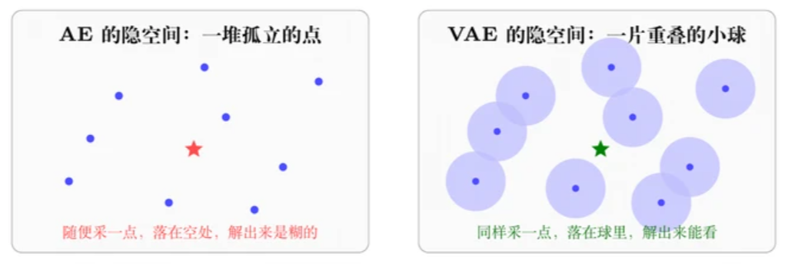

# VAE 不只是个加了噪声的压缩器

### 隐空间为什么要连续，以及它在具身里蹲在哪

> 基础知识 · 第三记：VAE 到底在压缩什么
> 作者：Mento（小红书）

上次写完 DiT 那篇，有人问我：你说"先用 VAE 把图压到 latent 空间"，这个 VAE 到底在干嘛？我发现不少人对它的印象停在"自编码器加了点噪声"，能背出 ELBO，但说不清那个 KL 项少了会怎样。

---

## 1. 先看自编码器差在哪

自编码器（AE）的训练目标只有一条：图进去，压成一个向量，再还原回来，和原图越像越好。这个目标很容易满足，也正因为太容易满足，它对隐空间的形状没有任何约束。

编码器完全可以把每张训练图映射到隐空间里一个孤立的点，点和点之间的区域是什么，训练过程从来没管过——损失函数 $\|f_\theta(g_\phi(x)) - x\|^2$ 里的 $z$ 永远只取 $g_\phi(x)$ 这些值，别的 $z$ 一项约束都没有。

所以解码器真正见过的 $z$ 只有 $N$ 个（$N$ = 训练集大小），而 **$N$ 个点在 $d$ 维隐空间里是一个测度为零的集合**。拿训好的 AE 随便采一个 $z$ 丢给解码器，这个 $z$ 以概率 1 落在从未有过任何训练信号的地方，输出只由网络的外插行为决定，出来大概率是一团糊。

AE 是个压缩器，不是生成器，这是它的能力边界，不是没调好——目标函数里从来没有"让隐空间可采样"这一项，不能指望优化 A 顺便得到 B。

> **图 1：** 同样是压缩到低维，AE 的隐空间中间是空的，VAE 被逼着把邻域也填满。
> （左：AE 的隐空间——一堆孤立的点，随便采一点，落在空处，解出来是糊的；右：VAE 的隐空间——一片重叠的小球，同样采一点，落在球里，解出来能看。）

---

## 2. VAE 的改法：编码器输出的是分布

> **1. VAE | 2013.12 [arXiv:1312.6114]**

> **图 2：** 随机性被挪到 ε 上，梯度才走得通。
> 流程：输入 $x → Encoder q_φ(z|x) → μ, σ → z = μ + σ ⊙ ε → Decoder p_θ(x|z) → 重构 x̂$其中 KL 项把它拉向 $N(0,I)，ε ~ N(0,I)$。重构损失让 $x$ 和 $x̂$ 越像越好。

**核心思路**：编码器不再吐一个点，而是吐一对参数 $μ$ 和 $σ$，代表一个高斯分布，真正送进解码器的 z 从这个分布里采样。训练时同一张图每一轮采到的 $z$ 都不一样，落在以 $μ$ 为中心的一个小球里，而每一次采样都要求解码器把这张图**完整**还原出来，不是还原其中一部分。训练跑得足够多，这个小球里的点就都被要求解成同一张图，邻域被填满，隐空间自然就连续了。

**顺带说清楚一件事**：采样只发生在训练的前向里，一次采一个 $z$，解码器一次前向出一整张图。推理和重构的时候通常直接拿 $μ$（也就是不采样），不需要采很多次再拼起来。

**光这样还不够**：如果只有重构损失，模型会发现最省事的办法是把 $σ$ 学到接近 0，小球缩成一个点，又退化回 AE。所以还要加一项 KL，把每个小球往标准正态 N(0,I) 上推，既不许它缩成点，也不许各自跑到很远的地方去。

/eq

**完整目标（ELBO 到底是什么）**：真正想最大化的是训练数据的对数似然 $\text{log}  p_θ(x)$，但它要对所有可能的 $z$ 积分，实际算不出来。ELBO（evidence lower bound，证据下界）是这个对数似然的一个下界，把下界顶上去就等于间接把似然往上推，"变分自编码器"里的"变分"指的就是这件事。写成损失就是两项加权相加：

$$\mathcal{L} = \underbrace{\mathbb{E}_{q_\phi(z|x)}[\log p_\theta(x|z)]}_{\text{重构项}} - \beta \cdot \underbrace{D_{\mathrm{KL}}(q_\phi(z|x) \| p(z))}_{\text{正则项}}$$

**这个 KL 是谁和谁**：是**逐样本**算的，一边是编码器给这一张图输出的那个高斯 $q_φ(z|x) = N(μ, σ²)$，另一边是固定不动的先验 $p(z) = N(0,I)$，一个 batch 里每张图各算一个再取平均。不是把所有图的 latent 汇总成一个总分布再去和先验比（那个叫聚合后验，是另一回事）。两个高斯之间的 KL 有闭式解，直接用 μ 和 σ 就能算出来，不需要采样估计。

**重参数化技巧**：直接对 $N(μ, σ²)$ 采样，梯度到这里就断了，因为采样不是可导操作。VAE 的做法是把随机性挪出来，写成 $z = μ + σ ⊙ ε$，其中 $ε ~ N(0,I)$。这样 $ε$ 只是个外部输入的随机数，梯度可以顺着 $μ$ 和 $σ$ 一路回传到编码器。这一步是整个方法能训起来的前提，不是可选的实现技巧。

---

## 3. 把 ELBO 拆开看

上面那个式子写出来就两项，但里面有几个地方是真的容易卡住：那个积分为什么算不出来、下界到底是怎么来的、$φ$ 和 $θ$ 各自是谁。这节把它拆开，能省掉后面很多"知道是这样但说不清为什么"的时刻。

### 3.1. 那个积分为什么算不出来

想学的是数据分布 $p_θ(x)$，最大似然的原始目标是让训练集出现的概率最大，也就是最大化 $∏ p_θ(xᵢ)$。取对数变成 $Σ log p_θ(xᵢ)$——取对数纯粹是技术性的：连乘变连加，几万个小于 1 的数相乘会直接下溢；log 单调递增，最优解不变。所以"对数似然"那个 log 是套在 $p_θ(x)$ 外面的，而积分在里面：

$$p_\theta(x) = \int p_\theta(x|z)\, p(z)\, dz \implies \log p_\theta(x) = \log \int p_\theta(x|z)\, p(z)\, dz$$

算不出来有两层障碍。**一是解析上**：p_θ(x|z) 是解码器给的，比如 N(x; f_θ(z), σ²I)，而 f_θ 是几十层网络的复合，被积函数里嵌着一个任意非线性的东西，根本写不出原函数。**二是维度上，这条更致命**：退一步做数值积分，网格法在 d 维要 K^d 个格点，而 z 动辄 512 维、SD 那种 latent 是 4×64×64 = 16384 维，每维切两段也是 2^512，远超可观测宇宙的原子数。

那蒙特卡洛呢？p(x) = E_{z~p(z)}[p_θ(x|z)]，从先验采一批 z 求平均，无偏、收敛率还跟维度无关，看着能救。真正的杀手是**方差**：对一张具体的猫图，z 空间里只有极小一片区域能解出这只猫，其余地方 p_θ(x|z) ≈ 0。采一百万个可能一次都没命中，估出来就是 0，梯度全是噪声。

要救就得换个地方采，专门往"对这张 x 有贡献"的区域采——**这个专用的采样分布就是 q_φ(z|x)，就是编码器**。所以下面推导里那步"凭空乘一个 q 再除掉"不是数学花招，它就是重要性采样的 proposal。

### 3.2. Jensen 不等式：把 log 挪进积分里

麻烦的根源是 log 卡在积分外面。Jensen 不等式干的就是把它挪进去：对凹函数（log 正好是凹的）有 log E[X] ≥ E[log X]，几何上就是凹函数的图像永远在它任意一条弦的上方。代个数就有感觉了：X 各 50% 取 1 或 100，log E[X] = log 50.5 ≈ 3.92，而 E[log X] = (0 + 4.605)/2 ≈ 2.30。

**最关键的是等号什么时候成立：X 退化成常数的时候**，X 越分散差距越大。记住这句，一会儿马上要用。

有了它，往 log p(x) 里塞一个 q_φ(z|x) 就能一路推下来：

$$\log p_\theta(x) = \log \int q_\phi(z|x) \frac{p_\theta(x|z)p(z)}{q_\phi(z|x)}\, dz = \log \mathbb{E}_{q_\phi}\!\left[\frac{p_\theta(x|z)p(z)}{q_\phi(z|x)}\right] \geq \mathbb{E}_{q_\phi}\!\left[\log \frac{p_\theta(x|z)p(z)}{q_\phi(z|x)}\right]$$

最后这项拆开，正好是 E_{q_φ}[log p_θ(x|z)] − D_KL(q_φ(z|x)‖p(z))，也就是前面写过的重构项加 KL 项。**ELBO 不是谁拍脑袋凑出来的损失函数，是从对数似然一路推下来的。**

回到"等号什么时候成立"：这里的 X 是 p_θ(x,z)/q_φ(z|x)，它对所有 z 恒为常数，等价于 q_φ(z|x) = p_θ(z|x)，也就是 q 正好等于真后验。所以"下界紧不紧"这件事，Jensen 的视角和下面恒等式的视角说的是同一件事。

**顺带解释一件很多人没深究的事**：为什么重构损失是 MSE？如果把 p_θ(x|z) 设成固定方差的高斯，log p_θ(x|z) = −‖x − f_θ(z)‖²/2σ² + const，最大化它就是最小化 MSE。MSE 不是随手挑的 L2，是高斯似然的必然结果；换成黑白图用伯努利，掉出来的就是 BCE。

### 3.3. 更有用的写法：把差距显式写出来

不等式只告诉你"下面这根比上面那根短"，没说短多少。换成恒等式就清楚了：

$$\log p_\theta(x) = \underbrace{\text{ELBO}(x; \phi, \theta)}_{\text{能算、能优化}} + \underbrace{D_{\mathrm{KL}}(q_\phi(z|x) \| p_\theta(z|x))}_{\text{近似后验离真后验的差距} \geq 0}$$

要点在于**左边完全不依赖 φ**。于是同一个目标被两组参数拆成了两件事：对 φ 优化，左边不动，那只能是差距在缩小，下界被顶得越来越紧；对 θ 优化，在差距已经比较紧的前提下，抬 ELBO 就把 log p(x) 一起抬上去了。

说句实话：顶下界并不严格保证似然一定上升，理论上差距可以同时变大把涨幅吃掉。但因为 φ 那条支路一直在压差距，实践里两者是一起走的。

> **图 3：** 左：Jensen 制造了下界；右：φ 在压红色的差距，θ 在抬整根柱子。

> （左：凹函数曲线永远在弦上方，log E[X] 与 E[log X] 之间有间隙；右：整根柱子总高是 log p_θ(x) = 差距 + ELBO，训练早期差距大，训练后期 ELBO 抬升。）

### 3.4. KL 散度到底在量什么

$$D_{\mathrm{KL}}(q\|p) = \mathbb{E}_{z\sim q}\!\left[\log \frac{q(z)}{p(z)}\right] = \int q(z)\log \frac{q(z)}{p(z)}\, dz$$

读法是：在 q 的地盘上，逐点比较 q 和 p 差多少倍，取对数，再按 q 的权重平均。信息论上的解释更直观——真实分布是 q，但你用"为 p 优化过的编码表"去编码 q 的样本，平均每个样本多花的比特数。它量的是"用错分布的额外代价"。

三条性质必须记住：D_KL ≥ 0（由 Jensen 直接得出）；等于 0 当且仅当 q = p；**不对称**，D_KL(q‖p) ≠ D_KL(p‖q)，所以它是"散度"不是"距离"。

不对称在 VAE 里有实际后果。这里用的是 D_KL(q‖p)：q 有质量而 p 没有的地方，log(q/p) → ∞，罚得极重；反过来 p 有质量而 q 没有的地方，被积项因 q = 0 直接为 0，不罚。结论是 q 宁可缩在 p 的一个峰里也不敢乱铺——这是后面生成偏糊、后验容易塌缩的一个根源。

顺带把前面提到的"闭式"补上。q = N(μ, σ²)，p = N(0,I) 时逐维相加：

$$D_{\mathrm{KL}}(q_\phi(z|x) \| p(z)) = \frac{1}{2}\sum_{j=1}^{d}\left(\sigma_j^2 + \mu_j^2 - 1 - \log \sigma_j^2\right)$$

之所以有闭式，是因为高斯的对数密度是 z 的二次型，中括号里就是个二次多项式，对它求期望只需要一阶矩 E[z] = μ 和二阶矩 E[z²] = σ² + μ²，都是现成的参数，代进去就完了，不需要数值积分也不需要采样估计。

代几个值验证一下，正好对上前面那句"既不许缩成点，也不许跑远"：μ = 0, σ = 1 时结果是 0；σ → 0 时 −log σ² → +∞，惩罚爆炸；μ 跑远时 μ² 二次增长。工程上编码器一般输出 log σ² 而不是 σ，这样 σ² = exp(·) 天然为正、log σ² 又直接可用，数值稳定。

### 3.5. φ 和 θ 分别是谁，怎么一起更新

就是两个网络的权重，没有别的玄机：θ 是**解码器**的全部参数，它参数化 p_θ(x|z)，输入 z 输出图；φ 是**编码器**的全部参数，它参数化 q_φ(z|x)，输入 x 输出 (μ, log σ²)。先验 p(z) = N(0,I) 是固定的，没有参数。命名习惯上 θ 归"生成方向"，φ 归"推断方向"。

**怎么优化：两组参数共用一个 loss，同一次反向传播一起更新**——没有交替训练，没有对抗，就是最普通的联合梯度下降。

有意思的是梯度的流向：θ 只收重构项的梯度（KL 项里压根没有 θ）；φ 收两路——KL 项直接给它梯度（闭式，不经过采样），而重构项的梯度要先穿过解码器，再穿过重参数化，才回到编码器。

这也正好解释了重参数化为什么非要不可：如果没有它，重构那一路对 φ 是断的，φ 就只剩 KL 一路梯度，而 KL 单独优化的最优解是 μ = 0, σ = 1——编码器会被推成一个不看输入的常数输出，latent 彻底作废。

> **图 4：** 同一个 loss、同一次反传，但两组参数拿到的梯度来路不同。

> （重构项的梯度：θ 和 φ 都收到，但 φ 那一路必须穿过重参数化才回得来；KL 项的梯度：闭式，只到 φ。）

### 3.6. 真后验和近似后验

先把四个分布摆清楚，混淆基本都出在这里：p(z) = N(0,I) 是**先验**，我们规定的、固定的；p_θ(x|z) 是**似然**，解码器给的；p_θ(z|x) 是**真后验**；q_φ(z|x) 是**近似后验**，编码器给的。

**真后验不是一个网络**，它由贝叶斯定理唯一确定：p_θ(z|x) = p_θ(x|z)p(z)/p_θ(x)。θ 一旦定了它就客观存在，只是我们够不着——分子完全算得出（跑一次解码器加一个高斯密度），**卡死在分母**，而分母就是这一节开头那个积不出来的积分。所以我们知道它正比于什么，却不知道归一化常数，也就没法从它采样、没法对它求期望。而且它的真实形状可以很怪：多峰、扭曲、完全不像高斯，因为解码器是任意非线性的。

近似后验则是我们**强行规定**成对角高斯，再用一个网络对每张 x 直接吐出 (μ, σ)。这里叠了两层近似：一是**族的限制**，对角高斯这个"形状库"可能根本装不下真后验，真后验多峰时单peak椭球必然对不齐；二是**摊销的限制**，用一个网络给所有 x 统一预测参数，比针对每张图单独跑一次优化要差一截，这个差有个专门的名字叫 amortization gap。

这两层误差加起来，就是上面恒等式里的那个差距项，也就是 ELBO 离 log p_θ(x) 的距离。

> **图 5：** 套不准的部分就是 ELBO 和 log p_θ(x) 之间那段差距。

> （p_θ(z|x) = p_θ(x|z)p(z) / p_θ(x)，分子跑一次解码器加高斯密度算得出，分母就是那个积不出来的积分；右：拿一个椭球去套一坨怪形状——真后验 p_θ(z|x) 形状扭曲，近似后验 q_φ(z|x) 只能是椭球。）

---

## 4. 那两项其实一直在打架

重构项希望 z 尽量多带信息，最好 σ 小一点、各张图的 μ 离得远一点，这样解码器好分辨。KL 项的诉求正好相反，它希望所有分布都贴着先验，极端情况下 z 什么都不带。β 就是这个拉扯的旋钮。

β 调大，隐空间更规整、不同维度更容易对应上独立的语义因子，代价是重构变糊，这条线的代表是 β-VAE（ICLR 2017）。β 调小，重构清晰，但隐空间不规整，随机采样的生成质量就差。

**有个常见的坑叫后验塌缩**：如果解码器本身很强（比如用自回归解码器），模型会发现不看 z 也能把 x 重构得不错，于是 KL 项被优化到接近 0，q_φ(z|x) 退化成先验，latent 变成摆设。训练时如果发现 KL 早早掉到 0、重构还在降，八成就是撞上这个了，常见对策是 KL annealing（前期把 β 压小再慢慢升）或者给 KL 设一个下限（free bits）。

> **图 6：** β 就是重构和正则之间的旋钮，两头都不好用。

> （β 太小：球缩得很小、离得远，重构清晰、采样出来是糊的；β 合适：球被此挨着、刚好铺满，重构和采样都能用；β 太大：球糊成一团，彼此分不开，latent 没信息、重构变糊。）

---

## 5. 为什么球里随便采都还原成同一张图

前面说"小球里的点都被要求解成同一张图"，这句话其实是个结果，不是原因。真正的机制是**球和解码器互相妥协**：球会一直缩，缩到解码器能容忍的尺度；同时解码器会在球所在的方向上把自己变平。两边同时在动，最后停在一个平衡点上。

**一、球有多大不是给定的，是学出来的。** 这是最容易漏掉的一环——σ 是编码器的输出，可训练。重构项想要 σ 小（球小、噪声小、好还原），KL 项想要 σ = 1（就是那个 −log σ²，σ 一小就爆炸）。所以问题不该问成"解码器怎么扛住这个球"，而是：球会一路缩，直到解码器扛得住为止。平衡点的位置就是再缩一点 KL 的惩罚超过重构的收益、再涨一点重构的损失超过 KL 的收益。上一节那个 β 旋钮，调的就是这个平衡点。

**二、采样这个操作，等价于给解码器加了一条平滑性惩罚。** 把解码器在 μ 处一阶展开，代入 z = μ + σ ⊙ ε 再对 ε 求期望（交叉项因 E[ε] = 0 消掉）：

$$\mathbb{E}_\varepsilon\|f_\theta(\mu + \sigma \odot \varepsilon) - x\|^2 \approx \underbrace{\|f_\theta(\mu) - x\|^2}_{\text{在 } \mu \text{ 点的重构}} + \underbrace{\sum_j \sigma_j^2 \|\partial f_\theta/\partial z_j\|^2}_{\text{凭空多出来的平滑性惩罚}}$$

右边第二项是白捡的：解码器在第 j 个方向上越敏感罚得越狠，力度正比于 σⱼ²。**所以解码器不是硬扛噪声，是被逼着在有噪声的方向上把斜率压下去——变平了，输入怎么动输出都不怎么变，自然就都还原成同一张图。**

**三、那个"球"其实是个很扁的椭球。** σ 是逐维输出的，训完通常分成两类：带信息的维度 σⱼ 很小、各图的 μⱼ 散开，解码器靠它区分；用不上的维度 σⱼ ≈ 1、μⱼ ≈ 0，KL 贡献正好是 0，模型白拿，于是主动把它关掉（这叫维度级的后验塌缩）。所以球在没用的方向上宽到 σ = 1，在有用的方向上薄得像片纸。在宽的方向上"怎么采都一样"是平凡成立的（解码器根本没读那一维），真正需要解释的只有那几个薄方向，而它们已经薄到噪声本来就不构成威胁了。

**四、球和球重叠的地方，解码器吐什么。** 顺着推一步能得到一个挺有意思的结论：z 空间里某个点如果同时落在图 A 和图 B 的球里，解码器会同时收到"解成 A"和"解成 B"两股梯度，在 MSE（也就是高斯似然）下的折中解是加权平均 f*(z) = Σᵢ q(z|xᵢ)xᵢ / Σᵢ q(z|xᵢ)，把几张图在像素上平均掉。**这就是 VAE 采样偏糊的根本原因。** 而且它和"隐空间连续"是同一个机制的两面：球撑得越开，空间填得越满（随便采都有意义），重叠也越多、平均越狠（糊）。这两件事不是两个独立的缺点。

最后说个边界：并不是真的"完全一样"。1σ 以内基本一致，2σ 往外开始漂、落进邻居的势力范围就变成插值，4σ 开外基本没有训练信号覆盖过，输出不可控。而球内输出有细微变化恰恰不是缺陷——正是这点变化让隐空间能做插值，真要每个球内输出严格恒定，latent 就退化成一堆离散的平台了。

> **图 7：** 球撑得越开，空间填得越满，重叠也越多——好处和代价共用一个机制。

> （左：不是球，是很扁的椭球，同一张图的后验其实长这样，用不上的维度 σ ≈ 1，解码器无视；右：填满空间和生成变糊是同一件事，图 A 的球与图 B 的球重叠处"来在这里"，两股梯度折中 ⇒ 像素上取平均 ⇒ 这就是"糊"的来源。）

---

## 6. 实践里真正在用的两个变体

> **2. Latent Diffusion / SD 里的 VAE | 2021.12 [arXiv:2112.10752]**

> **图 8：** LDM 把生成拆成两段，VAE 只是搬运工，生成能力全在中间那个扩散模型。

> （旧路线 DDPM/ADM：512×512 像素图 → 扩散模型直接在像素上去噪 T 步 → 512×512 出图，训练和采样都贵一个量级。

> 新路线：512×512×3 像素图 → VAE Encoder（f=8，训完冻住）→ 扩散模型（在 64×64×4 上去噪）→ VAE Decoder（训完冻住）→ 512×512×3 出图；latent 空间数据量约为原来的 1/48，扩散的训练和采样全程只在这里跑；KL 权重仅 10⁻⁶ 量级，只压缩、不生成。）

**它其实不负责生成**：这点很容易误会。Stable Diffusion 里的 VAE 只干压缩和还原，真正的生成能力在 latent 上那个扩散模型手里。所以它的 KL 权重开得极小（LDM 论文里是 10⁻⁶ 量级），本质上是一个带轻微正则的自编码器，正则只是为了防止 latent 的数值范围乱飘，让后面的扩散模型好训。

**所谓 LDM 这条路线**：把生成拆成两段。先单独训一个自编码器，把图像压到低维 latent，然后把它冻住；扩散模型的训练和采样全都只在 latent 上进行，出结果之后再用解码器解回像素。在这之前的扩散模型（DDPM、ADM 那一批）是直接在 512×512 的像素上一步步去噪的，训练和采样都贵得多。Stable Diffusion 能在消费级显卡上跑，靠的就是把扩散挪进了 latent 空间。

**具体规格**：下采样倍率 f = 8，512×512×3 的图压成 64×64×4 的 latent，数据量差不多是原来的 1/48。扩散模型在这个 64×64 的图上做去噪，算力开销比在像素上做低了一个量级。

**代价也在这里**：48 倍压缩是有损的，密集的小字、远处人脸这些高频细节，在编码阶段就已经丢了，后面扩散模型再强也补不回来。所以 SD 出图在小字、密集纹理这些地方翻车的时候，未必是扩散模型没学好，有相当一部分是压缩这一层在编码时就丢掉的，换更强的扩散模型也救不回来，得换压缩率更低的自编码器。

> **3. VQ-VAE | 2017.11 [arXiv:1711.00937]**

> **图 9：** VQ-VAE 的量化那一步不可导，梯度是"抄"过去的。

> （输入 x → Encoder → z_e(x) 连续向量 → 最近邻查表 码本 K 个码字 → z_q(x) 离散 token → Decoder；straight-through：梯度跳过量化直接回传。）

**核心思路**：把连续的 latent 换成一本有限的码本。编码器输出的向量不直接用，而是去码本里找最近的那个码字，用码字的编号代表这块内容。原论文的码本大小是 512。

**梯度怎么过**：最近邻查表这步不可导，VQ-VAE 用 straight-through，前向走量化后的码字，反向直接把解码器那边的梯度原样抄给编码器，假装量化没发生。码本本身另外用两项损失更新：一项把码字拉向编码器输出，一项（commitment loss）把编码器输出拉向码字，防止两边互相甩开。

**为什么值得这么麻烦**：离散之后，一张图就变成了一串整数 token，可以直接接自回归 Transformer 来建模，跟语言模型那套完全打通。代价是码本容易用不满，一部分码字从头到尾没被选中过（codebook collapse），实现上要靠 EMA 更新、码本重启这些手段兜着。

---

## 7. 具身智能里，VAE 蹲在哪

**一是当视觉压缩层。** 视频世界模型基本都不在像素上做预测，先把每帧压到 latent，在 latent 序列上预测未来，最后再解回像素。这条路和 SD 的逻辑是一样的，都是拿压缩换算力。

**二是压动作，而且是很多人没注意到的一处。** ACT（也就是 ALOHA 那套，arXiv:2304.13705）整个策略就是一个 CVAE：训练时有一个额外的编码器读入真值动作序列，输出一个 style latent z，用来解释"同一个任务，人这次为什么这么做"；推理时没有真值动作可读，直接把 z 设成先验的均值（也就是零向量）。这一步是用来吸收人类演示里的多模态性的，如果去掉，策略在精细任务上的成功率会掉得很明显，论文里专门做了消融。

> **图 10：** ACT 的 CVAE：编码器是训练期的一次性脚手架，推理时 z 直接置零。

> （真值动作序列 a_{1:k} → CVAE Encoder（读整段真值动作）→ style latent z ~ q(z|a_{1:k})，这一整条只在训练时存在，推理时整个丢掉；图像 obs + 关节状态 → Transformer 策略（就是 CVAE 的 Decoder）→ 输出动作块 â_{1:k}；推理时没有真值动作可读，直接令 z = 0 先验的均值。z 吸收的是"同一个任务，人这次为什么这么做"。）

**三是从视频里学动作。** 像 Genie（arXiv:2402.15391）这类工作，拿相邻两帧过一个 VQ 结构，让模型自己学出一套离散的"潜在动作"，Genie 的码本只有 8 个。这么做的意义在于，互联网视频没有动作标注，但如果能把"这两帧之间发生了什么"压成一个离散 token，就等于给海量无标注视频补上了动作标签，后面再用少量真机数据把这套潜在动作对齐到真实机器人上。

> **图 11：** Genie 这条路：用"预测下一帧"这个自监督目标，反推出一套离散动作词表。

> （帧 f_t、帧 f_{t+1} → 潜在动作模型（读相邻两帧）→ 连续向量 → VQ 码本（Genie 只有 8 个）→ 潜在动作 ã_t；把 ã_t 和当前帧一起回去；f_t 和 ã_t → Decoder → 预测 f̂_{t+1}；全程不需要任何动作标注。训完把 ã 当作海量无标注视频的伪动作标签，再用少量真机数据对齐到真实机器人。）

---

## 8. 对照一览

| 维度 | AE | VAE | VQ-VAE | SD 里的 VAE |

|---|---|---|---|---|

| 编码器输出 | 一个点 | μ, σ 一对参数 | 码本编号 | μ, σ（σ 影响很小） |

| latent 形态 | 连续、不规整 | 连续、贴近先验 | 离散 token | 连续、数值范围受控 |

| 正则项 | 无 | KL，权重显著 | 码本 + commitment | KL，权重约 10⁻⁶ |

| 能否直接采样生成 | 不能 | 能，但通常偏糊 | 要另配自回归先验 | 不能，生成交给扩散 |

| 典型用途 | 降维、去噪 | 表示学习、可控生成 | 图像/动作 token 化 | 扩散模型的压缩层 |

---

## Mento 碎碎念：

### 核心 Takeaways 总结

- **VAE 真正做的事是把隐空间填满，不是把图压小。** 压小是 AE 就能做的，加那一层采样和 KL，是为了让隐空间里"没被训练数据占过的地方"也有合理的含义。理解了这点，后面 β 怎么调、塌缩为什么会发生，基本都能顺出来。
- **看到 VAE 三个字母先问一句：这里的 KL 权重是多少。** 权重显著的是生成模型，权重接近 0 的（比如 SD 那个）就是个压缩层，两者能力完全不同，共用一个名字很容易让人误判。
- **离散化不是为了更好的重构，是为了接上自回归。** VQ 那套在重构指标上通常不占便宜，它换来的是能把内容变成 token，跟 Transformer 那一套基础设施打通，具身里的动作 token 化走的也是这条路。
- **"隐空间连续"和"生成偏糊"是同一个机制的两面，不是两个独立的毛病。** 球撑开才能把空间填满，撑开就必然重叠，重叠处解码器只能取平均。想要不糊就得让球小、让重叠少，可那样空白区又回来了——这个取舍是结构性的，换个损失函数解决不掉。
- **ELBO 不是凑出来的损失函数，是从 log p(x) 一路推下来的。** 卡点是那个积分：解析上算不出、维度上网格不了、从先验采样方差又爆炸，于是引入 q_φ(z|x) 当 proposal，Jensen 一压就得到下界。知道这条推导，才说得清 φ 和 θ 各自在优化什么。

### 进一步发散

这三个问题我自己也没有标准答案，下面是我目前的判断，欢迎在评论区拍。

**1. 动作这种维度很低、时间上强相关的信号，真的需要一个 VAE 来压吗？还是说像 ACT 那样只拿它吸收多模态性，性价比更高？**

我的看法：先把"压缩"和"建模多模态"这两件事分开，混在一起谈就没法讨论了。**压缩这一头基本可以直接排除**：ALOHA 的动作是 14 维，一个 chunk 撑死 50 步，也就 700 个数，跟一张 512×512×3 图像的七十多万维差着三个数量级。为了这点数据量去架一个自编码器，省下来的算力还不够多那一层前向的开销。所以 VAE 在动作上的价值从来不是压缩，ACT 也没打算拿它压缩。

**真正的价值只有一条：吸收人类演示里的多模态。** 同一个观测下人可能走左边也可能走右边，直接回归会把两条路平均成中间那条谁也走不通的路。ACT 用 CVAE 的 z 去解释"这一条为什么长这样"，把多模态从输出端挪到了 latent 上，这在 2023 年是很聪明的工程选择。

但如果今天从零开始做，我会倾向于不用它。原因是那个"推理时 z 置零"的操作其实相当别扭——训练时 z 是带信息的，推理时强行给 0，训练和推理之间存在一个说不清的 gap，论文里也只能靠消融证明"有比没有好"，说不清最优的 z 该是什么。而现在处理多模态有更直接的工具：diffusion policy、flow matching 都是直接对 p(a|o) 这个多峰分布建模，不需要额外的编码器，也不需要在推理时拍一个先验均值。**多模态交给 flow matching，CVAE 那一层可以省掉**，这是我的判断。

反过来说，动作上真正值得"压"的其实不是维度，是**时间**——把一长段动作压成少量 token 好接自回归骨干（π₀ 那条线的 FAST 用 DCT 加 BPE 做的就是这件事）。但那是 tokenization 问题，跟 VAE 是两回事，别混为一谈。

**2. 视频 latent 的压缩率现在基本是按"重构像素好不好看"定的，但世界模型真正需要的是物理量准不准。这两个目标什么时候会打架？**

我的看法：**一直在打架，只是被重构指标盖住了。** 具体有三处，越往后越致命。

**一是损失函数的取向。** 视频 VAE 普遍用 LPIPS 加 GAN loss，这两个都是朝"人眼觉得清晰"调的，奖励纹理锐利，但对几何一致性没有任何约束。结果是一面砖墙的纹理能被完美复原，而一个正在下落的小球位置偏了几个像素——LPIPS 几乎不罚，可这对动力学预测是致命的。

**二是占比和重要性不匹配。** 画面里占像素多的是背景和大面积纹理，它们主导了重构损失；任务真正相关的是夹爪指尖、接触点那几十个像素。压缩率是按前者定的，代价却由后者承担。

**三是时间维度，这条最狠。** 视频 VAE 为了压缩率普遍在时间上做 4 到 8 倍下采样，而碰撞的瞬间、接触的建立与断开，恰恰全是高频事件。重构出来的视频看着很流畅，接触时刻却被平滑没了——世界模型最需要的那一帧，正好是被压掉的那一帧。

还有个反直觉的地方值得说：**重构质量更好的 VAE 未必给出更好的世界模型 latent。** 为了还原高频纹理，latent 被迫携带大量对动力学毫无用处的信息，反而稀释了物理量的信噪比。

至于"什么时候会打架"，我的答案是：**只要下游任务是"预测未来"而不是"复现过去"，就已经在打架了。** 判断方法也不难——别看 PSNR 和 LPIPS，直接在 latent 上挂一个线性探针去回归物体位姿和接触状态，解不出来就说明这些信息在编码阶段压根没进 latent，后面接多强的预测模型都白搭。我认为这条线迟早要走向任务感知的压缩：不同区域给不同压缩率，或者干脆把物理量的监督加进重构损失里。

**3. 从视频里学出来的潜在动作，码本大小该怎么定？Genie 只用 8 个就够，换成真实机器人的接触操作，这个数是不是远远不够？**

我的看法："远远不够"这个判断我同意，但**"把 8 改成 8192"是错的方向**。

先说 8 个为什么够。Genie 学的是 2D 平台跳跃游戏，那里的真实动作空间本来就接近离散——左、右、跳、不动，8 个码字甚至还有冗余。这是任务性质决定的，不是方法的上限。

再说为什么不能靠扩码本解决。**一是码本大小该匹配的是"两帧之间可区分的变化数"，不是动作空间的自由度。** 机器人是 7 自由度连续控制，理论上无穷多，但在一个几十毫秒的帧间隔里，实际能发生的变化被动力学死死约束在一个低维流形上，真实的"可区分变化数"远小于自由度暗示的规模。**二是单纯放大码本会直接撞上 codebook collapse**——VQ 本来就用不满，Genie 那种小码本反而是它能训稳的原因之一，真要扩就得配 EMA 更新、码本重启，或者换 FSQ、残差量化这些路子。

但最根本的问题不在码本，在**模态**。接触操作的动作差异往往根本不体现在像素上：夹爪贴着物体施加 5N 和 15N 的力，相邻两帧看起来几乎一模一样，物理后果却天差地别。从视频里学潜在动作这条路，天生对"力"是盲的——**码本再大，也编码不出视频里本来就没有的信息。**

所以我的倾向是分层而不是扩容：用少量码字表征粗粒度的运动方向（这部分视频确实学得到），力和接触那一层老老实实留给真机数据补，别指望一个码本兜住全部。
