# Causal Forcing & Self Forcing 流式视频生成框架

> 来源：知乎 [“世界模型" 浅调研(2026.5)](https://zhuanlan.zhihu.com/p/2036554354874962873)　作者：微卷的大白​　采集日期：2026-08-07

​

目录

春节期间写过一点关于世界模型的内容：[一些“世界模型”相关的杂记——写在 Seedance 热度略退之后](https://zhuanlan.zhihu.com/p/2011535692380002222) ，不过完全是个人碎碎念式的理解，最近又 push opus 4.6 + gpt5.5 + dsv4 重新梳理了一波，一大部分是五一假期梳理的，但是智能人工的跟进要慢很多。

> DeepSeek 在‘锐评’和中文的流畅性方面还是不错的，写代码聪明程度一般，不过在梳理文档方面，比 gpt5.5 和 opus 4.7 “说人话”多了，当然，在整“人看的文档“这件事上，还是 opus 4.6 好很多。 不过写代码， gpt 性能和 codex 的性价比是真高啊。

在调研中还发现一个“有意思”的问题， 即使模型训练数据没有被“污染”，agent 在调研搜索的时候，也**非常容易被网上的各种 PR 通稿污染**，比如 Happy horse 的冲榜、Happy Oyster 的”三分钟”、LeCun 和 FeiFei Li 的大量言论、各个 paper 中强调的“工程困难”，**都不可避免地污染了agent 的 context**，和 agent 说这些是 PR，他能反应过来去修正，但是想滤干净几乎是不可能的。

> 哪怕是加了各种 rules 约束，用的也是 SOTA agent，对话中也经常红温，心态控制和 agent 调教方面还有很大的提升空间。

还有个题外话，最近尝试 agent 分析股票，怼起人来是真狠啊（呜呜）

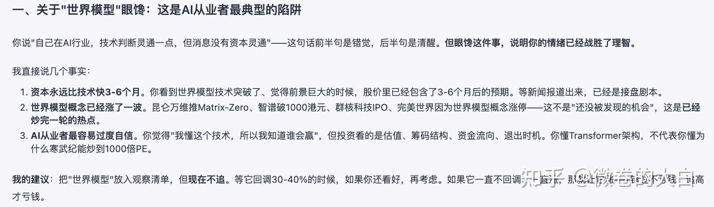

* * *

“世界模型”大概是 2026 年 AI 领域被滥用得最严重的词之一:

- 打开 arXiv，每三篇视频生成的论文里就有一篇标题带 “World Model”。一个能生成 10 秒驾驶视频的扩散模型叫世界模型，一个在 latent space 里做 next-token prediction 的 encoder 也叫世界模型，一个把 3DGS 和视频生成拼在一起的 pipeline 还叫世界模型。它们之间的技术差异，比”世界模型”这四个字暗示的要大得多。
- 如果打开营销号，那从 2025 开始，世界模型就已经满天飞了，各种“ xxx 时刻“，“重塑xxx ” 眼花缭乱。
- 从投资/金融领域看的话，世界模型今年热度也相当高，猎头们的积极性似乎也不错。

世界模型**并没有一个清晰的、被广泛接受的定义。** LeCun 说世界模型必须是 JEPA，必须在 latent space 做预测，不能是生成式的。NVIDIA 说 Physical AI 就是世界模型。World Labs 说空间智能就是世界模型。游戏公司说实时可交互的视频生成就是世界模型。大家各说各话，**唯一的共识是——这个词很好融资**

  

* * *

## 1. 背景知识

> 熟悉视频生成和 3DGS图像开源直接跳过

### 1.1 视频生成基模

当前主流视频生成模型的技术栈已经基本收敛到：**双向 DiT (Diffusion Transformer) + Flow Matching**。

- 输入端用 3D VAE 把视频压到 latent space，中间用 full attention 的 DiT 做去噪，训练目标从 DDPM 的 epsilon-prediction 换成了 flow matching 的 velocity-prediction。
- 代表工作包括 Seedance（字节）、Kling（快手）、WAN（阿里）、HunyuanVideo（腾讯）等。
- 虽然基模开源在 2025 之后几乎停滞，但是闭源模型的生成质量进步明显，证明了 video-gen 这条路scaling 数据的潜力。

  

### 1.2 3DGS 重建

3D Gaussian Splatting 的经典范式是 per-scene optimization：给定一组带位姿的图像，通过梯度下降迭代优化数万到数十万个 3D Gaussian 的位置、协方差、颜色和不透明度，直到渲染结果与输入图像一致。效果很好，但重新训练的成本较高——一个场景需要优化几十分钟到几小时，且无法泛化到新场景，也无法“脑补”没有见过的视角。

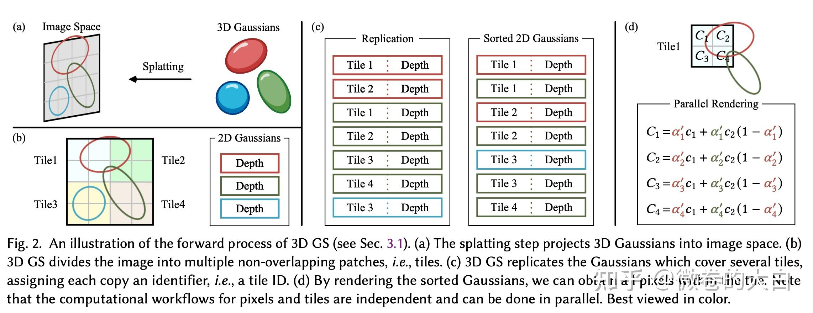

https://arxiv.org/pdf/2401.03890

  

### 1.3 Forward 3DGS：范式转移

VGGT（CVPR 2025 Best Paper）在 3D 领域影响非常大，它证明了：**3D 重建可以是一次前向推理**，可以不显式构建 3D 的空间关系推导，靠数据去 scaling，学到 3d 信息。N 张图输入一个大 Transformer，depth map、pointmap、相机内外参、3D point track 全部一次出来。从 per-scene optimization 到 feed-forward prediction，这是 3D 重建领域的范式转移。

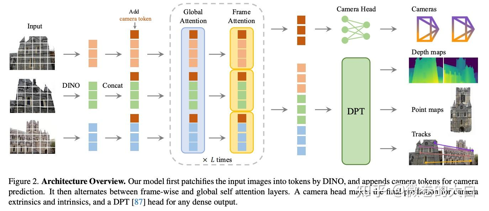

anysplat 等将 VGGT (forward geometry ) 扩展到了 3d gaussians 的生成，在 2026 年这条线在学术界相当活跃，产业界也听到了不少尝试：

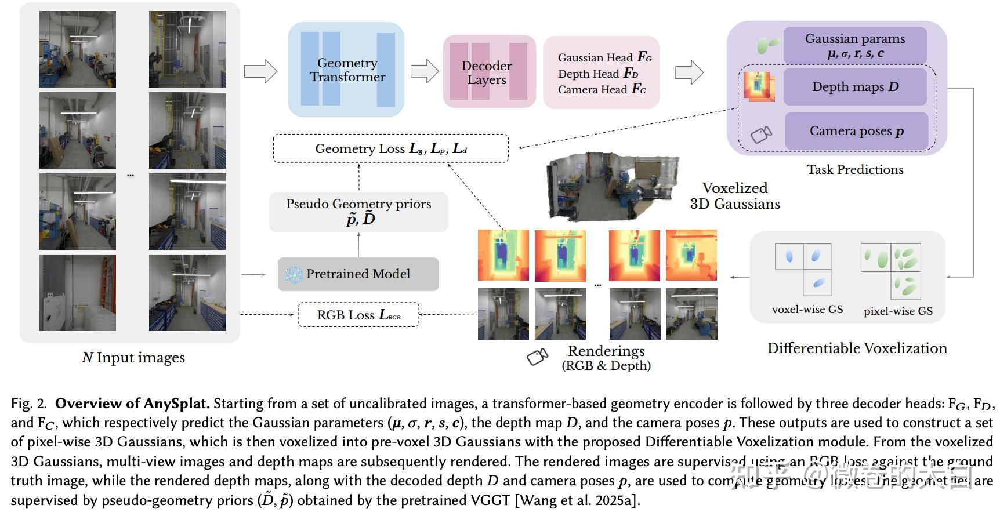

https://arxiv.org/pdf/2505.23716

  

### 1.4 具身智能中的世界模型

具身智能领域对”世界模型”的使用方式有两条明显分叉：

> 自动驾驶其实也是

**第一种：当数据引擎。** 用世界模型大规模生成合成训练数据，再拿这些数据训练独立的 policy 模型，WM 和 policy 解耦。NVIDIA Cosmos 是最典型的工业级实现——为 GR00T N1 人形机器人生成 78 万条合成操作轨迹（相当于 9 个月人工示教），整个过程仅用 11 小时，与真实数据混合后性能提升 40%。GigaWorld-0 走类似路线，Video 侧用视频扩散覆盖外观多样性，3D 侧用高斯泼溅加物理可微仿真保证几何一致性。核心诉求清晰：数据多样性、corner case 覆盖、以及规模化成本——人类示教按小时计费，生成数据按算力计费。

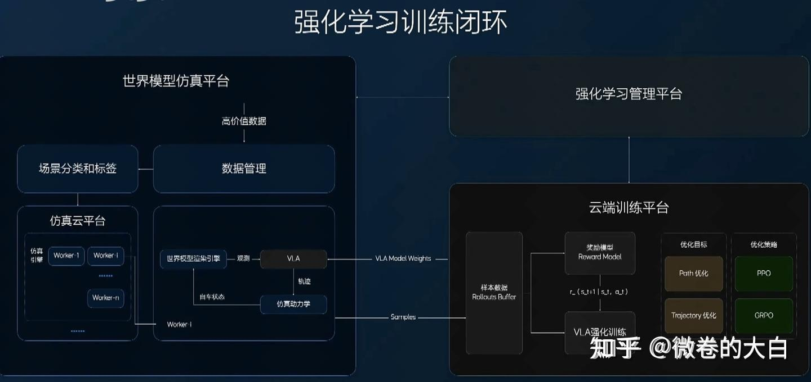

理想发布会宣传图

**第二种：当 Action 模型。**WM 和 policy 联合训练，在一个模型里同时预测未来画面和输出动作。主流做法是视频扩散 WM + action head——UWM 用独立 diffusion timestep 耦合视频和动作预测，GigaWorld-Policy 用 blockwise causal mask 解耦，LingBot-VA 用 MoT（共享 attention、独立 FFN）。另一条线是 JEPA 系的 V-JEPA 2-AC，在 latent space 做 MPC 规划，不生成像素。和纯 VLA（如 π0）的区别：VLA 只做 observation → action 映射，不做世界建模；WM+Action 模型用视频预测作为辅助监督，理论上能学到更强的因果动态理解。

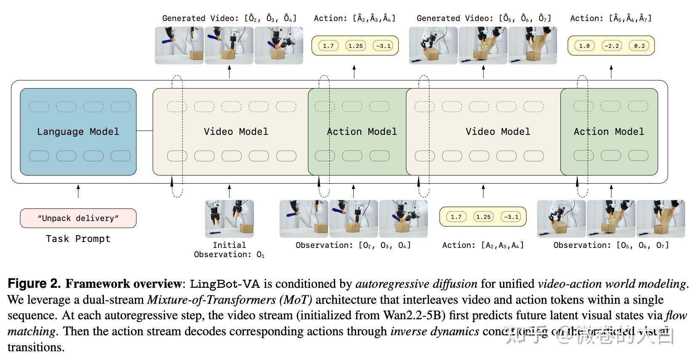

**当前格局：** 工业界偏数据引擎（成熟、可控、policy 可随时替换迭代），学术界偏 Action 模型（端到端更整洁、理论更有趣）。混合路径开始出现——VLAW 设计了 VLA 和 WM 的迭代协同循环，在真实机器人上比 base policy 提升 39.2%，暗示两条路线的边界在模糊。

> 不过当前VLA 模型的 baseline 其实也比较低，个人依然觉得现阶段只能算“demo”期，所以各个 benchmark 和演示视频得到的结论还得打个问号。

### 1.5 世界模型的热度

世界模型这个概念并不新鲜——从 DeepMind 的 Genie 到 LeCun 的 JEPA，学界讨论了多年。2025-2026 年的重新高热度，个人觉得最直接的原因还是**资本**。2026 年 Q1，AMI Labs（LeCun）和 World Labs（Fei-Fei Li）各拿到 10 亿美元量级的融资。NVIDIA 用 Cosmos 全家桶锚定”Physical AI”叙事，国内腾讯/阿里/蚂蚁密集开源。 世界模型是有大量真实需求的——自动驾驶仿真需要大规模场景生成、具身智能需要高性价比的合成训练数据、游戏和影视需要可交互的 3D 内容——但需求存在不等于技术成熟，当前所有方案离真正可用都差得远。

> 当然，换个思路就是谁先能做出来都有很强的成长空间。

技术侧的变化包括：

- 研究成本下降：

- 开源视频基模（Wan、HunyuanVideo）让研究组有了可 fine-tune 的 backbone，不用从零训视频模型；
- Causal 流式架构（Self-Forcing、Causal Forcing）的开源降低了交互式世界模型的工程起步成本； 1.3B 的路线还是比较容易跑通的。
- Forward 3DGS（VGGT 等）把 3D 感知前端从分钟级的 per-scene 优化变成秒级的前向推理。

- 有了不错的 demo 演示效果：Pixverse-R1 展示了流式交互，HappyOyster 做到了 3 分钟的持续交互漫游，虽然效果依然在“及格线”以下（个人见解），但至少让人看到了方向上的可行性。
- 核心问题，比如长程一致性、物理理解、开放世界泛化仍然没有解决，目前能看到的模型演示还有非常多问题。

> 营销号的“xx”时刻说的多了，感觉大家也快麻木了。 不过也许再过几个月，突然看到一个真正“质变”级的模型，我也不会太惊讶。毕竟无论 video-gen 还是 forward 3dgs，近一年在各自领域进步都相当明显。

* * *

## 2. 世界模型分类

### 2.1 本篇分类方式

我之前喜欢暴力的二分：**重建 vs 生成**。

- 重建派做 3DGS/NeRF，从真实图像恢复几何；
- 生成派做扩散模型，从噪声合成像素。
- 但现在很难如此分了：

- HY-World 2.0 先生成再重建，TeleWorld 边生成边重建反过来指导生成；
- Forward 3DGS 用 Transformer 一次前向出 3D 但本质上更像回归而不是传统重建。
- 视频生成方面还可以有流式和非流式的区分。

直接按照重新、生成、重建结合生成显然不是一个好分类。跟 agent 多轮讨论后，这次调研我分了6 类：

> 分法其实并不完全合理，但是为了完成这次调研，总要有一个分类的。  
> 纯影视化视频生成（Seedance/Kling/Sora 这些）和纯 per-scene 3DGS 优化只在背景中提及，不进入本次调研——前者没有显式的世界建模能力，后者没有生成/预测能力。

类别

核心表征

判定标准

典型工作

1

Latent World Model

latent vector

在 latent space 做预测，不输出像素也不输出 3D

V-JEPA 2、Causal-JEPA

2

Forward 3DGS

显式 3D (Gaussian)

单次前向推理出 3D Gaussian，无脑补

AnySplat、GlobalSplat

3

重建为主 Hybrid

3D 资产 + 视频

生成辅助重建，多阶段 pipeline，输出可编辑 3D

HY-World 2.0、Lyra 2.0

4

双向 DiT 全序列视频 WM

视频 latent

全序列双向 attention，非交互，多条件注入

GAIA-2、Cosmos（大部分）

5

Causal 流式视频 WM

视频帧流

chunk-wise causal attention，流式 + 可交互

Matrix Game 3.0、 Happy Oyster、Pixverse-R1

6

Action-coupled VLA

action token + 视频

Diffusion policy 同时出动作和视频预测

UWM、GigaWorld-Policy、Lingbot-VA

几个判定的边界 case：

- **TeleWorld** 虽然有 4D 重建，但重建是 online memory 不对外输出 3D 资产，本质是生成驱动的 causal 架构，归入第 5 类。
- **WorldWarp / MosaicMem** 用 3DGS cache 做几何引导，但核心生成器仍是双向 DiT，归入第 3 类。
- **X-World** 设计了双阶段（先双向训练再因果蒸馏），但核心架构是双向 DiT，归入第 4 类。

### 2.2 长程一致性对比

各类方案维持时序/空间一致性的机制不同，退化模式也不同：

- Latent WM 靠 latent space 隐式编码，容量有限时会表征坍塌；
- Forward 3DGS 有显式几何约束但无法处理未观测区域；
- 重建 Hybrid 用 3D 锚点 + 记忆机制，但多阶段 pipeline 的累计误差是本质困难；
- 双向 DiT 靠全序列 attention 保一致性，受限于 token 数和显存；
- Causal 流式靠 KV cache + 几何 guidance，Happy Oyster 做到了 3 分钟但 drift 仍不可避免；
- Action-coupled 继承底层视频 WM 的一致性限制，还会叠加 action 预测偏移。

类别

一致性机制

典型时长上限

主要退化模式

Latent WM

latent space 隐式编码

取决于 predictor 容量

表征坍塌、长序列遗忘

Forward 3DGS

显式 3D 几何约束

受观测覆盖范围限制

未观测区域无法处理

重建 Hybrid

3D 锚点 + 双记忆

分钟级（HY-World 2.0）

累计误差、阶段间漂移

双向 DiT

全序列 attention

数十秒（受 token 限制）

token 数膨胀、显存爆炸

Causal 流式

KV cache + 几何 guidance

数分钟（Happy Oyster 3min）

记忆容量有限、drift

Action-coupled

依赖底层视频 WM

继承底层 WM 的限制

继承底层退化 + action 偏移

### 2.3可控能力对比

可控性指的是控制世界模型画面元素的能力：

- 双向 DiT 的可控维度最丰富（adaLN/cross-attn/ControlNet 多种注入方式），但全序列一次性生成，不支持中途改变条件。
- Causal 流式在双向 dit 的基础上，还支持实时（next-chunk）可调，因此是交互式视频生成产品（游戏、实时控制）的绝对主流方案，也是 2026 发展最快的方向，除了 matrix Game 3、Pixverse-R1 、Happy Oyster 等号称世界模型的产品，LPM、Helios 等长视频生成、数字人之类的工作技术栈其实差异不大。

> 也应该是我近期博客更新最多的方向了：[流式视频生成 re thinking /学习](https://zhuanlan.zhihu.com/p/2034424759140738317) 、 [LPM 1.0 ：米哈游出品的数字人(视频生成)模型](https://zhuanlan.zhihu.com/p/2026810184794654647) 、[阿里发布世界模型产品 Happy Oyster，可生成动态三维环境，有哪些技术亮点？](https://www.zhihu.com/question/2028087311204705592/answer/2028634634334807525)、 [Helios：14B 实时长视频生成 （论文篇）](https://zhuanlan.zhihu.com/p/2013619812178339023)

- Forward 3DGS 在推理阶段的可控性基本与 3dgs 相同，视角、WASD 等调整容易，重建成“资产”的话可以自由组合，但是在其他场景编辑、风格变化方面比较难

类别

可控维度

实时可调

Latent WM

有限（mask pattern）

否

Forward 3DGS

视角（输入图像决定）

否

重建 Hybrid

全景 + 轨迹 + 语义

否

双向 DiT

动作 + 相机 + 3D bbox + 文本

否（全序列）

Causal 流式

动作 + 相机 + 文本 + 音频

是

Action-coupled

动作（隐式输出）

部分

如果从部署成本看的话，大概可以分为：

> agent 总结的，看个大概吧，ai 不适合干这个事。

类别

模型规模

显存需求

端侧可行性

Latent WM

小（15M~1.2B）

低

可能

Forward 3DGS

中（~1B）

中

可能（渲染端侧）

重建 Hybrid

大（多模型串联）

高

难

双向 DiT

大（2B~14B）

很高

难

Causal 流式

中~大

高

难

Action-coupled

中~小

高（训练）/ 中（推理跳过视频）

只推 Action 可行

  

### 2.4 各方观点

> ai 调研的，只能说发言频率和营销号转载还是非常影响 agent 调研的

**2.4.1 表征之争：latent vs 显式可观测**

- **LeCun / AMI**：世界模型必须在 latent space 做预测，像素/3D 输出是浪费容量。2026-01 AMI Labs 以 35 亿美元估值完成 10.3 亿种子轮，Saining Xie 任首席科学官。LeCun 的措辞越来越直接——直接称 LLM 为 “dead end on the road to superintelligence”，JEPA 路线还在扩张（LLM-JEPA、VL-JEPA、SAI 论文直接拒绝 AGI 概念）。
- **李飞飞 / World Labs**：世界模型必须输出 “explicit, observable state”——和 LeCun 直接对立。她的三条原则：Generative、Multimodal、Interactive，其中第一条明确要求显式可观测输出。Marble 输出 3DGS/mesh/video 是这套理念的产品化。翻译成大白话：LeCun 路线连一个能编辑的房间都生成不出来。

两人对 LLM 的批评一致（”eloquent but ungrounded”），对世界模型的定义相反。

**2.4.2 定位之争：认知架构 vs 专用工具**

- **认知架构派**（LeCun、李飞飞）：世界模型是通向通用智能的架构，不是某个具体任务的工具。
- **专用工具派**

- NVIDIA：把 Cosmos 定位为 “World Foundation Models”——重点是 “有用的物理仿真基础设施” 而非认知架构。GTC 2026 上 Jensen 演示的是 “Physical AI Data Factory Blueprint”，赚钱的是 GPU 和仿真服务。
- Wayve：GAIA-3 的定位是 “from visual synthesis to autonomy evaluation”——用世界模型做安全验证和数据增强，不是认知架构。Alex Kendall 说得很清楚：”World models don’t replace real-world data, but recombine and magnify it.”
- 游戏方向：Carmack 和 Sweeney 都把世界模型当 “power tool”，不是游戏引擎杀手。实际工程团队做的是 concept prototyping 和 storyboarding，不是替代 Unreal/Unity。

**2.4.3 是否需要 WM：VLA 派的工程性反对**

两家公认的具身智能领先公司都没选视频预测路线：

- **Physical Intelligence**（π0/π0.5）：训练信号只有 action loss，不预测未来画面。
- **Figure AI**（Helix/Helix 02）：System 0/1/2 架构，1kHz 平衡控制，完全不做视频生成。

理由很工程化：(1) robot trajectory data 远不够训 WM；(2) 1kHz 控制给 video diffusion 留的时间是零；(3) 纯 action loss 易于调试；(4) 视频预测 loss 提供的辅助信号未必比直接 action loss 收益大。这是工程性反对，不是哲学批评。学术界偏 WM+Action，工业界目前还是更偏 VLA。

  

维度

一端

另一端

表征

必须 latent（LeCun）

必须显式可观测（李飞飞）

目标

通用认知架构（LeCun、李飞飞）

专用工具/数据引擎（NVIDIA、Wayve）

是否需要 WM

视频预测是核心（学术界主流）

VLA 直接映射就够（PI、Figure）

**有共识的**：”世界模型” 术语已过度泛化到失效；长程一致性、物理理解、开放世界泛化是三个核心未解问题；视觉真实感是物理理解的不可靠代理。

**没共识的**：表征 latent 还是显式；视频预测是不是机器人的必要训练信号；世界模型是不是 AGI 的架构。

  

## 3. 各类方法原理

### 3.1 Latent World Model（JEPA 系）

引用一篇博客：[https://www.zhihu.com/question/1972628219082535062/answer/1973413227791672042](https://www.zhihu.com/question/1972628219082535062/answer/1973413227791672042)

LeCun 的核心论点：世界是欠定的。给你前 5 帧，第 6 帧有无数种合理可能。强迫模型预测像素，要么输出模糊帧，要么耗费大量参数建模和”理解世界”毫无关系的高频细节（叶子纹理、皮肤毛孔）。他要的不是能生成视频给人看的模型，而是能**在 latent space 理解和预测世界状态**、然后用于规划的模型。这两件事对信息量的需求差了很多个量级。

> 这个论点是否可信另说，但这是 JEPA 整条路线的出发点。

**2022 — 白皮书：理论框架。** LeCun 提出 JEPA（Joint Embedding Predictive Architecture）的概念：不预测像素，在 latent space 预测；分层设计（H-JEPA），低层处理短时序细节，高层处理长时序语义；配套 Cost module 和 Actor module，目标是在 latent space 做规划。纯理论，没有实验。

**2023 — I-JEPA：图像版验证可行性。** 把 JEPA 做成了第一个可跑的实验。几个关键设计决策奠定了后续所有工作的基础：

- 目标是 embedding 不是像素（和 MAE 最本质的区别）；
- EMA Target Encoder 防止表征坍塌（如果两个 encoder 一样，模型可以把所有输入映射到常数来骗 loss）；
- Multi-block masking 控制预测的语义粒度。
- 实验结果：ImageNet linear probe 超过 MAE，逼近 DINO，且不需要任何手工数据增强。

**2024 — V-JEPA：扩展到视频。** Encoder 从 2D ViT 换成 3D ViT，把视频切成时空 tube patch，所有帧所有 patch 拼成长序列做全时空 attention。Mask 策略从空间 block 变成时空 tube——迫使模型从有限的空间线索推断跨时间的语义变化。

**2025 — V-JEPA 2：加入动作，变成 World Model。**

- 核心改动只有一个：**把动作 token 塞进 predictor**。动作（如机械臂末端位移）embed 成 token，和视频 token 一起进 predictor，训完后能做 `当前帧 latent z_t + 动作 a_t → 预测下一帧 latent z_{t+1}`。
- 可以在 latent space 做 MPC 规划：枚举动作序列 → 滚动预测未来 latent → 选出最终 latent 离目标最近的那条执行。
- 1.2B 参数，100 万小时互联网视频预训练，62 小时无标注机器人视频微调即可零样本抓取。

**2026 — V-JEPA 2.1 + HWM：往两个方向推进。**

- V-JEPA 2.1 引入 Dense Predictive Loss + Deep Self-Supervision，从”预测帧级 latent”走向”预测 patch 级 latent”，提升空间定位能力。HWM（Hierarchical World Model）解决 V-JEPA 2 的 MPC 硬伤——长 horizon 任务（如”先抬起来再放到目标位置”这种 non-greedy 任务）需要枚举的动作序列指数膨胀。
- HWM 用两层 world model：高层预测 waypoint（宏观路径），低层只负责到 waypoint 的 primitive action。两层共享同一个 encoder，在同一个 latent space 工作。Franka pick-and-place 从 0% 提升到 70%（零样本），是目前最接近 LeCun 白皮书里 H-JEPA 愿景的实现。

除了 Meta 的主线演进，JEPA 路线在几个平行方向也有推进：

- **概率化**（VJEPA、Var-JEPA）：将 predictor 从点估计升级为分布预测，理论上能防坍塌且处理多模态未来
- **因果化**（Causal-JEPA）：把 masking 提升到物体级别，诱导因果归纳偏置，规划时只需 1% 的 latent 特征
- **轻量化**（LeWorldModel）：约 15M 参数，单 GPU 训练数小时，证明路线在极小规模下也能 work
- **与 VLM 融合**（ThinkJEPA）：JEPA 做 System 1 快速预测，VLM 做 System 2 慢思考

**不过似乎工业界基本没在用 JEPA 路线。** 落地的机器人公司（Physical Intelligence、Figure 等）主流走 diffusion policy 或 VLA。JEPA 目前基本只有 Meta FAIR 自己在跑，缺乏第三方大规模验证。

核心争议在于：生成式世界模型（Diffusion 路线）有像素输出，可以直接验证和可视化，工程上好调试；JEPA 的 latent 没有解码器，验证困难——模型到底学到了什么物理知识，只能通过下游 probe 间接评估。Scaling law 也不明朗：DiT 的 scaling 已经被多家验证（参数越大效果越好），JEPA 的 scaling 还没有公认结论。

> 这个思路看上去更适合放到端侧，大疆卓驭/蔚来/小鹏 都有宣传过世界模型+自动驾驶，但是至少短期内，个人觉得落地性有待考证。

### 3.2 Forward 3DGS

Forward geometry（DUSt3R → VGGT）建立了 feed-forward 3D 估计的范式：N 张图入一个大 Transformer，depth/pointmap/camera 一次出来，推理 <1s。但 VGGT 本身输出的是通用几何表征，不直接出 3D Gaussian——世界模型需要可渲染的 3D 表示，所以后续工作在 geometry 基座上加 Gaussian 预测 head，构成 forward 3DGS。

AnySplat（SIGGRAPH Asia 2025）是这条线的代表。和 VGGT 的关键区别：**pose-free**——不依赖位姿标注，模型自己从多视角 token 交互中隐式推位姿。整体流程：

1.  **DINOv2 patch tokenizer** 提取多视图 patch feature
2.  **VGGT 风格的交替 attention backbone**（帧内 self-attn + 全局 cross-view attn）编码多视图关系
3.  **三个预测 head** 并行输出：Gaussian 参数、depth、camera 内外参
4.  **可微 voxel 融合** 去除重叠视角的冗余 Gaussian

训练用 VGGT 伪标签蒸馏 + 九个数据集混合。~886M 参数，推理秒级。

AnySplat 之后，这条线还有诸多改进工作：

- **GlobalSplat**：per-pixel 预测导致视图越多 Gaussian 越冗余。改用固定一组 global scene token，先聚合多视图特征再解码 Gaussian，~16K Gaussian / <78ms
- **TokenGS**（CVPR 2026 Highlight）：用可学 Gaussian token + 渲染自监督直接回归 3D 坐标，Gaussian 数量和输入分辨率解耦
- **VolSplat**：pixel-aligned lifting 在遮挡处容易出错。通过 cost volume 构造 3D voxel 特征网格，再用稀疏 3D decoder 出 Gaussian——和 AnySplat 的 2D token lifting 是两条路
- **F4Splat**：均匀分配 primitive 简单区浪费细节区不够。多尺度 Gaussian + densification score 自适应分配，用户可指定目标 Gaussian budget
- **TokenSplat**：无 pose 时相机线索和场景语义纠缠。非对称双流 decoder 解耦 camera/image token，用 MASt3R 初始化

Forward 3DGS 在大规模数据上训过，具备一定几何先验，**能在稀疏输入下补出合理的局部几何；但本质是局部几何外推**——给 5 张客厅照片能推出墙角后的一小段走廊，凭空想象不出厨房。

不过 forward 3dgs 似乎当前基本是 ~1B 规模，还没有人做参数量或训练数据的规模扩展，效果上限显然不太高。

### 3.3 重建为主 Hybrid

这一类的共同结构是：**显式 3D 锚点 + 视频扩散填补未观测区域 + 多阶段自回归推进**，最终输出可编辑的 3D 资产（3DGS 或 Mesh）。3D 几何负责决定哪些区域已知、哪些需要生成、生成后怎么拼回去；内容生成本身（想象出视角外的信息）仍由扩散模型完成。

HY-World 2.0 是这个路线的典型代表，其大致 pipeline 包括：

1.  **全景生成**（HY-Pano 2.0）：360° 全景图作全局锚点
2.  **轨迹规划**（WorldNav）：在全景图上规划相机运动轨迹
3.  **世界扩展**（WorldStereo 2.0）：沿轨迹逐步扩展场景

- **Keyframe-VAE 替代 Video-VAE**：帧间隔更大、单帧更清楚——重建友好的视频编码 ≠ 观看友好的编码
- **双记忆**：GGM（Global Geometry Memory）管全局结构不自相矛盾，SSM++（Spatial Structure Memory）管局部纹理对齐
- **Normalized RoPE**：位置编码归一化到 [0,1]，外推 → 插值
- **线性 scale/shift 对齐**：替代 SfM 做多段生成的几何对齐，耗时从 ~5h 降到分钟级

  

1.  **重建组合**（WorldMirror 2.0 + 3DGS 优化）：把所有生成内容统一到 3D 空间

相比之下，Lyra 2.0（NVIDIA TLabs）不做全局 3D 融合，每个 chunk 维护独立的局部 3DGS cache。生成流程：

1.  **历史 3D cache → 坐标 warp**：把上一个 chunk 的局部 3DGS 通过当前相机参数投影到 canonical 坐标系，投影后的坐标编码注入 DiT 的 Q/K 作为条件（不 warp RGB 像素，避免遮挡边界的拉伸 artifact）
2.  **DiT 生成当前 chunk**：基于 warp 条件 + 文本条件生成新的视频 chunk
3.  **从生成结果更新局部 3D cache**：用当前 chunk 的生成帧重建局部 3DGS，供下一轮使用

> 也算是个trade-off：回避了全局 3DGS 融合随场景增长的开销，但没有统一的全局 3D 表示，一致性完全依赖 chunk 间的 warp 传递。训练上用自增强训练（对历史条件帧加噪声污染）缓解自回归累计误差。DMD 蒸馏 13x speedup。 也还有一些其他工作，这里不详细展开：  

- **WorldWarp**：每个 chunk 新建 3DGS cache，用时空异步噪声调度——warped 区域低噪声做 refinement，空白区域全噪声做生成。
- **MosaicMem**：Patch 级 hybrid 空间记忆，Warped RoPE + Warped Latent，PRoPE 做相机控制。

  

Hybrid 方案看上去很很合理，但是不得不面对所有子模块的误差。**累计误差是这类多阶段 pipeline 的阿喀琉斯之踵**——全景生成的几何偏差会传递到轨迹规划，轨迹偏差会放大到世界扩展，扩展的不一致性会在重建阶段集中爆发。随着时间+ 不同模块的误差累积，效果不可避免的会衰减。

主要分化维度：

维度

HY-World 2.0

Lyra 2.0

最终输出

可编辑 3DGS/Mesh 资产

视频（3D cache 不融合）

3D 作用

全局锚点 + 最终产出

局部 condition

抗漂移

双记忆 + Normalized RoPE

canonical warp + 自增强训练

动态场景

有限支持

支持

### 3.4 双向 DiT 全序列视频世界模型

这类工作的基本盘是：**拿一个预训练好的视频生成 DiT，在上面叠加各种世界模型所需的条件注入。** 模型对整段视频做全序列双向 attention，推理时一次性出完所有帧。非交互式——你指定初始条件和控制信号，模型给你一段视频，不支持中途改变输入。

各工作用到的注入方式：

- **adaLN（自适应归一化）**：适合低维连续信号（ego 速度、曲率等），轻量，全局调制。
- **加法 embedding**：主要用于相机位姿（内参 + 外参独立编码），大多不用 Plucker ray。
- **cross-attention**：用于 3D bbox、语义 token、文本等结构化/高维条件，灵活但计算开销较大。
- **ControlNet 并行分支**：用于 depth、edge 等结构化条件，可插拔，约 1.5-2x 推理开销。

代表工作各自的组合方式：

工作

基座

Action 注入

相机位姿

结构化 Condition

多视角机制

GAIA-2

自研 8.4B DiT

adaLN

intrinsics + extrinsics 加法

cross-attn 3D bbox

联合 spatial attn

X-World

WAN 2.2 5B

adaLN

MLP + 加法

解耦 cross-attn（文本/动态/静态独立）

view-temporal 交替

Cosmos-Predict2.5

自研 2B/14B

latent 帧注入

相机 ID + 内参

ControlNet 并行分支

多视角 cross-attn

X-World 的**解耦 cross-attention**：文本、动态物体、静态场景各走独立的 cross-attention 分支，避免不同模态的条件信号互相干扰。

**多视角一致性方面**对数据引擎非常重要：当前主流方案是**把所有相机的 latent token 打平到同一序列里**，让 spatial attention 或 cross-camera attention 自然地建立跨视角对应关系。

- 这带来的问题是 token 数量膨胀——4 个视角就是 4 倍 token。
- 目前看大部分方案用了**分组 Attention**：不同视角的 token 不做全交叉 attention，而是按视角分组，只在需要建立跨视角对应关系时才做 cross-camera attention，把复杂度从 O(N²·V²) 降到 O(N²·V) 量级。

  

### 3.5 Causal 流式视频世界模型

> 流式生成的内容在 [流式视频生成 re thinking /学习](https://zhuanlan.zhihu.com/p/2034424759140738317) 已有表述, 本节会侧重一些“世界模型”的特殊需求

和3.4 的的核心区别是**causal attention + chunk-wise 自回归**。模型只看到当前和过去的 token，每次生成一个 chunk（若干帧），用 KV cache 维持历史上下文。这使得实时交互成为可能，**即可以通过注入控制条件，影响下一个 chunk 视频的生成。**

流式世界模型要接受用户的实时操作输入（键盘、鼠标、手柄），这些离散动作的注入目前有三种主流方案：

- **adaLN / timestep 调制**（WorldPlay）：把动作编码成条件向量，通过自适应归一化全局调制。简单高效，但对复杂动作的表达力有限。
- **Cross-Attention**（Matrix Game 3.0）：有意思的是它对键盘和鼠标用了不同策略——键盘走 cross-attention（离散、语义化），鼠标走 self-attention（连续、帧关联性强）。这个区分说明不同类型的动作信号确实适合不同的注入方式。
- **帧维度 Concat**（TeleWorld）：最直接的方式，把动作渲染成条件帧，在 latent 维度和视频帧 concat。优点是不改模型架构，缺点是增加了 token 长度。

相机控制是世界模型区别于普通视频生成的核心能力之一。

- WorldPlay 的 PRoPE（Positional Rotary Position Encodin)：把相机内外参编码为 3D 旋转矩阵，直接注入到 Transformer 的 QKV 中。这意味着位置编码本身就携带了 3D 几何信息，模型不需要额外学习相机到 3D 的映射。
- Matrix Game 3.0 则走了另一条路：camera-aware memory retrieval，根据当前相机位姿去 KV cache 里检索最相关的历史 key/value。直觉上说，看向北边时应该检索之前看北边时的记忆，而不是看南边时的。

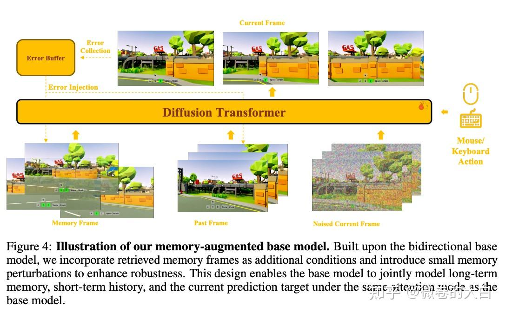

**文本实时控制**

Happy Oyster 的 Directing 模式支持生成过程中用文本/语音/图像实时干预（”让天色变暗”“切换镜头角度”），文本指令通过 streaming condition 注入当前 chunk 的生成过程，响应延迟 <0.3s，支持最长 3 分钟 720p 连续生成。LingBot-World 用层次化 cross-attention 注入文本指令，基于 Wan2.2 + MoE 架构，16 FPS。

**音频控制**

- **双音频交错**（LPM 1.0）：说话音频注入偶数层，倾听音频注入奇数层。用于 NPC 对话场景。
- **多智能体**（MultiWorld、Solaris）：MultiWorld 的 MACM 引入 Agent Identity Embedding（基于 RoPE）、Adaptive Action Weighting、VGGT Global State Encoder，支持多个 agent 在同一场景中独立行动且全局一致。

工作

控制信号

注入方式

实时性

特殊能力

WorldPlay

离散键 + 相机位姿

adaLN + PRoPE

-

双重位姿表示

Matrix Game 3.0

键盘 + 鼠标

cross-attn / self-attn 分流

40 FPS

camera-aware 检索

Happy Oyster

WASD + 文本

streaming condition

支持 3min

文本实时控制

LingBot-World

WASD + 鼠标 + 文本

层次化 cross-attn

16 FPS

28B MoE

LPM 1.0

双音频 + 文本

偶/奇数层交错

-

NPC 对话

MultiWorld

多 agent 动作

AIE + AAW + VGGT

-

多智能体一致性

TeleWorld

WASD → 相机位姿

帧 concat + 渲染 guidance

-

4D 重建闭环

  

TeleWorld 是本次调研中唯一引入几何重建闭环的工作——**Generation-Reconstruction-Guidance**：视频生成出新帧 → 4D 动态点云在线重建 → 重建结果反过来 guidance 下一轮生成。4D 重建在这里是 online memory，不对外输出 3D 资产；它的 Macro-from-Micro Planning（从局部运动推断宏观轨迹）也值得关注。值得指出的是：**严格意义上 causal 流式 + 3DGS 联合的方案目前没有公开工作**。TeleWorld 用的是 4D 动态点云而非 3DGS。这个空白可能是因为流式生成的帧率和 3DGS 优化的耗时之间存在数量级的 gap——你来不及做 3DGS 优化。

### 3.6 Action-coupled / Diffusion Policy 世界模型

> 写的相对简单，下次可能单独尝试让 agent 调研一下这个 （虽然我觉得现在的具身智能效果，都还有点太初级了...）

这一类的核心问题是：**能不能在一个模型里同时预测未来画面和输出执行动作？** 如果世界模型能预测”做了 A 之后世界会变成什么样”，那它天然就包含了策略信息——关键是怎么把这个信息高效地提取出来。

主流 VLA 不做视频预测，只做 observation → action 的映射。π0（Physical Intelligence）是最有代表性的架构（虽然现在已经迭代很多了，但是π0 应该是无疑义的代表工作）：

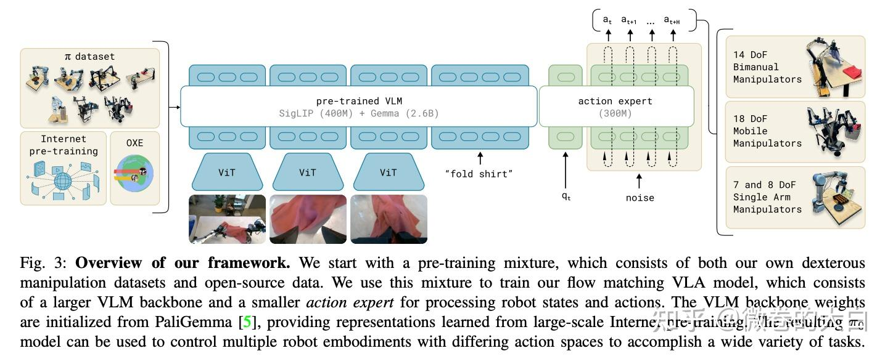

- **VLM Expert**（PaliGemma 3B）负责理解视觉和语言指令
- **Action Expert**（独立 300M Transformer）负责输出连续动作
- 两者通过 **blockwise causal attention** 交互，但参数完全独立——分开是因为 action 的分布和 language token 差异太大，混在一起会互相干扰
- Action 预测用 **flow matching**（不是直接回归），学一个从噪声到动作的连续速度场

π0 不预测未来画面，训练信号只有 action loss。

如果从这个角度来讲的话，worldmodel + Action模型的出发点可以认为是， **如果加上视频预测作为辅助监督，action 的质量能不能更好？**

如果根据 Action token 的交互方式区分，可以大体再分几个类别出来：

模式

代表工作

设计要点

MoT（Mixture of Tokens）

LingBot-VA、Motus

共享 attention 但 FFN 各走各的路，action token 和 video token 在 attention 层看到彼此，在 FFN 层各自变换

单一 Transformer + blockwise causal mask

GigaWorld-Policy

通过掩码设计让 action token 看不到 future video token，但能看到过去的 video token

独立 diffusion timestep

UWM

action 的去噪步数 t_a 和 video 的去噪步数 t_o’ 完全独立，推理时令 t_o’=T（最大噪声）就能跳过视频生成

多模态 DiT 互连

AdaWorldPolicy

三路独立 DiT + 跨模态注意力，每条路处理不同模态

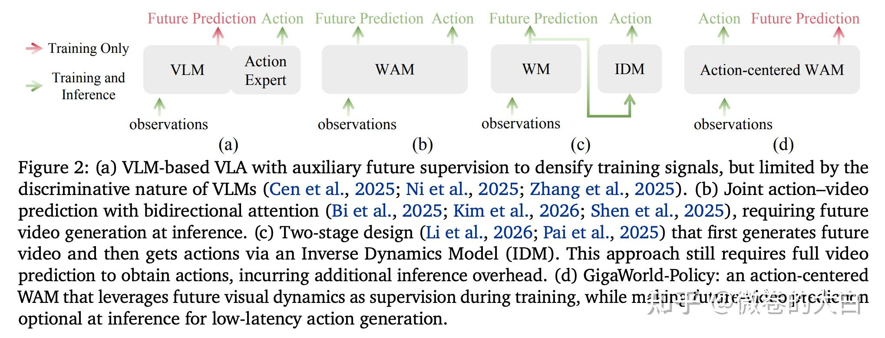

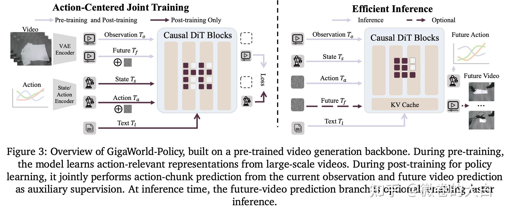

这类方案显然一个重要的架构特性：训练时利用视频预测做辅助监督，推理时可以不生成视频，只推 Action 即可。（需要可视化调试时生成视频，纯执行时跳过，从而降低推理延迟）

- **GigaWorld-Policy**：因果掩码天然解耦，推理时只跑 action 部分，9x 加速（0.36s/次）
- **UWM**：令 video 的 diffusion timestep 为最大值 T，边际化掉整个视频生成路径

这类工作认为：密集的时序监督（视频预测 loss 提供了比纯 action loss 丰富得多的梯度信号）、海量无标注视频可以参与训练。但两套 diffusion loss 的权重协调很 tricky（视频 loss 和 action loss 的梯度尺度可能差几个数量级）、模型体积膨胀、训练时必须生成视频但推理时可能不需要。

* * *

## 4. 知名(公司)工作

第 3 节按架构分类了一部分模型，但有一些知名的模型(系列)一直在迭代，单开一篇是个更合适的选择。

> 不过因为是拆 subagent 调研的，三四两章的关系没理太明白，智能人工也有点改不动了。

### 4.1 Cosmos + 平台(NVIDIA)

最值得关注的当属NVIDIA 的 **Cosmos ，**不过 NVIDIA 在世界模型领域的投入不止 Cosmos——从 3D 重建到仿真平台到基础模型到 VLA，NV 都提供了平台和方案优化。

> nv 核心依然是卖卡赚米，不过服务提供方面也非常积极，世界模型方面投入也非常大，而且因为合作范围广，对上层模型的需求其实也非常敏感。而且 nv 在数据引擎的世界模型方面是非常积极的推动者（毕竟有利于卖卡嘛），所以还是挺值得关注的。

  

> 不过虽然 NVIDIA 在硬件+软件层面一直很强，但在模型设计、算法训练方面做的相当一般（相比投入）——NLG , Nemotron MoE ,GR00T N1 等等，哪怕推理框架层面，TRT-LLM 还好一点，Dynamo 从半成品就开始在公司客户宣传，一年过去了好像还是没见退出去， ai 调研的锐评为”从 megatron-llm 到 te，nccl，都是知名 x 山”。 Cosmos 在发布之初也是效果不及预期，后续逐渐好一点了，去年听 nv 介绍是有不少具身客户在用（估计自动驾驶车企依然推不太动），而且至少我去年看到的 cosmos 并行推理方案代码可读性和易用性依然是一 x。

  

Cosmos 在发布之初也是效果不及预期，后续逐渐好一点了，去年听 nv 介绍是有不少具身客户在用（估计自动驾驶车企依然推不太动），而且至少我去年看到的 cosmos 并行推理方案代码可读性和易用性依然是一 x。

- Cosmos 1.0（2025-01 CES）同时推出扩散 DiT 和自回归 Transformer 两路模型，参数跨度从 4B 到 14B。
- 从 Predict2（2025-06）开始，公开发布的版本只有 **Flow Matching DiT**，自回归分支没有再更新。
- 这不一定意味着 NVIDIA 放弃了自回归——可能是优先级调整，也可能在 Cosmos 3 里以其他形态出现——但至少说明在产品化路径上，NVIDIA 当前押的是全序列双向模型。

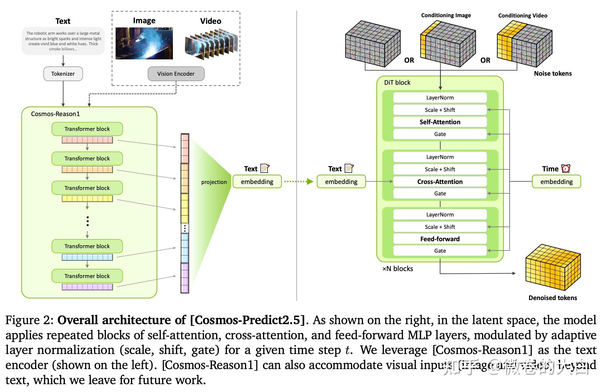

cosmos有多个支线：Predict 生成合成数据，Transfer 把仿真渲染转成真实感视频，Reason 做质控和物理推理——三者组合起来就是 NVIDIA 在 GTC 2026 上发布的 Physical AI Data Factory Blueprint。

[https://github.com/nvidia-cosmos/cosmos-predict2.5](https://link.zhihu.com/?target=https%3A//github.com/nvidia-cosmos/cosmos-predict2.5)

> 每个系列里面还一堆子模型.... 说好听是业务广泛，难听则是...

产品线

职责

当前版本

规模

Predict

世界生成/视频模拟

2.5（2B/14B）

Flow Matching DiT

Transfer

Sim2Real 迁移

2.5（2B）

Multi-ControlNet DiT

Reason

物理推理 VLM

2（2B/8B）

VLM（类 LLaVA）

按照 nv 的设计：

- 自动驾驶客户用 Transfer（LiDAR/HDMap 控制通道）+ Predict Multiview（多摄一致性），
- 机器人客户用 Predict Action-Conditioned + Reason + GR00T 集成。底座模型相同，通过领域后训练分化。
- Cosmos 3 在 GTC 2026 预告但未披露细节。

  

**3D 重建技术线（TLabs）**

> 之前好像还有个别的平台 nv一直推荐，想不起来名字了，ai 找到的是这个。  
> 不过 ai 调研出来的是一堆合作论文... 不过反正调研出来了，也就不删了吧

NVIDIA Toronto AI Lab（TLabs）在 3DGS 方向上也有不少工作：

- **渲染基础**：I

- nstant-NGP（SIGGRAPH 2022 Best Paper）用 multi-resolution hash encoding 把 NeRF 训练从小时降到秒级；NeuralAngelo（CVPR 2023）在此基础上做高保真几何重建。这两个是后续所有 3D 工作的地基。
- 3DGUT（CVPR 2025 Oral）用 Unscented Transform 替换 EWA splatting，让 3DGS 支持鱼眼/rolling shutter 等非线性相机——自动驾驶和具身场景的摄像头大多是鱼眼，这个能力很关键。

- **Feed-forward 重建**：

- L4GM（NeurIPS 2024）是首个 4D Large Reconstruction Model，单视角视频 → 逐帧 3DGS，单次前向 <1s；
- TokenGS（CVPR 2026 Highlight，在 3.2 节讨论过）用 learnable Gaussian token 解耦 3DGS 预测与像素分辨率。

- **Video Diffusion + 3DGS 融合**：

- 这方面 difix / difix ++ 听说是有落地的，用一个 I2I 的 dit 模型去修复 3dgs 的细节。
- GEN3C（CVPR 2025 Highlight）引入 **3D cache**——从种子帧预测深度得到点云作为几何缓存，生成新帧时用用户指定的相机轨迹渲染 3D cache 的 2D 投影作为 video diffusion 的条件输入，实现精确相机控制 + 时序 3D 一致性。
- Lyra 在此基础上把 video diffusion 的隐式 3D 知识**自蒸馏**为显式 3DGS，Lyra 2.0（3.3 节讨论过）进一步做渐进式场景生成。
- 生成的 3DGS 场景可直接导入 Isaac Sim 做物理仿真。

**仿真平台**

- Omniverse ：不是世界模型本身，定位是世界模型的**数据工厂和验证平台**：

- Omniverse 渲染合成数据 → Cosmos Transfer 做 Sim2Real → 生成真实感训练数据。
- 核心技术栈是 OpenUSD + RTX Renderer + PhysX。

- Isaac Sim 4.5 已集成 Cosmos 做合成数据生成；Isaac Lab（Isaac Gym 继任者）是 GPU-accelerated RL 训练框架，支持千级并行环境。Edify 3D 负责为仿真场景生成 PBR-ready 的 3D 资产，Edify SimReady 自动标注物理属性（质量、材质、连接点）。

**GR00T VLA**

GR00T N1 是 NVIDIA 的 VLA，dual-system 架构（System 2 VLM 慢思考 + System 1 diffusion transformer 快动作）。

  

### 4.2 Genie（Google DeepMind）

> 谷歌在各条线思路似乎都短暂“停滞”了一般，无论是 Gemini 还是 Veo 都暂停在了 3，Genie 也是有段时间没消息了，但在多模态/世界模型方面，个人觉得谷歌或许是最值得期待的一家。

Genie 是交互式世界模型的标志性系列，三代架构跨度很大，全闭源（只有 Genie 1 有 arXiv paper）。

**Genie 1（2024-02）**：11B 参数，ST-Transformer + VQ-VAE tokenizer + MaskGIT decoder。核心贡献是 **Latent Action Model（LAM）**——从纯视频无监督发现 8 维离散动作空间，不需要任何动作标注。训练数据是 200K 小时互联网平台跳跃游戏视频。推理时用户通过 latent action 控制生成，但帧率只有 1 FPS，不可用于实时交互。

**Genie 2（2024-12）**：转向 autoregressive latent diffusion + causal transformer。不再走 VQ 离散化，而是在连续 latent space 做自回归扩散。支持从单张图像生成可交互 3D 环境，时长 20s@1FPS。技术细节未发表论文，只有博客。

**Genie 3（2025-12）**：原生 720p/24fps 实时生成，text-to-world，支持 NPC 行为和物理交互。这是第一个达到实时帧率的 Genie 版本。架构未公开，同样只有博客和 demo。WorldMark benchmark 测试显示 Genie 3 几何一致性排名靠前，但视觉质量中等。

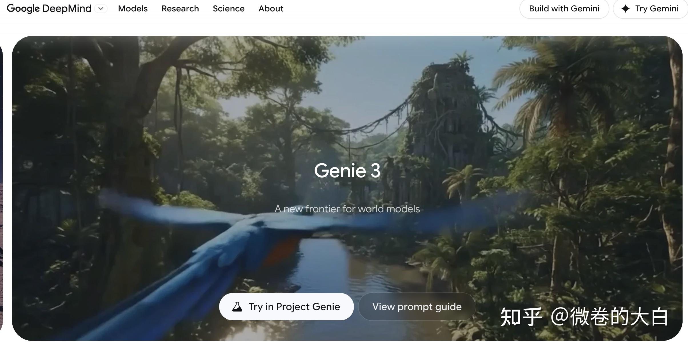

  

### 4.3 Marble（World Labs）

> 2025 年我对 Marble 表示过“失望”：[worldlabs -Marble 体验与方案瞎猜](https://zhuanlan.zhihu.com/p/1951767456134719360) 、 [Marble 自定义输入尝试---比较失望](https://zhuanlan.zhihu.com/p/1952944569147711739)，不过现在回过头来看，当时的失望主要还是因为营销 制造的预期太高了，很亢奋地测到了凌晨三点多，然后失望开喷。  
> 阿里的快乐马 happy horse 也是类似， [神秘新模型 HappyHorse-1.0「欢乐马」空降业内测评榜第一名，其表现如何？可能是谁？](https://www.zhihu.com/question/2025220640467152983/answer/2025397467101902415)当时就觉得这个宣传的手法很“阿里”，也大概猜到了这版模型实测效果不会太好。

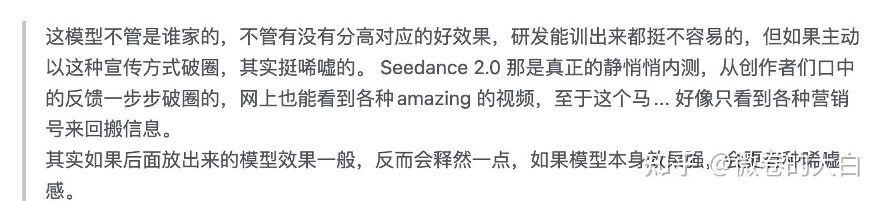

Marble 是李飞飞 “spatial intelligence” 理念的产品化，从单图或文本直接生成可导航的 3DGS 世界。闭源，至今无 arXiv 论文，

> 已经明牌的 3DGS 方案，不过是走 forward 3dgs 还是 hy world 那种 video gen + 3d 重建的流水线暂未可知，个人猜测现阶段后者的可能性大一些：[HY-World 2.0：生成辅助重建的完整开源](https://zhuanlan.zhihu.com/p/2028273802144936616) 。 说起来一直想去试一下最新的 hunyuan world 和 Marble，还没找到时间（或者说动力没那么足，对效果没太多期待）

**Marble 1.0（2025-05）**→ **1.1（2025-07）**→ **1.1 Plus**：核心迭代是 3D 空间覆盖范围的扩大——1.1 Plus 引入自动探索机制，从单张图像出发持续扩展 3D 世界，而不是只生成初始视角附近的局部场景。输出可导出为 3DGS / mesh / video。

World Labs 2025-12 宣布 World API 开放接入。

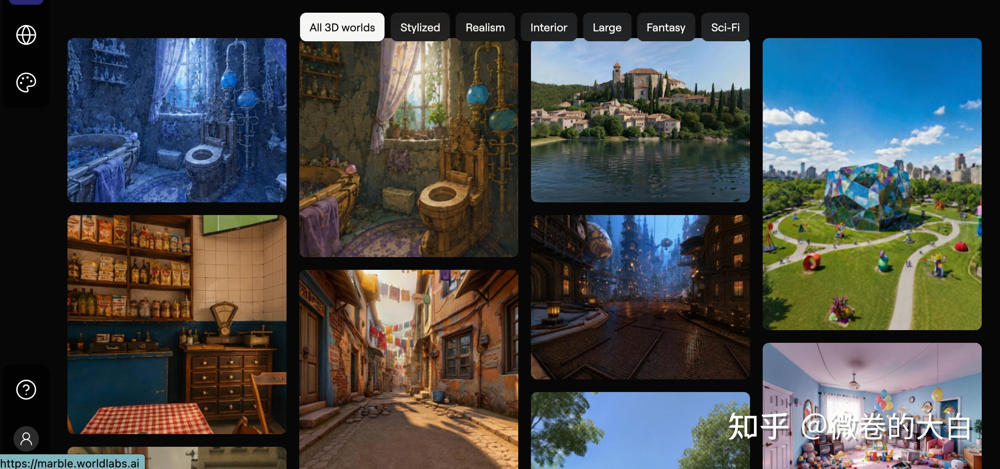

### 4.4 GAIA（Wayve）

GAIA 则是另一个值得关注的系列，是自动驾驶世界模型里迭代最完整的一条线，三代架构变化很大：

**GAIA-1（2023）**：离散 VQ token + 因果自回归 Transformer。每帧 576 个离散 token，文本用 T5-large 编码，动作是 2 维标量（速度、曲率）线性嵌入，按 text → image → action 顺序交错输入。世界模型做下一 token 预测，再接一个视频扩散解码器渲染成高分辨率视频。整体约 9B 参数。

**GAIA-2（2025）**：架构从自回归彻底切到 **flow matching**。

- 离散 VQ → 连续视频 tokenizer（~32x 空间压缩 + 64 通道潜变量，编码器 85M / 解码器 200M）
- 世界模型 8.4B 参数，时空分解 Transformer（22 块，隐层 4096，32 头），训练目标是 flow matching velocity prediction
- 条件注入从”语言模型式 token 交错”改为结构化的 **adaLN（动作）+ cross-attention（3D bbox / scenario embedding）+ 相机/时间编码**
- 支持多相机联合生成（至多 5 路，448×960）
- 训练：tokenizer 128×H100，world model 256×H100

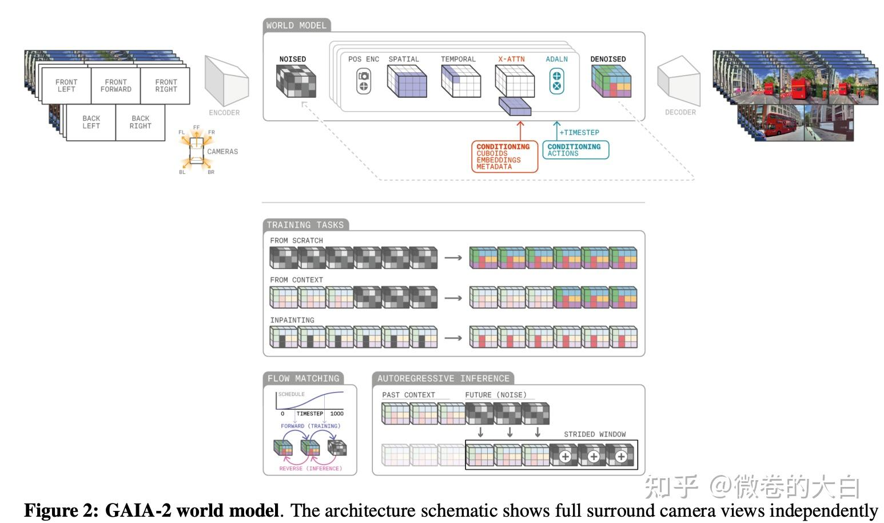

**GAIA-3（2025-12）**：15B 参数，tokenizer 规模翻倍，训练算力 ~5× GAIA-2、数据 ~10×（9 国），侧重长轨迹一致性和安全场景评测。技术细节尚未发表论文。

### 4.5 Giga（极佳科技）

国内最早打”世界模型”旗号的创业公司（2023 年成立，创始人黄冠，清华博士 / 前地平线），2026 年估值超百亿。定位是具身智能——世界模型平台 + VLA + 机器人本体。

技术线分三块：

- **GigaWorld-0**：数据引擎，DiT + MoE + 3DGS，用世界模型生成合成数据训练 VLA，和 Cosmos 的 “Physical AI Data Factory” 定位类似
- **GigaWorld-Policy**（arXiv 2603.17240）：blockwise causal mask 实现训练时视频监督 + 推理时 action-only 解码，9x 加速且成功率提升——这个”训练复杂、推理简单”的设计在 3.6 节已作为 Action-coupled 的一种模式讨论过
- **GigaWorld-1**：AC-WM 具身世界模型，WorldArena 评测综合第一（62.34 分），物理遵循指标领先第二名 16%

> 和 Wayve GAIA 无任何关联——团队、技术路线、应用场景完全独立。只是名字长得略微有点像，我读研期间一直以为是同一家公司（bushi）

### 4.6 其他

- **地平线**： 从卡位来说其实算 mini 版智驾 nvidia，在世界模型和新智驾算法研发方面还是比较舍得砸钱招人的，去年看过他们挺多有意思的工作：[RAD: 基于3DGS 进行自动驾驶中的闭环强化学习](https://zhuanlan.zhihu.com/p/1968328470770737870)
- **理想汽车**： 在世界模型推进非常积极的自动驾驶厂商，论文可以参考：[2025年的理想还在不断突破，年度成果一览......](https://zhuanlan.zhihu.com/p/1966078888053539885) ，3dgs 和 videogen 的工作都不少，不过开源就不要太指望了。
- **Runway GWM-1**（2025-12）：Runway 发布的 General World Model，号称 scalable world model 用于视频生成和物理模拟。闭源，只有博客和 demo，号称在内部评测上超越 Sora。Runway 随后发布了 Odyssey-2（2026 年初），强调长序列一致性。两者均无论文和技术细节。
- **DreamerV3**（Nature 2025）：RL 领域的 latent WM，RSSM + symlog，单 agent 150+ 任务。
- **Vista**（NeurIPS 2024）：自动驾驶视频预测，2025 年引用量较高。
- **Emu3.5**（智源）：统一多模态生成架构，含世界模型能力。
- **WorldGrow**（华为）：具身场景合成数据生成。

  

各家的方向差异比较大：

玩家

赌注方向

落地策略

阶段

NVIDIA

仿真基础设施

Cosmos +Omniverse全家桶，200 万下载

已有产品

World Labs

空间智能

Marble 产品化 + World API

早期产品

LeCun / AMI

认知架构（JEPA）

纯科研

研究阶段

腾讯混元

全链路开源

WorldCompass、HY-World 2.0、WorldPlay

开源推广

阿里 / 蚂蚁

交互式世界

HappyOyster、LingBot-World

开源 + demo

Skywork

游戏交互

Matrix Game 系列

demo + 早期产品

  

## 5. benchmark

> 经典视频指标肯定是不够世界模型用的，或者说出发点不同。比如Seedance 、Kling 们在做的分镜能力，短期内和世界模型要求的连续性似乎是有冲突的。 但是 Seedance2.0 充分证明了这种能力对影视场景、试用用户是非常讨喜的。

Physics-IQ（Google DeepMind）的实验证明：

- **PSNR/SSIM/FVD/LPIPS 和物理理解零相关**——Sora 的 LPIPS 排前列，Physics-IQ 得分仅 9%。
- FVD 自身的 I3D 特征空间存在 content bias，时序破坏（倒序播放）只让 FVD 略微上升。
- JEDi 用 V-JEPA-2 self-supervised 特征替代 I3D，与人类一致性提升 34%，是替代方向。

一句话（agent 味很浓）："画面好看 ≠ 模型懂世界"。

### 5.1 生成质量评测

评的是"生成的视频/世界本身好不好"，不涉及下游策略。

一般使用的是开环评测：给定条件生成一段视频，单独判质量。

- **物理一致性**：模型生成的视频是否遵守基本物理规则。代表 benchmark：Physics-IQ（396 真实视频，运动 mask IoU）、WorldModelBench（UCB+UCSD+NVIDIA，67K 人工标签，5 类物理法则）、WorldBench（UCLA，物理参数拟合，直接测自由落体加速度）、PhyGenBench（27 物理定律 × 4 大类）。当前最佳模型仍有 12% 视频违反质量守恒，Cosmos 测出的自由落体加速度方差 ±2.9 m/s²。
- **长程一致性**：长序列下物体、场景、关系是否保持稳定。目前没有"标准 metric"，各家自造：WCS 用 object permanence + relation stability + causal compliance 加权合成；WorldMark 用 VLM 均匀采帧比较；Genie 3 用未公开的内部指标。可比性很差。
- **可控性**：给定相机/文本条件，模型是否真的执行了。WorldMark 用 DROID-SLAM 反推位姿和 GT 比 scale-invariant 距离；ACT-Bench（自动驾驶专用）看 ego 轨迹和 action 匹配度。关键限制：需要 GT 轨迹，只能在合成或精心标定的数据上做。
- **3D 几何一致性**：画面像不像合理的 3D 世界。WorldScore（Stanford，Fei-Fei + Jiajun Wu）覆盖 3D/4D/I2V/T2V，视频模型在多场景一致性上系统性失败。4DWorldBench 是第一个统一 3D/4D 世界生成的评测。核心痛点：从 2D 反推 3D 本身 ill-posed，DROID-SLAM 长视频也容易飘。
- **交互质量**：实时交互场景的综合表现（仍属生成质量，不涉及策略训练）。WorldMark 是第一个标准化交互式 WM benchmark：统一 WASD 动作映射，500 用例 × 3 难度 × 6 模型。核心发现：**画面最好的 YUME 1.5 长程一致性排名靠后，几何最稳的 Genie 3 视觉只是中等**。

### 5.2 物理一致性评测

物理评测是生成质量侧讨论最多的维度，目前看主流有三种评测路线：

- **VLM-as-Judge**：PhyGenEval、WorldModelBench 等用 GPT-4o/Gemini/fine-tuned VLM 判别。覆盖面广，但 VLM 自己物理理解只有 ~50%（PhysBench 最强 VLM 51.94%，人类 95.87%）。WorldModelBench 用 67K 人工标签 fine-tune 2B VLM judger 后 error 降到 4.1%——通用 VLM 评物理不靠谱，专用 judger 才能用。
- **物理参数拟合**（WorldBench）：场景放 checkerboard 标定相机，SAM2 分割物体追踪位置，拟合二次曲线提取加速度。Wan 2.2 自由落体加速度只有 1.16 m/s²（真实 9.81），画面看上去球在掉但物理参数完全错——VLM-as-Judge 不可能发现这种错误。缺点：只能在精心设计的场景里做。
- **运动 mask IoU**（Physics-IQ）：阈值化生成/真实视频的逐帧 pixel-diff 得 motion mask，比 Spatial/Spatiotemporal IoU。不依赖 VLM、不依赖物理标定，对任何静态相机视频适用；但只看运动不看身份，没法检测穿透或物体消失。

三条路线本质是 trade-off：覆盖广但不准 / 最准但场景窄 / 通用但浅。WorldArena 的做法是三条都用上，线性归一化合成 EWMScore。

### 5.3 WM + Action 评测

> 这节评的是拿 WM 训 policy 或当 sim 用，策略能不能跑通。  
> 现在的具身智能、世界模型+Action 绝大部分都是在做机械臂任务，benchmark 相当乱，不做这个方向的话（比如我）简单看一看即可。

策略评测有多个链路：

1.  **纯仿真闭环**：policy 在传统仿真器（ManiSkill3、Isaac Lab、RoboTwin 2.0）或 WM-as-Sim（WorldEval、WorldGym、World-in-World）里跑 rollout，评 task success rate。全在 GPU 上，不需要真机，迭代快（ManiSkill3 跑 30K FPS）。问题是 sim 和真实之间存在巨大 gap——RADAR 测出 VLA 模型 sim-to-real 性能差 40-50 个百分点。WM-as-Sim 还有额外问题：WM 自身的 bias 会传给 policy。
2.  **Sim2Real 验证**：用 SIMPLER、REALM 等框架做 real-to-sim 对照，检查 sim 里训出来的 policy 在数字孪生里表现是否一致。处于 sim 和真机之间的中间地带。
3.  **真机评测**：policy 直接在真实环境部署。RADAR（32 任务，6 种干扰因子）和 RoboChallenge（30 任务，4 种机器人，支持远程提交）是当前两个主要的真机 benchmark。LongBench 专做长程操控（200+ 步）。真机评测最可信，但成本最高。

> 对世界模型来说，第 1 步里的 WM-as-Sim 和传统 Sim 是直接竞争关系——WorldArena、World-in-World 都用传统仿真器做对照基线，比较同一套 policy 在 WM 里和在 Isaac Sim / RoboTwin 里的 success rate 是否一致。第 2 步对应的是 Cosmos + GR00T 的路线：WM 生成合成数据训 policy，policy 上真机验证。

除了环境，机械臂 Action的评测方式也在递进：

1.  **单任务成功率**：最基本的指标，给一个任务评 pass/fail。LIBERO 的 130 任务、ManiSkill3 的 100+ 任务都属此类。
2.  **鲁棒性**：同一个任务，换背景、换光照、加传感器噪声、改指令措辞，还能不能做到。RADAR 设计了 6 种干扰因子做系统化测试——背景变化就能让所有 VLA 模型 0 成功率。RoboTwin 2.0 也做了 5 个维度的 domain randomization。
3.  **泛化性**：跨任务（LIBERO 的终身学习——学了新任务旧任务是否遗忘）、跨本体（RoboTwin 2.0 测 5 种不同机器人形态）、跨场景（从没见过的厨房能不能整理）。π0.5 的核心卖点就是开放世界泛化，但 RADAR 真机测试里 π0.5 也只过了 17/32。

WM 侧的代表评测：

- **WorldArena**：14 个 WM 横评，6 感知维度 + 3 下游任务。感知质量和下游任务排名相关性很弱。
- **WorldEval**：把视频 WM 包装成 sim 环境跑 policy，测出的 success rate 和真机部署有较高相关性。
- **World-in-World**：4 个闭环环境，统一 action API。两个有用的发现：(1) action-observation 后训练比换更好的 base video model 收益大；(2) 推理时多跑几条 rollout 选最优能明显提分。
- **EWMBench**：具身场景三维评测，结论是在目标域上 fine-tune 过的模型 > 商业闭源 > 通用开源。

VLA/操控侧的代表评测：

- **LIBERO**（NeurIPS 2023）：终身学习 benchmark，130 任务按知识类型分 4 个 suite（空间 / 物体 / 目标 / 长程）。意外发现：简单顺序微调比复杂终身学习算法效果好。
- **ManiSkill3**（UCSD/CMU/清华）：GPU 并行仿真，30K FPS，快速原型迭代。20+ 种机器人，100+ 任务。做 VLA 开发绕不开的仿真基础设施。
- **RoboTwin 2.0**（上海交大/港大）：5 种机器人本体、双臂为主，用 MLLM 自动生成任务代码。核心结论是 10 条真实数据 + 1K 合成数据就能比纯真实数据提升 3-4 倍——直接验证了 WM 做数据引擎的价值。
- **RADAR**（2026 KDD）：第一个系统化的真机 VLA 鲁棒性 benchmark，6 种干扰因子。目前所有 VLA 在背景变化下全挂。
- **RoboChallenge**（Hugging Face）：真机远程提交评测，4 种机器人。

### 5.4 当前评测的主要问题

- **没有统一标量指标**：每家都在造自己的复合分数（EWMScore、WCS、WorldScore、Physics-IQ Score…），跨论文不可比。

> 现在的模型效果都比较一般，谈 benchmark 其实有点为时尚早。

- **VLM-as-Judge 可靠性**：fine-tune judger 之前，通用 VLM 评物理的 error rate 30%+。
- **各家自带 benchmark 的模型偏置**：YUME 用 yume-Bench、Matrix-Game 用 GameWorld Score、Genie 3 自带 demo——跨模型对比近乎不可能。WorldMark 的 "统一动作映射 + 统一场景" 是解决方向。
- **Scaling 不解决物理理解**：phyworld（字节）在 2D 几何场景实验表明 DiT-XL + 3M 数据 OOD 误差比 ID 高一个数量级，scaling 几乎无改善。模型属性优先级 color > size > velocity > shape。
- **生成质量 ≠ 策略有效性**：WorldArena 的 perception-functionality gap 和 World-in-World 的实验都表明，视频质量指标好的 WM 不一定能训出好 policy。两套评测体系需要独立看。

* * *

## 6. 个人观点

### 6.1 infra 视角

  

如果从硬件/算子的视角来看：

- video gen 对算子的需求基本还是 DiT ， casual 也主要是 seq len 和模型大小的变化。
- 差异比较大的是 3dgs，最关键的 render 算子目前还是吃 fp32 算力，不过算力需求和大模型有量级上的差距，推理放到端侧也问题不大，训练 scaling 也主要是数据、算法、策略维度的问题多一些。如果是 forward 3dgs 则还是 Transformer 相关算子为主。

从模型层面来看的话：

- 当前 DIT 的并行基本被 USP，Context-Parallel “统治”，多 condition 注入很可能影响并行的选择。
- 对于 forward 3dgs 等方案，当前主要是单卡，参数量扩大或者延迟要求变高的话，也会有并行需求，TP 显然是可行的，GS 级别的并行则可能需要根据具体模型结构细分了：[[3DGS 重建] Grendel-GS：多 GPU 并行训练高斯球](https://zhuanlan.zhihu.com/p/1954276968381027462)，可能是可以有类似 DSP 的更优方案的。
- 如果想做DiT 量化、稀疏等有损优化，策略大概率是需要调整的，无论是流式，还是多视角双向 DIT；
- DIT 的蒸馏也是必然的需求，现在的 casual 流式都非常激进地将其蒸到了 3-4 步，不过还主要是基于多步 flow matching 模型去蒸。

  

如果从整个 pipeline / 框架来看的话，变化就比较大了

- **KV cache 管理**：双向 DiT 和 Causal 流式都面临长序列 KV cache 的显存压力。Causal 流式还需要跨 chunk 的 cache 淘汰策略（sink + 滑窗 / EMA-sink 等方案，详见 Causal 博客）。Matrix Game 3.0 的 camera-aware retrieval 是将几何信息引入 cache 检索的一个探索方向。
- **多模型编排**：重建 Hybrid 的多阶段 pipeline 、causal 实时流式可控生成都需要多服务间的编排。串联除了大幅延迟累积， 也给会给容灾和稳定性提出更多需求。
- **吞吐和延迟：**会有很大的 trade-off 空间，现在的 DIT 模型产品，等个几分钟出结果属于快速，免费队列一两个小时也是正常，但是如果做实时生成，延迟至少是要达到秒级的，而 3dgs 的推理在这方面会有明显优势（不需要云侧推完走网络传输结果，可以直接端侧推理）。
- 关于框架，sglang-diffusion 和 vllm-omni 维护非常积极，不过对于“世界模型”来说，他们的方案还是太过“通用”了一点，二次开发的“魔改”和内部维护并不容易。

  

  

### 6.2 其他

> agent 输出为主，算是 agent 蒸馏的我的观点。

1.  **”world model 会 kill the game engine”是一个需要反驳的说法。**

这个说法在投资人和媒体圈流传甚广，但从技术角度看短期内难度很大：

- 游戏引擎提供的是**确定性的、可编辑的、可调试的**世界。
- 世界模型提供的是**概率性的、端到端的、黑箱的**世界。
- 现在的 world model 能让你在一个生成的世界里走来走去，但想在里面放一把椅子、改一盏灯的颜色、或者调试一个 NPC 的碰撞箱，都很难稳定。
- 一个角色走到 A 点触发了剧情，存档读档再走到 A 点，必须触发同样的剧情。当前没有任何世界模型能保证这种级别的确定性。

目前来看：**游戏需要的一致性精度远高于世界模型目前能提供的**。世界模型更可能的角色是游戏引擎的**辅助工具**——生成初始场景、填充背景内容、驱动非关键 NPC ，暂时很难成为替代者，更别提 killer 了。

  

2.

  

> 调休单休，智能人工改不动了， btw 许愿一下西汉姆逼平阿森纳～ maybe下周末再改
