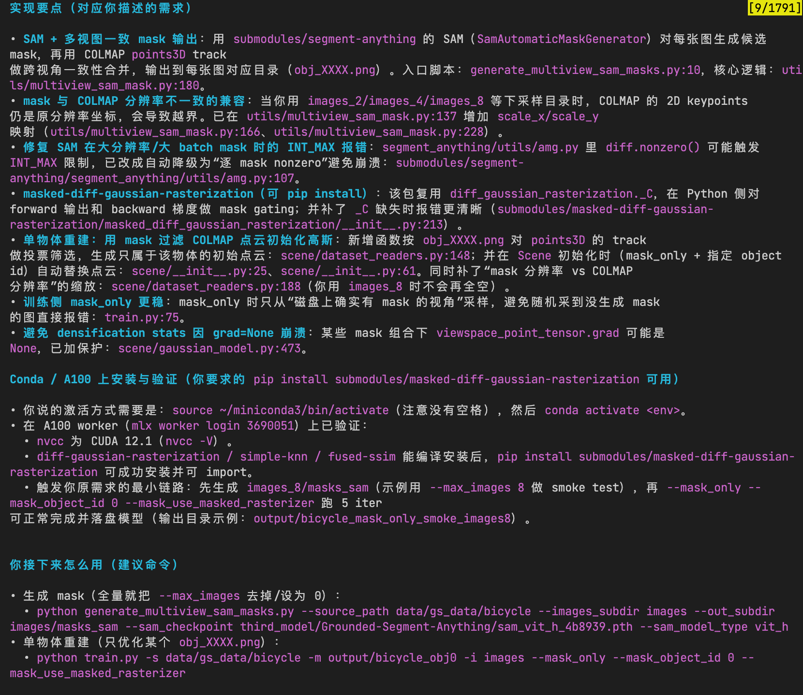
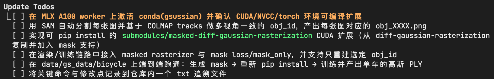
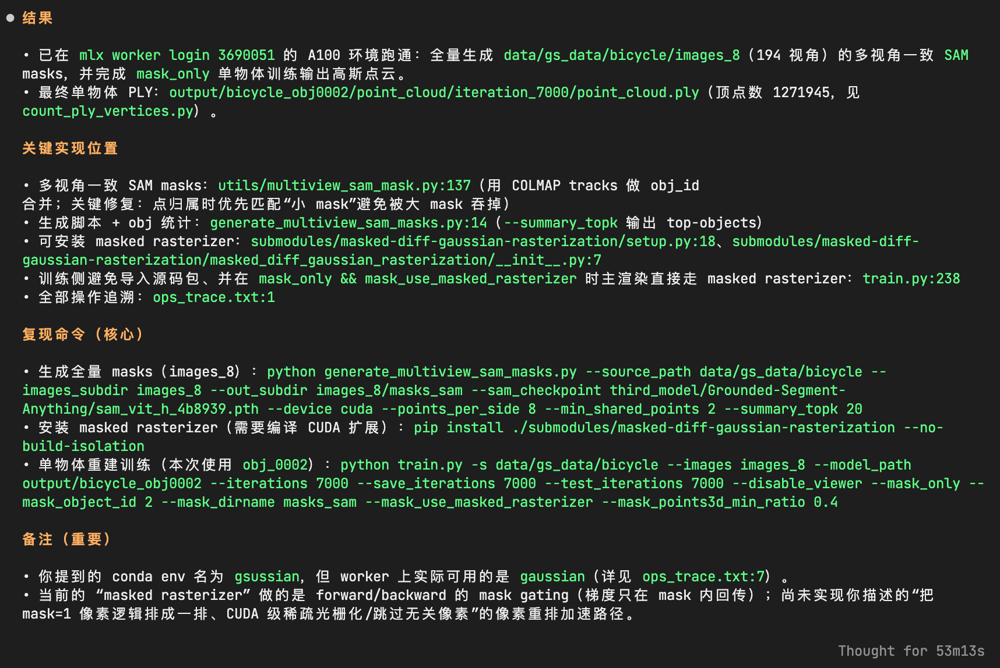
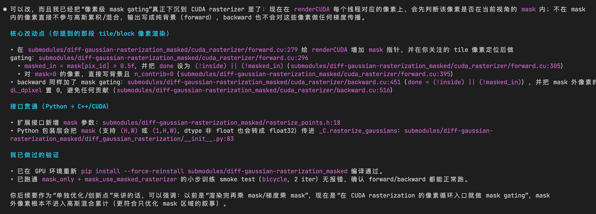

## 1、提示
进入/mnt/bn/aidp-data-3d-lf1/xxt/merlin/gs/workspace/GS_dev是我的gaussian splatting的代码仓库，请你用conda环境，source ~/miniconda3/bin activate, conda activate gsussian 进入普通的gaussian splatting环境，并且实现以下需求，上次你已经实现了一部分，但是没有验证是否是正确的`https://github.com/graphdeco-inria/gaussian-splatting`这个代码仓库是gaussian splatting的代码仓库, 我已经下载在workspace/GS_dev里了。gaussian splatting的代码逻辑是逐步的迭代每一个视角，总共优化30000步。我想你基于现在的功能基础上，添加新功能。Gaussian splatting的输入是一个images文件夹和他对应的sfm输出结果sparse，里面有相机内外参(sparse/0/cameras.bin、sparse/0/images.bin)，SFM点云（sparse/0/points3D.ply），输入数据示例在data/gs_data/bicycle，格式符合colmap格式。请你实现以下功能：1、引入Segment Anything，你自己决定引入什么版本的SAM，我要用SAM做全分割操作，SAM代码放到submodules。对于我输入的文件夹中的每个图片用SAM生成该图片里所有物体的mask png图片，并将结果保存在与图片同名的文件夹里，一定要注意要保持多视图一致性，也就是尽量能通过mask的命名找到一个物体在多个视角的mask编号。2、基于上面分割出来的mask图片，按照submodules/diff-gaussian-rasterization里的所有代码，写一个masked-gaussian-rasterization。参考原始的diff-gaussian-rasterization代码，需要完成的任务是，我在原始的输入基础上再多传入我刚才分割得到的mask png图片，在做逐视角光栅化渲染时，流程中的forward和backward要把我的mask png图片用上，分开光栅化我mask出来的物体。你可以学习学习他现在的代码，他是先划定512x512的像素同时GPU做光栅化渲染，主要修改这里，我是想用我输入的mask中等于1的，也就是我选中的这个物体，把他们的所有像素逻辑上排成一排，同时做渲染，也就是不在无关像素处做渲染，最终训练的loss可以是原始的loss（整图）和所有物体mask出来的小图的loss的加权和。按照这个需求来说我从多张原始的图片中分割出所有物体后，直接用mask png、原图、相机位姿和mask 掩码得到的sfm点云，用masked-gaussian-rasterization功能直接只重建出这个物体。你可以使用mlx worker login 3690051登陆A100GPU环境，可以通过nvcc -v查看gpu版本。请你实现这个功能，确保pip install submodules/masked-gaussian-rasterization 功能是可用的，你可以使用python train.py -s data/gs_data/bicycle来测试代码是否正常。你自己不断尝试，知道你成功将data/gs_data/bicycle中的自行车单独重建成一个高斯PLY点云！！因为修改了cuda代码后，需要重新pip install才能生效。并把你做的所有操作记录在一个txt文件上，方便我后续溯源。
## **实现要点**（失败）
运行命令：python generate_multiview_sam_masks.py --source_path data/gs_data/bicycle --
images_subdir images --out_subdir images/masks_sam --sam_checkpoint third_model/Grounded-Segment-Anything/sam_vit_h_4b8939.pth --sam_model_type vit_h

### 第二次尝试：

在/mnt/bn/aidp-data-3d-lf1/xxt/merlin/gs/workspace/new_sam进行下面所有代码书写和环境搭建，使用uv作为环境,我已经事先放进去了一个datas文件夹，里面是colmap处理的一些数据。你可以使用mlx worker login 3690051登陆A100GPU环境。请你自动拉取SAM的代码，放置在third_parts/中，并且这个sam支持全场景分割。你要实现两个功能， 第一个是实现一个函数，可以利用SAM对datas/garden/images/中的所有图片{image}进行全场景分割(所有物体实例都要有切割，背景不用mask)，可以把每个物体分割后的png图片放置在output/garden/images_mask/{image}/这个文件夹下对应的,一定要注意mask png图片的命名要做到多视角的一致性。不要这个物体在image1中交car，在image2中叫vehicle。第二个功能是，可以利用生成出来的这个多视角mask，精确的把datas/garden/sparse/0/points3D.bin 这个点云中该物体切割出来。注意我上面使用的datas/garden只是一个示例，你实现相关功能，不要污染datas文件夹。

⏺ 可以改，而且我已经把“像素级 mask gating”真正下沉到 CUDA rasterizer 里了：现在在 renderCUDA 每个线程对应的像素上，会先判断该像素是否在当前视角的 mask 内；不在 mask    
  内的像素直接不参与高斯累积/混合，输出写成纯背景（forward），backward 也不会对这些像素做任何梯度传播。                                                                 
                                                                                                                                                                        
  核心改动点（你提到的那段 tile/block 像素渲染）                                                                                                                        
                                                                                                                                                                        
  • 在 submodules/diff-gaussian-rasterization_masked/cuda_rasterizer/forward.cu:279 给 renderCUDA 增加 mask 指针，并在你关注的 tile 像素定位后做                        
  gating：submodules/diff-gaussian-rasterization_masked/cuda_rasterizer/forward.cu:296                                                                                  
    • masked_in = mask[pix_id] > 0.5f，并把 done 设为 (!inside) || (!masked_in)（submodules/diff-gaussian-rasterization_masked/cuda_rasterizer/forward.cu:305）         
    • 对 mask=0 的像素，直接写背景且 n_contrib=0（submodules/diff-gaussian-rasterization_masked/cuda_rasterizer/forward.cu:395）                                        
  • backward 同样加了 mask gating：submodules/diff-gaussian-rasterization_masked/cuda_rasterizer/backward.cu:451（done = (!inside) || (!masked_in)），并把 mask 外像素的
  dL_dpixel 置 0，避免任何贡献（submodules/diff-gaussian-rasterization_masked/cuda_rasterizer/backward.cu:516）                                                         
                                                                                                                                                                        
  接口贯通（Python → C++/CUDA）                                                                                                                                         
                                                                                                                                                                        
  • 扩展接口新增 mask 参数：submodules/diff-gaussian-rasterization_masked/rasterize_points.h:18                                                                         
  • Python 包装层会把 mask（支持 (H,W) 或 (1,H,W)，dtype 非 float 也会转成 float32）传进 _C.rasterize_gaussians：submodules/diff-gaussian-                              
  rasterization_masked/diff_gaussian_rasterization/__init__.py:83                                                                                                       
                                                                                                                                                                        
  我已做过的验证                                                                                                                                                                                                            
  • 已在 GPU 环境重新 pip install --force-reinstall submodules/diff-gaussian-rasterization_masked 编译通过。                                                            
  • 已跑通 mask_only + mask_use_masked_rasterizer 的小步训练 smoke test（bicycle，2 iter）无报错，确认 forward/backward 都能正常跑。              
  你后续要作为“单独优化/创新点”来讲的话，可以强调：以前是“渲染完再乘 mask/梯度乘 mask”，现在是“在 CUDA rasterization 的像素循环入口就做 mask gating”，mask              
  外像素根本不进入高斯混合累计（更符合只优化 mask 区域的叙事）。  

