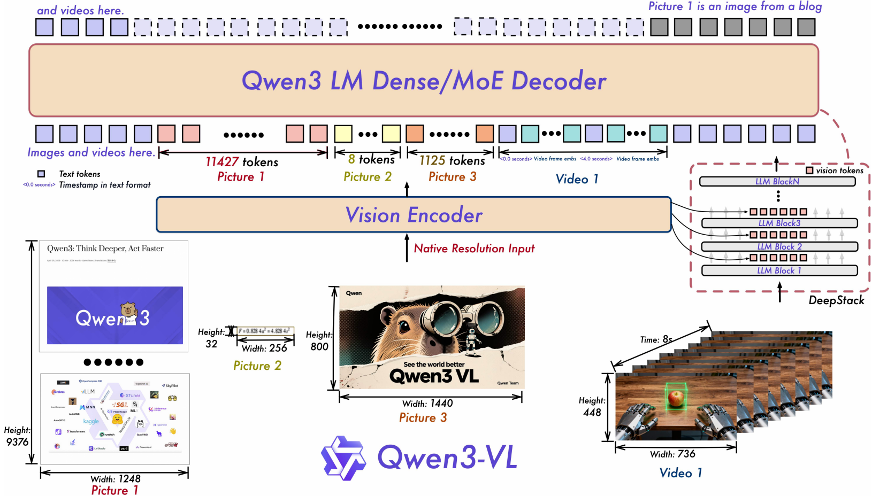

序列长度由Qwen2.5-VL的32k拓展到256k，并引入了3D groudning、agentic等新的能力。架构方面则引入了**interleaved-MRoPE、DeepStack、基于显式文本的视频时间对齐**等创新

#### 1、模芯汇总
- Qwen3-VL系列本次推出了
- 4种dense模型
	- 2B  /  4B  /  8B  /  32B
- 2种MOE模型
	- 30B-A3B
	- 235B-A22B
并区分了Instruct和Thinking版本。整体架构包括视觉encoder、MLP-based的VL-Merger、LLM：

- **视觉encoder**：基于SigLIP2持续预训练得到。训练时借鉴CoMP，在动态分辨率的输入下使用2D-RoPE位置编码。

- **MLP-based的VL-Merger**：两层MLP，将相邻的2×2视觉特征压缩为单个visual token。整体与Qwen2.5-VL类似，不同的是支持了DeepStack，以融合来自不同层的visual tokens。

- **LLM**：采用Qwen3作为语言基座模型。

